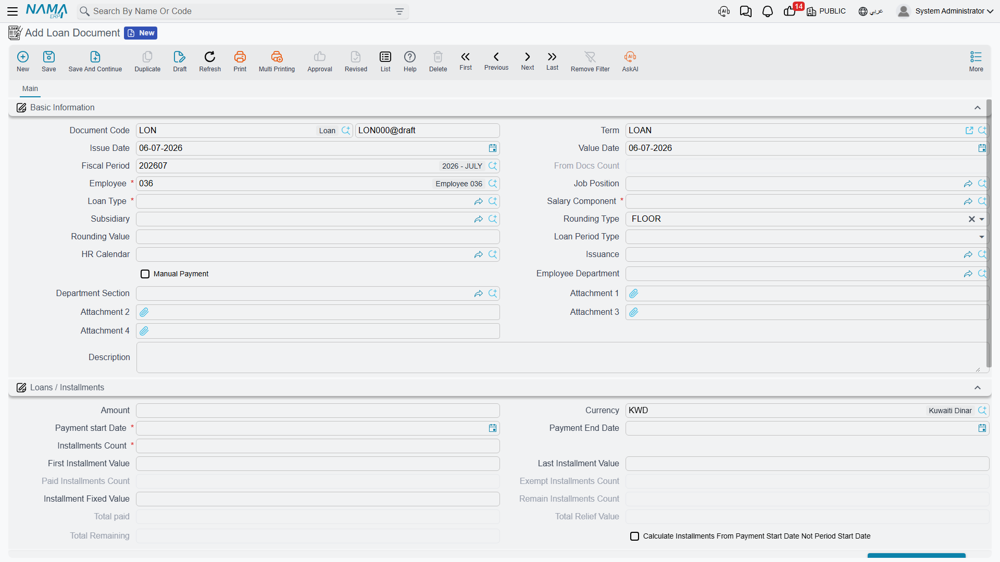
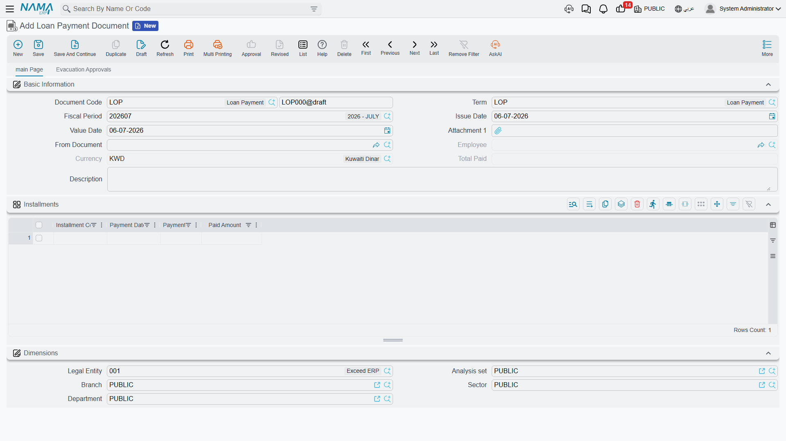

# Loan Documents & Payments

This page covers the three screens that turn a loan from a request into money in an employee's pocket, and eventually back out again: the **Loan Request** (طلب سلفة) and **Loan Document** (سند سلفة) pair, and the **Loan Payment Document** (سند سداد سلفة) used to record a manual repayment. All three read their limits and their recovery rules from the [Loan Type](hr-loan-types.md) the loan belongs to.

## The request → document flow

A **Loan Request** and a **Loan Document** follow the general request/document pattern used across HR — see **[HR Requests, Documents & Aggregated Documents](../concepts/hr-requests-and-documents.md)** for the full explanation. For loans specifically:

1. The employee (or HR on their behalf) fills in a **Loan Request**: employee, loan type, loan amount, and payment start date. Picking a loan type pre-fills the default amount and installment count from the [Loan Type](hr-loan-types.md); entering the amount or the installment count recalculates the other. The request starts in state Initial (مبدئي).
2. A reviewer clicks **Accept** (قبول) or **Reject** (رفض).
3. HR then creates a **Loan Document** and points its **From Document** (بناءا على) field at the accepted request, which copies the employee, loan type, amount, and dates across. Only **Accepted** requests are offered by that picker.
4. On the Loan Document, clicking **Generate Installments** (إنشاء الأقساط) builds the actual installment schedule — one line per installment, dated and valued according to the loan's period type (Weekly/Monthly), rounding rule, and any fixed/first/last-installment override. This is what the employee is actually disbursed against.

**Where to find them:** Payroll > Loans / Installments > Loan Request / Loan Document.

### Key fields on the Loan Document

| Field (English) | Arabic | Notes |
|---|---|---|
| Loan Type | نوع السلفة | Which [loan type](hr-loan-types.md) this loan belongs to — drives the eligibility conditions, the recovery component, and the automatic/manual payment rule. |
| Loan Amount | قيمة السلفة | The amount actually disbursed. |
| Installments Count | عدد الأقساط | How many installments the loan is split into. |
| Payment Start / End Date | تاريخ بدء السداد / تاريخ نهاية السداد | The window over which the installments fall; the end date is computed once the count and period type are known. |
| Loan Period Type | نوع فترة القسط | Weekly (أسبوعي) or Monthly (شهرية) — how far apart installments are spaced. |
| Installment Fixed / First / Last Value | القيمة المثبته للقسط / قيمة أول قسط / قيمة أخر قسط | Optional overrides: a flat value for every regular installment, or a different value for just the first or last one (to absorb rounding). |
| Rounding Type / Value | نوع التقريب / قيمة التقريب | How installment values are rounded — ceiling, floor, nearest, or none — with an optional rounding increment. |
| Calc Installments From Payment Start Date Not Period Start Date | حساب الاقساط من تاريخ بدء السداد وليس من تاريخ بداية فترة الرواتب | Whether the schedule is anchored to the exact payment start date or to the start of the payroll period it falls in. |
| HR Calendar | تقويم الرواتب | The [calendar](../setup/hr-calendar-and-holidays.md) used when spacing installment dates. |
| From Document | بناءا على | Points back at the Loan Request the document was generated from, when applicable. |

Each installment line carries its own state — **Not Paid** (غير مُسَدّدْ), **Paid** (مسدد), **Exempt** (معفي), **Initial** (مبدئي), or **Payment Is Being Made** (جاري التسديد) — plus a live running total of what has actually been paid and what remains, so the whole schedule stays visible on the document at every point.

::: tip Automatic vs. manual recovery
The [loan type](hr-loan-types.md#Key-fields)'s **Automatically Deducted From Salary** and **Manual** flags decide how the installments actually get collected. When automatic, the salary engine reads the outstanding installment for the period through the loan type's own salary component and deducts it as part of the ordinary [salary document](../payroll/salary-documents.md) — no separate action needed. When manual (or in addition to automatic, for an early or off-cycle repayment), someone records a **Loan Payment Document** instead.
:::

## Loan Payment Document

The **Loan Payment Document** (سند سداد سلفة) records money collected from the employee for a loan outside of, or ahead of, the normal payroll deduction — for example, a lump-sum early repayment, or recovering a loan for an employee whose loan type is not set to deduct automatically.

**Where to find it:** Payroll > Loans / Installments > Loan Payment Document.

| Field | Arabic | Notes |
|---|---|---|
| Employee | الموظف | Who is repaying. |
| From Document | بناءا على | The [Loan Document](hr-loan-documents.md) being paid down; only loans that are not [disabled](hr-loan-adjustments.md) are offered here. |
| Installment Code (grid) | كود القسط | Which installment line of the loan document this payment applies to; picking one auto-fills its payment date and its remaining unpaid value (installment value minus whatever has already been paid or relieved on it). |
| Paid Amount (grid) | المبلغ المسدد | The amount actually being collected for that installment on this document — can be less than the full remaining value for a partial payment. |

## How it's processed / what it posts

Both documents generate their ledger effect as a background **business request** with a **processing status**, retryable from the **Business Requests** view if it fails.

- **Loan Document** — on commit, the full **Loan Amount** is posted as a single line, debited and credited to whichever accounts are configured as the *debit* and *credit* sides on the document's own term (التوجيه), tied to the employee's subsidiary accounts. In a typical setup this debits an employee-loans/advances account (an asset — the company now has a receivable from the employee) and credits cash/bank (the money actually handed out). Un-committing the document reverses the same entry.
- **Loan Payment Document** — on commit, each installment line posts its own **Paid Amount** through the debit/credit sides configured on the *payment* document's own term — normally the mirror of the disbursement, crediting down the employee-loans account by the amount collected and debiting cash/bank (or whichever account the repayment channel uses).

::: info Automatic payroll recovery posts through the salary document, not here
When a loan's installment is recovered automatically, no Loan Payment Document is created at all — the outstanding amount is simply picked up as a deduction line on the employee's ordinary [salary document](../payroll/salary-documents.md) for the period, and posts through that deduction component's own account lines exactly like any other salary component.
:::

## Where this fits

- **[Loan Types](hr-loan-types.md)** — the eligibility rules and the recovery component every loan here follows.
- **[HR Requests, Documents & Aggregated Documents](../concepts/hr-requests-and-documents.md)** — the general request → document pattern this page applies.
- **[Salary Documents](../payroll/salary-documents.md)** — where an automatically-recovered installment actually shows up and posts.
- **[Loan Adjustments](hr-loan-adjustments.md)** — writing off, rescheduling, or pausing a loan that is already running.
