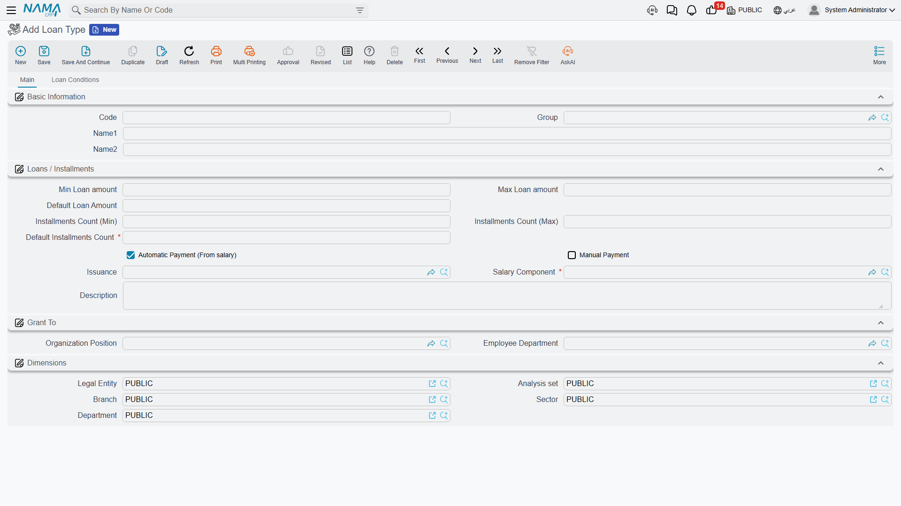

# Loan Types

Every loan or salary advance in Nama starts from a **Loan Type** (نوع السلفة) — a master file that defines what an employee can borrow: the default and allowed range for the amount, the default and allowed range for the number of installments, who is eligible, and — most importantly — **which salary component recovers it from pay**. Nama does not model "interest-free advance" and "installment plan" as two different entities; the difference is purely how a loan type is configured. A type whose default installment count is 1 behaves like a one-off advance handed out and settled in a single payroll cycle; a type with many installments behaves like a proper installment plan recovered gradually.

**Where to find it:** Payroll > Loans / Installments > Loan Type.

## Key fields

| Field (English) | Arabic | Notes |
|---|---|---|
| Default Installments Count | عدد الأقساط الافتراضي | Required. Pre-fills new [Loan Requests](hr-loan-documents.md) of this type. A value of 1 turns the type into a single lump-sum advance. |
| Minimum / Default / Maximum Loan Amount | أقل قيمة للسلفة / القيمة الأفتراضية للسلفة / أقصي قيمة للسلفة | The boundaries a Loan Request of this type must respect. |
| Minimum / Maximum Installments Count | الحد الأدنى لعدد الأقساط / الحد الأقصى لعدد الأقساط | The installment-count range allowed for this type. |
| Organization Position / Employee Department | الدرجة الوظيفية / إدارة موظف | Narrows which employees may use this type. When either is left blank the type is open to every position/department; the loan type list an employee sees on their own request is filtered to types that either match their own department/position or leave it blank. |
| Salary Issuance | الصرفية | Restricts the type to one payroll stream, the same issuance classifier used across the module (see [HR Years, Periods & Salary Issuance](../setup/hr-years-and-periods.md)). |
| Salary Component | مفرد راتب | Required. The single [salary component](../payroll/salary-components.md) — normally an *Installment*-classified deduction — through which the salary engine pulls this loan's installment out of pay automatically each period. |
| Automatically Deducted From Salary | تخصم من الراتب آليا | If checked, installments of this loan type are recovered every payroll run through the salary component above, with no separate action needed. |
| Manual | يدوي | If checked, this loan type can also (or only) be settled by hand through a Loan Payment Document instead of, or in addition to, the automatic payroll deduction — see [Loan Documents & Payments](hr-loan-documents.md). |

## Eligibility conditions

A Loan Type can carry a grid of **Conditions Should Matched In Loan Document** (الشروط الواجب توافرها في سند السلفه) — the rules a Loan Document of this type must pass before it can be committed. Each row can combine:

- A free-form query or criteria on the employee file or on the loan document itself, for cases the built-in fields below don't cover.
- Years-of-experience and service-months ranges (`From Exp Year`/`To Exp Year`, `From Service Month`/`To Service Month`) — an employee must fall inside the range to qualify.
- A salary bracket (`Salary Document Amount Greater Than Or Equal` / `Less Than`) and a loan-value bracket (`Loan Value Greater Than` / `Less Than`), so a rule can apply only to loans of a certain size taken by employees in a certain pay range.
- A **Max Installment Type** (نوع الحد الأقصى للقسط) ceiling expressed as *Basic Salary Percent*, *Salary Components Percent* (against the specific components listed in the type's own **Salary Components** grid, مفردات الراتب), *Final Salary Percent*, or a *Fixed Value* — plus a matching **Max Installment Value** (الحد الأقصى للقسط) applied per installment rather than to the loan total.
- Whether to fold in installments of the **same loan type already running this month** when checking these ceilings (`Consider Same Type Installments In Same Month` / الأخذ في الاعتبار الاقساط من نفس النوع في نفس الشهر), and whether to look back at the employee's **earlier loans of this type** at all (`Search Pre Loans For Loan Type`).
- A restricting job position, organization position, or department for that specific rule (narrower than the type-level fields above), and a date range on the loan document itself.

::: tip Setup, not approval
These conditions are a validation gate on the Loan Document, not an approval workflow — a document that fails one of them simply cannot be committed. Use the standard approval case configuration on the document term if you also need a human sign-off before disbursement.
:::

## Where this fits

- **[Loan Documents & Payments](hr-loan-documents.md)** — the request, the disbursement document, and the manual payment document this type feeds.
- **[Salary Components](../payroll/salary-components.md)** — where the recovery component's own classification and account lines live.
