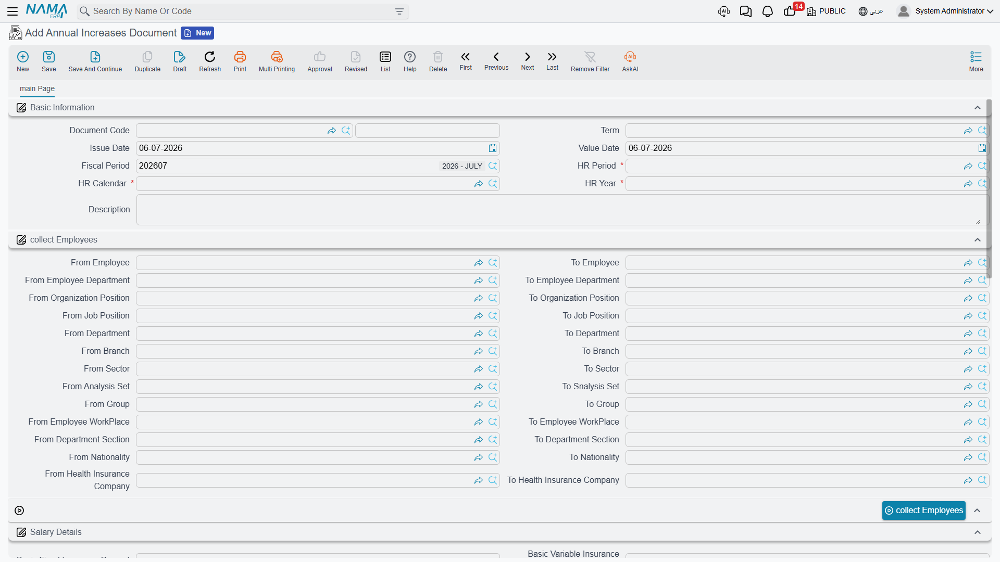

# Annual Increases

Salaries don't stay still. Once a year — or whenever a company decides on a raise round — every employee's pay needs to move: a percentage on the basic salary, a fixed bump to an allowance, a new insurable base. Doing that one employee at a time is exactly the kind of repetitive work that invites mistakes. The **Annual Increases Document** turns a raise campaign into a single, reviewable document: you describe *who* gets raised and *how*, collect the matching employees, and let the document generate the individual salary changes.

## Where to find it

**Payroll > Main > Annual Increases Document** (الرواتب > الأساسيات > مستند الزياده السنوية).

## Why it exists

A raise round has two moving parts that this document keeps together in one place: the **scope** (which employees are in the round) and the **rule** (what happens to their pay). Rather than editing hundreds of employee records by hand, you state the rule once, let the document harvest the eligible employees from filter criteria, and — for each one — it produces the actual per-employee change that carries the new figures onto the employee's record.

::: info This document does not post to the ledger
An Annual Increases Document is a **payroll-configuration** action, not an accounting one. It changes what employees will be *paid going forward*; it does not itself create any general-ledger entry. The financial effect only shows up later, when the next [salary documents](salary-documents.md) are generated with the raised figures.
:::

## The header: period, scope, and blanket increases

The top of the document fixes the timing and the population, and offers a few whole-population increases:

| Field (English) | Arabic label | Purpose |
|---|---|---|
| HR Year / HR Period / HR Calendar | سنة الرواتب / فترة الرواتب / تقويم الرواتب | The [payroll year, period and calendar](../setup/hr-years-and-periods.md) the raise round belongs to. |
| Issue Date / Value Date | تاريخ الإصدار / التاريخ الفعلي | When the document is written up, and the effective date the increase takes hold. |
| Generation Type | نوع الإنشاء | Tracks whether the per-employee lines have been generated yet, and whether they are still editable. |
| Basic Fixed Insurance Percent / Basic Fixed Insurance Value | نسبة الزيادة في الأساسي التأميني الثابت / قيمة الزيادة في الأساسي التأميني الثابت | A blanket percentage or fixed amount added to the **fixed insurable basic salary** for the whole round. |
| Basic Variable Insurance Percent | نسبة الزيادة في الأساسي التأميني المتغير | A blanket percentage added to the **variable insurable basic salary**. |
| Daily Salary Percent | نسبة الزيادة في الأجر اليومي | A blanket percentage added to the **daily wage**, for daily-paid labor. |
| Branch / Department / Sector / Legal Entity / Analysis Set | الفرع / الإدارة / القطاع / الشركة / مجموعة التحليل | The standard **Dimensions** that scope the document. |

### Who gets raised — the employee range

The document doesn't take a hand-typed list of employees. Instead you define a **range of criteria** — a set of *from / to* filters — and the document collects everyone who matches. The available bands cover employee, department, employee's department, department section, branch, sector, group, job position, organization position, work place, nationality, health-insurance company, analysis set, and the generic reference/description fields. Leaving a band open widens the net; narrowing it targets a specific slice of the workforce — one branch, one nationality, one job grade.

## The rule: which components get raised, and by how much

The **Details** grid (التفاصيل) is where the actual raise rule lives. Each line targets a salary component and states how it moves:

| Field (Arabic → English) | Purpose |
|---|---|
| نوع المفرد (Component Type) | The category of [salary component](salary-components.md) the rule applies to. |
| مفرد الراتب هدف الزيادة (Target Salary Component) | The specific component being increased. |
| نوع الزيادة (Increase Type) | *How* the component moves — see the values below. |
| نسبة/قيمة الزيادة (Increase Percentage / Value) | The magnitude — read as a percentage or an amount, depending on the increase type. |

**Increase Type** (نوع الزيادة) decides the mechanism:

| Value (Arabic → English) | Meaning |
|---|---|
| نسبه مضافة (Addition Percentage) | Raise the component by a percentage of its current value. |
| قيمة مضافة (Addition Value) | Add a fixed amount to the component. |
| نسبه مخصومة (Deduction Percentage) | Reduce the component by a percentage — a negative round. |
| قيمة مخصومة (Deduction Value) | Subtract a fixed amount from the component. |
| استبدال القيمة (Replace Value) | Overwrite the component's value with the figure entered — used when the new pay is set outright rather than nudged. |

::: tip Blanket rules apply to everyone collected — exceptions handle the edge cases
The Details grid is the *blanket* rule for the whole round. When a handful of employees should be treated differently — a larger raise for a top performer, no raise for someone still on probation — you record them in the **Exceptions** grid (الإستثناءات) instead. Each exception line names the employee, the target component, an increase type and a magnitude of its own, overriding the blanket rule for that one person.
:::

## Workflow

1. **Create** the document under **Payroll > Main > Annual Increases Document** and set its HR Year, Period, Calendar, and effective (Value) date.
2. **Define the scope** by filling the employee range criteria — as wide or as narrow as the round requires.
3. **Define the rule(s)** in the Details grid: for each component you want to move, pick the target component, the increase type, and the magnitude. Add any per-employee overrides in Exceptions.
4. **Collect the employees.** Use **Collect Employees** (تجميع الموظفين) to resolve the range criteria into concrete employee lines, or **Collect Employees With Components** (تجميع الموظفين مع المفردات) to bring each employee in together with their resolved salary components — so you can see and fine-tune the effect before committing.
5. **Review the generated lines.** Each collected employee appears in the **Employees Lines** grid (سطور الموظفين), showing the employee, their supervisor, and — once processed — a link to the per-employee change document that actually carries the new figures onto the employee's record.
6. **Save and process.** The document then generates one employee-info change per collected line, applying the raised figures going forward.

::: warning Edit the campaign, not the generated changes
Like other batch documents in Nama, the per-employee changes an Annual Increases Document produces are managed *by* the document. Re-collecting or reprocessing the campaign is the right way to adjust the round — editing the generated single changes directly puts them out of step with the campaign that owns them.
:::

## How it's processed

When saved, the document resolves its scope into employee lines and, per line, produces a per-employee change that writes the raised figures back onto each employee's record. This happens as background **business requests** with a **processing status**; if a line fails to process, it can be retried from the **Business Requests** view like any other request. No amount is posted to the general ledger by this document — the money only moves when the *next* salary run picks up the new figures.

## Related pages

- **[Salary Components](salary-components.md)** — the components an increase rule targets, and where the raised values ultimately live.
- **[Salary Documents](salary-documents.md)** — where the raised figures finally turn into paid salary and a ledger effect.
- **[How Salary Is Calculated](../concepts/hr-salary-engine.md)** — the full pipeline the raised components feed into.
- **[HR Years, Periods & Salary Issuance](../setup/hr-years-and-periods.md)** — the payroll calendar a raise round is tied to.
