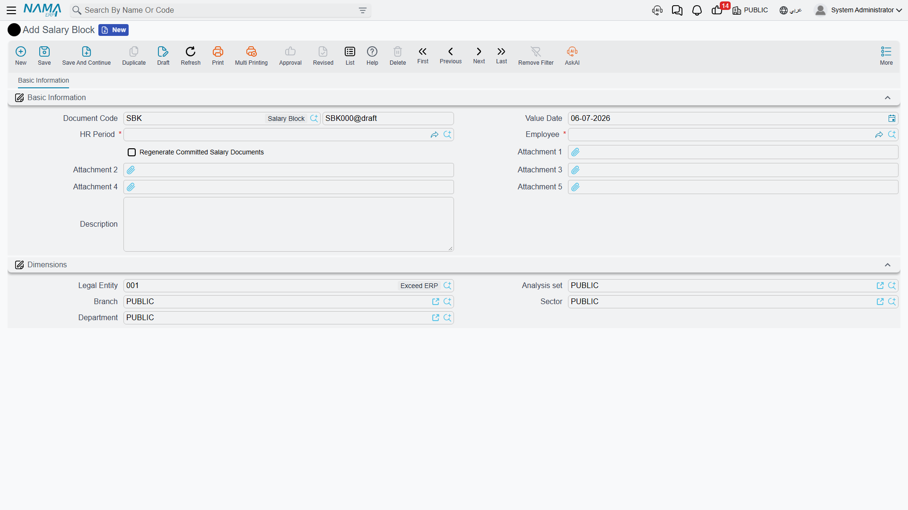
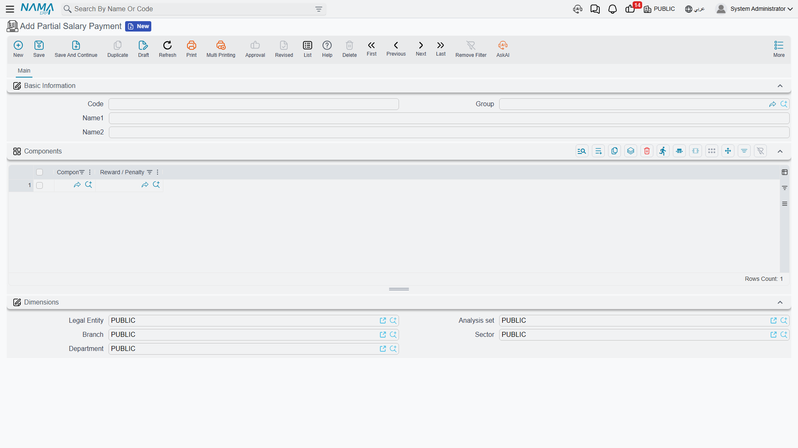

# Salary Blocking & Partial Payment

Sometimes a salary shouldn't be paid out — at least not yet, and not in full. An employee is under investigation, hasn't returned company property, or has an unresolved clearance; the pay is earned and calculated, but it needs to be *held* until the situation resolves. Nama handles this with a small family of documents: a **rule** that decides automatically when to hold pay, a **block document** that does the holding, an **unblock document** that releases it, and a **partial payment** template for paying out only part of a held (or ordinary) salary.

## The pieces

| Screen | Type | What it does |
|---|---|---|
| Salary Block Rule (قاعدة حجب مرتب) | Setup | Conditions that decide *automatically* whose pay to hold. |
| Salary Block (حجب راتب موظف) | Document | Holds a specific employee's pay for a period. |
| Salary UnBlock (إلغاء حجب راتب) | Document | Releases a hold, restoring normal payment. |
| Partial Salary Payment (ملف صرف راتب جزئي) | Setup | A reusable template selecting which components get paid out in a partial payment. |

## Salary Block Rule — deciding automatically whom to hold

Rather than manually blocking employees one by one, a **Salary Block Rule** lets you express the *conditions* under which pay should be held, and have the system apply them. Found at **Payroll > Settings > Salary Block Rule** (الرواتب > الإعدادات > قاعدة حجب مرتب).

| Field (Arabic → English) | Purpose |
|---|---|
| الاسم العربي / الاسم الإنجليزي (Arabic Name / English Name) | Identifies the rule. |
| تفعيل (Activate) | Turns the rule on or off. |
| الحجب عند (Block on) | Whether **Any Condition** (أي شرط) or **All Conditions** (كل الشروط) must be met before pay is held. |
| إدارة موظف (Employee Department) / المجموعة (Group) / فترة الرواتب (HR Period) | Scope the rule to a department, a group, or a specific period. |

The conditions themselves live in the **Block Rules** grid (قواعد الحجب): each line attaches a **Rule** (قاعدة) — a [calculation formula](salary-calculation-formulas.md), the same condition-evaluating building block used elsewhere in payroll — that is evaluated against the employee. The **Block on** setting decides whether *any* matching condition is enough to hold the pay, or whether *all* of them must match.

## Salary Block — holding an employee's pay

A **Salary Block** document (**Payroll > Payroll > Salary Block** — الرواتب > الرواتب > حجب راتب موظف) is the actual hold: it names an employee and a period, and while it stands, that employee's salary for that period is prevented from being paid. It can be raised by hand, or generated automatically from a block rule that matched.

| Field (Arabic → English) | Purpose |
|---|---|
| الموظف (Employee) | Whose pay is being held. |
| فترة الرواتب (HR Period) | The period the hold applies to. |
| بناءا على (From Document) | The source it was generated from — e.g. the rule evaluation that raised it. |
| تاريخ التحرير / التاريخ الفعلي (Issue Date / Value Date) | When it was written up, and the effective date. |
| إعادة إصدار سندات الرواتب المحفوظة (Regenerate Committed Salary Documents) | Whether to force-regenerate already-committed salary documents affected by this hold, so the block takes effect on pay that was already calculated. |
| توجيه المستند (Term) | The document term governing its numbering. |

## Salary UnBlock — releasing the hold

When the situation clears, a **Salary UnBlock** document (**Payroll > Payroll > Salary UnBlock** — الرواتب > الرواتب > إلغاء حجب راتب) reverses the block, restoring the employee's ability to be paid for that period. It mirrors the block's fields (employee, period, dates, term), and its **From Document** (بناءا على) links back to the block it lifts — so the hold and its release stay paired and auditable. Like the block, it can force-regenerate the affected salary documents so the release takes effect immediately.

## Partial Salary Payment — paying out only part

A held salary — or simply a salary a company chooses to pay in stages — sometimes needs to be paid out *partially*: this allowance now, the rest later. A **Partial Salary Payment** (**Payroll > Salary Configurations > Partial Salary Payment** — الرواتب > إعدادات الراتب > ملف صرف راتب جزئي) is the **template** that defines *which* parts get paid.

It is a reusable master record, not a payment itself. Beyond its Arabic/English name and group, its substance is the **Components** grid (المكونات):

| Field (Arabic → English) | Purpose |
|---|---|
| مكون (Component) | A [salary component](salary-components.md) to include in the partial payment. |
| نوع مكافأة / جزاء (Reward / Penalty) | Optionally, a specific [reward or penalty](../discipline/rewards-and-penalties.md) to include. |

Notice there is **no amount** on the template — it selects *which components* participate, not how much. The figure comes from the components themselves when the payment is actually made.

## How it's processed / what it posts

::: info The partial-payment template drives a Payment Voucher — and the voucher is what posts
This is the part worth getting right. Neither the block document, the unblock document, nor the partial-payment template posts anything to the general ledger by itself — the block/unblock documents are pure HR controls that gate *whether* salary can be paid, and the partial-payment record is only a component-selection template.

The real cash-out is a **Payment Voucher** (a standard accounting payment document): when an operator pays part of a salary, they issue a payment voucher and attach the **Partial Salary Payment** template to it, which tells the voucher *which* salary components (and rewards/penalties) are being paid out in this instalment. It is the **payment voucher** that posts the actual debit/credit to the ledger — crediting cash/bank and settling the salary payable for the selected components — as a background **business request** with a **processing status**, retryable from the **Business Requests** view. The partial-payment file supplies the *what*; the voucher does the paying and the posting.
:::

## Workflow

1. **(Optional) Define a block rule** under **Payroll > Settings > Salary Block Rule** with the conditions that should automatically hold pay, and choose Any / All.
2. **Block the pay** — either let a rule generate the **Salary Block**, or raise one by hand for the employee and period. Set *Regenerate Committed Salary Documents* if the pay was already calculated.
3. **Pay partially if needed** — set up a **Partial Salary Payment** template listing the components to release, then issue a **Payment Voucher** referencing it to actually pay (and post) that portion.
4. **Release the hold** — when the situation resolves, raise a **Salary UnBlock** from the block, restoring normal payment.

## Related pages

- **[Salary Documents](salary-documents.md)** — the payslips a block holds and an unblock releases.
- **[Salary Calculation Formulas](salary-calculation-formulas.md)** — the condition-formulas a block rule evaluates.
- **[Salary Components](salary-components.md)** — the components a partial payment selects to pay out.
- **[Rewards & Penalties](../discipline/rewards-and-penalties.md)** — the reward/penalty a partial payment can include.
