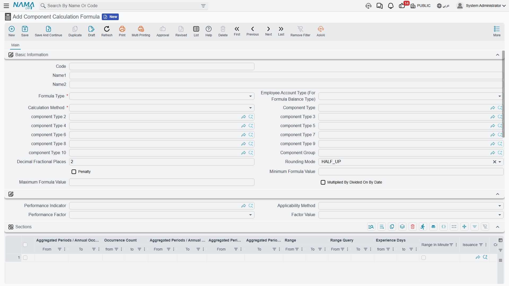
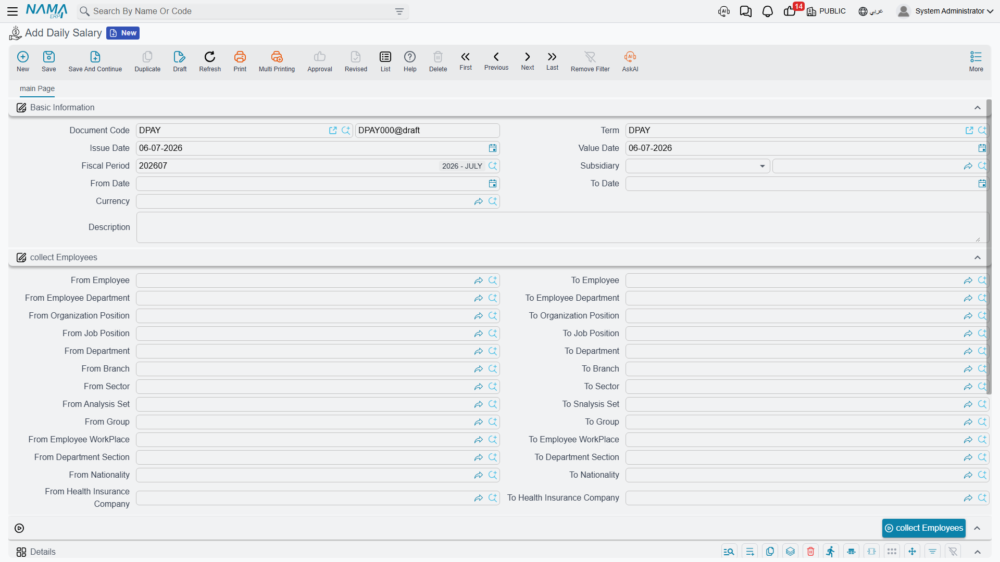

# Salary Calculation Formulas

A [Salary Component](salary-components.md) set to **Variable Value** doesn't carry a number of its own — it carries a **Component Calculation Formula**, which is the recipe that turns that month's inputs into a figure. This page covers how formulas are built, and covers the separate **Daily Salary** document used for employees who are paid by the day rather than by the month.

## Component Calculation Formula — the recipe

Found at **Payroll > Salary Configurations > Component Calculation Formula**, a formula's most important setting is its **Formula Type** — where the number comes from in the first place. There are more than twenty sources available; the ones support staff run into most often are:

| Formula Type | Arabic | Reads from |
|---|---|---|
| Percentage From Totals / Additions / Deductions | نسبة من الإجمالي / الإضافات / الأستقطاعات | A slice of other components' amounts. |
| Insurance Percentage (and its Fixed / Variable / Employee / Company variants) | نسبة من وعاء التأمينات (وتنويعاتها) | The employee's or the company's share of the fixed or variable insurance base. |
| Tax Percentage / Taxes | نسبة من وعاء الضرائب / الضرائب | A flat percentage, or a full progressive tax table (its own dedicated bracket grid — see below). |
| Related To Performance Indecator | مرتبط بمؤشر أداء | A measured figure — overtime hours, sales, attendance — from a [Performance Indicator](../performance/performance-indicators.md). |
| Related To Component | مرتبط بمفرد | Another component's own value, used as a building block. |
| Composite Formula | تتكون من معادلات أخري | A weighted combination of other formulas, each multiplied/divided by its own factor. |
| Fixed Value In Offer | القيمة المثبتة بالعرض الوظيفي | The literal value that was written into the employee's job offer. |
| Percentage From Service End | نسبة من نهاية الخدمة | A share of the end-of-service base — see [Provisions & End of Service](../end-of-service/hr-provisions.md) once published. |
| Balance From Employee Account (Debit-Credit / Credit-Debit) | رصيد حساب من حسابات الموظف | The running balance of one of the employee's own accounts — used for things like recovering an outstanding balance. |

When a formula is **Related To Performance Indicator**, its **Applicability Method** decides how the indicator's figure is applied:

| Applicability Method | Arabic | Behavior |
|---|---|---|
| Daily | يومي | The indicator is factored in **per working day**. |
| Periodic | فتري | The indicator's **whole-month total** is used once. |

### Calculation method: one rate, or progressive brackets

| Calc Method | Arabic | Behavior |
|---|---|---|
| One Percentage | نسبة واحدة | A single rate applies to the entire base. |
| Sections | شرائح | Progressive brackets — each slice of the base is computed at its own rate, exactly like an income-tax table. |

With **Sections**, the formula's **calculation lines** define the brackets, and each line can combine several kinds of gate at once:

- **Range** — a from/to band on the base value (or a SQL query for a computed range), plus a separate **Experience Days** from/to band for seniority-based brackets.
- **Rate** — multiply-by / divide-on factors, a flat rate, and an **Added Value** on top.
- **Criteria** (المعايير) — an optional filter (on the employee file, the HR information record, or the salary document itself) that must match for the bracket to apply at all.
- **Occurrence Count** — from/to bounds on how many times this bracket has already fired this period, or in the year/aggregated-period, useful for rules like "the first two occurrences are free, the third onward is penalized."
- **Vacation / Holiday / Weekend factors** — separate multipliers applied when the day in question falls on a vacation, an official holiday, or a weekly rest day.

The whole formula can also be clamped with an overall **Minimum Formula Value** / **Maximum Formula Value**, regardless of what the brackets compute.

::: tip A worked example: a seniority bonus by brackets
Suppose a component pays a **seniority bonus** as a percentage of basic salary, defined with **Sections** using the **Experience Days** range instead of a value range:

- 0 – 365 days of service → 0%
- 366 – 1,095 days → 5%
- 1,096 days and above → 10%

An employee with 900 days of service falls in the second bracket, so their bonus is **5% of basic salary** — not a blend of the brackets below it, because experience-day brackets (like value brackets) select **one** matching bracket rather than accumulating across all of them the way progressive tax slices do. If the same component also carried a **Criteria** limiting it to a specific department, an employee outside that department would get nothing at all, regardless of their experience.
:::

For the **Taxes** formula type specifically, brackets are defined in a separate, purpose-built **Tax Ranges** grid instead of the generic calculation lines: a Value threshold, a Tax Percentage, a Discount Percentage with its own min/max discount, and — for annual calculations — an "annual income greater than / less than or equal" band. A handful of extra flags (Tax On Tax, Tax Range Is Monthly, Discount Employee Insurance Before Tax, and others) refine how this interacts with country-specific tax rules.

A **Composite Formula** instead lists other formulas in a **Formulas** grid, each with its own multiply-by / divide-on factor, letting one formula be assembled from several simpler ones. And a formula can optionally pull figures from **up to ten other issuances** (see [HR Years, Periods & Salary Issuance](../setup/hr-years-and-periods.md)) when computing its rate — useful when, say, a commission formula needs to see totals from a separate "Sales" payroll stream.

::: info The "why is this number what it is" audit trail
The HR module's **Salary Config** settings include **Log Salary Account Detail In Database** (تسجيل تفاصيل حساب المرتب في قاعدة البيانات). When it's turned on, every bracket that actually fires while calculating a salary document is written to a detail audit entry — the trail support staff rely on when an employee asks "why is my bonus this amount and not that one."
:::

## Daily Salary — for employees paid by the day

Not every employee is paid a monthly component-driven salary. For daily-wage staff, Nama uses a separate document: **Daily Salary** (أجر يومى, **Payroll > Payroll > Daily Salary**).

| Field | Purpose |
|---|---|
| Document Code (Book / Code) | The document's own numbering. |
| Term (توجيه المستند) | The document term that governs its numbering and accounting. |
| Issue Date / Value Date | When it was written up, and the accounting date it takes effect on. |
| Fiscal Period / Subsidiary | The accounting period and the ledger subsidiary it posts against. |
| From Date / To Date | The date range this daily-wage run covers. |

A **Collect Employees** block (from/to employee, department, branch, sector, job/organization position, nationality, health-insurance company, and more) combined with the **Collect Employees** (تجميع الموظفين) button pulls in every matching employee in one pass, rather than adding them one at a time.

Each collected employee gets a **Details** line with: **Daily Wage** (days count, per-day value, total), **Overtime** (hours, hourly wage, total), **Other Additions**, **Deduction** (hours, hourly wage, total), **Other Deductions**, and a computed **Net Value**.

## How it's processed / what it posts

Unlike a Salary Component — which relies entirely on the component's own account lines carried through a monthly [Salary Document](salary-documents.md) — **Daily Salary posts its own accounting effect directly**. Its document term configures separate debit and credit sides for the Daily Wage Total, the Overtime Total, Other Additions, Deduction Total, and Other Deductions, each posted as its own background business request. If a Daily Salary document's processing fails, it is retried the same way as any other business request, from the Business Requests view.

## Related pages

- **[Salary Components](salary-components.md)** — where a formula gets attached, via a component's Variable Value.
- **[Time & Attendance](../attendance/time-attendance.md)** — the daily punches that ultimately drive performance-indicator-based formulas.
- **[Performance Indicators](../performance/performance-indicators.md)** — the measured figures a "Related To Performance Indicator" formula reads.
- **[How Salary Is Calculated](../concepts/hr-salary-engine.md)** — the full pipeline these formulas fit into.
