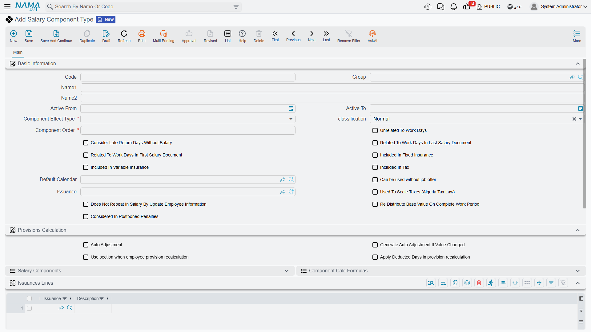

# Salary Components

Every payslip is built from small, reusable pieces: a basic salary, a housing allowance, a tax, an overtime line, an insurance deduction. In Nama, each of those pieces exists at two levels — a **Salary Component Type**, which defines the *kind* of pay or deduction and the rules that apply to it, and a **Salary Component**, the actual priced element that gets attached to an employee. A **Salary Component Group** exists purely to keep a long component list organized. This page covers all three; how a component's value is *calculated* when it isn't a flat number is the subject of [Salary Calculation Formulas](salary-calculation-formulas.md).

## Salary Component Type — the kind of pay or deduction

Found at **Payroll > Salary Configurations > Salary Component Type**, a component type is the category — Basic, Housing, Transportation, a tax, an insurance share — and it carries flags that every component created under it inherits.

| Field (English) | Arabic label | Purpose |
|---|---|---|
| Code / Group / Arabic Name / English Name | الكود / المجموعة / الاسم العربي / الاسم الإنجليزي | Identification. |
| Active From / Active To | فعّال من / فعّال إلى | The date range during which the type itself is in effect. |
| Component Effect Type | نوع التأثير | Whether components of this type add to, subtract from, or sit outside net pay — see table below. |
| Classification | التصنيف | A finer categorization used by specific payroll rules — see table below. |
| Component Order | ترتيب المفرد | The calculation sequence. **Load-bearing**: a component that is a percentage of another must be ordered *after* the component it depends on. |
| Default Calendar | التقويم الافتراضى | The [HR Calendar](../setup/hr-calendar-and-holidays.md) components of this type use unless overridden. |
| Issuance | الصرفية | Ties this component type to a [payroll stream](../setup/hr-years-and-periods.md), so it only feeds its own salary run. |

**Component Effect Type** decides what a component actually does to the payslip:

| Effect Type | Arabic | Role |
|---|---|---|
| Addition | إضافة | Increases the salary — basic pay, allowances, overtime. |
| Deduction | إستقطاع | Reduces the salary — tax, insurance, penalties, installments. |
| Other | أخري | Informational only. Recorded, but never added to or subtracted from net pay. |

**Classification** narrows the type further, and several of its values have special behavior baked into the payroll engine:

| Classification | Arabic | Notes |
|---|---|---|
| Normal | عادية | An ordinary pay or deduction element. |
| Basic Salary | الراتب الأساسى | The base figure many percentage-based formulas key off. |
| Housing Allowance | بدل سكن | Only pays out for an employee whose own [HR Information](../setup/employee-hr-information.md) record has the housing switch turned on — the type alone is not enough. |
| Transportation Allowance | بدل مواصلات | Same rule as housing: gated by the employee's own record. |
| Work End | نهاية خدمة | Deliberately zero in an ordinary monthly salary; this classification only carries value inside end-of-service settlement documents. |
| Installment | قسط | Also deliberately zero in a normal salary run; installment recovery happens through its own loan documents, not the monthly component machinery. |

::: tip Why a component sometimes looks like it's "not working"
If a component always computes to zero, check its classification and its tax/insurance flags before assuming something is broken. **Other**-effect components are zero by design; **Work End** and **Installment** classifications are zero outside their dedicated documents; and Housing/Transportation allowances need the switch enabled on the employee, not just a component definition. See [How Salary Is Calculated](../concepts/hr-salary-engine.md) for the full list of self-zeroing causes.
:::

The type also decides whether its components count toward the **fixed insurance base**, the **variable insurance base**, and the **tax base** — three independent yes/no flags — and owns two embedded lists for reference: the **Salary Components** built under it, and the **Component Calc Formulas** associated with it.

## Salary Component — the priced element

Found at **Payroll > Salary Configurations > Salary Component**, this is the record that actually gets attached to an employee, either directly on their [HR Information](../setup/employee-hr-information.md) or through a [Salary Structure](salary-structures.md). Its most important choice is the **value method**:

| Value Method | Arabic | Meaning |
|---|---|---|
| Constant Value | قيمة ثابتة | A fixed literal number — e.g. a housing allowance of 1,000. |
| Variable Value | متغير | Driven by a **[Component Calculation Formula](salary-calculation-formulas.md)**, so the amount is recalculated from its inputs every period. |

A component also carries its own **Component Order** and **Priority** (used when several components could apply and only one should win), plus a set of flags that fine-tune its behavior: whether editing its value on a generated salary document is even allowed (**Prevent Updating In Component Value**), whether regenerating a salary sheet should leave manually-edited values alone (**Do Not Override After Regenerate**), whether negative values are permitted, and the same fixed-insurance / variable-insurance / tax-base flags seen on the type (a component can narrow what its type allows, never widen it).

### Who it applies to

On the **Apply Scope** tab, a component can be restricted with an **Employee Criteria** and an **HR Info Criteria** (free-form filters over the employee's master file and HR information), plus explicit **From/To** ranges on legal entity, branch, department, sector, analysis set, employee, employee department, job position, nationality, and group. Leaving these open applies the component broadly; narrowing them lets one component type carry several differently-scoped components — for example, a transportation allowance that only applies to a particular branch.

### Where it posts — account lines

A component carries its own **debit account lines** and **credit account lines**, each with a percentage share and a fully configurable account source (a fixed account, an account read from a reference field, or one selected from a currency-aware "bag" of accounts) plus a narration template. This is exactly what lets a [salary document](salary-documents.md) post to the general ledger: the document itself carries no accounting logic of its own — it simply totals up its component lines and posts through each component's account lines. A simpler **Detail Accounts** group (Main Account plus five numbered fallback accounts) is also available for components that don't need the full debit/credit configuration.

## Salary Component Group — organization only

A **Salary Component Group** (مجموعة مفردات راتب, **Payroll > Salary Configurations > Salary Component Group**) simply bundles related components together for filtering and reporting. It has no effect whatsoever on how a component is calculated or where it posts — pure organization, nothing more.

## Related pages

- **[Salary Calculation Formulas](salary-calculation-formulas.md)** — how a Variable Value component gets its number.
- **[Salary Structures](salary-structures.md)** — reusable templates that assign components to groups of employees.
- **[How Salary Is Calculated](../concepts/hr-salary-engine.md)** — the full five-step pipeline these entities sit inside.
- **[Employee HR Information](../setup/employee-hr-information.md)** — where an employee's own component lines live, and where the Housing/Transportation switches are turned on.
