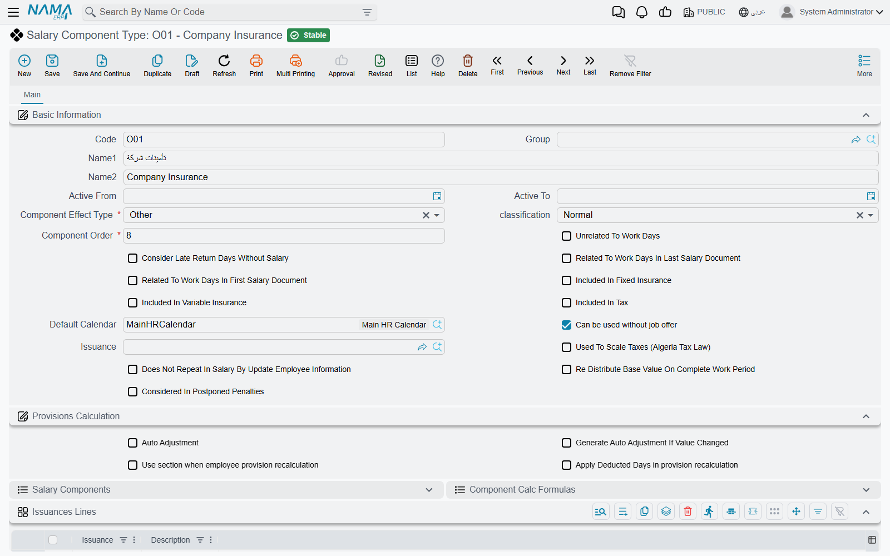
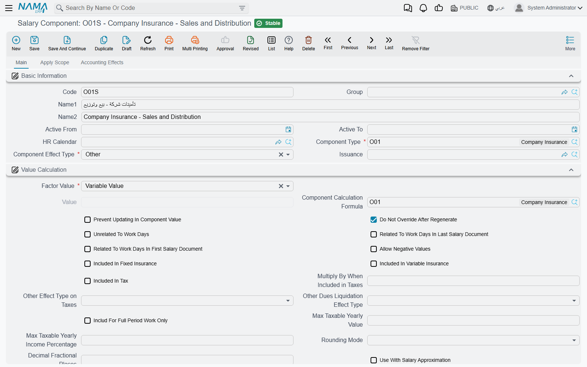

# Salary Components

Every payslip is built from small, reusable pieces: a basic salary, a housing allowance, a tax, an overtime line, an insurance deduction. In Nama, each of those pieces exists at two levels — a **Salary Component Type**, which defines the *kind* of pay or deduction and the rules that apply to it, and a **Salary Component**, the actual priced element that gets attached to an employee. A **Salary Component Group** mainly keeps a long component list organized, with one narrow effect on generation described below. This page covers all three; how a component's value is *calculated* when it isn't a flat number is the subject of [Salary Calculation Formulas](salary-calculation-formulas.md).

## Salary Component Type — the kind of pay or deduction

Found at **Payroll > Salary Configurations > Salary Component Type**, a component type is the category — Basic, Housing, Transportation, a tax, an insurance share — and it carries flags that every component created under it inherits.

| Field (English) | Arabic label | Purpose |
|---|---|---|
| Code / Group / Arabic Name / English Name | الكود / المجموعة / الاسم العربي / الاسم الإنجليزي | Identification. |
| Active From / Active To | فعّال من / فعّال إلى | The date range during which the type itself is in effect. |
| Component Effect Type | نوع التأثير | Whether components of this type add to, subtract from, or sit outside net pay — see table below. |
| Classification | التصنيف | A finer categorization used by specific payroll rules — see table below. |
| Component Order | ترتيب المفرد | The calculation sequence. **Load-bearing**: a component that is a percentage of another must be ordered *after* the component it depends on. |
| Default Calendar | التقويم الافتراضى | The [HR Calendar](../setup/hr-calendar-and-holidays.md) components of this type use unless overridden. |
| Issuance | الصرفية | Ties this component type to a [payroll stream](../setup/hr-years-and-periods.md), so it only feeds its own salary run. |

**Component Effect Type** decides what a component actually does to the payslip:

| Effect Type | Arabic | Role |
|---|---|---|
| Addition | إضافة | Increases the salary — basic pay, allowances, overtime. |
| Deduction | إستقطاع | Reduces the salary — tax, insurance, penalties, installments. |
| Other | أخري | Informational only. Recorded, but never added to or subtracted from net pay. |

**Classification** narrows the type further, and several of its values have special behavior baked into the payroll engine:

| Classification | Arabic | Notes |
|---|---|---|
| Normal | عادية | An ordinary pay or deduction element. |
| Basic Salary | الراتب الأساسى | The base figure many percentage-based formulas key off. |
| Housing Allowance | بدل سكن | Only pays out for an employee whose own [HR Information](../setup/employee-hr-information.md) record has the housing switch turned on — the type alone is not enough. |
| Transportation Allowance | بدل مواصلات | Same rule as housing: gated by the employee's own record. |
| Work End | نهاية خدمة | Deliberately zero in an ordinary monthly salary; this classification only carries value inside end-of-service settlement documents. |
| Installment | قسط | Also deliberately zero in a normal salary run; installment recovery happens through its own loan documents, not the monthly component machinery. |

::: tip Why a component sometimes looks like it's "not working"
If a component always computes to zero, check its classification and its tax/insurance flags before assuming something is broken. **Other**-effect components are zero by design; **Work End** and **Installment** classifications are zero outside their dedicated documents; and Housing/Transportation allowances need the switch enabled on the employee, not just a component definition. See [How Salary Is Calculated](../concepts/hr-salary-engine.md) for the full list of self-zeroing causes.
:::

The type also decides whether its components count toward the **fixed insurance base**, the **variable insurance base**, and the **tax base** — three independent yes/no flags — and owns two embedded lists for reference: the **Salary Components** built under it, and the **Component Calc Formulas** associated with it.

## Salary Component — the priced element

Found at **Payroll > Salary Configurations > Salary Component**, this is the record that actually gets attached to an employee, either directly on their [HR Information](../setup/employee-hr-information.md) or through a [Salary Structure](salary-structures.md). Its most important choice is the **value method**:

| Value Method | Arabic | Meaning |
|---|---|---|
| Constant Value | قيمة ثابتة | A fixed literal number — e.g. a housing allowance of 1,000. |
| Variable Value | متغير | Driven by a **[Component Calculation Formula](salary-calculation-formulas.md)**, so the amount is recalculated from its inputs every period. |

A component also carries its own **Component Order** and **Priority** (used when several components could apply and only one should win), plus a set of flags that fine-tune its behavior: whether editing its value on a generated salary document is even allowed (**Prevent Updating In Component Value**), whether regenerating a salary sheet should leave manually-edited values alone (**Do Not Override After Regenerate**), whether negative values are permitted, and the same fixed-insurance / variable-insurance / tax-base flags seen on the type (a component can narrow what its type allows, never widen it).

### Who it applies to

On the **Apply Scope** tab, a component can be restricted with an **Employee Criteria** and an **HR Info Criteria** (free-form filters over the employee's master file and HR information), plus explicit **From/To** ranges on legal entity, branch, department, sector, analysis set, employee, employee department, job position, nationality, and group. Leaving these open applies the component broadly; narrowing them lets one component type carry several differently-scoped components — for example, a transportation allowance that only applies to a particular branch.

### Where it posts — account lines

A component carries its own **debit account lines** and **credit account lines**, each with a percentage share and a fully configurable account source (a fixed account, an account read from a reference field, or one selected from a currency-aware "bag" of accounts) plus a narration template. This is exactly what lets a [salary document](salary-documents.md) post to the general ledger: the document itself carries no accounting logic of its own — it simply totals up its component lines and posts through each component's account lines. A simpler **Detail Accounts** group (Main Account plus five numbered fallback accounts) is also available for components that don't need the full debit/credit configuration.

## Salary Component Group

A **Salary Component Group** (مجموعة مفردات راتب, **Payroll > Salary Configurations > Salary Component Group**) bundles related components together for filtering and reporting. That is most of what it does, and for the great majority of groups it is all of it.

The exception is the group's **component types** grid. Each line names a component type, and where that type's own effect is **Other**, the line's **Other Component Effect Type** column says whether salary generation should treat it as an addition or a deduction when it works out a component that refers to the group. So the group is organization *plus* one narrow rule, and the refusal at the bottom of this page exists to keep that column confined to the types it applies to.

## Messages you may see

| Message | Why | What to do |
|---|---|---|
| *You can not check the option {0}, and the classification is {1} in component type {2}* — «لا يمكنك اختيار {0} ونوع التصنيف {1} في نوع المفرد {2}» | **Do Not Override After Regenerate** is ticked on a component whose type is classified **Installment**; installment values come from the loan documents on every regeneration, so they cannot be protected from being rewritten. | Untick the option on that component, or move it under a type with a different classification. |
| *One option from these option must be true {0} , {1} , {2} when this option is true {3} in component type, at salary component {4}* — «يجب تفعيل حقل من هذه الحقول {0} , {1} , {2} عند تفعيل هذا الحقل {3} في نوع المفرد وهذا في مفرد الراتب {4}» | The component type has **Auto Adjustment** switched on, which means exactly one of **Include Compulsory Vacation**, **Included Vacation Liquidation** or **Included Termination Liquidation** must be ticked on the component — none are, or more than one is. | Decide which settlement the component is auto-adjusted for and tick that one flag only. |
| *Approximation type can not be {0}* — «تقريب الراتب لا يمكن ان يكون {0}» | **Use With Salary Approximation** is ticked but the rounding type is left at **None**, so there is nothing to round to. | Choose a real rounding type, or untick the approximation option. |
| *Floor approximation type should not be used with addition component* — «التقريب لأسفل لا يجب استخدامه مع المفردات من النوع إضافة» | An **Addition** component is set to round **down**, which would quietly pay the employee less than the computed amount. | Round additions up, or to the nearest value. |
| *Ceiling approximation type should not be used with deduction component* — «التقريب لأعلي لا يجب استخدامه مع المفردات من النوع إستقطاع» | The mirror case: a **Deduction** component set to round **up** would deduct more than computed. | Round deductions down, or to the nearest value. |
| *Accounts Must Contains Only One Line* — «الحسابات جب أن تحتوى على حساب واحد فقط» | The debit or credit distribution type is **Fixed**, which posts the whole amount to one account, but its account-lines grid does not hold exactly one line. | Leave a single line in that grid, or switch the distribution type to the one that splits over several accounts. |
| *Total Percentages should be 100%* — «مجموع النسب يجب أن تكون 100 %» | The distribution type splits the amount by percentage, and the percentages on the debit or credit account lines do not add up to 100. | Adjust the percentages until they total 100 on both sides. |
| *You can not fill field {0} because distribution type is {1}* — «لا يمكنك ملء الحقل {0} لأن طريقة التوزيع {1}» | An account line carries a criteria or query field that the chosen distribution type never reads — for example an employee query on a fixed distribution. | Clear the field named in the message, or change the distribution type to the one that actually uses it. |
| *The Option {0} can not be true if {1} is true* — «الأوبشن {0} لا يمكن ان يكون مفعل عندما يكون الأوبشن {1} مفعل» | **Redistribute Base Value On Work Period** and **Unrelated To Work Days** are both ticked: the first prorates the value over the days worked, the second says the value ignores working days altogether. | Keep whichever is true of this component and untick the other. |
| *You must check {0} if you marked {1}* — «يجب ان تقوم باختيار {0} اذا قمت باختيار {1}» | On the **Salary Component Type**, **Not Affected By Emp Info** is ticked while **Unrelated To Work Days** is not — a type that ignores the employee's HR information must also be independent of their working days. | Tick **Unrelated To Work Days** as well, or untick the first option. |
| *Component type {0} salary effect type must be Other in order to be able to choose other component effect type* — «يجب ان يكون التأثير فى نوع المفرد {0} يساوى أخرى حتى يتم اختيار معاملة المفردات من نوع أخرى» | On a **Salary Component Group** line, the **Other Component Effect Type** column was filled for a component type whose own effect type is **Addition** or **Deduction**; that column only qualifies types whose effect is **Other**. | Clear the column on that line, or set the component type's effect type to **Other** if that is what it really is. |

## Related pages

- **[Salary Calculation Formulas](salary-calculation-formulas.md)** — how a Variable Value component gets its number.
- **[Salary Structures](salary-structures.md)** — reusable templates that assign components to groups of employees.
- **[How Salary Is Calculated](../concepts/hr-salary-engine.md)** — the full five-step pipeline these entities sit inside.
- **[Employee HR Information](../setup/employee-hr-information.md)** — where an employee's own component lines live, and where the Housing/Transportation switches are turned on.
