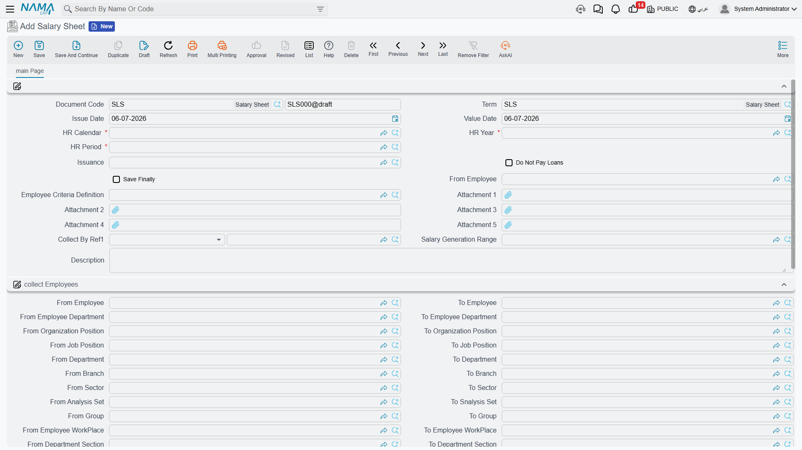
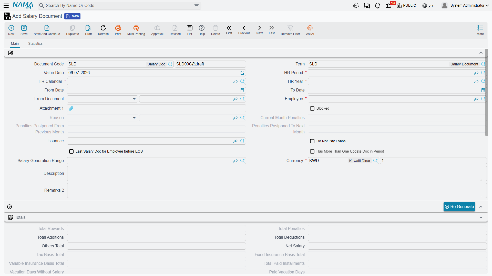

# Salary Documents

Everything on the [salary components](salary-components.md), [formulas](salary-calculation-formulas.md) and [structures](salary-structures.md) pages is *setup* — the machinery that decides how much each employee should be paid. This page is where that machinery finally runs. Two documents do the work: a **Salary Sheet**, which is the batch run for a whole payroll period, and a **Salary Document**, which is the individual payslip it produces for each employee — and the source of the accounting entry.

## Two documents, one job

| | Salary Sheet (سجل الرواتب) | Salary Document (سند الراتب) |
|---|---|---|
| Scope | One **period + issuance** for many employees | **One employee** for one period |
| Role | The batch run: collect employees, generate their payslips | The individual payslip, and the accounting source |
| Posts to the ledger? | No — it orchestrates | **Yes** — the GL entry lives here |

The sheet is the button you press once a month; the documents are what come out of it, one per employee. You review and adjust on the sheet, but the money is defined, line by line, on each document.

## Where to find them

- **Salary Sheet** — **Payroll > Payroll > Salary Sheet** (الرواتب > الرواتب > سجل الرواتب).
- **Salary Document** — **Payroll > Payroll > Salary Document** (الرواتب > الرواتب > سند الراتب).
- **Salary Generation Range** — **Payroll > Salary Configurations > Salary Generation Range** (الرواتب > إعدادات الراتب > مجال اصدار الرواتب).

## The Salary Sheet — the batch run

A sheet is built for one **HR Period** and one **Salary Issuance** at a time — which is exactly what lets the same month carry more than one parallel run (see [HR Years, Periods & Salary Issuance](../setup/hr-years-and-periods.md)). Its header sets the period and the two things that decide *who* gets pulled in:

| Field (Arabic → English) | Purpose |
|---|---|
| تقويم الرواتب / فترة الرواتب / سنة الرواتب (HR Calendar / HR Period / HR Year) | The [time framework](../setup/hr-years-and-periods.md) this run belongs to. |
| توجيه المستند (Term) | The document term that governs the sheet's numbering. |
| معايير تجميع الموظفين (Employee Criteria Definition) | A free-form criteria filter for which employees to collect. |
| مجال اصدار الرواتب (Salary Generation Range) | A saved, reusable employee-selection template (see below) used instead of typing the criteria each time. |
| Employee range (من موظف / إلى موظف … From/To Employee, Department, Branch, Sector, Job Position, Nationality, and more) | An explicit *from / to* range block that narrows the collected population. |
| عدم دفع السلف في السند (Do Not Pay Loans) | Suppress this run's automatic installment deductions. |
| عدم حذف سندات الرواتب الموجودة بالسطور المحذوفة (Do Not Delete Salary Documents Of Removed Sheet Lines) | Keep already-generated payslips even if their line is removed from the sheet. |
| الحفظ نهائياً (Save Finally) | Save the run as final rather than draft. |
| إجمالي الإضافات / إجمالي الإستقطاعات / إجمالي الأخرى / المرتب النهائي (Total Additions / Total Deduction / Total Other / Net Salary) | Roll-up totals across every line, computed by the run. |

Once collected, each employee appears as a line in the **Salary Sheet Lines** grid (السجلات), carrying that employee's net salary, working days, addition/deduction/other totals, a **Selected** checkbox (اختيار) to include or exclude them from generation, and — after generation — a link to the **Salary Document** produced for them and its last-generation timestamp.

### Salary Generation Range — a reusable selection

Typing the same employee-selection criteria every month is wasted effort, so Nama lets you save it once as a **Salary Generation Range** — a named master record holding exactly the same *from / to* criteria block a sheet uses, plus an optional **Limit To Employees** (قصر الإصدار على الموظفين التاليين) whitelist for pinning the run to a specific list. A sheet then just points at the range instead of re-entering the filters. It is pure selection configuration; it computes nothing and posts nothing.

## The Salary Document payslip

Each line the sheet generates becomes a full **Salary Document**: one employee, one period, and the complete breakdown of their pay. Its header carries the period and the computed totals; its detail grid carries the individual component lines.

| Field (Arabic → English) | Purpose |
|---|---|
| الموظف (Employee) | Whose payslip this is. |
| من تاريخ / إلى تاريخ (From Date / To Date) | The span the salary covers — usually the period, but shorter for a partial month. |
| أيام العمل / أيام عدم العمل (Working Days / None Working Days) | The day-count that pro-rates the pay. |
| أيام أجازات مدفوعة الأجر / أيام أجازات بدون مرتب (Paid Vacation Days / Vacation Days Without Salary) | Vacation days split by whether they are paid. |
| أيام إيقاف عن العمل بدون مرتب (Suspension Days Without Salary) | Unpaid suspension days that reduce the pay. |
| إجمالي الإضافات / إجمالي الإستقطاعات / إجمالي الآخري (Total Additions / Total Deductions / Others Total) | The three effect-type roll-ups. |
| جزاءات الشهر الحالي / الجزاءات المرحلة من الشهر السابق / المرحلة للشهر التالي (Current Month Penalties / Postponed From Previous Month / Postponed To Next Month) | How penalties this period carry in and out. |
| إجمالي الأقساط المدفوعة (Total Paid Installments) | Loan installments recovered this run. |
| إجمالي وعاء التأمينات الثابتة / المتغيرة / إجمالي وعاء الضريبة (Fixed / Variable Insurance Basis Total / Tax Basis Total) | The insurance and tax bases the formulas built up. |
| المرتب النهائي (Net Salary) | The bottom line: additions − deductions. |
| ما تم صرفة / المتبقي (Issued Value / Remaining Value) | How much has been paid out against this document, and what is still owed. |
| فترة غير مكتملة (جزئية) (Partial Period) | Marks a run that covers only part of the period. |

The **Salary Document Lines** grid (المفردات) is the heart of the payslip. Each line names a **Component** (مكون), its **Component Effect Type** (نوع التأثير — Addition / Deduction / Other), the addition and deduction amounts, the base and original values, an indicator value where a performance indicator fed the figure, and a full day-count breakdown (work / vacation / non-work days, each split by weekend vs. weekly-rest day). Two further grids capture the **Rewards / Penalties** applied this run (المكافأت / الجزاءات) and the **Paid Installments** (الأقساط المدفوعة), each installment line linking back to its [loan document](../loans/hr-loan-documents.md).

## Workflow

1. **Open the period.** Make sure the target [HR Period](../setup/hr-years-and-periods.md) is open — a closed period blocks generation.
2. **Create a Salary Sheet** for that period and the relevant [issuance](../setup/hr-years-and-periods.md).
3. **Collect employees** with **Collect Employees** (تجميع الموظفين) — the sheet pulls in everyone matching its criteria / range / generation range, skipping anyone already paid for that period. Use **Select All / Deselect All** (اختيار الكل / ازالة الاختيار من الكل) to fine-tune the population.
4. **Generate the documents** with **Generate Salary Documents** (إصدار سندات الرواتب), or **Generate Salary Documents Without Save** (إصدار سندات الرواتب بدون حفظ) to preview the numbers before committing. One [Salary Document](#The-Salary-Document-payslip) is produced per selected line.
5. **Review each payslip** — the component lines, the base/addition/deduction/other breakdown, and the resulting **Net Salary**. If a figure looks wrong, the day-count and indicator columns explain how it was reached; the [salary engine page](../concepts/hr-salary-engine.md) lists the usual reasons a component comes out as zero.
6. **Regenerate if needed.** **Re Generate** (أعد الإصدار) recomputes a document; components flagged *Do Not Override After Regenerate* keep any manual edits.

::: warning Edit through the sheet, not around it
The salary documents belong to the sheet that made them. Adjusting the population, re-collecting, and regenerating from the sheet keeps everything in step — deleting or hand-editing an individual document outside that flow risks leaving it inconsistent with the run it came from.
:::

## How it's processed / what it posts

The **Salary Document** is the accounting source — the sheet itself posts nothing; it only orchestrates. Once a salary document is committed, its ledger effect is built as a background **business request** with a **processing status**, retryable from the **Business Requests** view if it fails.

The document carries **no accounting logic of its own**. Instead, it posts **line by line through the account lines of the components that make it up**: for every [salary component](salary-components.md) on the document, that component's own **debit account lines** and **credit account lines** produce the entry — an addition-effect component debiting a salary-expense account and crediting a payable, a deduction crediting the relevant liability, and so on. Reward/penalty lines post through their own account lines the same way. This is exactly why the accounting is configured on the components, not here: the salary document simply totals its lines and drives each one through its component's accounts.

::: info Optional: contracting cost allocation
Beyond the per-component postings, a salary document's term can additionally allocate the labor cost as a **contracting cost** — a **Contracting Cost Debit / Contracting Cost Credit** (مدين / دائن تكلفة المقاولات) pair configured on the document term — for organizations that carry employee time onto project/contract costing. This is an add-on to the main component-driven posting, not a replacement for it, and only applies when the contracting module is in use.
:::

## Related pages

- **[How Salary Is Calculated](../concepts/hr-salary-engine.md)** — the full five-step pipeline that leads up to this document.
- **[Salary Components](salary-components.md)** — where each line's account lines (and therefore the ledger effect) are configured.
- **[HR Years, Periods & Salary Issuance](../setup/hr-years-and-periods.md)** — the period and issuance a sheet runs against.
- **[Salary Blocking](salary-blocking.md)** — holding an employee's pay, and paying part of it out.
- **[Annual Increases](hr-annual-increases.md)** — how raised component values reach the next salary run.
