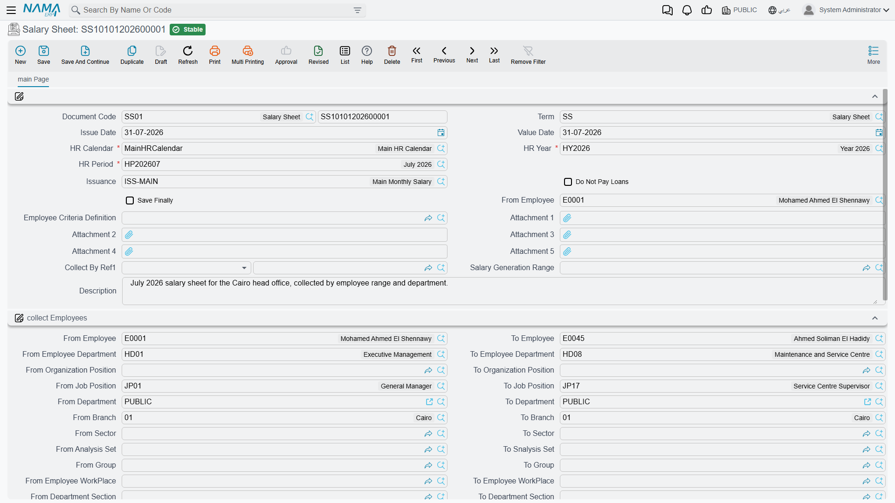
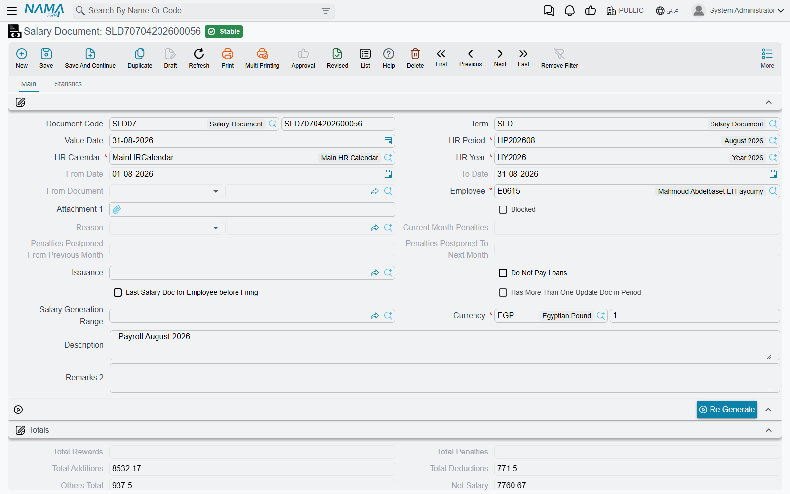

# Salary Documents

Everything on the [salary components](salary-components.md), [formulas](salary-calculation-formulas.md) and [structures](salary-structures.md) pages is *setup* — the machinery that decides how much each employee should be paid. This page is where that machinery finally runs. Two documents do the work: a **Salary Sheet**, which is the batch run for a whole payroll period, and a **Salary Document**, which is the individual payslip it produces for each employee — and the source of the accounting entry.

## Two documents, one job

| | Salary Sheet (سجل الرواتب) | Salary Document (سند الراتب) |
|---|---|---|
| Scope | One **period + issuance** for many employees | **One employee** for one period |
| Role | The batch run: collect employees, generate their payslips | The individual payslip, and the accounting source |
| Posts to the ledger? | No — it orchestrates | **Yes** — the GL entry lives here |

The sheet is the button you press once a month; the documents are what come out of it, one per employee. You review and adjust on the sheet, but the money is defined, line by line, on each document.

## Where to find them

- **Salary Sheet** — **Payroll > Payroll > Salary Sheet** (الرواتب > الرواتب > سجل الرواتب).
- **Salary Document** — **Payroll > Payroll > Salary Document** (الرواتب > الرواتب > سند الراتب).
- **Salary Generation Range** — **Payroll > Salary Configurations > Salary Generation Range** (الرواتب > إعدادات الراتب > مجال اصدار الرواتب).

## The Salary Sheet — the batch run

A sheet is built for one **HR Period** and one **Salary Issuance** at a time — which is exactly what lets the same month carry more than one parallel run (see [HR Years, Periods & Salary Issuance](../setup/hr-years-and-periods.md)). Its header sets the period and everything that decides *who* gets pulled in:

| Field (Arabic → English) | Purpose |
|---|---|
| تقويم الرواتب / فترة الرواتب / سنة الرواتب (HR Calendar / HR Period / HR Year) | The [time framework](../setup/hr-years-and-periods.md) this run belongs to. |
| توجيه المستند (Term) | The document term that governs the sheet's numbering. |
| معايير تجميع الموظفين (Employee Criteria Definition) | A free-form criteria filter for which employees to collect. |
| مجال اصدار الرواتب (Salary Generation Range) | A saved, reusable employee-selection template (see below) used instead of typing the criteria each time. |
| Employee range (من موظف / إلى موظف … From/To Employee, Department, Branch, Sector, Job Position, Nationality, and more) | An explicit *from / to* range block that narrows the collected population. |
| تجميع بمرجع 1 … 5 (Collect By Ref 1 … 5) | Five equality filters on the employee's own **Reference 1 … 5** fields — the usual way to collect by a classification Nama does not ship as a field of its own. |
| عدم دفع السلف في السند (Do Not Pay Loans) | Suppress this run's automatic installment deductions. |
| عدم حذف سندات الرواتب الموجودة بالسطور المحذوفة (Do Not Delete Salary Documents Of Removed Sheet Lines) | Keep already-generated payslips even if their line is removed from the sheet. |
| الحفظ نهائياً (Save Finally) | Save the run as final rather than draft. |
| إجمالي الإضافات / إجمالي الإستقطاعات / إجمالي الأخرى / المرتب النهائي (Total Additions / Total Deduction / Total Other / Net Salary) | Roll-up totals across every line, computed by the run. |

Once collected, each employee appears as a line in the **Salary Sheet Lines** grid (السجلات), carrying that employee's net salary, working days, addition/deduction/other totals, a **Selected** checkbox (اختيار) to include or exclude them from generation, and — after generation — a link to the **Salary Document** produced for them and its last-generation timestamp.

### Salary Generation Range — a reusable selection

Typing the same employee-selection criteria every month is wasted effort, so Nama lets you save it once as a **Salary Generation Range** — a named master record holding exactly the same *from / to* criteria block a sheet uses, plus an optional **Limit To Employees** (قصر الإصدار على الموظفين التاليين) whitelist for pinning the run to a specific list. A sheet then just points at the range instead of re-entering the filters. It is pure selection configuration; it computes nothing and posts nothing.

## How Collect Employees decides who is in

**Collect Employees** looks like a search box and behaves like a funnel. It runs in two stages: first it **searches the employee file** using everything you filled in on the header, then it **walks that result row by row** and drops anyone who should not be paid on this particular run. Almost every "why isn't this employee on my sheet?" question is answered by working out which of the two stages dropped them.

Two things must be true before the button will do anything at all: the **HR Period** must be filled — otherwise you get *Please select period* — and, if the sheet's term has **Salary Range Must be Specified** (يجب تحديد مجال الإصدار) ticked, a **Salary Generation Range** must be chosen, otherwise you get *You Must Fill Salary Generation Range*.

### Stage one, the search

Every filter on the header is combined with **and**. Nothing you fill in overrides anything else, and nothing widens the result: each box you fill can only make the list smaller.

| Filter | What it matches |
|---|---|
| **فترة الرواتب** (HR Period) | Only employees whose **تاريخ المباشرة الفعلية** (Commencement date) falls on or before the **period end date**. Someone who started the day after the period closed is never collected, whatever else you fill in. |
| **تجميع بمرجع 1–5** (Collect By Ref 1–5) | An exact match on the employee's own **Reference 1–5** fields — see the next section. |
| The employee range block (**من موظف / إلى موظف** … From/To Employee) | An alphabetical *from / to* comparison **on codes**, not on names — employee, branch, sector, analysis set, group, work place, department section, nationality, health insurance company, job position, department, employee department and organization position. |
| **مجال اصدار الرواتب** (Salary Generation Range) | The saved range's own *from / to* block is added **on top of** the one typed on the sheet, together with its **قصر الإصدار على الموظفين التاليين** (Limit To Employees) list and its own criteria. |
| **معايير تجميع الموظفين** (Employee Criteria Definition) | A free-form criteria record, added to everything above. |
| The sheet's own dimensions (legal entity, branch, sector, analysis set, department) | The employee's HR information must carry the same dimension. Employees whose dimension is the public value (`PUBLIC`) always pass the legal-entity test. |

::: warning A range and a Salary Generation Range do not replace each other
It is tempting to read the saved range as "use this instead of what I typed on the sheet". It is not — the two are **stacked**. If the sheet says *from employee 1000 to 1999* and the range says *from employee 2000 to 2999*, both conditions apply and the sheet collects nobody. Fill in one or the other, not both.
:::

Notice what is *not* on that list: employment state. At this stage the search deliberately returns **everyone**, resigned and terminated employees included. Filtering by state is stage two's job, because someone who resigned mid-month is still owed part of a salary.

### Collect By Ref 1 to 5, filtering on the employee's own reference fields

Every master record in Nama, the employee card included, carries five spare **generic reference** fields — **مرجع 1** to **مرجع 5** (Reference 1 to Reference 5). They can point at any record type you like, which makes them the standard place to park a classification Nama does not ship out of the box: a payroll group, a funding source, a contract type, a paying company, a site.

**تجميع بمرجع 1** to **تجميع بمرجع 5** (Collect By Ref 1 to 5) on the salary sheet header are the matching filters for those five slots. Fill **تجميع بمرجع 2** with a record and the collection keeps only employees whose **مرجع 2** points at *that exact record*.

Several things follow from that, and they are what trips people up:

- **It is an equality, not a range and not a hierarchy.** There is no from/to pair for these, and no roll-up: picking a parent record does not bring in employees pointing at its children. The employee's reference must be the very record you chose.
- **An empty Collect By Ref filters nothing.** Leave it blank and the whole population passes.
- **A filled Collect By Ref excludes employees whose reference is blank.** The moment you use it, anyone who never had that classification filled in on their employee card silently drops out of the run — the single most common reason a sheet filtered this way comes back short.
- **The five are combined with each other, and with everything else, using *and*.** Filling both Ref 2 and Ref 3 means both must match.
- The same five filters behave identically on the aggregated job offer screen, so what you learn here transfers.

::: tip Only Collect By Ref 1 is on the screen by default
The salary sheet stores all five and **Collect Employees** reads all five — but the standard edit screen only shows **تجميع بمرجع 1**. If you need 2 to 5, add them to the salary sheet's edit screen through the screen layout first; until they are on the screen there is no way to fill them, and an empty one filters nothing.

While you are there: because these are generic references, restrict each one to the record type it is actually meant to hold, and give it a name that means something to the user, through [Allowed Values For Generic References](/platform/fields-and-entities-settings/fields-settings-reference-lookups). Otherwise the user is offered a type list of everything in the system. Do the same on the employee's own Reference 1 to 5, and point both sides at the **same** type — or the filter can never match.
:::

### Stage two, the exclusions

Whatever the search returned is now filtered again, employee by employee, in this order:

1. **Employees already on this sheet are skipped.** Collect Employees is safe to press repeatedly — it appends, it never duplicates a line, and it never replaces the lines already there. Blank lines carrying no employee are cleaned out first.
2. **Employees who are not working are tested for partial work.** Anyone whose state is *Working* stays. For everyone else — resigned, on unpaid leave, suspended — the system reads their state history: if their state changed into or out of *Working* **inside the period**, or their last state change was a paid vacation, or they are still effectively working, they are kept and will be paid for the part of the month they worked. Someone whose firing date falls **before** the period started is never partially working, so they drop.
3. **Employees already paid for this period and this issuance are removed.** Anyone who already has a salary document for the same **فترة الرواتب** *and* the same **صرفية الراتب** — drafts included — is left out, and the sheet says so: *There are N out of M employees already have salary documents for period …*. Because the issuance is part of that test, opening a **second** issuance for the same month collects the whole population again, which is exactly what makes parallel runs possible.
4. **The legal-entity check.** The employee's HR information is re-read as of the sheet's **value date**, and an employee whose legal entity at that date is neither the sheet's legal entity nor the public one is dropped. This is what catches employees who were moved between companies mid-year.
5. **Employees with no component for this issuance may be dropped** — see the options table below.
6. **Employees already sitting on another sheet may be dropped** — likewise.

What survives is sorted **by employee code** and appended to the lines grid.

### Options that change who is collected

Three different places carry settings that quietly change the outcome, which is why two sheets built from identical headers can collect different people:

| Setting | Where it lives | Effect when ticked |
|---|---|---|
| **يجب تحديد مجال الإصدار** (Salary Range Must be Specified) | Salary sheet term | Refuses to collect until a Salary Generation Range is chosen — a good guard against someone accidentally collecting the entire company. |
| **عدم إعتبار الشركة عند تجميع الموظفين** (Ignore Legal Entity In Collecting Employees) | Salary sheet term | Skips the per-employee legal-entity check in step 4. |
| **السماح بإصدار سندات الراتب للموظفين الذين هم بأجازة بدون راتب** (Allow Issue Salary Documents For Employees In Vacation Without Salary) | Salary sheet term | Also keeps employees who spent the **whole** period on unpaid vacation, so a document carrying only *other* effects can be issued for them. |
| **تجميع الموظفين الذين حالتهم "علي رأس العمل" فقط في سجل الراتب** (Collect Working Employees Only In Salary Sheet) | HR configuration | Turns step 2 off entirely: only employees whose state is *Working* are collected. Anyone who resigned mid-month is excluded, and their final part-month salary has to be handled another way. |
| **عدم تجميع الموظفين الذين لهم سجل رواتب على نفس الفترة** (Do not Collect Employees With Any Salary Sheet Line) | HR configuration | Excludes employees who already appear on **another** salary sheet for the same period and issuance, even when no salary document has been generated from it yet. Without it, two half-finished sheets can both hold the same employee. |
| **عدم تجميع الموظفين الذين ليس لهم مفردات لهذه الصرفية** (Do Not Collect Employees That Do Not Have Components For This Issuance) | Salary issuance | Keeps only employees who actually have a [salary component](salary-components.md) attached to this issuance — either on their own component line or through the component type. Ideal for a bonus or commission issuance that concerns a handful of people. |

### When an employee doesn't come in

Work down the funnel in the order it runs and the answer usually appears within the first three checks:

1. Is their **Commencement date** after the period end?
2. Does a **Collect By Ref** on the header point at something their employee card's reference field doesn't — including the case where that reference is simply empty?
3. Are the sheet's own range block **and** its Salary Generation Range both filled, and do they contradict each other?
4. Do the range comparisons work on their **code**? A range of `A100` to `A200` will not catch employee `B050`, however their name sorts.
5. Is their state not *Working*, with **Collect Working Employees Only In Salary Sheet** turned on?
6. Do they already have a salary document — including a **draft** — for this period *and* this issuance? The message shown after collecting tells you how many fell out this way.
7. Is their legal entity, as of the sheet's value date, different from the sheet's?
8. Does the issuance require a component they don't have?

## The Salary Document payslip

Each line the sheet generates becomes a full **Salary Document**: one employee, one period, and the complete breakdown of their pay. Its header carries the period and the computed totals; its detail grid carries the individual component lines.

| Field (Arabic → English) | Purpose |
|---|---|
| الموظف (Employee) | Whose payslip this is. |
| من تاريخ / إلى تاريخ (From Date / To Date) | The span the salary covers — usually the period, but shorter for a partial month. |
| أيام العمل / أيام عدم العمل (Working Days / None Working Days) | The day-count that pro-rates the pay. |
| أيام أجازات مدفوعة الأجر / أيام أجازات بدون مرتب (Paid Vacation Days / Vacation Days Without Salary) | Vacation days split by whether they are paid. |
| أيام إيقاف عن العمل بدون مرتب (Suspension Days Without Salary) | Unpaid suspension days that reduce the pay. |
| إجمالي الإضافات / إجمالي الإستقطاعات / إجمالي الآخري (Total Additions / Total Deductions / Others Total) | The three effect-type roll-ups. |
| جزاءات الشهر الحالي / الجزاءات المرحلة من الشهر السابق / المرحلة للشهر التالي (Current Month Penalties / Postponed From Previous Month / Postponed To Next Month) | How penalties this period carry in and out. |
| إجمالي الأقساط المدفوعة (Total Paid Installments) | Loan installments recovered this run. |
| إجمالي وعاء التأمينات الثابتة / المتغيرة / إجمالي وعاء الضريبة (Fixed / Variable Insurance Basis Total / Tax Basis Total) | The insurance and tax bases the formulas built up. |
| المرتب النهائي (Net Salary) | The bottom line: additions − deductions. |
| ما تم صرفة / المتبقي (Issued Value / Remaining Value) | How much has been paid out against this document, and what is still owed. |
| فترة غير مكتملة (جزئية) (Partial Period) | Marks a run that covers only part of the period. |

The **Salary Document Lines** grid (المفردات) is the heart of the payslip. Each line names a **Component** (مكون), its **Component Effect Type** (نوع التأثير — Addition / Deduction / Other), the addition and deduction amounts, the base and original values, an indicator value where a performance indicator fed the figure, and a full day-count breakdown (work / vacation / non-work days, each split by weekend vs. weekly-rest day). Two further grids capture the **Rewards / Penalties** applied this run (المكافأت / الجزاءات) and the **Paid Installments** (الأقساط المدفوعة), each installment line linking back to its [loan document](../loans/hr-loan-documents.md).

## Workflow

1. **Open the period.** Make sure the target [HR Period](../setup/hr-years-and-periods.md) is open — a closed period blocks generation.
2. **Create a Salary Sheet** for that period and the relevant [issuance](../setup/hr-years-and-periods.md).
3. **Collect employees** with **Collect Employees** (تجميع الموظفين) — the sheet pulls in everyone matching its criteria, range, generation range and Collect By Ref filters, then drops anyone already paid for that period and issuance. Read the message it shows afterwards: it reports how many of the matched employees were skipped because they already have a salary document. Press it again after changing a filter — it appends and never duplicates. Use **Select All / Deselect All** (اختيار الكل / ازالة الاختيار من الكل) to fine-tune the population, and see [How Collect Employees decides who is in](#How-Collect-Employees-decides-who-is-in) when someone is missing.
4. **Generate the documents** with **Generate Salary Documents** (إصدار سندات الرواتب), or **Generate Salary Documents Without Save** (إصدار سندات الرواتب بدون حفظ) to preview the numbers before committing. One [Salary Document](#The-Salary-Document-payslip) is produced per selected line.
5. **Review each payslip** — the component lines, the base/addition/deduction/other breakdown, and the resulting **Net Salary**. If a figure looks wrong, the day-count and indicator columns explain how it was reached; the [salary engine page](../concepts/hr-salary-engine.md) lists the usual reasons a component comes out as zero.
6. **Regenerate if needed.** **Re Generate** (أعد الإصدار) recomputes a document; components flagged *Do Not Override After Regenerate* keep any manual edits.

::: warning Edit through the sheet, not around it
The salary documents belong to the sheet that made them. Adjusting the population, re-collecting, and regenerating from the sheet keeps everything in step — deleting or hand-editing an individual document outside that flow risks leaving it inconsistent with the run it came from.
:::

## How it's processed / what it posts

The **Salary Document** is the accounting source — the sheet itself posts nothing; it only orchestrates. Once a salary document is committed, its ledger effect is built as a background **business request** with a **processing status**, retryable from the **Business Requests** view if it fails.

The document carries **no accounting logic of its own**. Instead, it posts **line by line through the account lines of the components that make it up**: for every [salary component](salary-components.md) on the document, that component's own **debit account lines** and **credit account lines** produce the entry — an addition-effect component debiting a salary-expense account and crediting a payable, a deduction crediting the relevant liability, and so on. Reward/penalty lines post through their own account lines the same way. This is exactly why the accounting is configured on the components, not here: the salary document simply totals its lines and drives each one through its component's accounts.

::: info Optional: contracting cost allocation
Beyond the per-component postings, a salary document's term can additionally allocate the labor cost as a **contracting cost** — a **Contracting Cost Debit / Contracting Cost Credit** (مدين / دائن تكلفة المقاولات) pair configured on the document term — for organizations that carry employee time onto project/contract costing. This is an add-on to the main component-driven posting, not a replacement for it, and only applies when the contracting module is in use.
:::

## Related pages

- **[How Salary Is Calculated](../concepts/hr-salary-engine.md)** — the full five-step pipeline that leads up to this document.
- **[Salary Components](salary-components.md)** — where each line's account lines (and therefore the ledger effect) are configured.
- **[HR Years, Periods & Salary Issuance](../setup/hr-years-and-periods.md)** — the period and issuance a sheet runs against.
- **[Salary Blocking](salary-blocking.md)** — holding an employee's pay, and paying part of it out.
- **[Annual Increases](hr-annual-increases.md)** — how raised component values reach the next salary run.
- **[Reference Fields & Lookups](/platform/fields-and-entities-settings/fields-settings-reference-lookups)** — restricting and naming the generic Reference 1–5 fields that Collect By Ref matches on.
