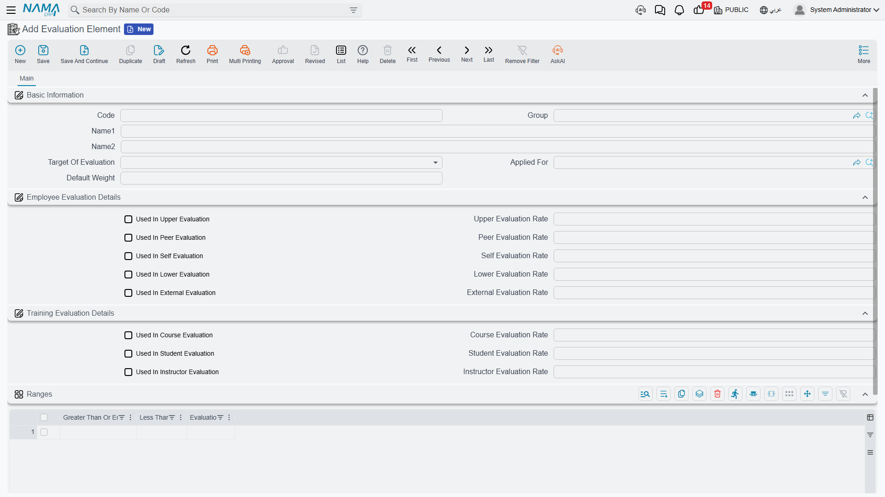
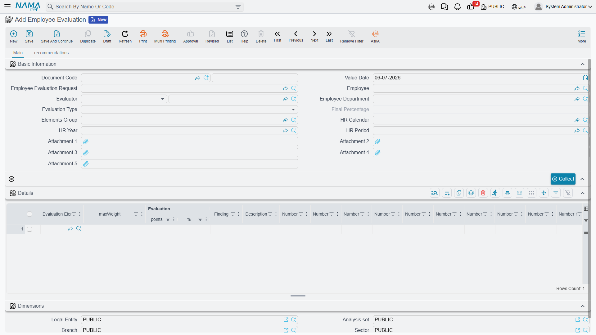

# Employee Evaluation

Where [Performance Indicators](performance-indicators.md) measure things that can be counted automatically — hours, occurrences, sales — an **Employee Evaluation** (تقييم موظف) is for the parts of performance that need a **human judgment**: how well someone communicates, how reliable their work is, how they handle a difficult client. This page covers how a periodic appraisal is built from a catalog of scored criteria, and how that appraisal can, in turn, become a Performance Indicator of its own.

## Where to find them

| Screen | Menu path |
|---|---|
| Evaluation Element (the catalog) | Human Resources > Main > Evaluation Element |
| Evaluation Elements Group | Human Resources > Training > Evaluation Elements Group |
| Employee Evaluation Request | Human Resources > Recruitment > Employee Evaluation Request |
| Employee Evaluation | Human Resources > Recruitment > Employee Evaluation |

## Evaluation Element — one scoring criterion

An **Evaluation Element** (عنصر تقييم) is a single named criterion — "Punctuality," "Teamwork," "Quality of Work" — with a **Default Weight** (the maximum points it is worth). What makes an element reusable across very different kinds of evaluation is that it carries its **own weight per angle**: the same "Communication" element can be worth 10 points when a manager rates an employee, but only 5 points when peers rate each other.

| Evaluation angle | Arabic | Used-in flag | Its own rate field |
|---|---|---|---|
| Upper | رؤساء | Used In Upper Evaluation | Upper Evaluation Rate |
| Lower | مرؤسيين | Used In Lower Evaluation | Lower Evaluation Rate |
| Peer | زملاء | Used In Peer Evaluation | Peer Evaluation Rate |
| Self | ذاتي | Used In Self Evaluation | Self Evaluation Rate |
| External | جهة من الخارج | Used In External Evaluation | External Evaluation Rate |

The same element record also carries three more angles reused by the training module — **Course Evaluation**, **Student Evaluation**, and **Instructor Evaluation** — each with its own used-in flag and rate, so the same catalog of criteria can back both a periodic staff appraisal and a post-course evaluation (see [Course Evaluation](../training/hr-course-evaluation.md)).

An element can also be limited to a specific **Applied For** (job position), and it carries its own **Ranges** grid that turns a raw score into a qualitative label:

| Ranges column | Arabic | Meaning |
|---|---|---|
| Greater Than Or Equal | أكبر من أو يساوي | The lower bound of this band. |
| Less Than | أقل من | The upper bound of this band. |
| Evaluation | التقييم | The label this band maps to (for example, "Excellent," "Good," "Needs Improvement"). |

## Evaluation Elements Group — a reusable bundle of criteria

Rather than picking elements one at a time on every appraisal, an **Evaluation Elements Group** (مجموعة نقاط تقييم) bundles a fixed set of elements — plus a remark per element — under one code, scoped to a **Target Of Evaluation**. A "Manager Appraisal" group, for instance, might bundle Punctuality, Quality of Work, and Teamwork, ready to be pulled into an evaluation in one click.

## Employee Evaluation Request — planning the appraisal

An **Employee Evaluation Request** (طلب تقييم موظف) sets up who is being evaluated, by whom, and against which criteria, before the scoring actually happens: the Employee, the Evaluator, the Employee's Department, the **Evaluation Type** (which of the five angles above applies), the **Elements Group** to draw criteria from, and the HR Calendar/Year/Period the appraisal belongs to. Clicking **Collect** (تجميع) pulls every element from the chosen Elements Group straight into the request's Details grid, so the evaluator doesn't have to add each criterion by hand.

## Employee Evaluation — scoring it

An **Employee Evaluation** carries the same header as the request, plus a link back to it via its own **Employee Evaluation Request** field — so a planned appraisal turns into a scored one without re-entering who, whom, and against which criteria. It can just as easily be opened directly, without ever having started from a request.

| Field (English) | Arabic | Notes |
|---|---|---|
| Employee Evaluation Request | طلب تقييم موظف | The request this evaluation was planned from, if any. |
| Employee / Evaluator | الموظف / المقيم | Who is being scored, and who is doing the scoring. |
| Employee Department | إدارة موظف | The employee's department, for reporting. |
| Evaluation Type | نوع التقييم | Which of the five angles (Upper/Lower/Peer/Self/External) this appraisal represents. |
| Final Percentage | النسبة النهائية | The rolled-up result across every scored element. |
| Elements Group | مجموعة نقاط التقييم | Which bundle of criteria this appraisal draws from. |
| HR Calendar / Year / Period | تقويم الرواتب / سنة الرواتب / فترة الرواتب | Which HR period this appraisal belongs to. |

The **Collect** button again pulls the Elements Group's criteria into the **Details** grid, where each row carries: the **Evaluation Element**, its **Max Weight** (the ceiling from the element's Default Weight), the **Points** actually scored, the resulting **Percentage**, and a **Finding** — the qualitative label produced by matching the score against the element's own Ranges. Ten free **Number** slots and ten free **Description** slots are also available per row, for any extra structured notes an evaluator wants to keep (a rating on a specific incident, a client's name, and so on).

A second tab, **Recommendations**, is where the evaluation turns into next steps: a grid of **Recommender**, their **Job Position**, and free-text **Recommendations** — the concrete actions (a raise, a training course, a warning, a promotion) that came out of the appraisal.

::: tip A worked example
Suppose the "Manager Appraisal" Elements Group bundles three elements: Punctuality (Default Weight 30, Upper rate also 30), Quality of Work (Default Weight 50), and Teamwork (Default Weight 20). The manager scores an employee 25, 40, and 15 points respectively — 80 points out of a possible 100, an overall Final Percentage of 80%. If Quality of Work's own Ranges say "70 and above = Good," that element's Finding shows as **Good**, even though the appraisal's overall percentage might fall in a different band on its own criteria.
:::

## Where evaluation results can go next

An evaluation's Final Percentage is not, by itself, tied to pay — but it doesn't have to stay a standalone record either. A [Performance Indicator](performance-indicators.md) of type **System** can be configured to source its value from an **Evaluation Element**, which means a well-defined appraisal outcome can flow into a [Salary Calculation Formula](../payroll/salary-calculation-formulas.md) exactly like an attendance-based indicator would — for example, turning a strong quarterly appraisal into an automatic bonus addition on the next [Salary Document](../payroll/salary-documents.md).

## Related pages

- **[Performance Indicators](performance-indicators.md)** — how an evaluation's result can itself become a measured indicator that feeds a salary formula.
- **[Course Evaluation](../training/hr-course-evaluation.md)** — the training-side reuse of the same Evaluation Element catalog.
- **[How Salary Is Calculated](../concepts/hr-salary-engine.md)** — the full pipeline an evaluation-driven indicator would ultimately feed.
