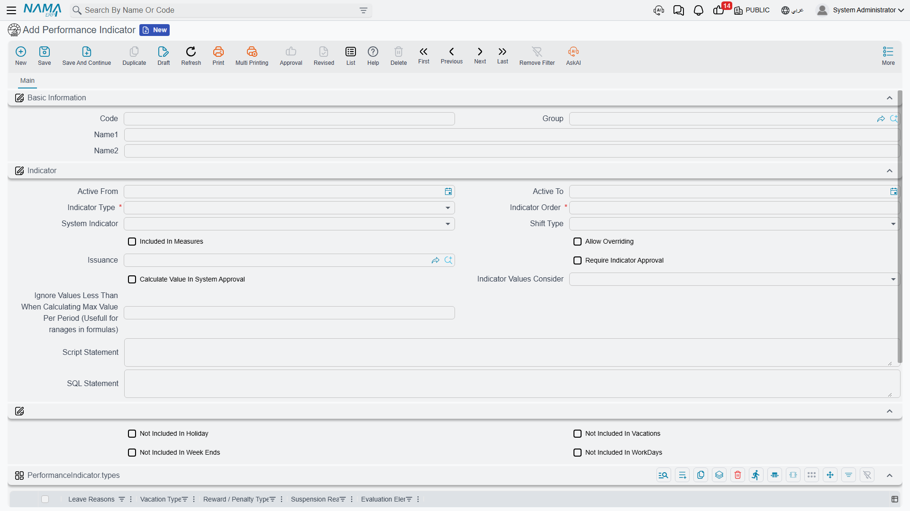
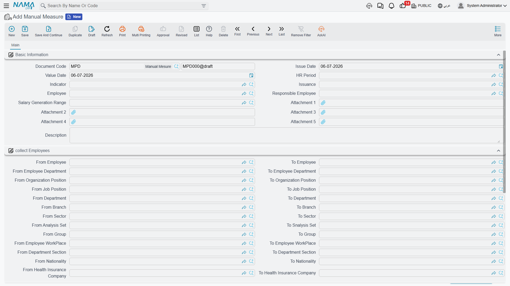

# Performance Indicators

Some pieces of an employee's pay aren't fixed numbers — they depend on something that has to be **measured** first: how many overtime hours were worked, how many late arrivals happened, how many sales were closed, or how the employee's last appraisal scored. A **Performance Indicator** (مؤشر الأداء) is Nama's way of naming that measured thing so a [salary formula](../payroll/salary-calculation-formulas.md) can read it. This page covers how an indicator is defined, the three ways its value can be entered or approved, and how it ultimately reaches the salary.

## Where to find them

| Screen | Menu path |
|---|---|
| Performance Indicator (the catalog) | Payroll > Performance Indicators > Performance Indicator |
| Performance Measure | Payroll > Performance Indicators > Performance Measure |
| Manual Measure | Payroll > Performance Indicators > Manual Measure |
| System Indicator Approval | Payroll > Performance Indicators > System Indicator Approval |

## Performance Indicator — naming what gets measured

A Performance Indicator is a small master record. Its most important setting is **Indicator Type** — where its value actually comes from:

| Indicator Type | Arabic | Where the value comes from |
|---|---|---|
| Manual | يدوي | Typed in by hand, one employee at a time, on a Manual Measure document (see below). |
| System | نظامى | Read automatically from another catalog already in Nama — see below. |
| Script | من سيناريو | Computed by a scenario script written for this indicator. |
| SQL Statement | SQL من جملة | Computed by a SQL query written for this indicator. |
| Groovy Script | Groovy Script | Computed by a Groovy script written for this indicator. |

When Indicator Type is **System**, the indicator doesn't read attendance directly — it piggybacks on one of five existing HR catalogs, chosen in its **Types** grid: Leave Reasons, Vacation Types, Reward/Penalty Types, Suspension Reasons, or [Evaluation Element](employee-evaluation.md). For example, a "Late Arrival Count" indicator can be tied to a specific Leave Reason so that every time that reason is recorded against an employee, the indicator's count goes up automatically — no manual typing needed.

A handful of other settings shape how an indicator behaves once it starts collecting values:

| Field (English) | Arabic | Purpose |
|---|---|---|
| Active From / Active To | فعّال من / فعّال إلى | The date range the indicator is in effect. |
| Indicator Order | ترتيب المؤشر | Where this indicator falls relative to others, when more than one feeds the same calculation. |
| Shift Type | نوع الدوام | Whether the indicator counts during the **Normal Shift**, the **Added Shift** (overtime), or **Both**. |
| Included In Measures | متضمنة في القياس | Whether this indicator is picked up when a Performance Measure batch collects employees. |
| Allow Overriding | السماح بتغيير القيمة | Whether a system-computed value can still be corrected by hand afterward. |
| Require Indicator Approval | يتطلب سند موافقة على مؤشر أداء نظامى | Forces a System Indicator Approval document before a System-type value is accepted (see below). |
| Calculate Value In System Approval | احتساب القيمة في سند موافقة على مؤشر أداء نظامي | Whether the approval document itself computes the value, rather than just reviewing one already computed. |
| Indicator Values Consider | إعتبار قيم المؤشر | How repeated values roll up over a period — **Yearly**, **Aggregated Period**, **Salary Period**, or **None**. |
| Ignore Values Less Than When Calculating Max Value Per Period | تجاهل القيم الأقل من عند حساب إجمالى الفترة | Excludes small values from the period's maximum — useful when a formula uses a range/bracket over the indicator. |
| Not Included In Holiday / Vacations / Week Ends / WorkDays | لا يتم احتسابه في أيام العطلات الرسمية / الأجازات / العطلات الأسبوعية / أيام العمل | Excludes the indicator's contribution on any of these day types. |
| Issuance | الصرفية | Ties the indicator to one [Salary Issuance](../setup/hr-years-and-periods.md), for companies running more than one payroll stream. |

An indicator can also be scoped by **Dimensions** (Legal Entity, Analysis Set, Branch, Sector, Department), and a read-only **Component Calc Formulas** list on the record shows every [Salary Calculation Formula](../payroll/salary-calculation-formulas.md) that already reads this indicator — a quick way to see where a given measurement is actually used before you change it.

## Manual Measure — typing in a value by hand

When an indicator's type is **Manual**, its values are entered on a **Manual Measure** document — one document per batch of employees and period. A **Collect Employees** block (from/to employee, department, branch, sector, job/organization position, nationality, health-insurance company, and more) combined with the **Collect Employees** button pulls in every matching employee at once, instead of adding rows one by one.

Each collected employee gets a **Details** row with: the **Indicator**, the **Value**, a free-text **Remark**, and up to two attachments — handy for attaching evidence (a signed timesheet, a sales report) behind a specific figure.

## Performance Measure — the batch that reconciles manual and system values

**Performance Measure** is the wider, period-level batch: it is where manual entries and automatically-computed values for **up to twenty indicator slots per employee** live side by side, tab by tab:

| Tab | Arabic | What it holds |
|---|---|---|
| Basic Information (with Manual Details grid) | المؤشرات اليدوية | Up to 20 hand-typed indicator/value pairs per employee, plus the same Collect Employees block described above. |
| System Details | المؤشرات الآلية | Up to 10 indicator values computed automatically by the system for the period. |
| Calculated Details | المؤشرات المحسوبة | Up to 10 indicators shown **side by side** — the Manual value next to the System value — so a reviewer can see at a glance where the two disagree before the figure is finalized. |

This three-way layout is exactly how Nama reconciles "what someone typed" against "what the system measured" before either one is allowed to feed a salary formula.

## System Indicator Approval — clamping and approving a system value

When an indicator's **Require Indicator Approval** flag is on, a System-type value doesn't go straight into salary — it first passes through a **System Indicator Approval** document. This is the gate that lets a reviewer cap and sign off on an automatically-measured figure before it counts, which matters most for things like overtime hours where an unreviewed system reading could otherwise inflate pay.

| Field (English) | Arabic | Purpose |
|---|---|---|
| Performance Indicator / System Indicator | مؤشر الأداء / المؤشر النظامى | Which indicator this approval covers. |
| Max Value Per Day / Max Value Per Day (Time) | أقصى عدد ساعات لليوم الواحد | A ceiling on the indicator's value for any single day. |
| Ignore Values Less Than When Calculating Max Value Per Period | تجاهل القيم الأقل من عند حساب إجمالى الفترة | Same idea as on the indicator itself — small values don't count toward the period ceiling. |
| From Date / To Date | من تاريخ / إلى تاريخ | The date range this approval covers. |
| Details (grid) | التفاصيل | One row per employee, repeating the indicator/employee/date-range setup plus the resulting **Indicator Value Over Period** — the clamped figure that is actually approved. |

Rather than a separate screenshot, picture the same style of form as the Performance Indicator screen above: a header carrying the indicator, the per-day ceiling, and the date range, over a details grid that lists one clamped total per employee.

## How an indicator becomes part of the salary

None of the four screens above touch pay by themselves — an indicator only affects a paycheck once a [Salary Calculation Formula](../payroll/salary-calculation-formulas.md) is set up to read it. A formula whose **Formula Type** is **Related To Performance Indicator** points at one indicator, and its **Applicability Method** decides how the reading is used:

- **Daily** (يومي) — the indicator is factored in **per working day**.
- **Periodic** (فتري) — the indicator's **whole-period total** is used once.

::: tip A worked example
Suppose "Overtime Hours" is a **System** indicator, tied to attendance and gated behind **System Indicator Approval** with a Max Value Per Day of 3 hours. An employee logs 5 hours of overtime on one day; the approval document clamps that day's contribution to 3. Across the period, their approved overtime total feeds a formula set to **Related To Performance Indicator** with a **Periodic** applicability, which multiplies the total hours by an hourly overtime rate to produce the addition on that employee's [Salary Document](../payroll/salary-documents.md).
:::

See [How Salary Is Calculated](../concepts/hr-salary-engine.md) for where this fits in the full five-step pipeline, and [Time & Attendance](../attendance/time-attendance.md) for how daily punches turn into the kind of raw figures that System indicators and formulas ultimately consume.

## Related pages

- **[Salary Calculation Formulas](../payroll/salary-calculation-formulas.md)** — the "Related To Performance Indicator" formula type that actually reads an indicator's value.
- **[How Salary Is Calculated](../concepts/hr-salary-engine.md)** — the full pipeline these indicators feed into.
- **[Time & Attendance](../attendance/time-attendance.md)** — the daily punches behind attendance-driven System indicators.
- **[Employee Evaluation](employee-evaluation.md)** — appraisal scores can themselves become a System indicator's source.
