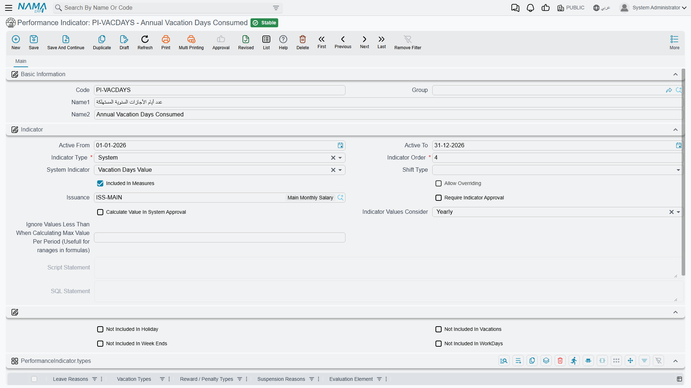
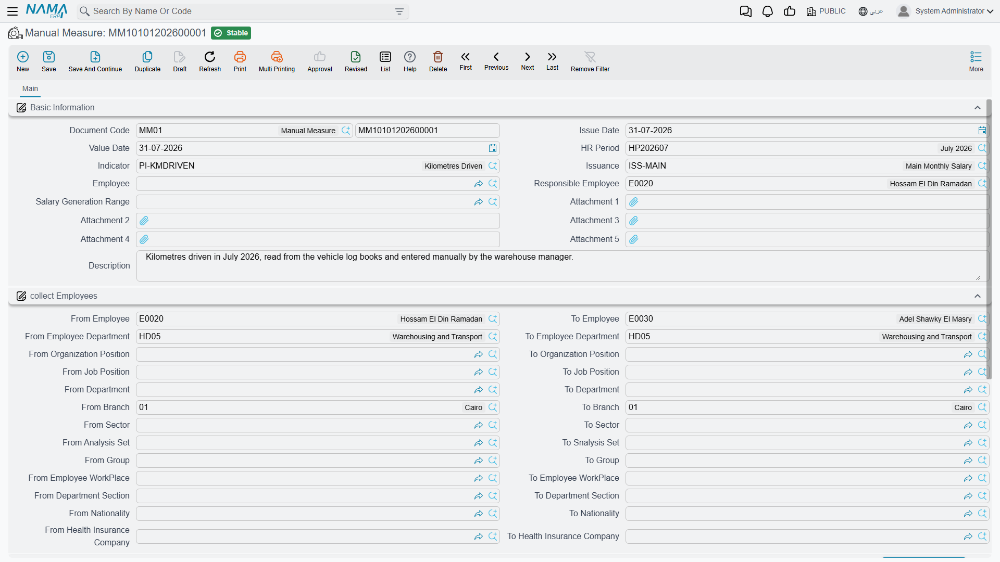

# Performance Indicators

Some pieces of an employee's pay aren't fixed numbers — they depend on something that has to be **measured** first: how many overtime hours were worked, how many late arrivals happened, how many sales were closed, or how the employee's last appraisal scored. A **Performance Indicator** (مؤشر الأداء) is Nama's way of naming that measured thing so a [salary formula](../payroll/salary-calculation-formulas.md) can read it. This page covers how an indicator is defined, the three ways its value can be entered or approved, and how it ultimately reaches the salary.

## Where to find them

| Screen | Menu path |
|---|---|
| Performance Indicator (the catalog) | Payroll > Performance Indicators > Performance Indicator |
| Performance Measure | Payroll > Performance Indicators > Performance Measure |
| Manual Measure | Payroll > Performance Indicators > Manual Measure |
| System Indicator Approval | Payroll > Performance Indicators > System Indicator Approval |

## Performance Indicator — naming what gets measured

A Performance Indicator is a small master record. Its most important setting is **Indicator Type** — where its value actually comes from:

| Indicator Type | Arabic | Where the value comes from |
|---|---|---|
| Manual | يدوي | Typed in by hand, one employee at a time, on a Manual Measure document (see below). |
| System | نظامى | Read automatically from another catalog already in Nama — see below. |
| Script | من سيناريو | Computed by a scenario script written for this indicator. |
| SQL Statement | SQL من جملة | Computed by a SQL query written for this indicator. |
| Groovy Script | Groovy Script | Computed by a Groovy script written for this indicator. |

When Indicator Type is **System**, a second field decides everything: **System Indicator** (المؤشر النظامى) names *which* reading the system takes — one of 73 built-in measurements of attendance, overtime, vacations, rewards, appraisals and the rest. It becomes required the moment the type is System, and the whole list is [further down this page](#The-73-system-indicators).

The **Types** grid on the same screen is not where the value comes from — it is a **filter**, and only some indicators accept one. An indicator that counts vacations can be narrowed to particular **Vacation Types** or **Leave Reasons**; one that counts rewards or penalties to particular **Reward/Penalty Types**; a suspension count to particular **Suspension Reasons**; an appraisal reading to a particular [Evaluation Element](employee-evaluation.md). The indicators that read attendance take no filter at all — they read the attendance record itself — and the screen refuses to save one that has rows in the grid, answering *"You can not link reason types grid with the system indicator type …"*.

::: tip Two more rules the type brings with it
**Daily Indicator From SQL** is the one system indicator whose reading you write yourself: its **SQL Statement** is required, and it is evaluated per day. And **Indicator Values Consider** must be left at **None** unless the indicator is a System one — on every other type, *Yearly*, *Aggregated Period* and *Salary Period* are refused on save.
:::

## The 73 system indicators

These are the values the **System Indicator** field offers, exactly as they read on screen. Most are self-explanatory once you know the family they belong to; what is worth checking before you build a formula on one is the third column, which says whether that indicator accepts a **Types** grid row as a filter. Anything marked — reads the attendance record directly and is rejected on save if the grid has rows.

Where an indicator's name ends in *Shift 1*, *Shift 2* or *Shift 3*, it measures one part of a split working day; the unnumbered version of the same name measures the whole day.

#### Attendance, absence and working days

| System Indicator | Arabic | Types grid |
|---|---|---|
| Attend Hours (Hours) | ساعات الحضور (بالساعة) | — |
| Attend Hours Shift 1 (Hours) | ساعات الحضور دوام 1 (بالساعة) | — |
| Attend Hours Shift 2 (Hours) | ساعات الحضور دوام 2 (بالساعة) | — |
| Attend Hours Shift 3 (Hours) | ساعات الحضور دوام 3 (بالساعة) | — |
| Actual Work Days  | ايام العمل الفعلية | — |
| Working Days | أيام العمل | accepted |
| None Working Days | أيام عدم العمل | accepted |
| Week End Days | ايام العطلات الأسبوعية | — |
| Holiday Days | ايام العطلات الرسمية | — |
| Absense Days | أيام الغياب | — |
| Shift 1 Absence | غياب دوام 1 | — |
| Shift 2 Absence | غياب دوام 2 | — |
| Shift 3 Absence | غياب دوام 3 | — |
| Total Working Months | شهور العمل الكلية | accepted |
| Experience Day (Use With End Of Service Component) | يوم خبرة (يستخدم مع مخصص نهاية الخدمة) | — |
| Days difference between work starting date and return date | فرق الأيام بين تاريخ المباشرة وتاريخ العودة | accepted |

#### Overtime

| System Indicator | Arabic | Types grid |
|---|---|---|
| OverTime (Hours) | وقت إضافي (بالساعة) | — |
| OverTime Normal Day (Hours) | وقت إضافي يوم عادي (بالساعة) | — |
| OverTime Other Than Normal Day (Hours) | وقت إضافي اى اجازة (بالساعة) | — |
| OverTime In Week Ends (Hours) | وقت إضافي عطلة أسبوعية (بالساعة) | — |
| OverTime In Holidays (Hours) | وقت إضافي يوم عطلة (بالساعة) | — |
| OverTime In Vacations (Hours) | وقت إضافي في اجازة (بالساعة)  | — |
| OverTime Shift1 (Hours) | وقت إضافي دوام 1 (بالساعة) | — |
| OverTime Shift2 (Hours) | وقت إضافي دوام 2 (بالساعة) | — |
| OverTime Shift3 (Hours) | وقت إضافي دوام 3 (بالساعة) | — |

#### Lateness, early arrival and short time

| System Indicator | Arabic | Types grid |
|---|---|---|
| Late Hours (Hours) | ساعات التأخير (بالساعة) | — |
| Late Arrival Shift1 (Hours) | حضور متأخر دوام 1 (بالساعة) | — |
| Late Arrival Shift2 (Hours) | حضور متأخر دوام 2 (بالساعة) | — |
| Late Arrival Shift3 (Hours) | حضور متأخر دوام 3 (بالساعة) | — |
| Early Hours (Hours) | ساعات الحضور المبكر (بالساعة) | — |
| Early Arrival Shift1 (Hours) | حضور مبكر دوام 1 (بالساعة) | — |
| Early Arrival Shift2 (Hours) | حضور مبكر دوام 2 (بالساعة) | — |
| Early Arrival Shift3 (Hours) | حضور مبكر دوام 3 (بالساعة) | — |
| Early Leave (Hours) | إنصراف مبكر (بالساعة) | — |
| Early Leave Shift1 (Hours) | إنصراف مبكر دوام 1 (بالساعة) | — |
| Early Leave Shift2 (Hours) | إنصراف مبكر دوام 2 (بالساعة) | — |
| Early Leave Shift3 (Hours) | إنصراف مبكر دوام 3 (بالساعة) | — |
| Out Time during shift 1 | ساعات الخروج أثناء الدوام 1 | — |
| Out Time during shift 2 | ساعات الخروج أثناء الدوام 2 | — |
| Out Time during shift 3 | ساعات الخروج أثناء الدوام 3 | — |
| Under Time (Hours) | إجمالي الوقت المتبقي لتحقق الدوام (بالساعة) | — |
| Under Time 1 (Hours) | الوقت المتبقي لتحقق الدوام 1 (بالساعة) | — |
| Under Time 2 (Hours) | الوقت المتبقي لتحقق الدوام 2 (بالساعة) | — |
| Under Time 3 (Hours) | الوقت المتبقي لتحقق الدوام 3 (بالساعة) | — |

#### Missing punches

| System Indicator | Arabic | Types grid |
|---|---|---|
| No Check In | عدم تسجيل بصمة دخول | — |
| No Check Out | عدم تسجيل بصمة خروج | — |
| Shift 1 No Check In | عدم تسجيل بصمة دخول دوام 1 | — |
| Shift 1 No Check Out | عدم تسجيل بصمة خروج دوام 1 | — |
| Shift 2 No Check In | عدم تسجيل بصمة دخول دوام 2 | — |
| Shift 2 No Check Out | عدم تسجيل بصمة خروج دوام 2 | — |
| Shift 3 No Check In | عدم تسجيل بصمة دخول دوام 3 | — |
| Shift 3 No Check Out | عدم تسجيل بصمة خروج دوام 3 | — |

#### Vacations, permissions and suspensions

| System Indicator | Arabic | Types grid |
|---|---|---|
| Vacation Days Value  | أيام الأجازات | accepted |
| Vacation Type Value Daily | أيام الأجازات يومي (يطبق عليه تكرارات) | — |
| Vacation Types Count | عدد أجازات | accepted |
| Permissions Hours (Hours) | ساعات الأذون | — |
| Permissions Hours of Specific Type (Hours) | ساعات الأذون من نوع معين | accepted |
| Permission Types Count | عدد أذون إنصراف | accepted |
| Suspension Type | نوع ايقاف | accepted |

#### Missions

| System Indicator | Arabic | Types grid |
|---|---|---|
| Days Missions | مأمورية بالأيام | — |
| Hours Missions | مأمورية بالساعات | — |
| Total Mission Hours From Mission Doc (Does not consider intersections) | إجمالي عدد ساعات المأموريات من السندات (لا تأخذ التقاطع في الحسبان) | accepted |
| Mission Allownce | بدل مأمورية | accepted |

#### Rewards and penalties

| System Indicator | Arabic | Types grid |
|---|---|---|
| Reward Types Count | عدد مكافأت | accepted |
| Penalty Types Count | عدد الجزاءات | accepted |
| Reward Penalty Daily | مكافأه - جزاء يومي (يطبق عليه تكرارات) | — |
| Penalties Postponed To Next Month | الجزاءات المرحلة إلى الشهر القادم | accepted |
| Penalties Postponed From Previous Month | الجزاءات المرحلة من الشهر السابق | accepted |

#### Appraisal

| System Indicator | Arabic | Types grid |
|---|---|---|
| Evaluation Points | نقاط التقييم | accepted |
| Inverse Evaluation Points | مقلوب نقاط التقييم | accepted |
| Evaluation Percent | نسبة التقييم | accepted |
| Inverse Evaluation Percent | مقلوب نسبة التقييم | accepted |

#### Written by you

| System Indicator | Arabic | Types grid |
|---|---|---|
| Daily Indicator From SQL | مؤشر يدوي يومي من جملة SQL | — |

A handful of other settings shape how an indicator behaves once it starts collecting values:

| Field (English) | Arabic | Purpose |
|---|---|---|
| Active From / Active To | فعّال من / فعّال إلى | The date range the indicator is in effect. |
| Indicator Order | ترتيب المؤشر | Where this indicator falls relative to others, when more than one feeds the same calculation. |
| Shift Type | نوع الدوام | Whether the indicator counts during the **Normal Shift**, the **Added Shift** (overtime), or **Both**. |
| Included In Measures | متضمنة في القياس | Whether this indicator is picked up when a Performance Measure batch collects employees. |
| Allow Overriding | السماح بتغيير القيمة | Whether a system-computed value can still be corrected by hand afterward. |
| Require Indicator Approval | يتطلب سند موافقة على مؤشر أداء نظامى | Forces a System Indicator Approval document before a System-type value is accepted (see below). |
| Calculate Value In System Approval | احتساب القيمة في سند موافقة على مؤشر أداء نظامي | Whether the approval document itself computes the value, rather than just reviewing one already computed. |
| Indicator Values Consider | إعتبار قيم المؤشر | How repeated values roll up over a period — **Yearly**, **Aggregated Period**, **Salary Period**, or **None**. |
| Ignore Values Less Than When Calculating Max Value Per Period | تجاهل القيم الأقل من عند حساب إجمالى الفترة | Excludes small values from the period's maximum — useful when a formula uses a range/bracket over the indicator. |
| Not Included In Holiday / Vacations / Week Ends / WorkDays | لا يتم احتسابه في أيام العطلات الرسمية / الأجازات / العطلات الأسبوعية / أيام العمل | Excludes the indicator's contribution on any of these day types. |
| Issuance | الصرفية | Ties the indicator to one [Salary Issuance](../setup/hr-years-and-periods.md), for companies running more than one payroll stream. |

An indicator can also be scoped by **Dimensions** (Legal Entity, Analysis Set, Branch, Sector, Department), and a read-only **Component Calc Formulas** list on the record shows every [Salary Calculation Formula](../payroll/salary-calculation-formulas.md) that already reads this indicator — a quick way to see where a given measurement is actually used before you change it.

## Manual Measure — typing in a value by hand

When an indicator's type is **Manual**, its values are entered on a **Manual Measure** document — one document per batch of employees and period. A **Collect Employees** block (from/to employee, department, branch, sector, job/organization position, nationality, health-insurance company, and more) combined with the **Collect Employees** button pulls in every matching employee at once, instead of adding rows one by one.

Each collected employee gets a **Details** row with: the **Indicator**, the **Value**, a free-text **Remark**, and up to two attachments — handy for attaching evidence (a signed timesheet, a sales report) behind a specific figure.

## Performance Measure — the batch that reconciles manual and system values

**Performance Measure** is the wider, period-level batch: it is where manual entries and automatically-computed values for **up to twenty indicator slots per employee** live side by side, tab by tab:

| Tab | Arabic | What it holds |
|---|---|---|
| Basic Information (with Manual Details grid) | المؤشرات اليدوية | Up to 20 hand-typed indicator/value pairs per employee, plus the same Collect Employees block described above. |
| System Details | المؤشرات الآلية | Up to 10 indicator values computed automatically by the system for the period. |
| Calculated Details | المؤشرات المحسوبة | Up to 10 indicators shown **side by side** — the Manual value next to the System value — so a reviewer can see at a glance where the two disagree before the figure is finalized. |

This three-way layout is exactly how Nama reconciles "what someone typed" against "what the system measured" before either one is allowed to feed a salary formula.

## System Indicator Approval — clamping and approving a system value

When an indicator's **Require Indicator Approval** flag is on, a System-type value doesn't go straight into salary — it first passes through a **System Indicator Approval** document. This is the gate that lets a reviewer cap and sign off on an automatically-measured figure before it counts, which matters most for things like overtime hours where an unreviewed system reading could otherwise inflate pay.

| Field (English) | Arabic | Purpose |
|---|---|---|
| Performance Indicator / System Indicator | مؤشر الأداء / المؤشر النظامى | Which indicator this approval covers. |
| Max Value Per Day / Max Value Per Day (Time) | أقصى عدد ساعات لليوم الواحد | A ceiling on the indicator's value for any single day. |
| Ignore Values Less Than When Calculating Max Value Per Period | تجاهل القيم الأقل من عند حساب إجمالى الفترة | Same idea as on the indicator itself — small values don't count toward the period ceiling. |
| From Date / To Date | من تاريخ / إلى تاريخ | The date range this approval covers. |
| Details (grid) | التفاصيل | One row per employee, repeating the indicator/employee/date-range setup plus the resulting **Indicator Value Over Period** — the clamped figure that is actually approved. |

Rather than a separate screenshot, picture the same style of form as the Performance Indicator screen above: a header carrying the indicator, the per-day ceiling, and the date range, over a details grid that lists one clamped total per employee.

## How an indicator becomes part of the salary

None of the four screens above touch pay by themselves — an indicator only affects a paycheck once a [Salary Calculation Formula](../payroll/salary-calculation-formulas.md) is set up to read it. A formula whose **Formula Type** is **Related To Performance Indicator** points at one indicator, and its **Applicability Method** decides how the reading is used:

- **Daily** (يومي) — the indicator is factored in **per working day**.
- **Periodic** (فتري) — the indicator's **whole-period total** is used once.

::: tip A worked example
Suppose "Overtime Hours" is a **System** indicator, tied to attendance and gated behind **System Indicator Approval** with a Max Value Per Day of 3 hours. An employee logs 5 hours of overtime on one day; the approval document clamps that day's contribution to 3. Across the period, their approved overtime total feeds a formula set to **Related To Performance Indicator** with a **Periodic** applicability, which multiplies the total hours by an hourly overtime rate to produce the addition on that employee's [Salary Document](../payroll/salary-documents.md).
:::

See [How Salary Is Calculated](../concepts/hr-salary-engine.md) for where this fits in the full five-step pipeline, and [Time & Attendance](../attendance/time-attendance.md) for how daily punches turn into the kind of raw figures that System indicators and formulas ultimately consume.

## Related pages

- **[Salary Calculation Formulas](../payroll/salary-calculation-formulas.md)** — the "Related To Performance Indicator" formula type that actually reads an indicator's value.
- **[How Salary Is Calculated](../concepts/hr-salary-engine.md)** — the full pipeline these indicators feed into.
- **[Time & Attendance](../attendance/time-attendance.md)** — the daily punches behind attendance-driven System indicators.
- **[Employee Evaluation](employee-evaluation.md)** — appraisal scores can themselves become a System indicator's source.
