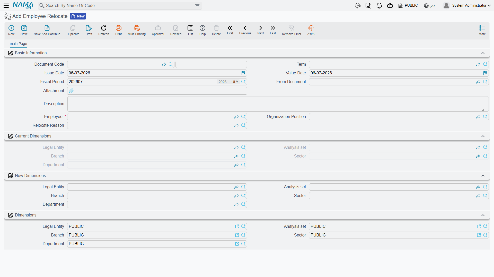
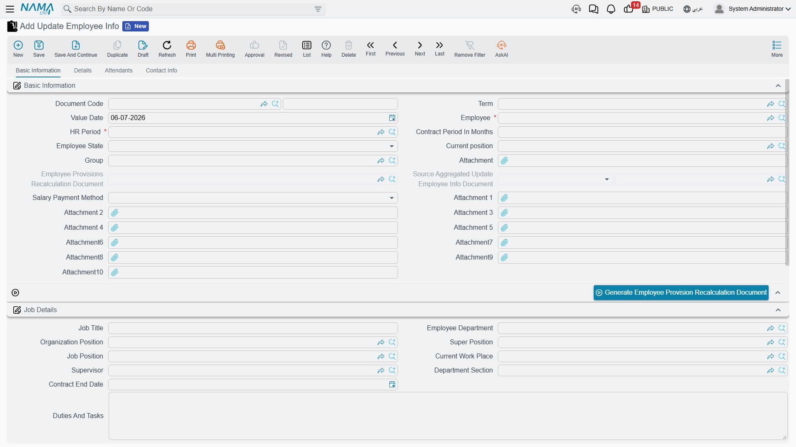

# Employee Relocation

People and their records change after they're hired: a branch gets restructured and someone's whole department moves, an employee needs a raise or a new job title, a passport gets renewed, or a project needs a handful of people working somewhere else for a few weeks. Nama splits these into distinct tools rather than one giant "edit employee" screen, because each of them has a different footprint — one of them even reallocates historical accounting balances, and none of the others do.

## Employee Relocate

Found at **Human Resources > Recruitment > Employee Relocate**, an **Employee Relocate** document is a permanent move of one employee from one organisational placement to another — a different branch, department, sector, or analysis set.

| Field | Purpose |
|---|---|
| Employee | Who is being relocated. |
| Organization Position | The org-chart position the move applies to. |
| Relocate Reason | Why the move is happening. |
| Current Dimensions — Legal Entity / Branch / Department / Sector / Analysis Set | The employee's placement as it stands today (read from their own record). |
| New Dimensions — Legal Entity / Branch / Department / Sector / Analysis Set | Where the employee is moving to. |

::: warning A relocate cannot cross legal entities
The Legal Entity under New Dimensions must match the employee's current one — Nama blocks saving otherwise. Moving someone to a different legal entity is a different kind of transaction (a new employment relationship, for accounting and legal purposes), not a relocation.
:::

## How it's processed / what it posts

Committing an Employee Relocate document does two things at once:

1. It immediately updates the employee's own master record so their branch, department, sector, and analysis set become the New Dimensions.
2. It looks back through the employee's accounting history for any **balance-sheet account** (not income-statement accounts like expenses or revenue) whose debit and credit don't net to zero under the *old* dimension combination — typically an accrued or provisioned balance carried against that employee — and posts a reallocating journal entry that debits one dimension combination and credits the other, so the balance follows the employee to their new placement instead of being silently split across two locations.

A **Without Accounting Effect** switch on the document term can turn off step 2 for organisations that don't want relocation to touch the ledger at all; step 1 (updating the employee's own record) always happens regardless.

### Employee Relocate Request

**Employee Relocate Request**, at the same **Human Resources > Recruitment** menu group, is the standard optional approval layer described in [HR Requests, Documents & Aggregated Documents](../concepts/hr-requests-and-documents.md): the same Employee/Reason/Dimensions fields, plus the Initial/Accepted/Rejected/Processed approval state. Once accepted, generate the real Employee Relocate document from it.

## Update Employee Info

Found at **Payroll > Main > Update Employee Info**, this document is the general-purpose way to change almost anything about an existing employee at a specific point in time: job title and position, salary component values, personal and official documents (bank details, passport, residency, work license, social and health insurance, entry visa), contract dates, and the employee's own working state.

**Basic Information:**

| Field | Purpose |
|---|---|
| Employee | Who this change applies to. |
| HR Period / Value Date | Which payroll period the change lands in, and the exact day it takes effect. |
| Employee State | Records a state change — **Working**, **Resigned**, **Dismissed**, **Pension**, **Suspended**, and more — effective from Value Date. |
| Commencement Date / Contract End Date / Contract Period In Months | Employment-term dates. |
| Group | The employee group this person belongs to. |
| Salary Payment Method | How the employee is paid. |

**Job Details:**

| Field | Purpose |
|---|---|
| Job Title / Employee Department / Organization Position / Super Position / Job Position / Supervisor | Where the role sits in the org chart, mirroring the same fields on a [job offer](job-offers-and-tests.md). |
| Current Work Place | The physical work location. |
| Department Section | A finer-grained grouping under the department. |
| Duties And Tasks | A description of the role. |

An **Element Lines** grid (مفردات رواتب) lists the employee's salary components with both their new **Salary Component Value** and their **Old Salary Component Value** side by side per line, rolling up into read-only **Total Previous Salary** and **Total Salary** figures — so the change in pay is visible as one number before it's saved. A **Vacation Lines** grid lets entitlement (assigned days, the balance range, days-of-year basis) be adjusted the same way. Further pages carry the employee's personal contact details, bank/IBAN information, official documents (passport, residency, work license, SSN, social insurance, health insurance, entry visa), and — with **Copy Attendants** / **Copy Qualifications** switches — the option to resync attendants and qualifications from elsewhere onto the employee's own record.

::: tip Why this document is what splits a salary calculation
Update Employee Info is exactly the mechanism behind the [salary engine](../concepts/hr-salary-engine.md)'s warning that "a mid-period information change splits the calculation into segments." Because its Value Date can fall on any day inside an HR period — not only the first day — a raise, a transfer, or any other change recorded here takes effect from that exact date. When the period's salary sheet runs afterwards, it finds the employee's component lines dated in two segments (the old values up to the day before, the new values from Value Date onward) and calculates each segment separately. If a component's total looks off for that month, this document — and its Value Date — is the first place to check.
:::

A **Generate Employee Provision Recalculation Document** button appears when a changed component is flagged to auto-adjust on change; it creates the matching [provisions recalculation](../end-of-service/hr-provisions.md) document so end-of-service accruals stay in step with the new component values.

### Aggregated Update Employee Info

Found at **Payroll > Main > Aggregated Update Employee Info**, this is the batch version for applying the *same* info change to many employees at once — a cost-of-living adjustment across a whole department, for example. Define the employee range or criteria and click **Collect Data** (تجميع البيانات) to pull in every matching employee, one line per employee in the **Employee Info** grid. Shared **Element Lines** and **Vacation Lines** grids carry the component and entitlement changes applied to every collected employee, with an **Element Update Type** / **Vacation Update Type** choice of **Add And Update** (add new lines and update matching ones) or **Replace** (replace the employee's existing lines outright). Each collected employee line spawns its own ordinary Update Employee Info document underneath — as with any [aggregated document](../concepts/hr-requests-and-documents.md), work in the batch, not in the singles it produces.

## Work Place Update

Found at **Human Resources > Main > Work Place Update**, this is a lighter, narrower tool than either of the above: it changes only where an employee is physically working, for a bounded date range, without touching anything else on their record — useful for a temporary project assignment or a short-term posting to another site.

| Field | Purpose |
|---|---|
| Current Work Place / From Date / To Date (header) | Defaults applied to every line that doesn't set its own. |
| Employee (per line) | Who is being temporarily reassigned. |
| Work Place / Previous Work Place (per line) | The new location, and the one it's replacing (captured automatically). |
| From Date / To Date (per line) | The window this particular line's reassignment covers. |

::: tip A date-gated effect
The new work place only takes hold on lines whose From/To window includes the current date at the moment the document is committed. If a line's window starts in the future, resave the document once that date arrives (or use a from-document/scheduling process) to make the reassignment actually stick on the employee's record.
:::

## Related pages

- **[How Salary Is Calculated](../concepts/hr-salary-engine.md)** — why a mid-period Update Employee Info splits the month's calculation into segments.
- **[Employee HR Information](../setup/employee-hr-information.md)** — the record whose component lines and details these documents update.
- **[HR Requests, Documents & Aggregated Documents](../concepts/hr-requests-and-documents.md)** — the request/document/aggregated pattern behind Employee Relocate Request and Aggregated Update Employee Info.
- **[HR Provisions](../end-of-service/hr-provisions.md)** — the end-of-service recalculation an info change can trigger automatically.
