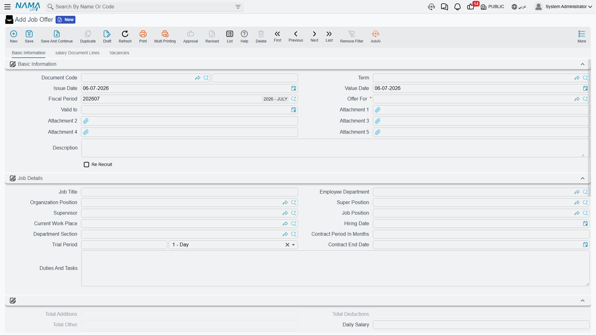
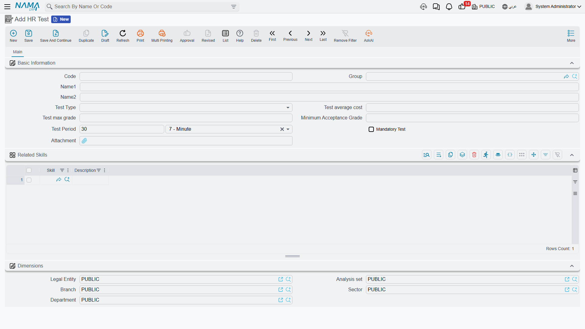

# Job Offers & Tests

A [candidate](vacancies-and-candidates.md) who clears interviews and testing doesn't just get hired on a handshake — Nama puts the proposed terms of employment into their own document first, so the job title, salary package, and start date discussed with the candidate are on record before anyone signs anything.

## Job Offer

Found at **Payroll > Recruitment > Job Offer**, a **Job Offer** (عرض وظيفي) is a document that spells out what's being offered: who it's for, the job details, and the full salary package.

**Basic Information & Job Details:**

| Field | Purpose |
|---|---|
| Document Code / Term / Issue Date / Value Date / Fiscal Period | The standard document identity fields shared by every Nama document. |
| Offer For | Who the offer targets — this is a generic reference, so it can point at a registered candidate or, for a returning hire, an existing employee. |
| Re Recruit | Marks the offer as re-hiring someone who worked for the company before. |
| Valid To | The offer's expiry date. |
| Job Title / Employee Department / Organization Position / Super Position / Supervisor / Job Position | Where the role sits in the org chart. |
| Current Work Place | The physical work location assigned. |
| Start Date / Contract Period In Months / Contract End Date / Trial Period | The employment term being proposed. |
| Duties And Tasks | A description of the role's responsibilities. |

**Employee Details** carries the personal terms — Nationality, Marital Status, Residency ID, Ensured Legal Entity (for social insurance), Calendar, Offer State (**Offered**, **Accepted**, or **Rejected**), Tickets/Classification, and banking details (Bank ID, Bank Account, IBAN).

::: tip A job offer copies the salary structure
The **Salary Structure** field on a job offer works exactly like it does anywhere else in HR — see [Salary Structures](../payroll/salary-structures.md). Whatever structure is picked here becomes the fallback for every component the offer's own **Salary Components** grid doesn't explicitly price, and — because the offer becomes the new hire's first HR record — that same structure carries forward as the employee's own fallback once they're appointed. Proposing the right structure on the offer is effectively proposing the employee's whole pay package in one move.
:::

The **Salary Components** page repeats the familiar shape (HR Calendar, Component Type, Salary Component Value, Component Calculation Formula, Issuance, From/To Date, Criteria) alongside Housing and Transportation allowance switches, ticket entitlements, and the read-only Total Additions / Deductions / Other / Salary figures — so the whole package can be reviewed as one number before it's sent to the candidate. A **Vacancies** page lets the offer pre-assign vacation entitlement (vacation type, assigned days, balance range) for the new hire, the same information that later appears on their [Employee HR Information](../setup/employee-hr-information.md) record.

Two actions close out an offer: **Collect Vacations** (تجميع الأجازات) pulls in the entitlement lines from the chosen vacation balance ranges, and **Reject** (رفض) records that the candidate — or the company — walked away from the offer.

## Candidate Job Offer

**Candidate Job Offer** (عرض وظيفي لمتقدم للعمل), at **Payroll > Recruitment > Candidate Job Offer**, is the same idea narrowed to one specific use: it carries a direct **Candidate** field instead of the generic "Offer For" reference, and it's the document created automatically when a recruiter clicks **Transfer To Employee And Create Job Offer** on a [candidate's record](vacancies-and-candidates.md). Everything else — job details, salary components, vacancies, the **Reject** action — mirrors the plain Job Offer.

## Aggregated Job Offer

Hiring rarely happens one person at a time when a whole cohort starts together — a new branch opening, a seasonal intake. **Aggregated Job Offer** (عرض وظيفي مجمع), at **Payroll > Recruitment > Aggregated Job Offer**, is the batch version: define an employee range or criteria (department, organization position, job position, branch, sector, nationality, and more) in its **Collect Employees** block, click **Collect Employees** (تجميع الموظفين), and Nama pulls in every matching person into the **Employees** grid — one line each, with a back-pointer to the individual **Job Offer** it will generate.

The same Job Details, Salary Components, and Vacancies pages appear here, applied once to every collected line; a **Generated Doc Book / Term** pair tells Nama which book and term to use for the individual offers it spawns, and **Create Offers Only And Do Not Update When Saving** controls whether re-saving the batch is allowed to touch offers it already created. As with any [aggregated document](../concepts/hr-requests-and-documents.md), work in the batch — not in the generated singles underneath it.

## HR Test

Found at **Payroll > Recruitment > HR Test**, an **HR Test** (إختبار) defines one assessment style a candidate can be put through on the way to an offer: **Test Type** (Written Test, Interview, Trial Work, or one of three custom types), **Test Average Cost**, **Test Max Grade**, **Minimum Acceptance Grade**, **Test Period**, whether it's **Mandatory**, and a **Related Skills** grid linking it to the skills it measures. A vacancy type (see [Vacancies & Candidates](vacancies-and-candidates.md)) lists the tests expected of anyone applying under it, with its own per-vacancy-type weight and passing grade.

## HR Test Result

**HR Test Result** (نتائج الإختبار), at **Payroll > Recruitment > Test Result**, is where the actual scoring happens. Pick the **Vacancy** and the **Test** being scored, use **Collect Candidates** (تجميع المتقدمين) to pull in everyone waiting on that test, then fill each candidate's **Test Score** in the **Details** grid; Nama compares it against the **Minimum Acceptance Grade** and records a **Test Conclusion** — **Passed**, **Partial Passed**, or **Failed** — for that line. Those per-test conclusions are what a candidate's own Tests Total Grade and Tests Status summarise.

## From offer to employee

Accepting an offer isn't a separate click on the offer itself — the hire happens back on the [candidate's record](vacancies-and-candidates.md), whose **Create Employee** or **Transfer To Employee And Create Job Offer** button turns the applicant into a real employee. From there, onboarding continues with [Work Starting](work-starting.md), which puts the new hire on the payroll and creates their [Employee HR Information](../setup/employee-hr-information.md) record.

## Related pages

- **[Vacancies & Candidates](vacancies-and-candidates.md)** — opening the position and screening the applicants that eventually reach an offer.
- **[Salary Structures](../payroll/salary-structures.md)** — the fallback package a job offer proposes and carries forward.
- **[Work Starting](work-starting.md)** — the onboarding step that follows an accepted offer.
- **[HR Requests, Documents & Aggregated Documents](../concepts/hr-requests-and-documents.md)** — the general aggregation pattern behind Aggregated Job Offer.
