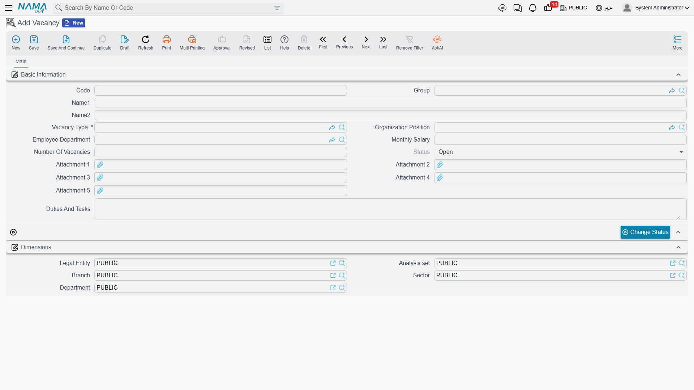
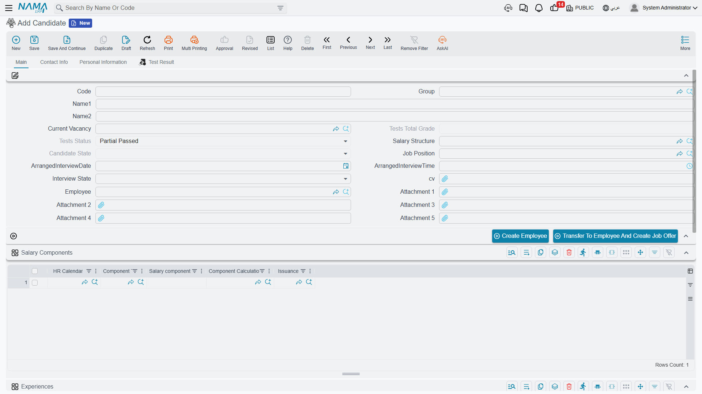

# Vacancies & Candidates

Hiring in Nama starts before anyone applies. You first decide **what** you're hiring for — a vacancy — and only then does a pipeline of **applicants** get matched against it. Keeping the two separate is what lets HR track "how many people have we interviewed for this one opening" instead of drowning every CV in one undifferentiated pile.

## HR Vacancy Type — the reusable job profile

Found at **Payroll > Recruitment > Vacancy Type**, an **HR Vacancy Type** (نوع فرصة عمل) is a template you define once for a role that gets opened repeatedly — "Sales Representative", say — so you don't have to re-enter its skill and testing requirements every time a new opening for that role comes up.

| Field | Purpose |
|---|---|
| Code / Group / Arabic Name / English Name | Identification. |
| Organization Position / Employee Department | The job grade and department this profile normally belongs to. |
| Average Monthly Salary / Average Monthly Other Cost | Budgeting figures used when planning headcount for the role. |

Two grids carry the profile's real content:

- **Skills** — each line names a **Skill**, the **Skill Level** required (from **Not Found** up through **Very Weak**, **Weak**, **Good**, **Very Good**, to **Excellent**), and whether it's **Required**.
- **Tests** — each line names a **Test** (see HR Test further down this page), its **Test Order**, its **Test Weight**, and the **Minimum Acceptance Grade** a candidate must clear.

Neither grid forces anything automatically onto a vacancy — they're a reference profile a recruiter reads while screening candidates for any vacancy opened under that type.

## HR Vacancy — the actual opening

Found at **Payroll > Recruitment > Vacancy**, an **HR Vacancy** (فرصة عمل) is the specific position you're recruiting for right now.

| Field | Purpose |
|---|---|
| Code / Group / Arabic Name / English Name | Identification. |
| Vacancy Type | The job profile (HR Vacancy Type, above) this opening was created from. |
| Organization Position / Employee Department | Where the new hire will sit once appointed. |
| Monthly Salary | The budgeted pay for this specific opening. |
| Number Of Vacancies | How many people are needed to fill it — a single vacancy can represent several open seats. |
| Status | **Open** (مفتوحة) or **Closed** (مغلقة). |
| Duties And Tasks | A free-text description of the role, useful for job postings and interviews alike. |

A vacancy also carries the standard **Dimensions** (legal entity, branch, sector, department, analysis set), so recruitment can be scoped the same way as every other master record in Nama.

Once every seat is filled — or the opening is called off — a recruiter uses the **Change Status** button (تغيير الحالة) to flip it from Open to Closed, rather than deleting it; the closed vacancy stays on record as a history of what was hired for and when.

## HR Candidate — registering an applicant

Found at **Payroll > Recruitment > Candidate**, an **HR Candidate** (متقدم للعمل) is one person's application file. It carries far more than a name and a CV — it's the record a recruiter lives in from the first phone screen through to the hiring decision.

**Basic Information:**

| Field | Purpose |
|---|---|
| Code / Group / Arabic Name / English Name | Identification. |
| Current Vacancy | The vacancy this application is being evaluated against right now. |
| Job Position | The specific position applied for. |
| Salary Structure | A proposed [salary structure](../payroll/salary-structures.md) — carried forward if this candidate is later offered the job. |
| Candidate State | Tracks the applicant's standing — **Offered** (بأنتظار الموافقة) while a decision is pending, **Appointed** (مُعين) once hired, plus the same working-life states (Working, Resigned, Dismissed, Suspended, Pension, In Vacation…) used elsewhere for an employee's own record, since a candidate who is hired keeps this same field going forward. |
| Tests Total Grade / Tests Status | The candidate's combined score across all recorded test results (see HR Test Result further down), and the resulting conclusion — **Passed**, **Partial Passed**, or **Failed**. |
| Arranged Interview Date / Time | When the interview is scheduled. |
| Interview State | Where the candidate sits in the interview funnel: **Not Called**, **No Answer**, **Not Available**, **Waiting Interview**, **Interviewed**, **Short Listed**, **Accepted**, **Rejected**, **Awaiting Another Interview**, or **Interviewed Second Time**. |
| CV | The candidate's attached résumé. |
| Employee | Filled in automatically once the candidate is hired and becomes an employee record. |

Three tabs round out the file:

- **Contact Info** — address and phone/email details, the same shape used across Nama's contact-info block.
- **Personal Information** — gender, nationality, birth date/place, marital status, religion, plus a **Qualifications** grid (qualification, institute, graduation date, grade).
- **Test Result** — a read-only list of every HR Test Result line recorded for this candidate.

Two grids on the main page carry the working history and the application scope:

- **Experiences** — job title, company name, project name, from/to dates, years/months of experience, and a description — the candidate's work history.
- **Vacancies** — one line per HR Vacancy this same person has applied to, with a remarks column. A single candidate can be tracked against more than one opening at once.

There's also a **Salary Components** grid, identical in shape to the one on [Employee HR Information](../setup/employee-hr-information.md) — a place to pencil in the pay components being discussed with this candidate before any formal offer exists.

::: tip Two ways to turn a candidate into an employee
A candidate's record carries two buttons for closing out a successful application:

- **Create Employee** (إنشاء موظف) — hires the candidate directly, with no job offer document in between.
- **Transfer To Employee And Create Job Offer** (تحويل المتقدم للعمل لموظف وإنشاء عرض وظيفي) — hires the candidate *and* generates the matching job offer record in the same step, so the terms that were discussed are captured on paper.

Most organisations use the second path so there's always a documented offer behind every hire — see [Job Offers & Tests](job-offers-and-tests.md) for what that document looks like.
:::

## HR Test and HR Test Result

Found at **Payroll > Recruitment > HR Test**, an **HR Test** (إختبار) defines one assessment a candidate might be put through — a written test, an interview, or trial work — with its own **Test Type**, **Average Cost**, **Max Grade**, **Minimum Acceptance Grade**, **Test Period**, whether it's **Mandatory**, and a **Related Skills** grid tying it back to the skills it's meant to measure.

**HR Test Result** (نتائج الإختبار), at **Payroll > Recruitment > Test Result**, records the outcome: pick the **Vacancy** and the **Test**, use the **Collect Candidates** button (تجميع المتقدمين) to pull in every candidate awaiting that test, then score each one in the **Details** grid — **Test Score** and the resulting **Test Conclusion** (Passed / Partial Passed / Failed). Those per-test conclusions are what roll up into a candidate's own Tests Total Grade and Tests Status.

## Where this leads

Once a candidate clears interviews and tests, the natural next step is making it official — see **[Job Offers & Tests](job-offers-and-tests.md)** for how an offer is drawn up (carrying forward the salary structure proposed here) and how it turns into an actual hire.
