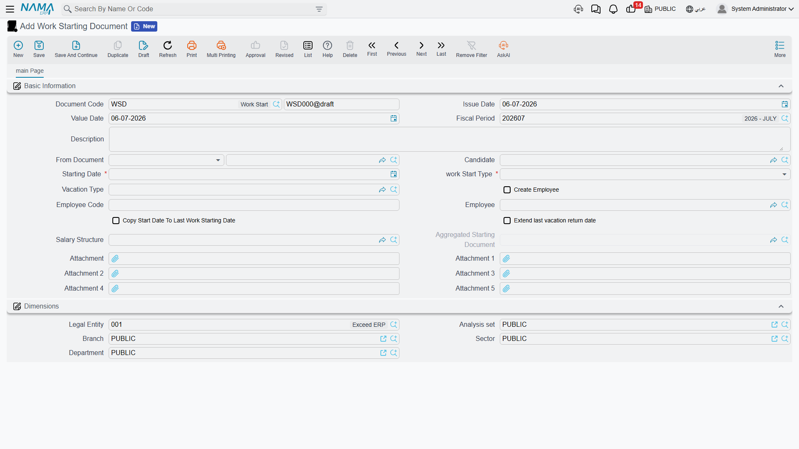

# Work Starting

An offer being accepted, a suspension ending, a long vacation running its course — none of these, on their own, put a person back on the payroll. Nama always records the actual first day back at work as its own event: a **Work Starting Document**. What makes this document interesting is that it doesn't care where the person is coming from — a job offer, a return from vacation, and a plain work-starting request all feed into the same document, because putting someone back to work is always the same act regardless of how they got there.

## Work Starting Request

Found at **Human Resources > Recruitment > Work Starting Request**, this is the optional approval layer described in [HR Requests, Documents & Aggregated Documents](../concepts/hr-requests-and-documents.md): the same business fields as the document below, plus the approval state (**Initial**, **Accepted**, **Rejected**, **Processed**) and the **Accept**/**Reject** buttons. Use it whenever a manager should sign off on a start date before it becomes real — for example, confirming a return date after a long unpaid leave.

| Field | Purpose |
|---|---|
| Starting Date | The day the person is due back at work. |
| Work Start Type | What kind of start this is — see the options below. |
| Candidate / Employee | Who is starting: a candidate being hired for the first time, or an existing employee returning. |
| Vacation Type | Which vacation balance this return relates to, when relevant. |
| Salary Structure | The fallback [salary structure](../payroll/salary-structures.md) to carry forward. |
| Open Shift | The [attendance shift](../attendance/attendance-plans-and-shifts.md) to open for the person from this date. |
| Copy Start Date To Last Work Starting Date / Extend Last Vacation Return Date | Housekeeping switches that keep the employee's own start-date history and vacation return date in step with this record. |

Once a reviewer accepts the request, HR turns it into the real Work Starting Document either from the request's generate button or by picking the accepted request as the document's **From Document**.

## Work Starting Document

Found at **Payroll > Recruitment > Work Starting Document**, this is where the return to work actually happens. The **Work Start Type** field is what tells Nama which of the three origins this is:

| Work Start Type | Arabic | What it means |
|---|---|---|
| New Hiring | تعيين جديد | A candidate is joining for the first time — this is the document that follows an [accepted job offer](job-offers-and-tests.md). |
| Back From Vacation | عودة من أجازة | An existing employee is returning from a vacation. |
| Back From Suspension | عودة من إيقاف | An existing employee is returning from a disciplinary suspension. |
| Other 1 / Other 2 / Other 3 | أخرى 1 / 2 / 3 | Free slots for company-specific return scenarios that don't fit the three above. |

| Field | Purpose |
|---|---|
| Starting Date | The day the person actually starts (or restarts) work. |
| Candidate | Set when the document is onboarding a candidate for the first time. |
| Create Employee | Checked to have Nama create the **Employee** record itself from the candidate's details — see below. |
| Employee Code | The code to give the new employee record when Create Employee is checked. |
| Employee | Set directly when the document is for an existing employee (a return, not a first hire). |
| Vacation Type | The vacation balance this return closes out, for a Back From Vacation start. |
| Salary Structure | The fallback [salary structure](../payroll/salary-structures.md) carried onto the employee. |
| From Document | The job offer, vacation document, or work-starting request this document was generated from. |
| Open Shift | The attendance shift to open from this date. |
| Copy Start Date To Last Work Starting Date / Extend Last Vacation Return Date | The same housekeeping switches as on the request. |

## How it's processed

Committing a Work Starting Document is the moment the person is actually put back to work: Nama marks the target — the new employee or the returning one — as **Working**, effective on the Starting Date, and carries the chosen salary structure onto their record as its fallback.

- For a **New Hiring** start with **Create Employee** checked, saving does not just flag an existing record — it creates the **Employee** record and its companion [Employee HR Information](../setup/employee-hr-information.md) record from scratch, copying the candidate's name and salary component lines across. This is the exact moment a candidate becomes a real employee.
- For a **Back From Vacation** start generated from a vacation document, Nama also writes the actual return date back onto that vacation document, closing the loop between "how long the leave was supposed to be" and "when the person actually came back."
- The document itself has no accounting effect — it is purely an HR/payroll-eligibility event, not a posting document.

## Aggregated Vacation Work Starting Document

Some employees don't return from vacation just once a year — think of rotational or offshore staff cycling through several separate on/off stints. Rather than opening a fresh Work Starting Document for every single return, **Aggregated Vacation Work Starting Document**, at **Payroll > Recruitment > Aggregated Vacation work Starting document**, lets HR list every return for **one employee** as line items in a single batch. Each line — its own Start Date and Return Date, the Vacation Type it draws from, the balance before and after, and a Vacation Reason — spawns its own ordinary [Work Starting Document](#Work-Starting-Document) underneath, tracked by a back-pointer on the line.

| Field | Purpose |
|---|---|
| Employee | The one employee this whole batch is for. |
| Start Date / Return Date (per line) | The departure and return dates of that particular stint. |
| Vacation Period / Actual Vacation Period / Manual Vacation Period (per line) | The planned length of the stint versus the length actually recorded, and a manual override when the automatic calculation isn't right. |
| Balance / Reminder Balance After Vacation (per line) | The vacation balance available, and what's left once that stint is deducted. |
| Vacation Reason (per line) | Why this particular stint was taken. |
| Extend Last Vacation Return Date / Copy Start Date To Last Work Starting Date | The same housekeeping switches as on a single Work Starting Document, applied to the whole batch. |

As with any [aggregated document](../concepts/hr-requests-and-documents.md), the individual Work Starting Documents underneath are system-managed — add, remove, and edit the lines on the batch rather than the singles it produces.

## Related pages

- **[HR Requests, Documents & Aggregated Documents](../concepts/hr-requests-and-documents.md)** — the request/document/aggregated pattern this whole area follows.
- **[Employee HR Information](../setup/employee-hr-information.md)** — the record a New Hiring start creates, and where the employee's own salary component lines live afterwards.
- **[Job Offers & Tests](job-offers-and-tests.md)** — the accepted offer that a New Hiring work-starting document usually follows.
