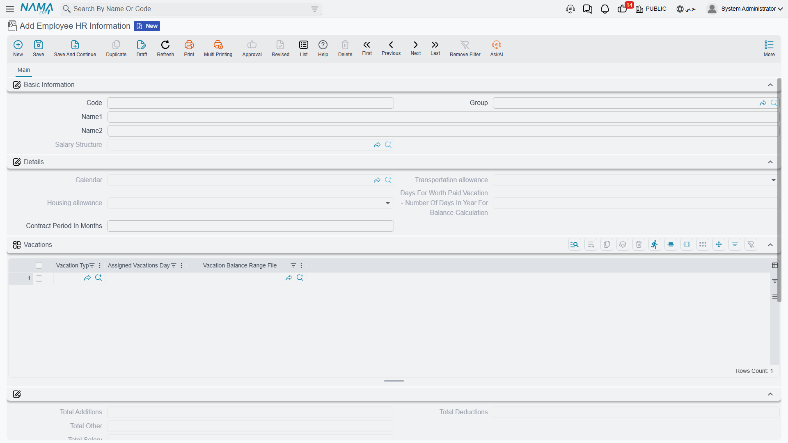
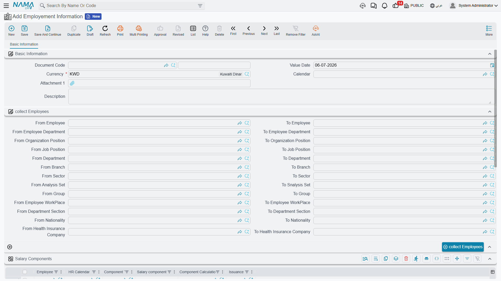

# Employee HR Information

Once someone joins the company, their record splits naturally into two layers. Their **personal and job details** — name, contact information, passport and residency, department, job position, bank account — live on their own employee master record. Everything the **salary engine** needs on top of that — which calendar they follow, which allowances apply to them, and their own personal salary component lines — lives on a companion record: **Employee HR Information**.

## Employee HR Information (معلومات شئون الموظفين) — the payroll layer

Found at **Payroll > Main > Employee HR Information**, this is a master file with one record per employee. It matters more than its short field list suggests, because it's exactly what [How Salary Is Calculated](../concepts/hr-salary-engine.md) means when it says "the employee's own component lines are read first; a salary structure is only consulted when the employee has none." Those personal lines are here.

**Basic Information:**

| Field | Purpose |
|---|---|
| Code / Group / Arabic Name / English Name | Identification (mirrors the employee's own name). |
| Salary Structure (هيكل راتب) | The reusable [salary structure](../payroll/salary-structures.md) that acts as a fallback if this employee has no component lines of their own. |

**Details:**

| Field | Purpose |
|---|---|
| Calendar (التقويم) | Which [HR Calendar](hr-calendar-and-holidays.md) this employee's payroll math follows. |
| Transportation Allowance (بدل مواصلات) / Housing Allowance (بدل سكن) | Each one of **None** (بدون), **Applicable** (مطبق), or **Insured** (مؤمن) — and this is precisely the switch behind the salary-engine warning that "Housing/Transportation allowances self-zero unless actually enabled on the employee's own record." A structure alone is not enough; it has to be turned on here. |
| Days For Worth Paid Vacation — Number Of Days In Year For Balance Calculation (عدد الأيام لاستحقاق بدل الأجازة) | The day-count basis used to calculate this employee's paid-vacation entitlement. |
| Contract Period In Months (مدة العقد بالشهور) | For fixed-term contracts. |

A **Vacations** grid lists per-employee entitlement overrides — Vacation Type, Assigned Vacation Days, and the Vacation Balance Range File (see [Vacation Types & Balances](../vacations/vacation-types-and-balances.md)) — followed by a read-only **Totals** block (Total Additions / Deductions / Other / Salary) so support staff can sanity-check an employee's overall pay at a glance without opening a salary document.

The most important part of the screen is the **Salary Components** grid (مفردات رواتب): HR Calendar, Component Type, Salary Component Value, Component Calculation Formula, **Issuance** (الصرفية), From Date, To Date. This is the actual list of personal component lines the salary engine reads first. Two things worth noticing:

- Each line can be **dated** (From/To), so a raise, a temporary allowance, or an end date can be scheduled without ever deleting history.
- Each line is tagged with an **Issuance** — see [HR Years, Periods & Salary Issuance](hr-years-and-periods.md) — so one employee can carry a "Main Salary" set of components and a separate "Commissions" set, each feeding only its own payroll stream.

## Employment Information (بيان توظيف) — bulk onboarding

**Employment Information**, at **Human Resources > Recruitment > Employment Information**, is a different kind of thing entirely: not a master file but a document, built for onboarding a whole batch of new hires at once instead of opening each employee's HR Information record one at a time.

Its **Collect Employees** block defines a range or criteria — from/to employee, department, organization position, job position, branch, sector, analysis set, group, work place, department section, nationality, health insurance company — and a **Collect Employees** (تجميع الموظفين) button pulls in every employee that matches. Once collected:

- A **Salary Components** grid (the same shape as HR Information's: employee, HR calendar, component type, value, formula, issuance) lets HR key in the same component setup for the whole batch in one pass.
- A **Collect Vacations** (تجميع الأجازات) button populates a Vacancies grid so assigned vacation days can be pre-set for the same batch.

::: info Not a payroll or accounting document
Employment Information generates no accounting effect and runs no payroll on its own. It's purely a convenience tool for writing the same component and vacation setup into many employees' records in one operation — typically right after a batch of hires has gone through [work starting](../recruitment/work-starting.md).
:::

## How it fits into onboarding

A new hire's record usually comes together in this order: a [job offer](../recruitment/job-offers-and-tests.md) proposes a salary structure, a [work starting](../recruitment/work-starting.md) document creates the employee (and their HR Information record), and — if a whole cohort joined at once — Employment Information bulk-fills their component lines and vacation entitlements in a single pass. From then on, day-to-day adjustments for one person happen directly on their Employee HR Information record.

The employee's own master record also carries the official identity and travel documents — passport, residency, work license, social insurance — that the [government relations](../government-relations/government-relations-overview.md) processes later read and update as visas and residencies are renewed.

## Related pages

- **[How Salary Is Calculated](../concepts/hr-salary-engine.md)** — why the component lines on this page take priority over a salary structure.
- **[Work Starting](../recruitment/work-starting.md)** — how a new employee's record and HR Information come into existence.
- **[Government Relations](../government-relations/government-relations-overview.md)** — where the employee's official documents are tracked and renewed.
