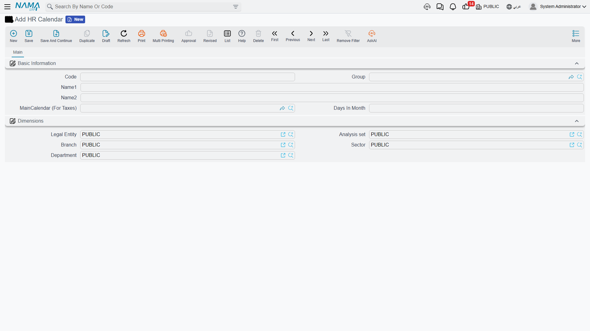
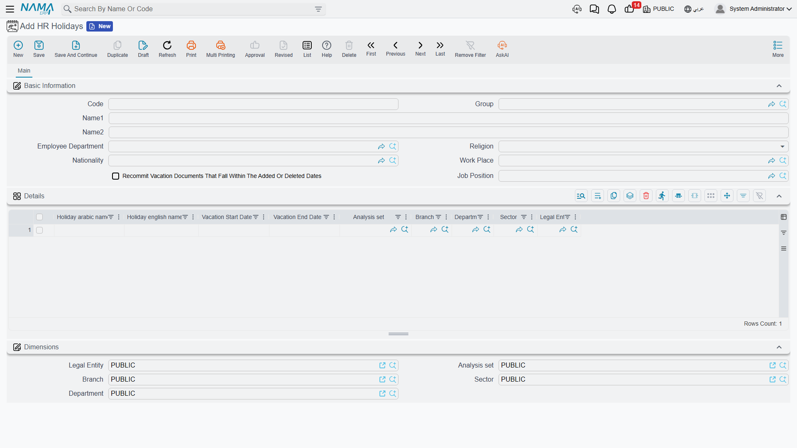

# HR Calendar, Holidays & Weekends

Every attendance rollup, every vacation-day count, and every payroll figure in Nama ultimately answers one question: was this a working day, a weekly rest day, or an official holiday? Three settings answer it — the HR Calendar, HR Holidays, and, perhaps surprisingly, the Attendance Plan.

## HR Calendar (تقويم الرواتب)

Found at **Payroll > Settings > HR Calendar**, an HR Calendar is the reference every [HR Year](hr-years-and-periods.md), every [Employee HR Information](employee-hr-information.md) record, and every salary sheet points to when it needs to know "which calendar am I running on." A company that operates more than one payroll calendar — say, different day-count conventions for different legal entities — keeps them as separate HR Calendar records rather than one global setting.

| Field | Purpose |
|---|---|
| Code / Group / Arabic Name / English Name | Identification. |
| Main Calendar (For Taxes) (التقويم الاساسي للضرائب) | An optional link to another HR Calendar that should be used as the tax reference — so a company's own working calendar and the calendar its tax computations rely on don't have to be the same record. |
| Days In Month (عدد ايام الشهر) | The day-count convention (commonly 30) used wherever a daily rate needs to be derived from a monthly figure. |

## HR Holidays (عطلة رسمية) — official holidays

**Payroll > Settings > HR Holidays** defines the set of official holiday dates — national days, religious holidays, and the like — that attendance and vacation calculations must recognize as non-working days. Because not every holiday applies to every employee, a holiday-set record can be scoped narrowly:

| Applicability field | Purpose |
|---|---|
| Employee Department (إدارة موظف) | Limit the holidays to one department. |
| Religion (الديانة) | A religious holiday only applies to employees of that religion. |
| Nationality (الجنسية) | A national holiday only applies to employees of that nationality. |
| Work Place (مكان العمل) / Job Position (الموقع الوظيفي) | Further narrows which employees the set applies to. |

Inside the record, a **Details** (التفاصيل) grid lists the actual holiday dates, each with its own Arabic/English name, **Vacation Start Date** and **Vacation End Date** (تاريخ بداية العطلة / تاريخ نهاية العطلة), and its own dimension scoping (legal entity, branch, sector, department, analysis set) — so one HR Holidays record can hold an entire year's worth of discrete holiday events.

::: tip Recommit Vacation Documents That Fall Within The Added Or Deleted Dates
If a holiday date is added or removed **after** vacation documents spanning that date have already been saved, turning on **Recommit Vacation Documents That Fall Within The Added Or Deleted Dates** (إعادة حفظ سندات الأجازه التى تقع فى التواريخ المضافة او المحذوفة) tells Nama to recompute those existing vacation documents so their day-count correctly reflects the change, instead of leaving them silently stale.
:::

## Weekends: set on the Attendance Plan, not the calendar

Unlike holidays, the **weekly rest day** is not configured on the HR Calendar at all — it lives on the **Attendance Plan** (خطة الدوام, **Payroll > Time Attendance > Attendance Plan**), covered in full on the [attendance](../attendance/attendance-plans-and-shifts.md) page. Each plan carries weekend lines — scoped by employee, department, job position and a date range — naming up to three weekly rest days (**Weekend 1 / 2 / 3**, راحة أسبوعية 1/2/3, chosen from Saturday through Friday). This is what lets one attendance plan use Friday–Saturday as its weekend while another uses Sunday alone.

Some companies prefer to manage weekly rest days as their own document instead of editing the attendance plan every time; for them, a **Weekend Document** (سند الراحات الأسبوعية, **Payroll > Time Attendance > Weekend Document**) exists, and a module setting — **Take Weekends from the Weekend Document Instead of the Attendance Plan** (اعتماد الراحات الأسبوعية من سندها الخاص بدلاً من خطة الدوام) — switches the whole company over to sourcing weekends from it.

## Why this matters downstream

Holidays and weekends aren't just calendar trivia — they change how attendance and salary numbers come out:

- A calculation-line bracket in a [salary formula](../payroll/salary-calculation-formulas.md) can carry a distinct **Factor For WeekEnds** (المعامل للعطلات الإسبوعية), so overtime worked on a weekend can be paid at a different multiplier than overtime on an ordinary day.
- A performance indicator can be flagged **Not Included In Week Ends** (لا يتم احتسابه في أيام العطلات الأسبوعية), excluding weekend days from a measure entirely.
- On the [vacation type](../vacations/vacation-types-and-balances.md) itself, **Include Weekend (Balance)** (تشمل العطلة الأسبوعية - أرصدة) decides whether a weekend that falls inside a multi-day vacation is deducted from the employee's balance, while a separate **Weekend Policy (Salary)** (معاملة أجازة اسبوعية - رواتب) setting — Like Balances, Include, or Exclude — controls how that same weekend is treated for salary purposes, independently of the balance decision.

In short: the calendar and holiday list decide *which dates are special*; the attendance plan decides *which day of the week is the weekend*; and the formulas, indicators, and vacation types decide *what that specialness is worth* in attendance and pay.

## Related pages

- **[HR Years, Periods & Salary Issuance](hr-years-and-periods.md)** — every HR Year points to one HR Calendar.
- **[Attendance Plans & Shifts](../attendance/attendance-plans-and-shifts.md)** — where the weekly rest day is actually configured.
- **[Vacation Types & Balances](../vacations/vacation-types-and-balances.md)** — how weekends interact with vacation balances and pay.
