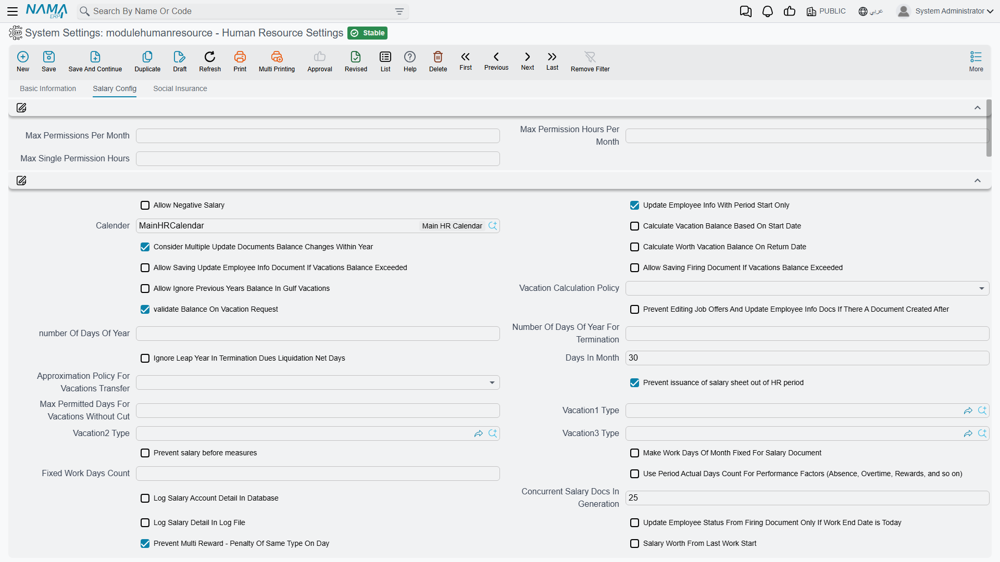
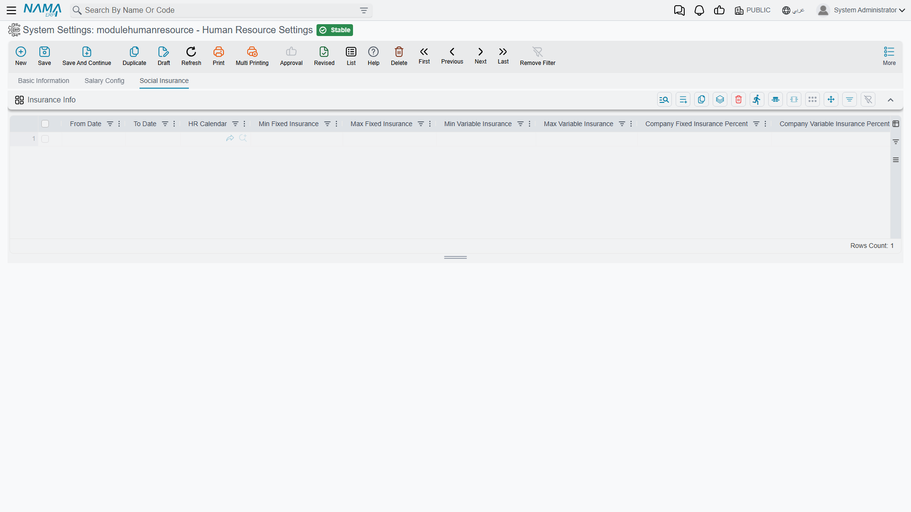

# HR Configuration

Everything the payroll engine does that is not written on a document is written here. Whether an
absent day costs the employee a thirtieth of the month or a share of the days the month actually
has, whether overtime starts at the end of the shift or at the end of the last punch, how many
leave permissions a month allows, which vacation balance rule the Gulf branches follow — all of it
lives on one record, and that record is read every time a salary document is generated.

The menu entry is the first surprise: it is called **Human Resource Settings** and it sits under
**Payroll → Settings**, not under Human Resources. The second is that the tab holding nearly all of
these options is titled **Salary Config** («إعدادات الرواتب»), because most of what is on it ends up
as a number on a salary document. Look for "HR Configuration" in the Human Resources menu and you
will not find it.

## Where the settings live, and who they apply to

The settings are a **system settings record** whose code is `modulehumanresource` and whose name is
*Human Resource Settings* — «أعدادات الموارد البشرية», with the shipped Arabic missing the hamza on
the first word. It opens with **three tabs**:

- **Basic Information** — the record's own header: code, name, configuration group, type and the
  dimensions the record applies to. Nothing HR-specific.
- **Salary Config** — everything in this page except the last section.
- **Social Insurance** — one dated grid of insurance bands.

**There is exactly one, and it covers the whole database.** Every system settings record is a
single global record, and the HR one is no exception: one *Days In Month*, one vacation policy, one
set of deduction rules for every legal entity, branch, department and sector in the database. A
group running seven companies out of one database runs all seven on the same HR settings.

The Basic Information tab shows a configuration group, a type and a set of dimensions, and it is
natural to read those as a way to scope the record to one company. **They are not.** A
per-legal-entity configuration was designed in 2014 and never adopted, and those fields are what is
left of it. Do not create a second Human Resource Settings record and expect one company to follow
it — leave the shipped record as the only one, with its dimensions public.

So when two companies genuinely need different month arithmetic or different deduction rules, this
screen cannot give it to them. The difference has to come from something that *is* per-document or
per-employee: the attendance plan, the salary components, the salary structure, or the document
term and book the salary sheet hands out.

**A change takes effect at once.** A dozen of the attendance options are held in memory for speed,
but that cache is cleared the moment the settings record is saved, so the next document generated
uses the new value. Nothing is frozen into a salary document when it is created either — so
changing a deduction rule mid-month and then regenerating last week's documents will change their
figures. Change these settings deliberately, and not in the middle of a payroll
run.

**Almost everything starts switched off.** Seven options ship on: *Update Employee Info With Period
Start Only*, *Validate Balance On Vacation Request*, *Prevent issuance of salary sheet out of HR
period*, *Consider Extended Attendance in First Day*, *Handle Overlap Between Attendance, Missions,
and Leave Permissions*, *Prevent Multi Reward - Penalty Of Same Type On Day* and *Add Default Dues
Liquidation Additions And Deductions*. A few numbers ship with a value — 30 days in the month, 23
hours as the longest continuous attendance, 25 salary documents generated at a time, 18 hours as the
widest gap the system will bridge when it pairs a punch-in with a punch-out, and 1/2/3/4 as the
overlap priorities. Everything else is off or empty, which means the module's behaviour out of the
box is the plain one described throughout these pages.

## Reading the Salary Config tab

Around a hundred and fifty fields sit on this one tab, in a dozen groups, and it is worth knowing
three things about the layout before you hunt for an option.

- **The first two groups have no title.** The three permission ceilings sit in one, and about sixty
  unrelated options sit in the other, in no particular order. That is how the screen is built, not a
  fault in your installation.
- **Four group titles show an internal name instead of a translated one** — `AttendanceConfig`,
  `overtimeInMultiVacationDayHandling`, `SalaryDeductions` and `ProvisionCalculation` appear in that
  code-like form in both the Arabic and the English interface, because no translation was ever
  registered for them. They are the attendance group, the day-type collision group, the
  absence-deduction group and the provisions group respectively.
- **A handful of fields have no label at all** and show their internal name: the ten salary
  component slots and the five constant-salary groups (see
  [Component slots](#Component-slots-and-constant-salary-groups) below).

Because the big group is unordered, **use your browser's find rather than scrolling**. This page
ignores the screen order entirely and groups the options by what they change.

## Leave permission ceilings

The first, untitled group is the whole of the leave-permission policy: how many permissions an
employee may take and how long they may be.

| Option | Field | What it does |
|---|---|---|
| **Max Permissions Per Month** | `value.maxPermissionsPerMonth` | The number of leave permissions one employee may have in a month. Empty means no ceiling. |
| **Max Permission Hours Per Month** | `value.maxPermissionsHoursPerMonth` | The total hours of permission per month, regardless of how many documents they are spread over. |
| **Max Single Permission Hours** | `value.maxSinglePermissionHours` | The longest one permission may be. |
| **Max Permission Count Per Hr Period Not Fiscal Period** | `value.maxPermissionCountPerHrPeriod` | Counts the ceiling against the **payroll period** instead of the calendar/fiscal month. Turn it on wherever the payroll period does not start on the first of the month, or the ceiling is measured over the wrong window. |
| **Max Permission Count Per Reason** | `value.maxPermissionCountPerReason` | Applies the monthly count **separately to each permission reason** rather than to all permissions together. Two permissions for a medical appointment and two for personal reasons then count as two and two, not four. |

::: tip The ceiling is a refusal, not a warning
Exceeding one of these stops the permission document from being saved. If staff need the excess
recorded anyway, the ceiling is the wrong tool — raise it and control the excess through approvals
instead.
:::

The three *prevent … with no attendance plan* options in the attendance group are the other half of
this story: they decide whether a permission, mission or vacation document may exist at all for an
employee who has no attendance plan on that date. See [Attendance](#Attendance) below.

## The calendar, the year and the month

These are the numbers that turn a monthly salary into a daily or hourly rate, and they are the ones
to get right before the first live payroll run — every formula that divides by a number of days
reads one of them.

| Option | Field | What it does |
|---|---|---|
| **Calender** | `value.calender` | The HR calendar the module uses when a document does not name one. |
| **Days In Month** | `value.daysInMonth` | The fixed divisor for a month. Ships as **30**. |
| **number Of Days Of Year** | `value.numberOfDaysOfYear` | The fixed divisor for a year. |
| **Number Of Days Of Year For Termination** | `value.daysOfYearForTermination` | A separate year length used only for end-of-service arithmetic, because labour law often prescribes a different one. |
| **Ignore Leap Year In Termination Dues Liquidation Net Days** | `value.ignoreLeapYearInTerminationDuesLiquidationNetDays` | Leaves 29 February out when a dues liquidation counts net working days. |
| **Make Work Days Of Month Fixed For Salary Document** | `value.makeWorkDaysFixedForSalaryDoc` + `value.fixedWorkDaysCount` | Every salary document is generated with the same number of working days, whatever the month holds. The count comes from *Fixed Work Days Count*. |
| **Use Period Actual Days Count For Performance Factors** | `value.usePeriodActualDaysForFactors` | Absence, overtime, rewards and the other performance factors are divided by the days the period **actually** has instead of the fixed month. The label spells out the list: *(Absence, Overtime, Rewards, and so on)*. |
| **Salary Worth From Last Work Start** | `value.salaryWorthFromLastWorkStart` | The salary document's entitlement starts at the employee's **last** work-start date rather than the period start. This is the option for someone who returned from unpaid leave in the middle of the month. Remember that a [Vacation Compensation](../vacations/vacation-compensation-and-transfer.md) also moves that date, so with this option on a mid-month cash-out shortens the salary period too. |

::: warning Fixed month versus actual month
`Days In Month` and *Use Period Actual Days Count For Performance Factors* answer the same question
in opposite ways, and they are read by different parts of the calculation. A 30-day divisor with
actual-day factors is a legitimate combination and a common one — but if a deduction looks
consistently wrong by a day or two in February and in the 31-day months, this pair is where to look
first.
:::

## Vacation entitlement and balance

| Option | Field | What it does |
|---|---|---|
| **Vacation Calculation Policy** | `value.calcPolicy` | The entitlement rule the module follows. |
| **Calculate Vacation Balance Based On Start Date** | `value.calcVacBalanceBasedOnWorStart` | Accrues from the employee's work-start date rather than the calendar year. The Arabic label marks it as Gulf-specific — «خاص بالخليج». |
| **validate Balance On Vacation Request** | `value.validateBalanceOnVacRequest` | **On by default.** A vacation request is refused when the balance will not cover it. |
| **Calculate Worth Vacation Balance On Return Date** | `value.calculateWorthVacationBalanceOnReturnDate` | Entitlement is computed as at the return date instead of the start of the vacation — which matters for a vacation that straddles an accrual boundary. |
| **Allow Ignore Previous Years Balance In Gulf Vacations** | `value.allowIgnorePreviousYearsBalance` | Lets the Gulf vacation calculation drop what was carried forward. |
| **Approximation Policy For Vacations Transfer** | `value.approxPolicyForVacTrans` | The rounding applied to years of service when vacation balance is carried over. |
| **Max Permitted Days For Vacations Without Cut** | `value.maxPermitDaysForVacWithoutCut` | How many vacation days may be taken before the absence starts to cut into length of service. |
| **Vacation1 / Vacation2 / Vacation3 Type** | `value.vacation1Type` … `value.vacation3Type` | Three vacation types the engine and the formulas can refer to positionally, so a salary formula can talk about "vacation 1" without naming a specific type. |
| **Allow Saving Update Employee Info Document If Vacations Balance Exceeded** | `value.allowSaveEmployeeUpdateDocIfBalanceExceeded` | Lets an employee-update document save even though it pushes the vacation balance negative. |
| **Allow Saving Firing Document If Vacations Balance Exceeded** | `value.allowSaveFiringDocIfBalanceExceeded` | The same for a firing document — often needed, because the final settlement is exactly where an over-consumed balance shows up. |
| **Do Not Check Consumed Vacation With Update Document** | `value.doNotCheckConsumedVacationWithUpdateDoc` | Skips the consumed-balance check on employee-update documents altogether. |
| **Consider Multiple Update Documents Balance Changes Within Year** | `value.considerMultipleUpdateDocumentsBalanceChangesWithinYear` | When an employee has several update documents in one year, each one's change to the vacation balance is taken into account instead of only the latest. |
| **Prevent Save Dues Liquidation Document From Vacation Document With Non Annual Vacation Type** | `value.preventDuesDocFromNonAnnualVacationType` | Blocks a liquidation raised from a vacation that is not the annual type. |

Vacation types, balances and the documents themselves are covered in
[Vacation Types and Balances](/modules/hr/vacations/vacation-types-and-balances).

## Employee information, job offers and firing

| Option | Field | What it does |
|---|---|---|
| **Update Employee Info With Period Start Only** | `value.updateInfoWithPeriodStart` | **On by default.** An employee-information change takes effect from the start of a payroll period rather than mid-period. |
| **Multiple Documents To Update Employee Info In The Same Period Handling** | `value.multipleUpdateInfoInPeriodHandling` | How the engine reconciles more than one update document covering the same period. This choice also decides which of the four deduction sets applies — see [Absence and unpaid days](#Absence-unpaid-days-and-the-four-deduction-sets). |
| **Allow More Than One Update Employee Info Document For Same Employee In Same Day** | `value.allowMoreThanOneUpdateEmployeeInfoDocForSameEmpInSameDay` | Removes the one-per-day restriction. |
| **Prevent Editing Job Offers And Update Employee Info Docs If There A Document Created After** | `value.preventEditingJobOffersAndUpdateEmpInfoDocsIfThereADocAfter` | Locks a job offer or update document once any later document exists for that employee, so history cannot be rewritten underneath a salary that was already generated. |
| **Do not Copy Dimensions From Job Offer and Update Info To Employee** | `value.dontCopyDimensionsToEmployee` | Stops the branch, department, sector and analysis-set values on a job offer or update document from being written onto the employee master file. |
| **Update Employee Status From Firing Document Only If Work End Date is Today** | `value.updateEmpStatusFromFiringDocInSameDate` | The employee's state changes on the firing document only when the end date has actually arrived; a firing document dated next month leaves the employee on the books until then. |
| **Prevent More Than One Liquidation At The Same Liquidation Date** | `value.preventMoreThanOneLiquidationAtTheSameLiquidationDate` | One dues liquidation per liquidation date. |
| **Add Default Dues Liquidation Additions And Deductions** | `value.addDefaultDuesLiquidationAdditionsAndDeductions` | **On by default.** A dues liquidation is pre-filled with the standard additions and deductions. |
| **Always Create Salary Document For Dues Liquidation** | `value.alwaysCreateSalaryDocumentForDuesLiquidation` | A liquidation always produces its own salary document. Its label is untranslated — the Arabic screen shows the English text. |

## What stops a salary document

These are the refusals. Each one exists because someone shipped a payroll they should not have.

| Option | Field | What it prevents |
|---|---|---|
| **Allow Negative Salary** | `value.allowNegativeSalary` | Off, a net salary below zero is refused. On, it is allowed — normally only wanted where a loan or a penalty is expected to swallow the whole month and the balance is carried. |
| **Prevent issuance of salary sheet out of HR period** | `value.prevIssuOfSalarySheetOutOfHRPeriod` | **On by default.** A salary sheet dated outside the payroll period it belongs to. |
| **Prevent salary before measures** | `value.preventSalaryBeofreMeasures` | A salary document generated before the performance indicators for the period exist. |
| **Prevent Issue Salary Document If Loans are Greater Than Net Salary** | `value.preventIssueIfLoansMore` | A salary document where the loan instalments exceed the net. |
| **Do not pay loans if there are no addition components at Salary Document** | `value.doNotPayLoansAuto` | Loan instalments being deducted from a document that has no additions at all. The label notes the exception: *(Except last Salary)*. |
| **Collect Working Employees Only In Salary Sheet** | `value.collectWorkingEmployeesOnlyInSalarySheet` | Non-working employees from being collected onto a sheet at all. |
| **Do Not Collect Employees With No Work Starting Document After Vacation** | `value.doNotCollectEmpsWithNoWorkStartingDocAfterVacation` | Collecting someone who went on vacation and has not been recorded as back at work. |
| **Do not Collect Employees With Any Salary Sheet Line** | `value.doNotCollectEmployeesWithAnySalarySheetLine` | Collecting an employee who already appears on **any** sheet for the period, not just a paid one. |
| **Allow Salary Issue If Vacation Includes Holiday** | `value.allowSalaryIssueIfVacationIncludesHoliday` | (Permits, rather than prevents) a salary run over a vacation that swallows an official holiday. |

The two *collect* options here are only part of how a sheet chooses its employees; the full funnel —
the employee search, the five Collect By Ref slots, the ranges that stack — is on
[Salary Documents and Sheets](/modules/hr/payroll/salary-documents).

## Regenerating salary documents and sheets

Regeneration is the most dangerous thing a payroll user can do, so it has its own small policy
engine: a master switch, three grids and two notification templates.

**Allow Regenerate Paid Salary Documents** `value.allowRegeneratePaidSalaryDocuments` — without
this, a document that has been paid cannot be regenerated at all.

**Schedule Salary Documents/Sheets Regeneration By Regeneration Date And Time**
`value.scheduleSalaryDocsRegenByDateTime` — regeneration is queued to run at the date and time
recorded on the request instead of immediately.

Then three grids decide *when* regeneration is allowed, and they are the useful part:

- **Regenerate Salary Docs Allowed Statuses** `value.regenSalaryDocsAllowedStatuses` — one row per
  combination of document status and the status of the salary sheet the document sits in, with
  *Allow Regenerate* and a pair of message templates. The two message columns — Arabic and English —
  are the text the user sees when the row refuses, so a row can explain itself in the words of the
  team that wrote the rule.
- **Regenerate Salary Sheets Allowed Statuses** `value.regenSalarySheetsAllowedStatuses` — the same,
  for sheets.
- **Prevent Regenerate Salary Docs If Found** `value.preventRegenerateSalaryDocs` — the opposite
  test: name a document type and a criteria, and regeneration is blocked when a matching document
  exists. Two columns soften it — *Allow Regen If Doc Is Draft* and *Allow Regen If Doc Is Waiting
  Approval* — so that a downstream document that is still a draft need not block the payroll.

Each grid row can carry a **Criteria** so the rule applies to some employees or documents and not
others; criteria are written on [Criteria Definitions](/platform/criteria-definitions).

The two templates, **Salary Documents Regeneration Notification Template**
`value.regenSalaryDocsNotificationTemplate` and **Salary Documents Regeneration Failure Notification
Template** `value.regenSalaryFailureNotificationTemplate`, are the messages sent when a regeneration
finishes or fails. Both ship with a default that links back to the document.

## Absence, unpaid days and the four deduction sets

This is the group the screen labels `SalaryDeductions`, it holds a third of the options on the
page, and it is the one that produces support tickets, so it is worth understanding its shape rather
than reading its thirty-odd fields one at a time.

The engine distinguishes **two kinds of day that are not worked**:

- **Non-working days** — days outside the span the salary document actually covers, for example the
  days before someone started or after they left.
- **Days without salary** — unpaid leave and suspension inside the period.

For each kind it asks two questions and then two more:

1. **Behaviour** — *Deduct Days* (take the days off the salary) or *Add Other Days* (pay the days
   that were worked instead). Ships as **Deduct Days** in every case.
2. **Basis** — *Actual Period Days* (divide by the days the period really has) or *Fixed Period
   Days* (divide by `Days In Month`). Non-working days ship as **Actual**; days without salary ship
   as **Fixed**.
3. **Are weekend days deducted too?** — a yes/no flag.
4. **Are weekly rest days deducted too?** — a separate yes/no flag. Weekend and weekly rest are
   different things in an attendance plan, and the configuration keeps them apart throughout.

And then the whole set of four exists **four times over**, because the right answer depends on how
messy the employee's month was. Which set the engine uses is decided for you:

| Set | When it applies | Fields |
|---|---|---|
| **Single Update** | The employee has **one** Update Employee Information document in the period — the ordinary case. | `value.nonWorkingDaysSingleBehavior`, `…SingleBasis`, `value.weekEndDaysDeductionSingleBehaviourFor…`, `value.weeklyRestDaysDeductionSingleBehaviourFor…` |
| **Multiple Per Full Period** | More than one update document, and the document covers a full period. | `…MultipleBehavior`, `…MultipleBasis`, `…MultipleBehaviourFor…` |
| **Multiple Per Partial Period** | More than one update document, and the document covers part of a period. | `…MultiplePartialBehavior`, `…MultiplePartialBasis`, `…MultiplePartialBehaviourFor…` |
| **In Last Salary Document** | The document is the employee's **last salary document before termination** — the flag on the document reads *Last Salary Doc for Employee before Firing*. | `value.nonWorkingDaysInLastDocBehavior`, `…InLastDocBasis`, `…InLastDocFor…` |

::: warning The last-document set behaves differently from the other three
For the last salary document before termination, an **empty** behaviour or basis falls back to
whichever of the other three sets would have applied. The four weekend and rest-day flags do
**not** fall back: they are read from the last-document set alone, and an unticked box there means
"do not deduct", even if the equivalent box in the Single or Multiple set is ticked. If a final
settlement deducts a different number of weekend days from every other month, this is why.
:::

Two more options sit in the same group:

**Do Not Consider Weekends In Non Working Days** `value.doNotConsiderWeekendsInNonWorkingDays` —
weekends inside a stretch of non-working days are not counted as non-working.

There is a matching **Do Not Consider Weekends In Working Days** on the record, but it is not on
the screen — see [Options not on the screen](#Options-that-exist-but-are-not-on-the-screen).

## Attendance

The group the screen labels `AttendanceConfig` decides how punches become hours. The overtime half
of it is explained in full on
[Overtime and Lateness](/modules/hr/attendance/overtime-and-lateness); this is the rest.

**Which dimensions an attendance plan may be chosen by.** Six switches — *use LegalEntity /
AnalysisSet / Branch / Department / Sector / Job Position In Attendance Plan*
(`value.useLegalEntityInAttPlan`, `value.useAnalysisSetInAttPlan`, `value.useBranchInAttPlan`,
`value.useDepartmentInAttPlan`, `value.useSectorInAttPlan`, `value.useJobPositionInAttPlan`) — add
that dimension to the matching an attendance plan does when it looks for the plan that applies to an
employee on a date. Turn on only the ones you actually use: every extra dimension is another way for
a plan to fail to match and leave an employee with no plan at all.

**Attendance Manual Calculation** `value.attendanceManualCalculation` — attendance is computed when
a user asks for it rather than automatically.

**Max Continuous Attendance Hours** `value.maxContinuousAttendance` — ships as **23**. An
attendance line longer than this is treated as an error rather than a very long shift.

**Consider Extended Attendance in First Day** `value.considerExtendedAttendanceInFirstDay` —
**on by default.** An attendance that runs past midnight belongs entirely to the day it started.

**Consider Attendance Start Is The Second Shift Start When Attendance Spans Multiple Shifts**
`value.considerAttendanceStartIsTheSecondShiftStart` — when one attendance line covers more than one
shift, the start is taken as the second shift's start.

**Merge Lines Missing Punch In With Lines Missing Punch Out**
`value.mergeLinesMissingPucnhInOrOut` — pairs an orphaned punch-in with an orphaned punch-out, up to
the gap allowed by **Max Difference In Hours To Merge Lines Missing Punch In Or Out**
`value.maxDiffInHoursToMergeLinesMissingPucnhInOrOut`, which ships as **18** hours. This is the pair
to reach for when a machine drops punches. Both labels carry the shipped misspelling *Pucnh*.

**Consider Arrival Time For Work Day When Arriving Before Attendance Time With Period**
`value.considerArrivalTimeForWorkDayWithPeriod` (ships as **2** hours) and **Do Not Consider Arrival
Time For Work Day When Arriving After Departure Time With Period**
`value.doNotConsiderArrivalTimeForWorkDayWithPeriod` (ships as **10** hours) — the window either
side of a shift within which an early or very late punch still counts as that work day.

**unOfficial Working Time** `value.unOfficialWorkingTime` — what to do with hours worked outside
official working time: *Ignore*, count them as *OverTime*, or count them as *Normal* hours.

**Leave Permission Starts The Day** `value.leavePermissionStartsTheDay` — the label explains itself:
*(Late arrival does not consider time between leave end and actual attendance start)*. With a
morning permission, the gap between the end of the permission and the employee actually arriving is
not counted as lateness.

**Prevent Leave / Mission / Vacation Document With In No Attendence Plan**
`value.preventLeaveDocWithInNoAttendencePlan`, `value.preventMissionDocWithInNoAttendencePlan`,
`value.preventVacationDocWithInNoAttendencePlan` — refuse each of the three documents for an
employee with no attendance plan on that date. Worth turning on: without a plan there is nothing to
measure the absence against, so the document records an intention that the engine cannot price.
(All three labels carry the shipped misspelling *Attendence*.)

**Take Weekends from the Weekend Document Instead of the Attendance Plan**
`value.takeWeekendsFromWeekendDocNotAttPlan` — the weekly days off come from the dedicated weekend
document rather than the attendance plan.

**Mission / Permission Does Not Affect In First In Time / Last Out Time**
`value.missionDoesNotAffectInFirstInTime`, `value.missionDoesNotAffectInLastOutTime`,
`value.permissionDoesNotAffectInFirstInTime`, `value.permissionDoesNotAffectInLastOutTime` — keep a
mission or permission from being treated as the day's first punch-in or last punch-out. Without
these, a morning mission makes the employee's day start at the mission, which changes both lateness
and overtime.

## Overlap between attendance, missions, permissions and partial vacations

One day can be covered by a punched attendance line, a mission, a leave permission and a partial
vacation at the same time. Five options decide what happens.

**Handle Overlap Between Attendance, Missions, and Leave Permissions**
`value.handleOverlapBetweenAttendanceAndMissions` — **on by default.** With it off, overlapping
records are all counted, and hours are paid twice.

**Allow Ignore Overlapping Attendance Documents** `value.allowIgnoreOverlappingAttendance` — lets a
user mark an overlapping attendance document as ignored. This mechanism has its own page:
[Ignore Overlapping Attendance](/modules/hr/ignore-overlapping-attendance).

Then four numbers rank the sources when two of them cover the same minutes. The lowest number wins,
and they ship ranked **mission (1), attendance (2), leave permission (3), partial vacation (4)**:

| Option | Field | Ships as |
|---|---|---|
| **Mission Document Priority With Overlap** | `value.missionDocPriorityWithOverlap` | 1 |
| **Time Attendance Priority With Overlap** | `value.timeAttendancePriorityWithOverlap` | 2 |
| **Leave Permission Priority With Overlap** | `value.leavePermissionPriorityWithOverlap` | 3 |
| **Partial Vacation Priority WithOverlap** | `value.partialVacationPriorityWithOverlap` | 4 |

## When two day types collide

A single date can be an official holiday, a weekly day off **and** a vacation day all at once, and
the engine has to pick one identity for it, because the answer changes whether the day is paid, is
deducted, or turns the whole attendance into overtime. The group the screen labels
`overtimeInMultiVacationDayHandling` holds the four rulings:

| Collision | Field | Ships as |
|---|---|---|
| Holiday **and** weekly day off | `value.holidayAndWeekEnd` | Holiday |
| Holiday **and** vacation | `value.holidayAndVacation` | Holiday |
| Weekly day off **and** vacation | `value.weekEndAndVacation` | Vacation |
| All three at once | `value.holidayWeekEndAndVacation` | Holiday |

The first three are restricted to the two types in their name; the fourth offers all three. The
shipped answers are the generous ones — a vacation day that lands on a public holiday is a holiday,
so the employee does not spend vacation balance on it, and a weekly day off inside a vacation is
vacation.

Two unrelated options sit in the same group: **Do Not Use Performance Measures**
`value.doNotUsePerformanceMeasures`, which takes the performance indicators out of the salary
calculation entirely, and **Allow Salary Issue If Vacation Includes Holiday**
`value.allowSalaryIssueIfVacationIncludesHoliday`.

## Ignoring electronic attendance

Sometimes the machines are wrong and the manual records are right. This group lets you discard
electronic attendance wholesale or selectively.

**Ignore Electronic Attendance** `value.ignoreElectronicAttendance` is the blunt switch: no
electronic attendance is used when salaries and attendance information are calculated. The other
four narrow it, and they come in two pairs — one pair selects **documents**, the other selects
**employees**:

| Option | Field | Selects |
|---|---|---|
| **Ignore Electronic Attendance Criteria** | `value.ignoreElectronicAttendanceCriteria` | Only the electronic attendance documents a criteria matches. |
| **Ignore Electronic Attendance Query** | `value.ignoreElectronicAttendanceQuery` | The same, by query. |
| **Ignore Employee Electronic Attendance By Criteria** | `value.ignoreElectronicAttendanceEmployeeCriteria` | All electronic attendance for the employees a criteria matches. |
| **Ignore Employee Electronic Attendance By Query** | `value.ignoreElectronicAttendanceEmployeeQuery` | The same, by query. |

The employee pair is the one to use for a group of staff whose machine records are unreliable — a
site with a broken reader, or field staff who never pass one.

## Loans

**Allowed Employee Statuses For Loan Document** `value.allowedEmployeeStatusesForLoanDocument` is a
grid of employee states. An employee whose state is listed may have a loan document or loan request;
anyone else may not. Leave it empty and no state is restricted.

The loan options in [What stops a salary document](#What-stops-a-salary-document) — *Prevent Issue
Salary Document If Loans are Greater Than Net Salary* and *Do not pay loans if there are no addition
components* — are the other half. Loan mechanics are on
[Loan Documents](/modules/hr/loans/hr-loan-documents).

## Penalties

The group titled with its own first field caps how much of a penalty may be taken in one month and
says where the rest goes.

**Max Penalty Per Month** `value.maxPenaltyPerMonth` — the ceiling. What is not deducted this month
is not forgiven; it is postponed, and the two components below carry it:

- **Penalties Postponed To Next Month Component Type**
  `value.penaltiesPostponedToNextMonthComponentType` — the component the unpaid remainder is parked
  in on this month's document.
- **Penalties Postponed From Previous Month Component Type**
  `value.penaltiesPostponedFromPreviousMonthComponentType` — the component it arrives in next month.

Both must be set for postponement to work; a ceiling with no components quietly loses the excess.

**Prevent Multi Reward - Penalty Of Same Type On Day**
`value.preventMultiRewardPenaltyOfSameTypePerDay`, in the big untitled group, is **on by default**
and stops two penalties (or two rewards) of the same type landing on one day.

## Component slots and constant-salary groups

Fifteen fields in the *salaryComponentConfigurations* group have **no label in either language** and
show their internal name on screen. They are worth knowing precisely because of that.

- `value.sComponentValue1` … `value.sComponentValue10` — ten salary component types the engine and
  the salary formulas can reference **positionally**. A formula can say "the value of component 1"
  and every installation points component 1 at whatever it calls the basic salary. This is what makes
  a formula portable between customers.
- `value.employeeConstantSalary1Gruop` … `value.employeeConstantSalary5Gruop` — five salary
  component **groups** used as the employee's constant (fixed) salary buckets. The field name carries
  a shipped misspelling of "Group", which is also what you see on screen.

Set these before writing salary formulas, not after: a formula that refers to slot 3 changes meaning
the moment slot 3 is repointed. Formulas themselves are on
[Salary Calculation Formulas](/modules/hr/payroll/salary-calculation-formulas).

## Which dimensions a salary line carries

Four identical little groups — *analysisSetConfigurations*, *branchConfigurations*,
*departmentConfigurations*, *sectorConfigurations* — decide where each dimension on a **salary
document line** comes from. Each has the same two fields:

- **Source Dimension** (`value.analysisSetConfig_sourceDimension` and its three siblings) — either
  **Document** (take the value from the salary document's header) or **Employee** (take it from the
  employee's information as at that line's date).
- **Always Override** (`value.analysisSetConfig_alwaysOverride` and siblings) — overwrite a value
  the line already has, instead of only filling an empty one.

The rule the engine follows for each of the four dimensions is short and worth knowing exactly:

1. If the group has not been configured at all, the line takes the **employee's** dimension.
2. If *Always Override* is ticked, **or** the line has no value yet, the line takes whichever
   source *Source Dimension* names.
3. Otherwise the line keeps what it already has.

So leaving *Always Override* off does not mean "never change it" — an empty line still gets filled
from the source. And **Legal Entity is not in this group**: a salary line always takes the legal
entity of its document, and no setting changes that.

This is how payroll cost lands on the right branch or cost centre without anybody typing it. The
dimensions themselves are explained in
[the Dimensions tab of the global configuration](/platform/global-config/global-config-dimensions).

## Provisions

The group the screen labels `ProvisionCalculation` is small and consequential.

| Option | Field | What it does |
|---|---|---|
| **Employee Provision Recalculation From Date** | `value.employeeProvisionRecalculationFromDate` | The earliest date a provision recalculation may reach back to. |
| **Consider Opening Vacation Document In First Liquidation Document** | `value.considerOpeningVacDocInFirstLiquidationDoc` | The opening vacation balance document is taken into account by the first liquidation. |
| **Termination Calculation Based On Whole Period** | `value.terminationCalculationBasedOnWholePeriod` | End-of-service is computed over the whole service period rather than period by period. |

See [HR Provisions](/modules/hr/end-of-service/hr-provisions) for what the provisions are and how
they post.

## Attendance machines

Two fields, and one of them is a language.

**Consider Legal Entity To Find Employee** `value.considerLegalEntityToFindEmployee` — the machine's
employee code is matched within the legal entity as well, which is what you need when two companies
in one database use overlapping employee numbers on their readers.

**Attendance Machine Formula** `value.attendanceMachineFormula` — the parsing formula that turns a
machine's raw log file into attendance lines, with around forty token buttons on the screen beside it
(`hrfEmployeeID`, `hrfInDateTime`, `hrfAlternatingPunch`, `hrfSeparator` and the rest). The formula
language has its own page: [Attendance Machine Formula](/modules/hr/attendance-machine-formula).
Machine setup is on [Attendance Machines](/modules/hr/attendance/attendance-machines).

## Logging and throughput

**Log Salary Account Detail In Database** `value.logSalaryDetailInDB` and **Log Salary Detail In Log
File** `value.logSalaryDetailInLogFile` record how each salary figure was arrived at — the first into
the database, the second into the server log files. Both are off by default and both cost
performance on a large run, but when a customer disputes a number they are the only way to answer
without re-deriving the calculation by hand. Turn one on for the run you need to explain, then turn
it off.

**Concurrent Salary Docs In Generation** `value.concurrentSalaryDocsInGeneration` ships as **25** and
is how many salary documents are generated in parallel. Its Arabic label was never translated, so
the Arabic screen shows the English text.

## Evaluation

Two evaluation options sit in the big untitled group rather than with performance:

**Calculate Evaluation Final Percentage From Total Points Divided by Total Max Weights**
`value.calcEvaluationFinalPercentageFromTotalPointsDividedByTotalMaxWeights` — changes the final
percentage on an evaluation to total points over total maximum weights.

**Allow Evaluation Element Duplicate** `value.allowEvaluationElementDuplicate` — lets the same
element appear twice on one evaluation.

Evaluations are on [Employee Evaluation](/modules/hr/performance/employee-evaluation).

## Social Insurance

The third tab of the screen is a single grid, **Insurance Info** `value.insuranceInfo`, and it is
dated — one row per period during which the insurance bands and percentages held. That is the point
of it: when the authority changes a ceiling, you add a row rather than editing the old one, and
historical salary documents keep the figures that were correct at the time.

Each row carries **From Date**, **To Date**, an **HR Calendar**, the floor and ceiling for the fixed
and the variable insurance base (**Min / Max Fixed Insurance**, **Min / Max Variable Insurance**) and
four percentages — the **company** and the **employee** share of each of the fixed and variable
bases.

Social insurance documents and the employee side of this are on
[Social Insurance and Sponsorship](/modules/hr/government-relations/social-insurance-and-sponsorship).

## Options that exist but are not on the screen

Three options are declared on the configuration record and read by the engine, but the standard
screen layout does not show them. They behave exactly like the others — they are simply invisible
until a screen modifier adds them, in the same way that Collect By Ref 2–5 exist on a salary sheet
without being on its default screen.

| Option | Field | What it does |
|---|---|---|
| **Do Not Consider Weekends In Working Days** | `value.doNotConsiderWeekendsInWorkingDays` | The mirror of the non-working-days option: weekends are not counted among working days. |
| *Use Employee Work Place In Attendance Plan* | `value.useEmpWorkPlaceInAttPlan` | A seventh dimension for attendance-plan matching, alongside the six that **are** on screen. It has no label in either language. |
| *Egyptian vacation not migrated by new system* | `value.egyptionVacationNotMigratedByNewSystem` | A migration flag for Egyptian vacation balances carried over from an older system. No label in either language; the field name carries a shipped misspelling of "Egyptian". |

If you need one of them, add it to the screen with a
[Screen Modifier](/platform/screen-modifier/screen-modifier-edit-screen) rather than editing the record directly.

## Messages you may see

Every message below is raised by an option on this screen, so the fastest way to answer one is to
open the configuration and look at the option named in the *Why* column.

| Message | Why | What to do |
|---|---|---|
| *You Must Entre Calender In HR configuration* | No **Calender** is set on the configuration, and something needs one. The shipped text misspells "Enter". | Set *Calender* on the configuration. This message has no Arabic text, so it appears in English on Arabic screens too. |
| *You Must Fill Salary Generation Range* — «يجب ملء حقل مجال إصدار الرواتب» | A salary sheet was collected with no Salary Generation Range, so the collection has no way to know which employees are in scope. | Fill the range on the sheet, or set one on the issuance so the sheet inherits it. |
| *Employee {0} has no attendance plan on day {1}* — «الموظف {0} ليس له خطة دوام في اليوم {1}» | The employee has no attendance plan covering a day in the document's range, and the matching *Prevent Leave / Mission / Vacation Document With In No Attendence Plan* option is on. | Give the employee a plan for those dates. If a plan does exist, check the six dimension switches in the attendance group — a plan that exists can still fail to match on a dimension. |
| *Performance Measures was not created for employee {0}* | *Prevent salary before measures* is on and the period's performance indicators have not been generated for this employee yet. | Generate the performance indicators for the period, then reissue. No Arabic text exists for this message. |
| *Salary For {0} is negative* | The net came out below zero and *Allow Negative Salary* is off. | Find what swallowed the month — usually a loan instalment or a penalty. Switch *Allow Negative Salary* on only if carrying a negative net is genuinely your policy. No Arabic text exists for this message. |
| *The Net Salary {0} of Employee {1} is Less than paid Loans {2}* — «صافي المرتب {0} للموظف {1} اقل من مجمل السلف {2}» | *Prevent Issue Salary Document If Loans are Greater Than Net Salary* is on and this month's instalments exceed the net. | Reschedule or relieve the instalment for this month, or raise the ceiling for this employee through the loan document rather than switching the check off for everyone. |
| *Can not regenerate salary for the employee {0} because it is already paid for him* — «لا يمكن إعادة إصدار الراتب للموظف {0} لأنه تم قبضه بالفعل» | The document has been paid and *Allow Regenerate Paid Salary Documents* is off. | Decide deliberately: either reverse the payment, or switch the option on for the duration of the correction. |
| *Can not regenerate because the document {0} does not match any line in grid {1} in hr configuration* — «لا يمكن إعادة الإصدار لأن المستند {0} لا يقابله أي سطر في جريد {1} الموجود في إعدادات الموارد البشرية» | Regeneration is governed by the allowed-statuses grids, and the document's status combination matches no row — and no row means no permission. | Add a row to the grid the message names for this status combination, with *Allow Regenerate* ticked. |
| *This employee can have {0} permissions per month. Your are trying to give him {1} permissions* — «الموظف لديه  {0} إذن شهريا وانت تحاول ان تعطيه  {1} إذن» | The *Max Permissions Per Month* ceiling. The shipped English reads "Your are". | Raise the ceiling, or record the excess another way. Check *Max Permission Count Per Reason* and *Max Permission Count Per Hr Period Not Fiscal Period* too — they change what is being counted. |
| *This employee can have {0} permission Hours per month. Your are trying to give him {1} permission hours* — «الموظف لديه عدد {0} ساعات إذن شهريا وانت تحاول ان تعطيه  {1} ساعات إذن» | The *Max Permission Hours Per Month* ceiling. | As above. |
| *This employee max single permission hours is {0}. Your are trying to give him {1} permission hours* — «أقصى عدد ساعات للإذن الواحد للموظف هي {0} ساعات وانت تحاول ان تعطيه  {1} ساعات إذن» | The *Max Single Permission Hours* ceiling — this one is about a single document, not the month. | Split the permission into two, or raise the single-permission ceiling. |
| *This document can not be used if the option manual attendance is selected* | *Attendance Manual Calculation* is on, and this document only works with automatic calculation. | Either switch manual calculation off, or stop using this document. There is a matching message for entity flows: *The entity flow {0} can not be used if the option manual attendance is selected*. Neither has Arabic text. |
| *Document {0} was created in the same date {1}* — «{1} السند {0} تم إنشاؤه في نفس التاريخ» | A one-per-day rule refused a second document — for employee-update documents this is *Allow More Than One Update Employee Info Document For Same Employee In Same Day*, for liquidations it is *Prevent More Than One Liquidation At The Same Liquidation Date*. | Edit the existing document instead of adding a second one, or switch the relevant option on if two per day is genuinely valid here. |

::: info Messages quoted here are copied, not translated
Where a message has no Arabic text in the product it is shown in English on Arabic screens as well.
That is the product's behaviour, not a gap in this page.
:::

Messages raised by the generic layer on every screen — the draft and revised refusals, authority,
licence, duplicate code — are on
[Messages and Refusals](/platform/messages-and-refusals).
