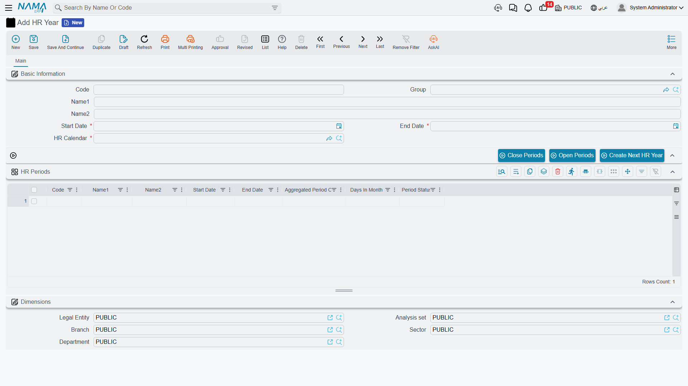
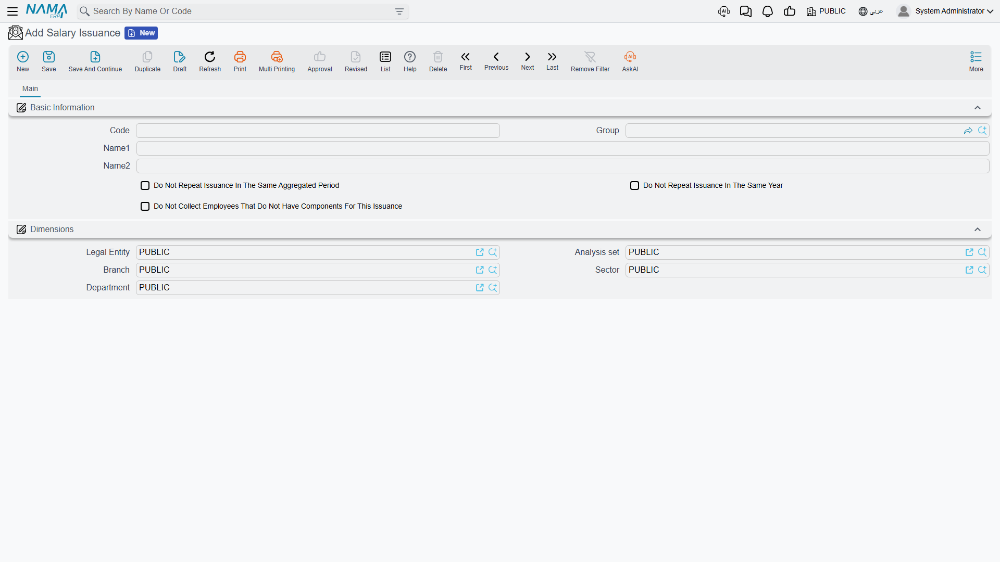

# HR Years, Periods & Salary Issuance

Before any salary can be calculated, Nama needs to know two things: **which time slice** the run belongs to, and **which pay stream** it belongs to. The first question is answered by the payroll calendar — HR Year and HR Period. The second is answered by a small but easily misunderstood setting called Salary Issuance.

## The payroll calendar: HR Year and HR Period

An **HR Year** (سنة رواتب) is a payroll-only calendar year — it is deliberately separate from the accounting fiscal year, because a company's pay cycle doesn't have to line up with its financial year. You find it at **Payroll > Settings > HR Year**.

| Field | Purpose |
|---|---|
| Code / Group / Arabic Name / English Name | Identification, as with any master file. |
| Start Date / End Date (تاريخ البداية / تاريخ النهاية) | The boundaries of the payroll year. |
| HR Calendar (تقويم الرواتب) | Which [HR Calendar](hr-calendar-and-holidays.md) this year's math runs against — a company can maintain more than one calendar, so this is where a year picks its own. |

An HR Year owns an embedded grid of **HR Periods** (فترات الرواتب) — typically twelve, one per month, though nothing forces that shape. Each period line carries its own Code, Arabic Name/English Name, Start/End Date, **Days In Month** (عدد ايام الشهر — the day-count convention used for daily-rate math), an **Aggregated Period Code** (كود الفترة المجمعة), and a **Period Status** (حالة الفترة) of either **Opened** (مفتوح) or **Closed** (مغلقة).

The same period record also exists as its own standalone entity at **Payroll > Settings > HR Period**, with identical fields plus a reference back to its HR Year — useful when you need to look up or report on a single period without opening the whole year.

::: tip Aggregated Period Code
Two ordinary periods can share the same **Aggregated Period Code**, which lets reports and aggregated documents roll several periods up under one label — for example, treating two half-month runs as a single reporting month. It doesn't change how salary is calculated; it only affects how periods are grouped afterwards.
:::

Three actions sit on the HR Year screen:

- **Close Periods** (غلق الفترات) — locks the selected periods (their status becomes Closed), which blocks further salary generation against them. This is the safety switch once a month's payroll is finalized.
- **Open Periods** (فتح الفترات) — reverses that, for the rare case a closed period needs a correction.
- **Create Next HR Year** (إنشاء سنة الرواتب التالية) — rolls a brand-new year (and its periods) forward automatically, so payroll admins don't rebuild the calendar from scratch every year.

## Salary Issuance: a payroll-stream tag, not a payment

::: warning Salary Issuance does not pay anyone
A **Salary Issuance** (صرفية راتب, **Payroll > Settings > Salary Issuance**) does **not** post accounting and does **not** move money. It is a **classifier — a tag on a stream of pay** that lets the same period produce more than one parallel salary run. Think of it as a label, not a payment step; the money still flows entirely through the salary sheet and salary document described in [How Salary Is Calculated](../concepts/hr-salary-engine.md).
:::

Why would one period need more than one stream? A common case: a company runs its main monthly salary under one issuance ("Main Salary"), and a separate commissions or bonus run for the same month under a second issuance ("Commissions"). Both target the same HR Period, but they generate independent salary sheets and salary documents, and each employee's [salary component lines](employee-hr-information.md) can be tagged so they only feed the issuance they belong to.

Beyond the identification fields (Code, Group, Arabic Name, English Name), an issuance carries three repeat-control flags whose whole job is to stop a stream from accidentally running twice:

| Flag | What it prevents |
|---|---|
| Do Not Repeat Issuance In The Same Aggregated Period (عدم تكرار الصرفية خلال نفس فترة الرواتب المجمعة) | Generating this issuance more than once for periods sharing the same Aggregated Period Code. |
| Do Not Repeat Issuance In The Same Year (عدم تكرار الصرفية خلال نفس السنة) | Generating this issuance more than once anywhere within the same HR Year. |
| Do Not Collect Employees That Do Not Have Components For This Issuance (عدم تجميع الموظفين الذين ليس لهم مفردات لهذه الصرفية) | Pulling in employees who have no salary component lines tagged for this issuance at all — keeps a "Commissions" run, say, from collecting every employee in the company. |

When a salary sheet is generated, it is built for one **HR Period + Issuance** combination at a time — which is exactly what makes parallel streams possible without them colliding.

## Putting it together

A typical year looks like this: an HR Year "2026" is created (via Create Next HR Year from 2025), carrying twelve HR Periods, January through December, all tied to one HR Calendar. Every month, payroll runs a salary sheet for that month's period under the "Main Salary" issuance; a separate team runs a second salary sheet for the same period under a "Commissions" issuance, restricted to sales staff. Once a month's numbers are confirmed, its period is closed, so no further generation can touch it by accident.

## Related pages

- **[How Salary Is Calculated](../concepts/hr-salary-engine.md)** — the full five-step pipeline that a salary sheet actually runs.
- **[HR Calendar, Holidays & Weekends](hr-calendar-and-holidays.md)** — the calendar an HR Year points to.
- **[Employee HR Information](employee-hr-information.md)** — where per-employee component lines are tagged with an issuance.
