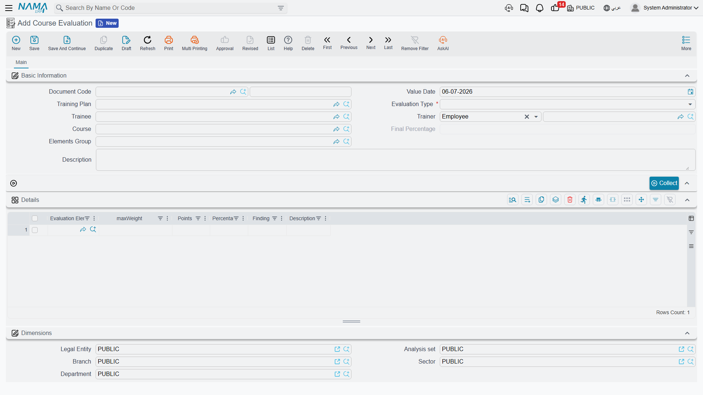

# Course Evaluation

[Employee Evaluation](../performance/employee-evaluation.md) rates ongoing staff performance against a catalog of scored criteria. A **Course Evaluation** (تقييم دورة تدريبية) applies that exact same scoring mechanism to training, right after a course wraps up — except here the subject being rated can be the **course** itself, the **student** who took it, or the **instructor** who delivered it. It draws on the same **Evaluation Element** (عنصر تقييم) catalog described on the Employee Evaluation page, with a set of training-specific weight overrides layered on top.

## Where to find it

| Screen | Menu path |
|---|---|
| Course Evaluation | Human Resources > Training > Course Evaluation |
| Evaluation Element (the shared catalog) | Human Resources > Main > Evaluation Element |
| Evaluation Elements Group | Human Resources > Training > Evaluation Elements Group |

## Evaluation Element — the training-specific angles

The Evaluation Element catalog is fully described on the [Employee Evaluation](../performance/employee-evaluation.md) page — a **Default Weight**, an **Applied For** position, and a **Ranges** grid that turns a raw score into a qualitative Finding. Alongside the five staff-appraisal angles (Upper/Lower/Peer/Self/External), the same element record carries a second block of angles reused specifically by training:

| Field (English) | Arabic | Notes |
|---|---|---|
| Used In Course Evaluation | يستخدم في تقييم الدورة التدريبية | Makes this element selectable when the evaluation's subject is the course itself. |
| Course Evaluation Rate | نقاط العنصر | The weight this element is worth when scored as part of a course-subject evaluation, overriding the Default Weight. |
| Used In Student Evaluation | يستخدم في تقييم المتدربين | Makes this element selectable when the subject is a student. |
| Student Evaluation Rate | نقاط العنصر | The weight this element is worth when scored as part of a student-subject evaluation. |
| Used In Instructor Evaluation | يستخدم في تقييم المدرب | Makes this element selectable when the subject is an instructor. |
| Instructor Evaluation Rate | نقاط العنصر | The weight this element is worth when scored as part of an instructor-subject evaluation. |

Only elements catalogued this way — and Evaluation Elements Groups scoped to training — are offered on a Course Evaluation's own Details grid and Elements Group field, so the two modules' criteria never get mixed up on screen even though they share one catalog.

## Course Evaluation — scoring it

A Course Evaluation's header starts with an **Evaluation Type** (نوع التقييم): **Training Course**, **Student**, or **Instructor** — which of the three is being rated. What else is required on the header follows from that choice: pick Training Course and the **Course** field becomes mandatory; pick Student or Instructor and the **Trainee** field is required instead. A **Trainer** field is always available too, pointing to either an employee or an outside training provider — the same internal/external distinction a Training Course itself can carry. A **Training Plan** link ties the evaluation back to the plan the course belongs to, when there is one.

| Field (English) | Arabic | Notes |
|---|---|---|
| Evaluation Type | نوع التقييم | Training Course, Student, or Instructor. |
| Trainee | المتدرب | Required unless Evaluation Type is Training Course. |
| Trainer | المدرب | An employee or a third-party training provider. |
| Course | الدورة التدريبية | Required when Evaluation Type is Training Course. |
| Elements Group | مجموعة نقاط التقييم | An optional bundle of elements to draw from, scoped to training. |
| Final Percentage | النسبة النهائية | The rolled-up result across every scored element. |

The Details grid can be populated two ways. Choosing an **Elements Group** copies in every element it bundles, along with its remark, in one step. Clicking **Collect** (تجميع) instead pulls in the training-catalog elements directly, without going through a group. Either way, each Details row carries the **Evaluation Element**, a computed **Max Weight**, the **Points** actually scored, the resulting **Percentage**, and a **Finding** — the qualitative label matched against the element's own Ranges, exactly as on Employee Evaluation.

Max Weight is where the training-specific rates from the element catalog come in: it starts from the element's Default Weight, then gets overridden by whichever rate matches this evaluation's own Evaluation Type — the Course Evaluation Rate for a Training Course subject, the Student Evaluation Rate for a Student subject, or the Instructor Evaluation Rate for an Instructor subject (falling back to Default Weight if that particular rate is left empty).

::: tip A worked example
Suppose Evaluation Type is set to **Training Course**, and the Details grid includes "Course Content Quality" — Default Weight 20, but with a Course Evaluation Rate of 30 set on the element itself. Because this record's Evaluation Type is Training Course, that element's Max Weight here becomes 30, not 20. A score of 27 points works out to 90%; if that element's own Ranges say "80 and above = Excellent," its Finding shows as **Excellent**.
:::

## Related pages

- **[Training Courses & Plans](training-courses-and-plans.md)** — the course, plan, enrollment, and closing records a Course Evaluation typically follows.
- **[Employee Evaluation](../performance/employee-evaluation.md)** — the shared Evaluation Element catalog and its staff-appraisal angles.
