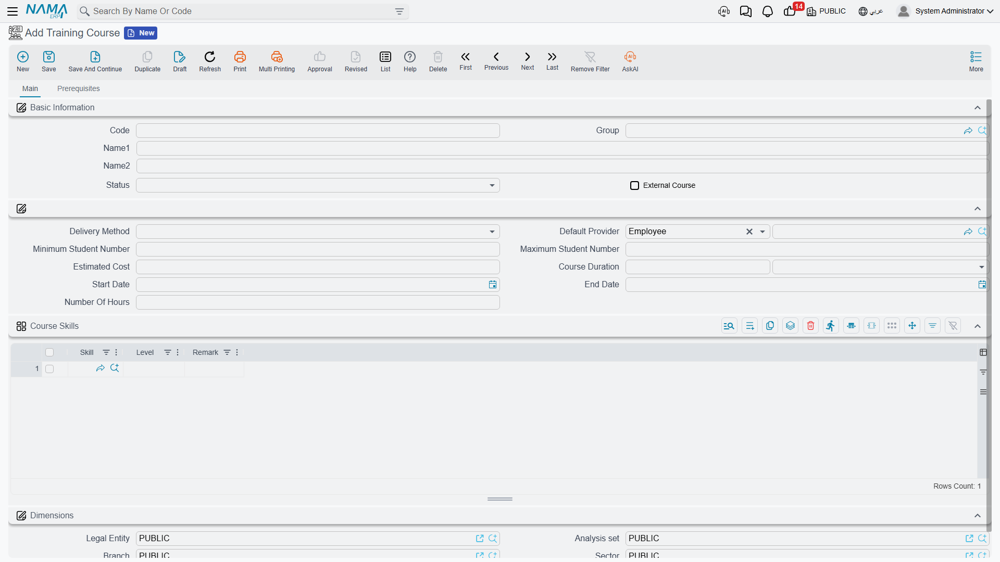
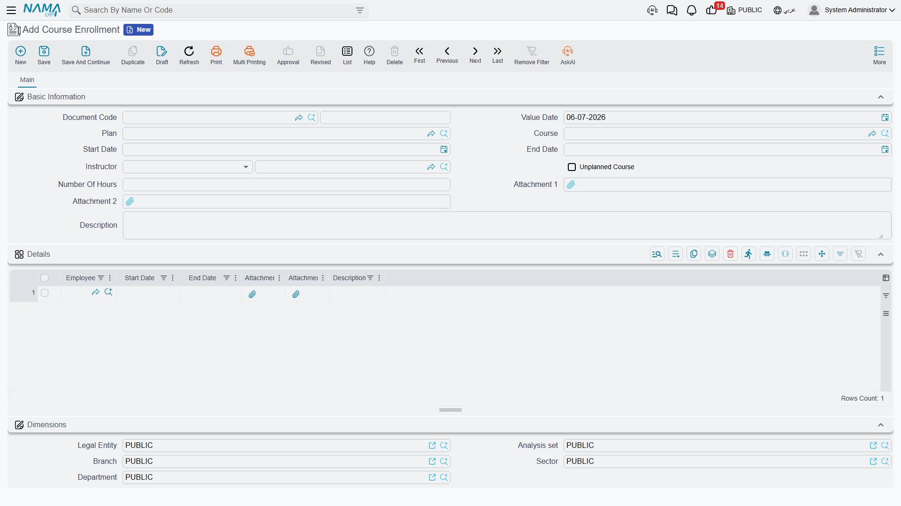

# Training Courses & Plans

Before anyone can be trained, there has to be something to train them *in*. A **Training Course** (دورة تدريبية) is that catalog entry — a reusable definition of a course, independent of who ends up taking it or when. A **Training Plan** (خطة تدريب) is what turns the catalog into a schedule: which employees need which skills, and which courses will get them there. **Course Enrollment** (تسجيل المتدربين بدورة) then records the actual delivery — who showed up, with which instructor, on which dates — and **End Training Course** (إنهاء دورة تدريبية) closes out one employee's participation, recording the skill level they actually reached. This page walks through all four, in the order a course's life normally follows.

## Where to find them

| Screen | Menu path |
|---|---|
| Training Course | Human Resources > Training > Training Course |
| Training Plan | Human Resources > Training > Training Plan |
| Course Enrollment | Human Resources > Training > Course Enrollment |
| End Training Course | Human Resources > Training > End Training Course |

## Training Course — the catalog entry

A Training Course is defined once and reused across every plan and enrollment that needs it: a **Code**, **Group**, Arabic and English name, and a **Status** of Inactive, Active, or Proposed — so a course can be drafted and reviewed before it is opened for enrollment.

| Field (English) | Arabic | Notes |
|---|---|---|
| External Course | دورة تدريبة خارجية | Ticks on when the course is run by an outside training provider rather than in-house. |
| Delivery Method | طريقة التدريس | Instructor, Self-Study, or On Job Training. |
| Default Provider | مقدم الدورة الأساسي | Who normally delivers it — an employee by default, though an external course can point to a third party instead. |
| Minimum / Maximum Student Number | أدنى / أقصى عدد للمتدربين | The minimum can never be set higher than the maximum — the course rejects that combination outright. |
| Estimated Cost | التكلفة التقديرية | The planning figure a Training Plan pulls in when it schedules the course (see below). |
| Course Duration | مدة الدورة | A value plus a unit (days, hours, and so on) describing how long a single run of the course takes. |
| Start Date / End Date | تاريخ البداية / تاريخ النهاية | The course definition's own default dates — a particular Course Enrollment can still run on different dates. |
| Number Of Hours | عدد الساعات | Total contact hours the course represents. |

Two grids round out the definition, on separate tabs:

- **Course Skills** (المهارات المكتسبة), on the Main tab — the skills this course is meant to build, each with a target **Level** (from Not Found up through Very Weak, Weak, Good, Very Good, to Excellent) and an optional remark. A skill can only appear once per course; adding the same skill twice is rejected. This grid is what a Training Plan later searches to match a course to a need (see **Collect Courses** below).
- **Prerequisites**, on its own tab — the skills (and levels) a trainee is expected to already have going in, catalogued alongside the course for whoever is planning enrollments.

::: tip Status vs. Delivery Method
Status tracks the course record's own lifecycle (still being proposed, or open and active); Delivery Method describes how it is taught. A course can be Active and still be Self-Study or On Job Training — neither field implies the other.
:::

## Training Plan — matching people to courses

A Training Plan is where the actual need gets written down, before any course is scheduled against it: a **Training Director** and **Training Coordinator**, a date range, and running **Estimated Cost** / **Actual Cost** totals.

The plan's **Skills** grid is the starting point — one row per **Employee** and the **Skill** they need to develop, with an **Expected** skill level (the target) sitting next to an **Actual** level that starts out empty and only gets filled in once the training is actually completed (see End Training Course below).

Clicking **Collect Courses** (تجميع الدورات) turns that wishlist into a schedule: for every Skills row, it searches the course catalog for a Training Course whose own Course Skills grid lists that same skill at that level or higher, and adds a matching row to the plan's **Details** grid — the Employee, the Course it found, a Status of **Not Started**, and that course's Estimated Cost, which also rolls into the plan's own Estimated Cost total.

| Details column (English) | Arabic | Notes |
|---|---|---|
| Employee | الموظف | Who is being scheduled. |
| Course | الدورة التدريبية | Which catalog course was matched (or picked directly). |
| Status | الحالة | Not Started, In Progress, Finished Successfully, Finished UnSuccessfully, or Terminated. |
| Cost \| Estimated / Actual | التكلفة \| المخطط / الفعلي | The course's planning cost next to what it actually cost. |
| Start Date / End Date \| Estimated / Actual | تاريخ البداية / تاريخ النهاية \| المخطط / الفعلي | Planned dates alongside the dates Course Enrollment and End Training Course later stamp in. |

Nothing about a Details row is locked to what Collect Courses found — a course can just as easily be added to the grid by hand, without a matching Skills row at all.

::: tip A worked example
Suppose a Skills row calls for **Ahmed** to reach **Level 5 (Very Good)** in "Negotiation." Collect Courses searches the catalog and finds an "Advanced Negotiation" course whose own Course Skills grid lists Negotiation at Level 6 (Excellent) — a match, since Excellent is at or above the Level 5 target. A Details row is added: Ahmed, Advanced Negotiation, Not Started, with that course's Estimated Cost added to the plan's running total.
:::

## Course Enrollment — delivering a course

Where the Training Plan schedules a course, a Course Enrollment records one actual delivery of it — a specific **Instructor**, running from a **Start Date** to an **End Date**, with one or more employees attending. Picking a **Plan** on the header pre-fills the Start Date and End Date from that plan automatically; a course delivered outside any plan is simply marked **Unplanned Course** instead of being tied to one.

The **Details** grid holds one row per attending **Employee**, each with its own Start Date and End Date — these default from the header dates, and if the grid holds exactly one row, changing the header's End Date updates that row's End Date too. The header's End Date must always fall after its Start Date.

Saving the enrollment reaches back into the Training Plan: for every employee/course pair it finds a matching Details line on the plan, stamps in the enrollment's Start Date as that line's **Actual Start Date**, and — if the line was still sitting at Not Started — bumps its Status to **In Progress**. In other words, enrolling people is what tells the plan that a scheduled course has actually begun.

## End Training Course — closing an employee's participation

An End Training Course record closes out one **Employee**'s run through one **Course** on one **Training Plan** — a **Status** (the same Not Started / In Progress / Finished Successfully / Finished UnSuccessfully / Terminated set used on the plan), a **Final Percentage**, an **End Date**, and a **Skill Development** grid listing each skill the employee actually worked on, with the **Level** they reached.

Saving it feeds two things back into the Training Plan in one step:

1. It finds the matching Details line (same Employee, same Course) and copies in this document's End Date as the line's **Actual End Date**, along with its Status.
2. For every skill in this document's Skill Development grid, it finds the plan's matching Skills row (same Employee, same Skill) and raises that row's **Actual** level to the level just achieved — but only if it is higher than whatever was recorded there already, so a later, weaker result never overwrites a stronger one.

::: tip Continuing the example
Ahmed finishes "Advanced Negotiation," and his End Training Course record shows him reaching **Level 6 (Excellent)** in Negotiation — one level above the Level 5 the plan originally called for. The plan's Skills row for Ahmed/Negotiation updates its Actual level to Excellent, even though only Very Good was required, because End Training Course only ever raises the recorded level, never lowers it.
:::

## Where it goes next

A finished course is not the end of the record — it is usually followed by a **Course Evaluation**, rating either the course itself, the student, or the instructor, using the same scored-criteria mechanism the HR module uses for staff appraisals. See [Course Evaluation](hr-course-evaluation.md) for how that works.

## Related pages

- **[Course Evaluation](hr-course-evaluation.md)** — the post-course scoring that typically follows an End Training Course.
