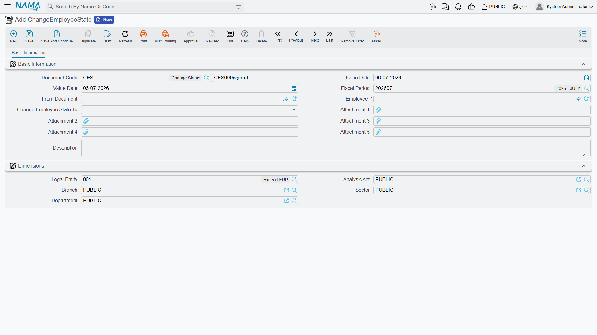

# Change Employee State

Every employee carries one working state at a time — Working, In Vacation, Suspended, Resigned, Dismissed, Pension, and a set of open-ended "Other" states a company can repurpose for its own needs. **Change Employee State** (تغير حالة موظف) is the one screen that records a change to that state directly, with the date it takes effect, independent of any other document.

**Where to find it:** Payroll > Vacations > Change Employee State.

| Field (English) | Arabic | Notes |
|---|---|---|
| Employee | الموظف | Whose state is changing. |
| Value Date | التاريخ الفعلي | The date the new state takes effect from. |
| Change Employee State To | تغير حالة الموظف إلى | The new state: `Working` (على رأس العمل), `In Vacation` (في أجازة), `Suspended` (موقوف), `Resigned` (مستقيل), `Dismissed` (تم فصله), `Pension` (على المعاش), `Appointed` (مُعين), `Offered` (بانتظار الموافقة), or one of ten free-form `Other` states a company can define its own meaning for. |
| From Document | بناءا على | Filled in automatically when this document is generated from a Vacation Document — see below. |

Committing this document does two things: it writes the employee's current state directly onto their record, and it adds a **dated state-history entry**, so the system always knows which state an employee was in on any given date in the past — not just their state today.

## Two ways this document gets created

Most of the time you never open this screen directly: a [Vacation Type](vacation-types-and-balances.md) can carry a **Change Employee State To** setting of its own (for example, flipping an employee to `In Vacation` or `Suspended`), and every [Vacation Document](vacation-documents.md) of that type generates a matching Change Employee State entry automatically for its duration, flipping the state back again on return. The **From Document** field is how a generated entry points back at the vacation document that created it.

The rest of the time — ending an unpaid leave early, marking someone `Resigned`/`Dismissed`/`Pension` outside of the [firing workflow](../end-of-service/firing-and-termination.md), or reactivating someone whose state was set to `Suspended` via a manual Change Employee State entry (often recorded alongside a [suspension document](../discipline/hr-suspension.md)) — HR opens Change Employee State directly and records the change by hand.

::: info No accounting effect
Change Employee State never touches the ledger. It exists purely to answer one question — "what was this employee's working state on this date?" — for everything else in HR and payroll to read.
:::

## What it does to payroll

That state history is not just informational — the [salary sheet](../payroll/salary-documents.md) generation step reads it for every employee before it will issue a salary document for a period. An employee has to be `Working` for some part of the period (or have a firing date that falls inside it) for the period's salary to be generated at all; a period spent entirely `Suspended`, `Resigned`, `Dismissed`, `Pension`, or in one of the `Other` states is normally excluded, unless the employee also spent part of that same period `In Vacation` under a paid/partially-paid vacation type (in which case the salary engine still treats the period as partially worked).

In practice this means recording a suspension or a return to work through Change Employee State — whether entered directly or generated automatically from a vacation document — is what tells payroll whether to include that employee in the next salary run at all.

## Where this fits

- **[HR Suspension](../discipline/hr-suspension.md)** — the disciplinary suspension document; it's related but separate — recording it does **not** by itself change the employee's state. Putting someone into the `Suspended` working state still takes a Change Employee State entry, recorded here.
- **[Salary Documents](../payroll/salary-documents.md)** — where the recorded state history is read to decide whether a salary document can be generated for an employee in a given period.
