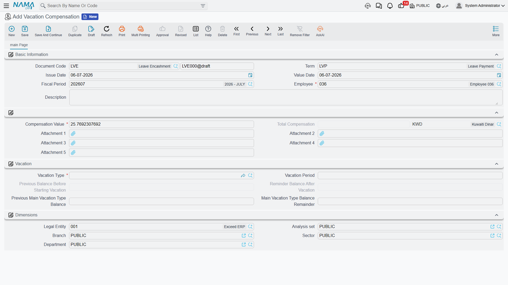

# Vacation Compensation & Transfer

Not every leave document is about an employee actually being away. This page covers four screens that instead **cash out** unused balance (**Vacation Compensation** / سند صرف بدل أجازة), **carry a balance forward into a new HR year** (**Vacation Transfer Document** / سند ترحيل أجازات), **manually correct a balance** (**Vacation Changing Document** / سند تعديل رصيد أجازة), or **convert days actually worked on a holiday/rest day into balance** (**Holidays And Rest Days Balance Compensation Document** / بدل أرصده راحات أسبوعية و عطلات رسمية). All four read and write the same balances defined in [Vacation Types & Balances](vacation-types-and-balances.md).

## Vacation Compensation: cashing out unused leave

A **Vacation Compensation** (سند صرف بدل أجازة) document pays an employee money instead of letting them take (or keep accruing) a number of leave days — the "Repaid" side of a vacation type's **Vacation Transfer Policy** (سياسة ترحيل الأجازة, see [Vacation Types & Balances](vacation-types-and-balances.md)). Unlike an ordinary vacation document, it does not send the employee away from work; it consumes balance and creates a payable amount.

**Where to find it:** Payroll > Vacations > Vacation Compensation.

| Field (English) | Arabic | Notes |
|---|---|---|
| Employee | الموظف | Who is being compensated. |
| Vacation Type | نوع الأجازة | Which balance is being cashed out; the vacation type must have a **Vacation Class** set. |
| Vacation Period | مدة الأجازة | How many days of balance this compensation covers — must be greater than zero. |
| Compensation Value | قيمة البدل | The money value of **one day** of this compensation. Can be entered directly, or — if the term/توجيه has a Compensation Calc Formula configured — calculated automatically from the employee's own salary data for the period, the same calculation engine used to price [salary components](../payroll/salary-calculation-formulas.md). |
| Total Compensation (Amount / Currency) | إجمالي البدل | `Compensation Value × Vacation Period` — the actual amount to be paid. |
| Previous Balance Before Starting Vacation / Reminder Balance After Vacation | الرصيد السابق قبل بدء الإجازة / الرصيد المتبقي بعد الاجازة | The vacation type's own balance, before and after this compensation consumes `Vacation Period` days from it. |
| Previous Main Vacation Type Balance / Main Vacation Type Balance Remainder | الرصيد السابق من نوع الإجازة الرئيسي / الرصيد المتبقي بعد الإجازة من نوع الإجازة الرئيسي | The same before/after figures for the employee's main annual balance, when the compensated type is linked to it. |

This screen requires the `humanresource-payroll` license component.

## How it's processed / what it posts

Committing a Vacation Compensation document does two things at once. First, exactly like a vacation document, it consumes `Vacation Period` days from the employee's balance for that vacation type. Second — and unlike an ordinary vacation document — it creates a **business request** that posts a real ledger entry: a debit line and a credit line, both for the **Total Compensation** amount, to whichever accounts are configured on the Vacation Compensation term/توجيه (the two sides are labeled **Debit 2** / **Credit 2** there). Editing an already-committed compensation document reissues that ledger entry with the new amount; deleting it reverses the entry and gives the days back to the balance.

## Vacation Transfer Document: carrying balances into a new HR year

At the close of an HR year, someone has to decide what happens to every employee's leftover balance: does it disappear, get migrated into the new year, or need repaying (via Vacation Compensation, above)? The **Vacation Transfer Document** (سند ترحيل أجازات) is the batch tool that performs the "migrate into the new year" step for every vacation type whose Vacation Transfer Policy is `Migrated` (ترحيل).

**Where to find it:** Payroll > Vacations > Vacation Transfer Document.

| Field | Arabic | Notes |
|---|---|---|
| From Year | من سنة | The HR Year being closed out. |
| To Year | إلى سنة | The HR Year balances are carried into. Must be a later year than **From Year**. |
| Value Date | التاريخ الفعلي | Must equal **To Year**'s start date. |
| Details — Employee | التفاصيل — الموظف | The list of employees to run the transfer for. |

Saving the document expands that employee list into a computed **Lines** grid — one row per employee/vacation-type combination:

| Field | Arabic | Meaning |
|---|---|---|
| Assigned Balance | الرصيد المخصص | The employee's entitlement for that vacation type, as of the transfer. |
| Reminder From Previous Year | الرصيد المتبقي من العام الماضى | How much of the old year's unused balance survives the move — capped by the vacation type's migration limit, and by the employee's years of service. |
| Total Balance | الرصيد الكلى | What lands in the new year: `Assigned Balance` for non-migrating types, or `Assigned Balance + Reminder From Previous Year` for `Migrated` types. |

::: warning Egypt-style calendar years only
This document only works when the HR module's vacation balances are calculated on a shared calendar year (the model historically used in Egypt). If the module is instead configured to calculate each employee's balance from their own individual work-start date, Vacation Transfer Document is blocked outright — that configuration carries balances forward automatically per employee instead.
:::

There is no ledger effect: this document only rewrites the vacation-balance records behind the two years — it marks the old year's balance as no longer current and plants the computed `Total Balance` as the new year's opening figure.

## Vacation Changing Document: correcting a balance by hand

Sometimes a balance is simply wrong — a manual seniority bonus, a correction after a payroll audit, an ad-hoc grant of extra days — and there is no request/document workflow that fits. The **Vacation Changing Document** (سند تعديل رصيد أجازة) exists for exactly that: a direct, audited adjustment to one or many employees' balances.

**Where to find it:** Payroll > Vacations > Vacation Changing Document.

| Field | Arabic | Notes |
|---|---|---|
| Added Balance | الرصيد المضاف | A header-level default adjustment (positive to add days, negative to deduct) applied to every line that doesn't override it. |
| Work Start Date (Unified) | تاريخ بدء العمل (موحد) | Only relevant when vacations are calculated from each employee's individual work-start date — sets a single work-start date across all lines at once. |
| Employee range | — | A from/to filter (branch, department, sector, job position, and more) for quickly pulling many employees into the grid instead of adding them one by one. |

**Vacations grid** (one line per employee + vacation type):

| Field | Arabic | Meaning |
|---|---|---|
| Employee / Vacation Type | الموظف / نوع الأجازة | Whose balance, and which vacation type. |
| Work Start Date | تاريخ بدء العمل | Per-line work-start date (individual-start-date mode only). |
| Added Balance | الرصيد المضاف | The per-line adjustment, defaulting from the header value above. |
| Current Balance / Current Consumed / Current Remainder | الرصيد الحالي / المستهلك الحالى / المتبقي الحالى | The balance figures **before** this document, read live from the employee's vacation balance record. |
| New Balance / New Remainder | الرصيد المعدل / المتبقي المعدل | `Current Balance + Added Balance`, and the corresponding new remainder. |

There is no ledger effect here either — this document writes straight to the employee's vacation balance record; it does not touch accounting.

## Holidays And Rest Days Balance Compensation Document

Employees who are called in to work on an official holiday or their weekly rest day are, in effect, owed something back. The **Holidays And Rest Days Balance Compensation Document** (بدل أرصده راحات أسبوعية و عطلات رسمية) scans an employee's attendance over a period and converts each holiday or rest day they actually clocked in on into vacation balance.

**Where to find it:** Payroll > Vacations > Holidays And Rest Days Balance Compensation Document.

| Field | Arabic | Notes |
|---|---|---|
| From Date / To Date | من تاريخ / إلى تاريخ | The attendance period to scan. |
| Details — Employee | التفاصيل — الموظف | Which employees to scan. |
| Details — Attendance Holidays Count | عدد أيام حضور عطلات رسمية | Days in the period marked as an official holiday where the employee still has an actual clock-in/clock-out recorded — computed automatically, not typed in. |
| Details — Attendance Rest Days Count | عدد أيام حضور راحات أسبوعية | The same, but for weekly rest days (not also a holiday). |

Two settings on the document's term/توجيه decide **where** those counted days land:

| Term setting | Arabic | Meaning |
|---|---|---|
| Holidays Compensation Vacation Type | نوع أجازة لبدل أيام العطلات الرسمية | The vacation type credited for each counted holiday day. |
| Rest Days Compensation Vacation Type | نوع أجازة لبدل أيام الراحة | The vacation type credited for each counted rest day. |
| Recalculate Employee Attendance Lines | إعادة حساب الحضور والإنصراف النظامي | Re-runs the attendance calculation for the period before counting, so the figures reflect the latest punches/corrections. |

::: warning Requires system-calculated attendance
This document cannot be used when the HR module is configured for fully manual attendance entry — it relies on the system's own calculated attendance lines to know which days were holidays/rest days and whether the employee actually clocked in.
:::

Like the Vacation Changing Document, this is a balance-only mechanism — it does not generate a ledger entry; the value it creates is *days*, not money, and it lands in whichever vacation type the term settings point to. An employee whose vacation type has `Vacation Transfer Policy = Repaid` can later cash those days out with the Vacation Compensation document described above.

## Where this fits

- **[Vacation Types & Balances](vacation-types-and-balances.md)** — the vacation type rules (Transfer Policy, Vacation Class, balance limits) all four screens on this page read from or write into.
- **[Vacation Documents](vacation-documents.md)** — the request/document pair and aggregations that consume balance the ordinary way, by sending someone on leave.
