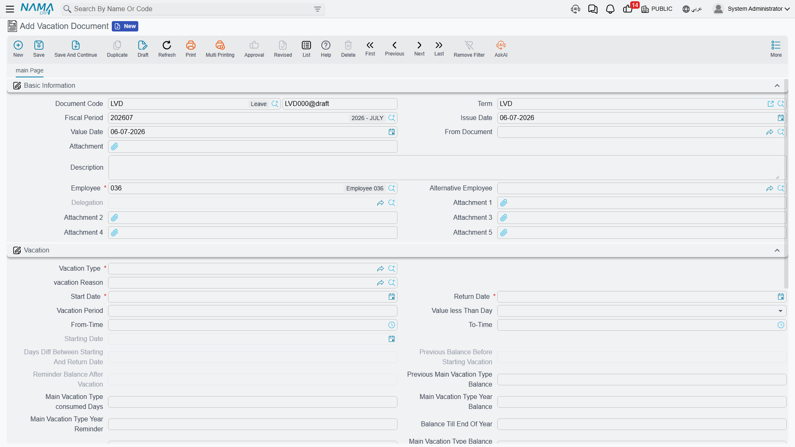
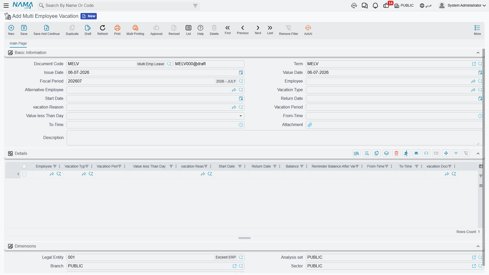

# Vacation Documents

This page covers the screens that actually put an employee on leave: the **Vacation Request** (طلب أجازة) and **Vacation Document** (سند أجازة) pair, the **Vacation Plan Document** (مستند خطة أجازة) used to schedule leave ahead of time, and the two batch screens that aggregate vacations across many employees or many segments — **Multi Employee Vacation** (سند أجازة مجمع لأكثر من موظف) and **Aggregated Vacation Document** (سند أجازه مجمع). All of them read their rules from the [Vacation Type](vacation-types-and-balances.md) the leave belongs to.

## The request → document flow

A **Vacation Request** and a **Vacation Document** follow the general request/document pattern used across HR — see **[HR Requests, Documents & Aggregated Documents](../concepts/hr-requests-and-documents.md)** for the full explanation of that pattern. In short:

1. HR (or the employee via self-service) enters a **Vacation Request**, choosing the employee, the vacation type, and the dates. It starts in state Initial (مبدئي).
2. A reviewer clicks **Accept** (قبول) or **Reject** (رفض).
3. If accepted, clicking **Generate Vacation Doc** (إنشاء سند أجازة) on the request creates the matching **Vacation Document**, which is what actually consumes the balance. The request flips to Processed (تمت معالجته).

**Where to find them:** Payroll > Vacations > Vacation Request / Vacation Document.

### Key fields on the Vacation Document

| Field (English) | Arabic | Notes |
|---|---|---|
| Vacation Type | نوع الأجازة | Which [vacation type](vacation-types-and-balances.md) this leave is taken under — drives every balance and pay rule that follows. |
| Vacation Reason | سبب الأجازة | A Leave Reason catalog entry; some vacation types require it (`Reason Is Required`). |
| Starting Date | تاريخ مباشرة العمل | The date work actually stops for this leave. |
| Return Date | تاريخ العودة | The date the employee is expected back. |
| Vacation Period | مدة الأجازة | The computed length of the leave, in days. |
| Value less Than Day | قيمة الاجازة اقل من يوم | For a partial day off: Normal, Half Day (نصف يوم), or Quarter Day (ربع يوم). |
| From Time / To Time | من وقت / إلى وقت | Used together with the half/quarter-day setting for a partial-day leave. |
| Main Vacation Type consumed Days | الرصيد المستهلك من نوع الإجازة الرئيسي خلال العام قبل بدء الإجازة | How many days of the main balance were already used this year, before this leave. |
| Main Vacation Type Balance Remainder | الرصيد المتبقي بعد الإجازة من نوع الإجازة الرئيسي | What is left of the balance once this leave is deducted. |
| Balance Till End Of Year | الرصيد حتى نهاية العام | A projection of the balance through year end, useful for planning further leave. |
| Alternative Employee | الموظف البديل | Who covers for the employee while away. |
| Delegation | التفويض | An optional formal delegation of the employee's authority/tasks for the duration of the leave. |
| From Document | بناءا على | Points back to the Vacation Request the document was generated from, when applicable. |

The document also has a small "contact info during vacation" block (address, mobile, email) so HR can reach the employee if genuinely needed while they are away.

## How it's processed

A vacation document does not post to the general ledger — the accounting effect of an employee's salary is worked out later, on the salary document for the period. What a vacation document *does* do is register the leave against the employee's attendance record for those dates, and against their balance. When the [salary engine](../concepts/hr-salary-engine.md) later calculates that period, it reads the recorded leave to decide whether those days are paid as normal, paid partially, or unpaid — exactly as configured on the vacation type (`Without Salary...` / `Deduct Percentage From Salary Components`). In other words: the vacation document's effect surfaces in attendance and then in salary, not in the ledger directly.

## Planning leave ahead of time: Vacation Plan Document

Before an employee actually requests leave, HR sometimes needs to plan it — especially for the kind of annual "home leave" common in Gulf employment contracts, where a trip ticket may be part of the package. The **Vacation Plan Document** (مستند خطة أجازة) exists for that planning step, separate from the request/document pair above; saving a plan does not consume any balance.

**Where to find it:** Payroll > Vacations > Vacation Plan Document.

| Field | Arabic | Notes |
|---|---|---|
| Employee | الموظف | Whose leave is being planned. |
| Vacation Type | نوع الأجازة | The planned leave's type. |
| Start Date / Return Date | تاريخ البداية / تاريخ العودة | The planned dates. |
| Requested Vacation Period | مدة الاجازة المطلوبة | How many days are planned. |
| Vacation Balance From Contract | مدة الاجازة طبقاً للتعاقد | The entitlement the employee's contract promises, for comparison against what is actually planned/available. |
| Ticket Type | نوع التذكرة | Cash (نقدي), Insured By Company (تتحملها الشركة), or Without Ticket (بدون تذكرة) — whether a travel ticket is part of this planned leave, and who pays for it. |
| Relation Type | نوع الربط | When a ticket also covers a family member, which relation they are (spouse, child, parent, and so on). |

## The two aggregation axes

Nama offers two different batch screens for vacations, and they aggregate along **completely different axes** — do not confuse them. This distinction is explained in general terms in [HR Requests, Documents & Aggregated Documents](../concepts/hr-requests-and-documents.md); here is what it means specifically for vacations.

### Multi Employee Vacation — many employees, one action

**Multi Employee Vacation** (سند أجازة مجمع لأكثر من موظف) sends **several different employees** on leave in one batch — the same kind of action, applied to a group. Fill the header's convenience fields (employee, vacation type, dates, reason) and each entry drops a line into the grid below; you can also add/edit lines directly. **Each line spawns its own ordinary Vacation Document** when the batch is saved, and each line tracks its own balance fields (`Balance`, `Reminder Balance After Vacation`) independently, because different employees have different balances.

**Where to find it:** Payroll > Vacations > Multi Employee Vacation.

### Aggregated Vacation Document — one employee, many segments

**Aggregated Vacation Document** (سند أجازه مجمع) is the opposite idea: **one employee's** long leave, split across several **segments** — for example, part of a long absence drawn from the annual balance and the remainder recorded as unpaid. Each grid line is a segment with its own vacation type, dates, and period (`Actual Vacation Period` / مدة الأجازة الفعلية can differ from the requested period), and — just like the multi-employee screen — **each line still spawns its own single Vacation Document** underneath.

**Where to find it:** Payroll > Vacations > Aggregated Vacation Document.

::: warning Edit the batch, not the generated singles
In both screens, the individual Vacation Documents are system-generated and system-managed. Adding or removing a batch line creates or deletes its single document automatically. If you need to change something about one employee's leave (Multi Employee Vacation) or one segment (Aggregated Vacation Document), edit that line in the batch — editing the generated single document directly puts it out of step with its parent batch.
:::

| Axis | One grid line means | Screen | Arabic |
|---|---|---|---|
| Many employees | The same leave, for a different employee each line | Multi Employee Vacation | سند أجازة مجمع لأكثر من موظف |
| One employee, many segments | Part of one long leave, split by balance/type | Aggregated Vacation Document | سند أجازه مجمع |

## Where this fits

- **[Vacation Types & Balances](vacation-types-and-balances.md)** — the rules every document here consumes.
- **[HR Requests, Documents & Aggregated Documents](../concepts/hr-requests-and-documents.md)** — the general request → document → aggregated pattern this page applies.
- **[Vacation Compensation & Transfer](vacation-compensation-and-transfer.md)** — cashing out, transferring, or adjusting the balances these documents consume.
