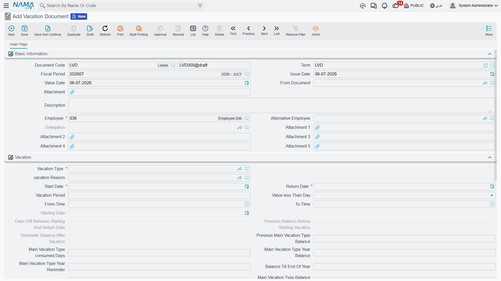
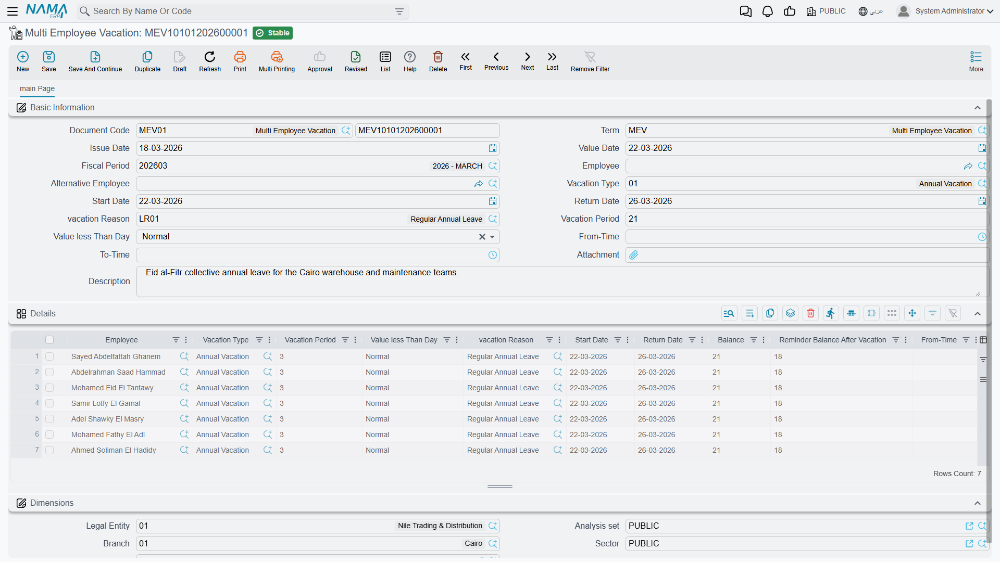

# Vacation Documents

This page covers the screens that actually put an employee on leave: the **Vacation Request** (طلب أجازة) and **Vacation Document** (سند أجازة) pair, the **Vacation Plan Document** (مستند خطة أجازة) used to schedule leave ahead of time, and the two batch screens that aggregate vacations across many employees or many segments — **Multi Employee Vacation** (سند أجازة مجمع لأكثر من موظف) and **Aggregated Vacation Document** (سند أجازه مجمع). All of them read their rules from the [Vacation Type](vacation-types-and-balances.md) the leave belongs to.

## The request → document flow

A **Vacation Request** and a **Vacation Document** follow the general request/document pattern used across HR — see **[HR Requests, Documents & Aggregated Documents](../concepts/hr-requests-and-documents.md)** for the full explanation of that pattern. In short:

1. HR (or the employee via self-service) enters a **Vacation Request**, choosing the employee, the vacation type, and the dates. It starts in state Initial (مبدئي).
2. A reviewer clicks **Accept** (قبول) or **Reject** (رفض).
3. If accepted, clicking **Generate Vacation Doc** (إنشاء سند أجازة) on the request creates the matching **Vacation Document**, which is what actually consumes the balance. The request flips to Processed (تمت معالجته).

**Where to find them:** Payroll > Vacations > Vacation Request / Vacation Document.

### Key fields on the Vacation Document

| Field (English) | Arabic | Notes |
|---|---|---|
| Vacation Type | نوع الأجازة | Which [vacation type](vacation-types-and-balances.md) this leave is taken under — drives every balance and pay rule that follows. |
| Vacation Reason | سبب الأجازة | A Leave Reason catalog entry; some vacation types require it (`Reason Is Required`). |
| Starting Date | تاريخ مباشرة العمل | The date work actually stops for this leave. |
| Return Date | تاريخ العودة | The date the employee is expected back. |
| Vacation Period | مدة الأجازة | The computed length of the leave, in days. |
| Value less Than Day | قيمة الاجازة اقل من يوم | For a partial day off: Normal, Half Day (نصف يوم), or Quarter Day (ربع يوم). |
| From Time / To Time | من وقت / إلى وقت | Used together with the half/quarter-day setting for a partial-day leave. |
| Main Vacation Type consumed Days | الرصيد المستهلك من نوع الإجازة الرئيسي خلال العام قبل بدء الإجازة | How many days of the main balance were already used this year, before this leave. |
| Main Vacation Type Balance Remainder | الرصيد المتبقي بعد الإجازة من نوع الإجازة الرئيسي | What is left of the balance once this leave is deducted. |
| Balance Till End Of Year | الرصيد حتى نهاية العام | A projection of the balance through year end, useful for planning further leave. |
| Alternative Employee | الموظف البديل | Who covers for the employee while away. |
| Delegation | التفويض | An optional formal delegation of the employee's authority/tasks for the duration of the leave. |
| From Document | بناءا على | Points back to the Vacation Request the document was generated from, when applicable. |

The document also has a small "contact info during vacation" block (address, mobile, email) so HR can reach the employee if genuinely needed while they are away.

## How it's processed

A vacation document does not post to the general ledger — the accounting effect of an employee's salary is worked out later, on the salary document for the period. What a vacation document *does* do is register the leave against the employee's attendance record for those dates, and against their balance. When the [salary engine](../concepts/hr-salary-engine.md) later calculates that period, it reads the recorded leave to decide whether those days are paid as normal, paid partially, or unpaid — exactly as configured on the vacation type (`Without Salary...` / `Deduct Percentage From Salary Components`). In other words: the vacation document's effect surfaces in attendance and then in salary, not in the ledger directly.

## Planning leave ahead of time: Vacation Plan Document

Before an employee actually requests leave, HR sometimes needs to plan it — especially for the kind of annual "home leave" common in Gulf employment contracts, where a trip ticket may be part of the package. The **Vacation Plan Document** (مستند خطة أجازة) exists for that planning step, separate from the request/document pair above; saving a plan does not consume any balance.

**Where to find it:** Payroll > Vacations > Vacation Plan Document.

| Field | Arabic | Notes |
|---|---|---|
| Employee | الموظف | Whose leave is being planned. |
| Vacation Type | نوع الأجازة | The planned leave's type. |
| Start Date / Return Date | تاريخ البداية / تاريخ العودة | The planned dates. |
| Requested Vacation Period | مدة الاجازة المطلوبة | How many days are planned. |
| Vacation Balance From Contract | مدة الاجازة طبقاً للتعاقد | The entitlement the employee's contract promises, for comparison against what is actually planned/available. |
| Ticket Type | نوع التذكرة | Cash (نقدي), Insured By Company (تتحملها الشركة), or Without Ticket (بدون تذكرة) — whether a travel ticket is part of this planned leave, and who pays for it. |
| Relation Type | نوع الربط | When a ticket also covers a family member, which relation they are (spouse, child, parent, and so on). |

## Actions on this screen

- **Generate Vacation Doc** (on the **Vacation Request**) — opens a new Vacation Document already carrying the request's employee, vacation type and reason, dates, period, contact information and dimensions, with **From Document** pointing back at the request. The request must be saved first; the new document is stored only when you save it.
- **Collect Employees** (on the **Vacation Plan Document**) — asks for a range (employee, department, analysis set, branch, sector) and fills the plan's grid with one line per matching employee, showing their contract balance for the plan's **Vacation Type** — so pick the type first. Family members marked on the employee's file as covered by the ticket are added beneath each employee. The grid is rebuilt each time.

The **Vacation Document**, **Multi Employee Vacation** and **Aggregated Vacation Document** have no buttons of their own.

## The two aggregation axes

Nama offers two different batch screens for vacations, and they aggregate along **completely different axes** — do not confuse them. This distinction is explained in general terms in [HR Requests, Documents & Aggregated Documents](../concepts/hr-requests-and-documents.md); here is what it means specifically for vacations.

### Multi Employee Vacation — many employees, one action

**Multi Employee Vacation** (سند أجازة مجمع لأكثر من موظف) sends **several different employees** on leave in one batch — the same kind of action, applied to a group. Fill the header's convenience fields (employee, vacation type, dates, reason) and each entry drops a line into the grid below; you can also add/edit lines directly. **Each line spawns its own ordinary Vacation Document** when the batch is saved, and each line tracks its own balance fields (`Balance`, `Reminder Balance After Vacation`) independently, because different employees have different balances.

**Where to find it:** Payroll > Vacations > Multi Employee Vacation.

### Aggregated Vacation Document — one employee, many segments

**Aggregated Vacation Document** (سند أجازه مجمع) is the opposite idea: **one employee's** long leave, split across several **segments** — for example, part of a long absence drawn from the annual balance and the remainder recorded as unpaid. Each grid line is a segment with its own vacation type, dates, and period (`Actual Vacation Period` / مدة الأجازة الفعلية can differ from the requested period), and — just like the multi-employee screen — **each line still spawns its own single Vacation Document** underneath.

**Where to find it:** Payroll > Vacations > Aggregated Vacation Document.

::: warning Edit the batch, not the generated singles
In both screens, the individual Vacation Documents are system-generated and system-managed. Adding or removing a batch line creates or deletes its single document automatically. If you need to change something about one employee's leave (Multi Employee Vacation) or one segment (Aggregated Vacation Document), edit that line in the batch — editing the generated single document directly puts it out of step with its parent batch.
:::

| Axis | One grid line means | Screen | Arabic |
|---|---|---|---|
| Many employees | The same leave, for a different employee each line | Multi Employee Vacation | سند أجازة مجمع لأكثر من موظف |
| One employee, many segments | Part of one long leave, split by balance/type | Aggregated Vacation Document | سند أجازه مجمع |

## Messages you may see

Most refusals on a vacation come from the rules on its [Vacation Type](vacation-types-and-balances.md), so the fix is usually there rather than on the document.

| Message | Why | What to do |
|---|---|---|
| *Document {0} Vacation Period should be less than or equal {1} for type {2}, employee {3}* — «المستند {0} مدة الأجازة يجب ان تكون اقل من او تساوي {1} للنوع {2} , الموظف {3}» | The leave is longer than the employee's remaining balance of that type. {1} is the balance available at that point, so a **0** means the balance is used up. {0} isn't always the document you are saving. When you edit or delete an earlier vacation or balance document, every later vacation is recalculated, and {0} names the later one that would run short. | Check the balance, record the extra days under another type (unpaid leave, for example), or adjust the balance (see [Vacation Compensation & Transfer](vacation-compensation-and-transfer.md)). If going over is allowed for this type, set **Allowed Days For Balance Exceed** on the vacation type, or tick **No Max Limit** to remove the check. |
| *There is another vacation doc {0} for the employee {1} in on the day {2}* — «يوجد سند أجازة آخر {0} للموظف {1} في نفس التاريخ {2}» | A saved vacation document (or, on the request screen, a saved request) for the same employee overlaps these dates. The return date counts as a working day, so one leave can start on the day the previous one returns. | Change the dates, or edit the existing document {0} instead of adding a second one. |
| *Employee {0} and vacation type {1}, start date {2} of document {3} overlapped with start date {4} and end date {5} of document {6}* — «الموظف {0} ونوع الاجازه {1}, تاريخ البداية {2} للمستند {3} متداخل مع تاريخ البداية {4} وتاريخ النهاية {5} للمستند {6}» | The same overlap, caught by the balance check for one vacation type. Document {6} already covers that period. | As above. |
| *From date {0} cant be after to date {1}* — «إلى تاريخ {1} يجب أن يكون بعد من تاريخ {0}» | The **Starting Date** is after the **Return Date**. | Correct the dates. |
| *Can not exceed the maximum number of days with this type* — «لا يمكن أن تتخطي أقصي عدد من الأيام لهذا النوع من الأجازة» | The vacation period is longer than the type's **Vacation Days (Max)**, which limits one vacation document. | Shorten the leave, or split it: an Aggregated Vacation Document (above) can put the rest under another type. |
| *To Time Could not be before From Time* — «إلي وقت لا يمكن ان يكون قبل من وقت» | A half-day or quarter-day leave has its **To Time** before its **From Time**. | Correct the times. |
| *Document {0} - employee {1} vacation type {2} can not deserve balance until work for {3} periods* — «المستند {0} - الموظف {1} لنوع الأجازة {2} لا يستحق الرصيد حتي يتم مرور {3} فترات من بداية عمله» | The employee hasn't yet worked the **Applicable After** months the type requires. | Use another type until then, or tick **Allow Vacation Before Applicable After Months** on the vacation type if early leave is permitted. |
| *Document {0} - employee {1} vacation end should be in the same hr year {2}* — «المستند {0} - الموظف {1} نهاية الأجازة لابد ان تكون في نفس السنة» | The leave starts in one HR year and ends in the next. Each year's balance is separate. The Arabic text doesn't show the year. | Split the leave at the year end into two documents, or two lines of an Aggregated Vacation Document. |
| *Document {0} - employee {1} vacation document start date {2} can not be before or equal commencement date {3}* — «المستند {0} - الموظف {1} تاريخ بداية الأجازة لا يمكن ان يكون قبل او يساوي تاريخ التعيين» | The leave starts on or before the employee's commencement date. The commencement day itself is refused too. | Start the leave after the commencement date, or correct the commencement date if it's wrong. |
| *Vacations of type {0} must be created before vacation date with at least {1} days* — «الأجازات من النوع {0} يجب أن تنشأ قبل تاريخ الأجازة ب {1} يوم على الأقل» | The vacation type has a **Minimum Period Before Vacation Request** for leaves of this length, and the document is being entered too close to the start date. The check uses the date the document was created. | Enter leave of this type earlier. If an exception is needed, change the type's rule. |
| *Vacations of type {0} must be created after vacation date with at most {1} days* — «الأجازات من النوع {0} يجب أن تنشأ بعد تاريخ الأجازة ب {1} يوم على الأكثر» | The type has a **Maximum Period After Taking Vacation**, and the document is being entered too long after the leave started. This is typical for sick leave. | Record such leave sooner, or relax the rule on the vacation type. |
| *Document {0} - you Must Create Working Start Document After Vacation {1}* — «المستند {0} - يجب عمل سند مباشرة عمل بعد الأجازة {1}» | **Calculate Vacation Balance Based On Start Date** is on in HR Configuration, and the employee's previous vacation {1} has no **Work Starting Document**. Without one the system can't tell when the employee came back. | Create the Work Starting Document for vacation {1} first. If the return date should count as the return to work for this type or reason, tick **Consider Return Date As Working Start Date** on the vacation type or the vacation reason. |
| *You did not define hr year contains date {0}* — «لم يتم تعريف سنة رواتب تحتوي علي التاريخ {0}» | No HR year covers the vacation's start date. | Define the HR year — see [HR Years, Periods & Salary Issuance](../setup/hr-years-and-periods.md). |

## Where this fits

- **[Vacation Types & Balances](vacation-types-and-balances.md)** — the rules every document here consumes.
- **[HR Requests, Documents & Aggregated Documents](../concepts/hr-requests-and-documents.md)** — the general request → document → aggregated pattern this page applies.
- **[Vacation Compensation & Transfer](vacation-compensation-and-transfer.md)** — cashing out, transferring, or adjusting the balances these documents consume.
