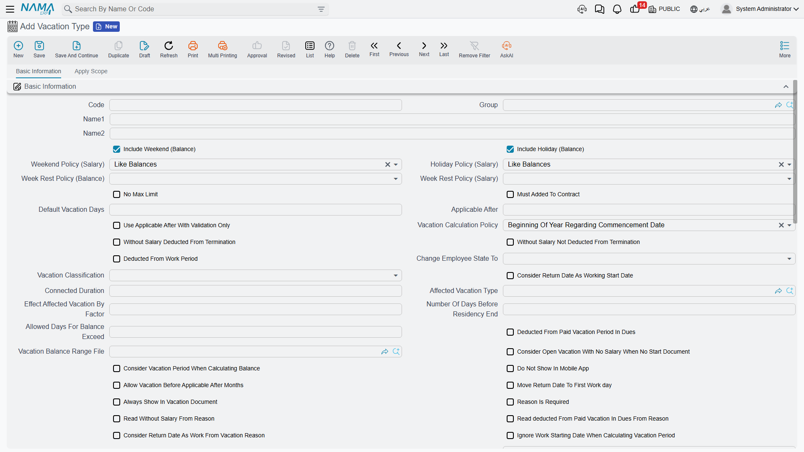
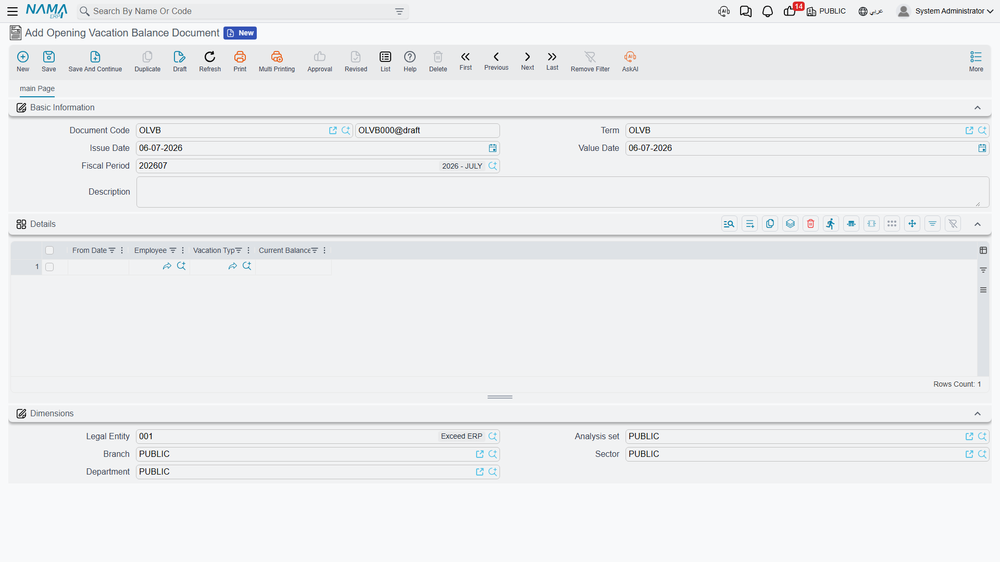

# Vacation Types & Balances

Before anyone can take a day of leave, Nama needs to know what *kind* of leave it is and how many days the employee is entitled to. That is the job of three master-data screens: the **Vacation Type** (نوع الأجازة) that defines each kind of leave and its rules, an optional **Vacation Balance Range File** (ملف أرصدة الأجازات بناءا على الخبرات) that scales the entitlement with seniority, and the **Opening Vacation Balance Document** (سند إدخال رصيد أجازة إفتتاحية) that seeds a starting balance for an employee. Everything else in the vacations area — requests, documents, plans — reads its rules from here.

## Vacation Type: the rulebook for one kind of leave

A **Vacation Type** (نوع الأجازة) is not just a label like "Annual" or "Sick." It is a small rulebook that controls how days accrue, how they are consumed, what happens to what is left over, and what the leave does to the employee's pay and service record.

**Where to find it:** Payroll > Vacations > Vacation Type.

### Classification and accrual

| Field (English) | Arabic | What it controls |
|---|---|---|
| Group | المجموعة | Optional master-group folder, for organizing many vacation types. |
| Vacation Classification (Vacation Class) | تصنيف الاجازة | `Annual Vacation` (أجازة سنوية) is the special class the rest of HR treats as *the* main leave balance (service-period math, dues liquidation, and the balance-range file all key off it); `Other 1/2/3` (أخرى 1/2/3) are free-form additional buckets you define yourself — sick leave, marriage leave, bereavement leave, and so on. |
| Vacation Calculation Policy | سياسة استحقاق الأجازة | When the year's entitlement is credited: Beginning Of Year Regarding Commencement Date (أول السنة مع الأخذ في الحسبان تاريخ التعيين), With Month Start (مع بداية الشهر), With Month End (مع نهاية الشهر), or Beginning Of Year Regardless of Commencement Date (أول السنة بغض النظر عن تاريخ التعيين). |
| Applicable After (months) | شهور العمل قبل استحقاق الأجازة | How many months of service must pass before an employee can take this leave at all. |
| Default Vacation Days | أيام الأجازة الأفتراضية | The flat day entitlement — used unless a Vacation Balance Range File is attached (see below). |
| Vacation Balance Range File | ملف أرصدة الأجازات (بناءا على الخبرات) | Reference to a seniority-scaled entitlement table, instead of one flat number. |
| Vacation Days (Max) | الحد الأقصى للأجازة (يوم) | The longest a single vacation document of this type may run. |
| Balance Days (Max) | الحد الأقصى لرصيد الاجازة (يوم) | A ceiling on the accumulated balance itself. |
| Vacation Number During Service Period | عدد مرات الاجازه خلال فترة الخدمة | Caps how many times this leave can be taken across the whole employment (useful for one-off leave types like a pilgrimage or marriage leave). |

::: tip Reading it as a business rule
Annual leave is normally set up as `Vacation Class = Annual Vacation`, credited `With Month Start` (a twelfth of the year accrues every month) with a `Default Vacation Days` of, say, 21 or 30 — or, better, pointed at a **Vacation Balance Range File** so a 2-year employee earns fewer days than a 15-year one. Sick leave is usually a separate `Other` type with its own `Applicable After` and a `Vacation Days (Max)` per episode, and no balance-range dependency at all.
:::

### What happens to leftover balance and to pay

| Field | Arabic | Meaning |
|---|---|---|
| Vacation Transfer Policy | سياسة ترحيل الأجازة | What happens to days left unused at year end: Ignored (تجاهل — simply lost), Repaid (تعويض — cashed out, see [Vacation Compensation & Transfer](vacation-compensation-and-transfer.md)), or Migrated (ترحيل — carried into next year's balance). |
| Minimum Consumed Days Per Year | الترحيل بحد أدني من المستهلك سنويا | A floor on how many days must actually be *used* before migration/repayment of the rest is allowed. |
| No Max Limit (Allow Over Balance) | السماح بتعدى رصيد الاجازة | Lets an employee go negative on this vacation type's balance. |
| Allowed Days For Balance Exceed | السماح بتعدى رصيد الاجازه بمدة (أيام) | How far into negative the balance may go, when the above is checked. |
| Without Salary Deducted From Termination | بدون مرتب و يخصم من نهاية الخدمة | Marks this as unpaid leave whose days *do* reduce the end-of-service gratuity calculation. |
| Without Salary Not Deducted From Termination | بدون مرتب ولا يخصم من نهاية الخدمة | Unpaid leave that does **not** touch the gratuity calculation. |
| Deduct Percentage From Salary Components | استقطاع نسبة من المفردات | Instead of an all-or-nothing unpaid day, deduct only a percentage from selected salary components — configured on the **Deduction Percentage Lines** grid. |
| Discard Components | المفردات الواجب تجاهلها مع الاجازه بدون مرتب | The salary components to simply skip (not deduct, not pay) while this leave type is unpaid. |

### The flag that feeds end-of-service settlement

| Field | Arabic | Meaning |
|---|---|---|
| Deducted From Work Period | تخصم من مدة العمل | When on, days taken under this vacation type do **not** count as credited service — they shrink the service period used later to compute the end-of-service gratuity. |

::: warning This flag has downstream consequences
`Deducted From Work Period` is not cosmetic. An employee with several months of this kind of leave over their career will show a shorter *net* service period the day they leave the company, and a shorter service period means a smaller gratuity. Nama's [dues liquidation](../end-of-service/dues-liquidation.md) settlement reads this flag when it works out how many service days the payout is based on — that is the whole reason this field lives on the Vacation Type rather than being decided case-by-case on each document.
:::

### A few more behaviors worth knowing

- **Always Show In Vacation Document** (تُعرض في سند الإجازة دائما) — keeps a vacation type in the picker even if the employee's balance is zero, so HR can still record it (with `No Max Limit`, for example).
- **Must Added To Contract** (يجب إضافته الى العقد) — the type only applies to employees whose employment contract explicitly lists it.
- **Change Employee State To** (تغير حالة الموظف إلى) — automatically flips the employee's working state (for example to *In Vacation*/في أجازة, or *Suspended*/موقوف) for the duration of this leave, and back again on return. This is the same state machine used by [Change Employee State](change-employee-state.md).
- **Reason Is Required** (عدم الحفظ إذا كان سبب الأجازة فارغاً) — blocks saving a vacation document of this type without a leave reason.

This module requires the `humanresource-payroll` license component.

## Vacation Balance Range File: scaling entitlement by seniority

A flat `Default Vacation Days` number is fine when every employee gets the same annual leave regardless of tenure — but many labor laws (and many company policies) grant *more* days the longer someone has worked. The **Vacation Balance Range File** (ملف أرصدة الأجازات بناءا على الخبرات, found under Human Resources > Main > Vacation Balance Range File) exists exactly for that: a small table of service-length brackets, each with its own day entitlement.

| Field | Arabic | Meaning |
|---|---|---|
| Greater Than Or Equal (Days) | اكبر من او يساوي (أيام) | The lower bound of the service-length bracket. |
| Less Than (Days) | اقل من (أيام) | The upper bound of the bracket. |
| Default Vacation Days | أيام الأجازة الأفتراضية | The entitlement that applies inside this bracket. |

For example, one range file might read: 0 up to 1,825 days of service (5 years) → 21 days; 1,825 up to 3,650 days (10 years) → 30 days; 3,650 days and beyond → 36 days. Attach this file to a Vacation Type's **Vacation Balance Range File** field and the flat `Default Vacation Days` on the type is overridden — every employee's entitlement is looked up from their own service length instead.

## Opening Vacation Balance Document: setting the starting point

When a company first switches to Nama, or when an employee joins with leave days already carried over from elsewhere, someone has to enter that number *somewhere* — otherwise Nama would assume every balance starts at zero. That is exactly what the **Opening Vacation Balance Document** (سند إدخال رصيد أجازة إفتتاحية) is for.

**Where to find it:** Payroll > Vacations > Opening Vacation Balance Document.

| Field | Arabic | Meaning |
|---|---|---|
| Period / Value Date | الفترة / التاريخ الفعلي | The HR period and date this opening balance is booked as of. |
| Details — Employee | الموظف | Which employee this line sets a balance for. |
| Details — Vacation Type | نوع الأجازة | Which vacation type's balance this line sets. |
| Details — From Date | من تاريخ | The date the balance is considered to run from (relevant to accrual policies). |
| Details — Current Balance | الرصيد الحالي | The opening number of days credited to the employee for this vacation type. |

One document can carry many lines — one per employee/vacation-type combination — so a single opening-balance run can seed an entire company at go-live.

::: info No accounting or GL effect
Unlike most Nama documents, an Opening Vacation Balance Document does not generate a business request or touch the ledger. It simply establishes the number that every later vacation document, request, and balance inquiry will be calculated against.
:::

## Where this fits

- **[Vacation Documents](vacation-documents.md)** — how vacation types and balances are actually consumed when an employee takes leave.
- **[Vacation Compensation & Transfer](vacation-compensation-and-transfer.md)** — what happens to balances under the Repaid/Migrated transfer policies.
- **[Dues Liquidation](../end-of-service/dues-liquidation.md)** — reads the `Deducted From Work Period` flag when computing the final gratuity service period.
- **[Change Employee State](change-employee-state.md)** — the same working-state values used by a vacation type's `Change Employee State To` field.
