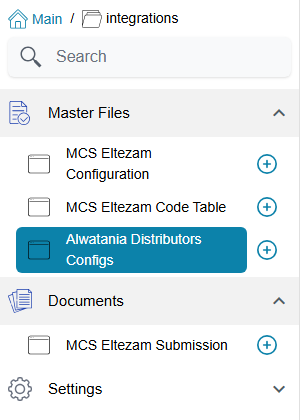

# Alwatania Distributors Integration

A company that distributes for Alwatania has to keep the distributor's platform informed: which
customers it sells to, which salesmen visit them, which items it carries, and every invoice and
return it issues. Retyping all of that on a second system is slow and error-prone. The Alwatania
Distributors integration sends it straight from Nama, so the data is entered once, in Nama, and
Nama reports it.

The integration only **sends**. Nama pushes master data and sales documents to the Alwatania
platform and reads back nothing except the platform's answer to each request (accepted, or
refused with a reason). Nothing on the platform changes records in Nama.

## What you need

- **The licence.** The integration belongs to the NaMa Integrations module (in Arabic
  «نما للتكاملات») and needs the licence `integrations-ksa-watania-samil` (short code **ADC**).
  Without it the menu entry does not appear.
- **Credentials from Alwatania.** The platform issues a token address, an API address, a client id
  and an API key (client secret). They go on one record, the
  [Alwatania Distributors Config](./alwatania-setup).
- **A task schedule or two.** There is **no Send button** anywhere. Data leaves Nama only when one
  of three ready-made actions runs, from a Task Schedule of type *Action* or from an Entity Flow.
  [Sending master data and invoices](./alwatania-sending-data) shows how to set them up.

You find the configuration under **integrations → Master Files → Alwatania Distributors Config**.

## How the data maps onto the platform

The platform has its own vocabulary: provinces, cities, branches, regions, client classes,
salesmen, clients, items and item details. Each of these is fed from a Nama master file, and the
mapping is fixed — there is nothing on the screen to map one field to another. What you control is
how you fill in the Nama records.

| Alwatania receives | From this Nama record | Notes |
|---|---|---|
| Provinces **and** Cities | Legal Entity | Every legal entity is sent twice: once as a province, and once as a city that belongs to that same province |
| Branches | Group (master group) | Each group is placed in the city of its legal entity. A client's branch is its **customer group**, so the customer groups are the ones that matter |
| Regions | Analysis Set | Placed in the city of its legal entity |
| Client Classes | Customers' Class 5 | A client's class is the **Customer Class 5** field on the customer |
| Salesmen | Employee | The salesman on the customer and on the invoice |
| Clients | Customer | See the field list below |
| Items | Item | Arabic and English names only — no cost or price is sent |
| Item Details | Item | One row per unit on the item's **Units** grid; these are the units the platform accepts on invoice lines |
| Invoices | Sales Invoice, Sales Return | A sales return is sent with the invoice type `Returned`, an invoice with `Sale` |

The platform needs the pieces in that order — a client cannot arrive before the city and branch
it belongs to — and Nama sends them in that order automatically.

### What a client carries

For each customer Nama sends its Arabic and English names, its legal entity (as the city), its
Customer Class 5, its tax registration number, its commercial registration number, a phone number (the
mobile, or Phone 1 when the mobile is empty), its group (as the branch), its salesman, its address
(the first address line, or the second when the first is empty), and the dates it was created and last changed.

### What an invoice carries

For each sales invoice or return: the document code as the serial number, the customer, whether it
is **Cash** or **Credit** (the document's Credit flag), the total discount (the header discount
plus every line's discounts), the tax, the net value, the issue and due dates, the salesman, and
one line per item with its unit, quantity, unit size and unit price.

::: tip Names and ids
Where the platform takes a single name, Nama sends the Arabic name (Name1). Where it takes both,
an empty name falls back to the other one, then to the code. The platform identifies every record
by a number that Nama builds from the record's internal id, not from its code — so your codes do
not need to be numeric, and a customer keeps the same number on every invoice that mentions it.
:::

## What gets sent, and when

Three behaviours shape everything else about this integration, and they surprise people who
expect a "sync" button:

1. **Only new or changed records travel.** Each run looks at what it sent last time. A master
   file that was accepted and has not changed since is skipped, which keeps frequent runs cheap.
   A sales document that was accepted is never sent again, even if the query picks it up again.
2. **Failures retry themselves.** A record or document the platform refused, or that could not be
   sent because the platform was unreachable, is simply tried again on the next run.
3. **Every send leaves a log row**, and deleting a log row makes Nama treat that record as never
   sent. That is how you force a resend — see
   [Send logs and resending](./alwatania-send-logs).

## Pages in this section

- [Setting up the Alwatania config](./alwatania-setup) — the one screen and its fields.
- [Sending master data and invoices](./alwatania-sending-data) — the three actions, their
  parameters, and ready-to-copy task schedules and entity flows.
- [Send logs and resending](./alwatania-send-logs) — reading the two logs, forcing a resend, and
  the messages you may see.
