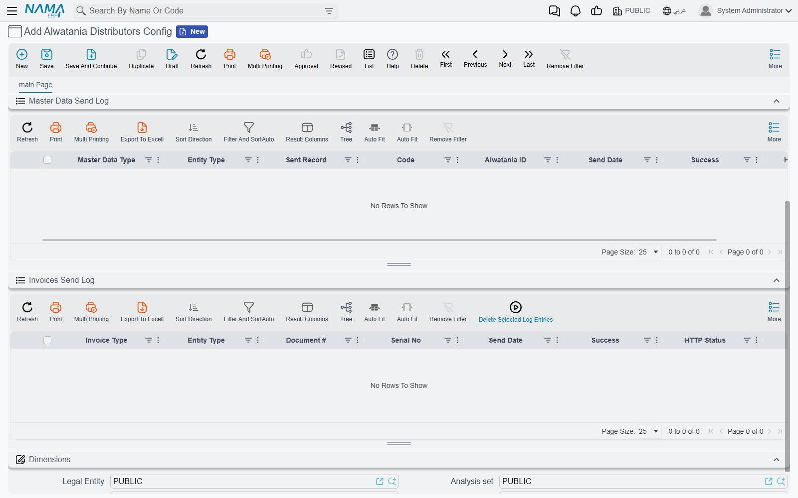

# Alwatania Send Logs and Resending

Every time Nama sends something to Alwatania it writes down what it sent and what the platform
answered. Those notes are not just an audit trail — they are what Nama reads on the next run to
decide what still needs sending. Understanding the two logs therefore answers both "did it
arrive?" and "how do I make it go again?".

Both logs are lists at the bottom of the
[Alwatania Distributors Config](./alwatania-setup) record; they have no screen of their own. Open
the config and expand them.

## Master Data Send Log

One row per record **and** type: a customer has one row (as a client), an item has one row as an
item plus one as item details, and a legal entity has two (as a province and as a city). When the
record is sent again, its row is updated rather than a new one added.



| Column | What it tells you |
|---|---|
| **Master Data Type** | The platform type the record was sent as — `Provinces`, `Clients`, `Items`, … (always in English) |
| **Sent Record** | The Nama record, with its entity type in the column beside it |
| **Code** | The record's code |
| **Alwatania ID** | The number the platform knows this record by. Use it when talking to Alwatania about a record |
| **Send Date** | When it was last sent |
| **Success** | Ticked when the platform accepted it |
| **HTTP Status** | The platform's HTTP answer code (200 for a normal answer) |

Four more columns are hidden by default and can be shown from the list's column chooser:
**Created On Alwatania**, **Record Update Date When Sent** (the record's last-change date at the
moment it was sent — a later change is what makes the next sweep send it again), **Request Body**
and **Response**.

## Invoices Send Log

One row per sales document. A document that is sent again updates its own row.

| Column | What it tells you |
|---|---|
| **Invoice Type** | `Sale` for an invoice, `Returned` for a sales return |
| **Document #** | The Nama document, with its entity type beside it |
| **Serial No** | The document code, as sent to the platform |
| **Send Date**, **Success**, **HTTP Status** | As above |

The hidden columns here are **Code**, **Request Body** and **Response**.

## Finding out why something was refused

1. Open the config and filter the log on **Success** = not ticked.
2. Show the **Response** column. It holds the platform's own answer — typically a `message` and a
   list of `errors`, for example:

   ```json
   {"success":false,"message":"Validation failed for item at index 12.","errors":["Quantity must be greater than 0."],"statusCode":"BadRequest"}
   ```

3. Show the **Request Body** column to see exactly what Nama sent for that one record or document
   (only that record's part, not the whole batch). Comparing the two usually points straight at
   the missing or wrong field.
4. Fix the record in Nama.

The platform may answer a refusal with HTTP 200 and `"success":false` in the body; Nama counts that
as a failure too, so always read **Success**, not only **HTTP Status**. When a whole request fails
— the platform was unreachable, or it refused a master-data batch as a whole — every row in that
batch is marked as not successful.

## Retrying — nothing to do

A row that is not ticked as successful is retried automatically. The next run of the schedule
sends every failed master record and every failed document again, whether or not you changed
anything. Fix the data, and let the schedule do the rest — or press **Run Now** on the task
schedule if you do not want to wait.

## Forcing a resend

An accepted master record is sent again only when it changes, and an accepted document is never
sent again. To make Nama send one anyway:

1. Select the rows in the log.
2. Open **more actions** and choose **Delete Selected Log Entries**. On the Invoices Send Log the
   button is also on the list's toolbar.
3. Confirm the question.

The next run treats those records as never sent and sends them as new.

::: danger Resending an invoice creates a second copy on the platform
The platform has no way to update an invoice it already holds. Deleting the log row of an invoice
that was accepted, and letting it run again, gives Alwatania the same invoice twice. Only do this
when Alwatania has confirmed it does not have the document.
:::

## Messages you may see

None of these messages has an Arabic translation, so they appear in English on Arabic screens too.
They show up as the result of the task schedule's run (its error message and execution log) or as
the entity flow's message.

| Message | Why | What to do |
|---|---|---|
| `Could not find Alwatania Distributors config with code or id {0}` | Parameter 1 of the master data or invoice action does not match any config | Type the config's code exactly as it is on the record |
| `{0} was not sent to Alwatania, there is no config with code or id {1}` | The same, from the entity flow action | Correct parameter 1 on the entity flow line |
| `Failed to obtain Alwatania access token (HTTP {0}): {1}` | The platform refused to log in, or the token address is wrong | Check **Token URL**, **Client Id**, **API Key** and **Scope** with Alwatania; the text after the colon is the platform's answer |
| `Unknown Alwatania master data type ({0}), it must be one of {1}` | Parameter 2 of the master data action is not a known type | Use `All` or one of the listed types, spelled as shown |
| `The query must return two columns, the entity type and the id, eg: select entityType, id from InvItem where sellable = 1` | The query in parameter 3 returns the wrong columns | Select `entityType, id` |
| `The query returned records of {0}, which feed no Alwatania master data endpoint and were not sent. The entity types it may return are {1}` | The query picked up records of a master file the platform does not take | Remove that table from the query |
| `Failed to send a batch of {0} {1} records to Alwatania: {2}` | A master-data batch could not be sent at all (for example, the platform was unreachable) | Check the address and the network; the batch is retried on the next run |
| `Alwatania {0} batch of {1} records failed (HTTP {2}): {3}` | The platform refused a master-data batch; the end of the message is its own reason | Read the **Response** column of the failed rows and fix the records |
| `Failed to send a batch of {0} documents to Alwatania: {1}` | An invoice batch could not be sent at all | As above; the documents are retried on the next run |
| `Alwatania batch of {0} documents failed (HTTP {1}): {2}` | The platform refused an invoice batch | Read the **Response** column of the failed rows |
| `Alwatania refused document {0}: {1}` | The platform refused one document; the rest of its batch was sent | Fix the document named in the message; it is retried on the next run |
| `Alwatania refused {0} documents of this batch one after another, so the {1} documents left were not taken apart any further and stay to be sent by the next run` | So many documents in one batch were refused that Nama stopped picking them out one by one | Fix the refused documents (the log shows them); the rest go on the next run |
| `Alwatania did not accept {0} of the {1} documents selected, the rest were sent; every document it refused is on its own row of the Alwatania Invoice Log with the answer that refused it` | The run's summary: some documents were still refused after the second attempt | Filter the Invoices Send Log on failed rows and read their **Response** |
| `{0} is not one of the master files Alwatania accepts, it must be one of {1}` | The entity flow action runs on a screen the platform has no place for | Move the flow to one of the listed master files |
| `{0} can not be sent to Alwatania as {1}, it can only be sent as {2}` | Parameter 2 of the entity flow action names a type that does not fit the record | Leave parameter 2 empty, or use one of the listed types |
| `{0} was not sent to Alwatania ({1})` | The entity flow could not send the record; the reason is in brackets | Fix the cause; the scheduled sweep sends the record on its next run |
