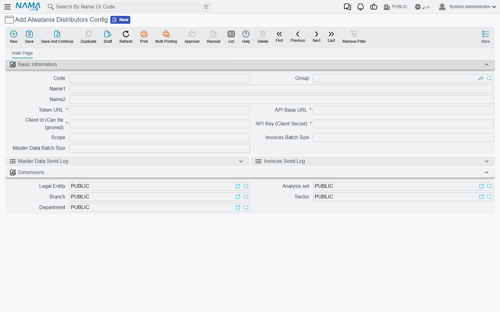

# Setting Up the Alwatania Config

Everything Nama needs to reach the Alwatania platform lives on one record, the **Alwatania
Distributors Config**. Open **integrations → Master Files → Alwatania Distributors Config** and
create one record per Alwatania account; most installations need exactly one.

The record's **code** is what the sending actions ask for, so pick something short you will type
into a task schedule — `ALW01`, for example.

## Basic Information

| Field | What to put in it |
|---|---|
| **Code**, **Group**, **Name1**, **Name2** | The usual master-file header. Remember the code: every sending action takes it as its first parameter |
| **Token URL** | The full address the platform gave you for obtaining an access token, e.g. `https://auth.example.com/connect/token`. Required |
| **API Base URL** | The root address of the platform's API, e.g. `https://api.example.com`. Nama adds the rest of each address itself, so do not include `/api/v1/...`. A trailing `/` does no harm. Required |
| **Client Id (Can Be Ignored)** | The client id Alwatania issued. Despite the label, the record will not save without it, and it is sent with every login |
| **API Key (Client Secret)** | The secret key Alwatania issued. It is a password field, so it is hidden once typed. Required |
| **Scope** | Only if Alwatania asked for a specific scope. Leave it empty and Nama uses `openid` |
| **Invoices Batch Size** | How many documents go in one request. Leave it empty (or 0) for **5000** |
| **Master Data Batch Size** | How many master records go in one request. Leave it empty (or 0) for **1000** |

Below the fields sit the two send logs, **Master Data Send Log** and **Invoices Send Log**. They
fill in by themselves as the actions run; [Send logs and resending](./alwatania-send-logs)
explains how to read them.

The **Dimensions** group carries the standard legal entity, analysis set, branch, sector and
department, like any master file.

::: warning Saving does not test the connection
Nama does not contact the platform when you save the config, so a mistyped address or key goes
unnoticed until the first send. The first run is your connection test: if the credentials are
wrong, it fails with a message that begins
`Failed to obtain Alwatania access token` and shows the platform's own answer.
:::

## Logging in

You never log in by hand. Each run asks the token address for an access token using the client id,
the API key and the scope, keeps the token for as long as the platform says it is valid, and fetches
a new one when it expires. If the platform ever rejects a token mid-run, Nama logs in again and
repeats that request once before giving up.

## Choosing batch sizes

The defaults suit most installations. A smaller batch means more requests but less to resend when
one fails because the platform was unreachable; a larger one means fewer round trips on a big
initial push. Very large invoice batches are split by Nama automatically when a request would be
too big for the platform, so you do not need to tune the invoice batch size for that.

## Next step

With the config saved, prepare the master data and set up the actions that send it —
[Sending master data and invoices](./alwatania-sending-data).
