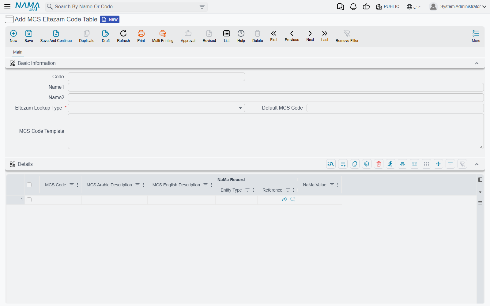

# Eltezam Code Tables

The ministry does not want to hear that an employee is "Male", works in "Riyadh Branch" and holds
the position "Senior Accountant". It wants `M`, a seven-digit location code and a nine-digit job
name code — each taken from a code list MCS publishes. Nama, meanwhile, stores the agency's own
records and wording. The **MCS Eltezam Code Table** (جدول أكواد التزام) is the dictionary between
the two: one table for each MCS code list, each row saying "this Nama record, or this Nama value,
is that MCS code".

You find it under **Master Files → MCS Eltezam Code Table** in the integrations menu.

## Creating all the tables at once

MCS publishes 29 code lists, and there can be only one table per list — saving a second table for
a list that already has one is refused. Rather than create them one by one, run the entity action
**`EACreateEltezamCodeTables`** once. It takes no parameters and can run from anywhere; the
simplest way is a task schedule of type **Action** that you run with **Run Now** (see
[Scheduled Tasks](/platform/scheduled-tasks)). In **Class Name**, write the full name
`com.namasoft.modules.integrations.utils.actions.EACreateEltezamCodeTables`, or type the short name
and pick the full one from the suggestion list.

The action creates an empty table for every list that does not have one yet, with the list name
as both its code and its names (`JobClassCode`, `Gender`, …), and opens it to every legal entity,
sector, branch, department and analysis set, because the ministry's codes are agency-wide.
Running it again is harmless: it skips the tables that already exist.

## The table screen

The header says which list the table covers and what to do when no row matches:

| Field | Meaning |
|---|---|
| **Code / Name1 / Name2** | The table's own reference — the creation action uses the list name |
| **Eltezam Lookup Type** (نوع جدول أكواد التزام) | **Required.** The MCS code list this table translates, by its MCS name (JobClassCode, NationalityCode, …) |
| **Default MCS Code** (كود الوزارة الافتراضي) | The code to send when nothing else matches. For a list where the whole agency uses one value, this is all you need |
| **MCS Code Template** (قالب كود الوزارة) | A field to read the code (or a value to translate) from, written like the employee-field boxes on the configuration: `description5`, `{ref4}`, `ref4.name1`. It is read on the Nama record first and then on the employee |

The **Details** grid holds the mapping rows:

| Column | Meaning |
|---|---|
| **MCS Code** (كود وزارة الخدمة المدنية) | **Required.** The code exactly as MCS lists it |
| **MCS Arabic Description** (الوصف العربي لكود الوزارة) | The ministry's Arabic description — for your reference |
| **MCS English Description** (الوصف الإنجليزي لكود الوزارة) | The ministry's English description — for your reference |
| **NaMa Record** (سجل نما) | The Nama record that means this code — an organizational position, a work place, a salary component… |
| **NaMa Value** (قيمة نما) | Or the Nama text that means this code — a nationality, a gender, a specialization… |

## How Nama picks a code

For each value it sends, Nama looks in the matching table in this order and stops at the first
hit:

1. **A grid row for the record.** A row whose NaMa Record is the record being sent. If you typed
   the record in NaMa Value instead of picking it, that works too: a NaMa Value equal to the
   record's code, Arabic name or English name counts. The first matching row wins.
2. **The MCS Code Template**, read from the record and then from the employee.
3. **The Default MCS Code.**

For **LocationCode** and **TransactionCode** the template works one step differently: what it reads
is a value of your own — say `description5` holds "Riyadh Branch" — which a grid row then translates
by its NaMa Value. So you can keep something readable on the employee and map it once. For every
other list, whatever the template reads is sent as the MCS code itself.

Numeric codes that MCS expects at a fixed width are padded with leading zeros: job class to 5
digits, job name and job position to 9, location to 7.

## Which Nama data each list is keyed on

Knowing what each list is matched against tells you whether to fill **NaMa Record** or
**NaMa Value**.

**Keyed on a record** — fill NaMa Record:

| List | Record |
|---|---|
| JobClassCode, JobNameCode, JobCatChain, EmploymentTypeCode, RankCode | The employee's organizational position |
| LocationCode | The employee's work place (or its template) |
| ElementCode | The salary component of each salary document line |
| ConsolidationSetID | The issuance of the salary document |
| QualificationCode | The qualification on the employee's qualification line |
| VacationCode | The vacation type of the vacation document |
| AppraisalTypeCode | The evaluation type of the employee evaluation |

**Keyed on a value** — fill NaMa Value with the text as Nama holds it:

| List | Value |
|---|---|
| EmployeeStatusCode | The employee state (Working, Resigned, …) |
| TerminationReasonCode | The employee state of an employee with a firing date |
| Gender, Religion, MaritalStatus | The matching option on the employee |
| NationalityCode | The employee's nationality |
| MajorCode | The specialization text of the qualification line |
| UniversityCode | The institute text of the qualification line |
| EduGrade | The grade text of the qualification line |

**Template or default only** — HealthStatus, BloodType and TransactionCode are read through the
MCS Code Template on the employee, or fall back to the Default MCS Code. **PositionStatus** and
**JobTransactionCode** use the Default MCS Code only.

::: tip Words, not numbers, for some lists
For Gender, Religion, BloodType, MaritalStatus and HealthStatus the ministry expects the word it
publishes — `M`, `Muslim`, `O-Positive`, `Single`, `Healthy` — not a number. Copy the MCS code
list exactly.
:::

### University codes 998 and 999

When a qualification's institute maps to the university code `998` or `999` ("other"), Nama sends
the institute's own name alongside the code, so an institute that is not on the ministry's list
can still be reported. Map any unlisted institute to `999` rather than leaving it without a code.

### Ratings work as thresholds

The **RatingCode** table is read differently from all the others. Its NaMa Value is a
percentage: the **lowest** final evaluation percentage that earns that rating. With rows at `0`,
`60`, `75` and `90`, an evaluation of 82% gets the code of the `75` row. An evaluation with no
final percentage falls back to the Default MCS Code.

Next: [send a submission](./eltezam-submissions-and-sending).
