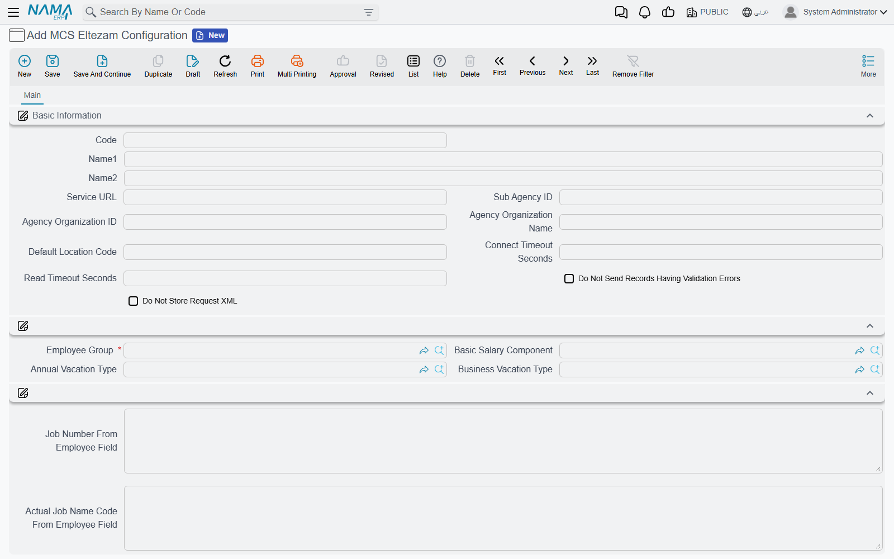
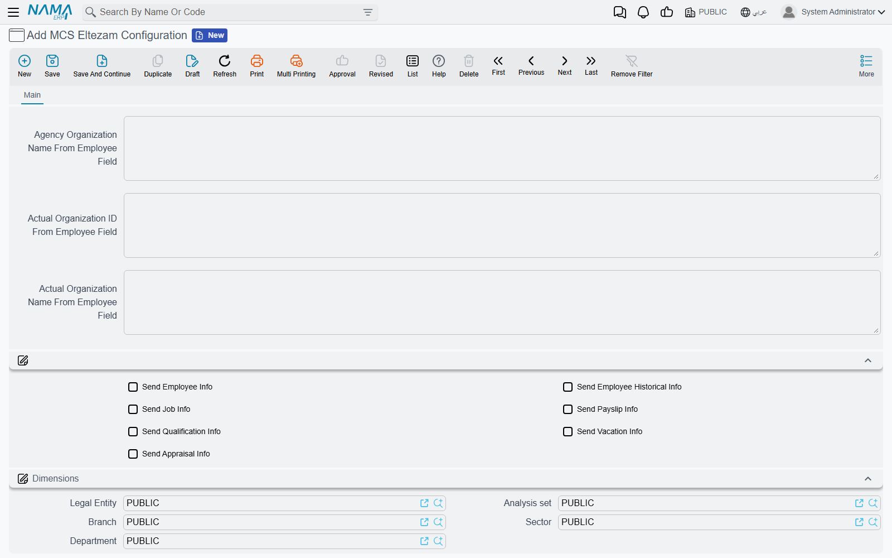

# Setting up Eltezam

Before Nama can send anything to the Ministry of Civil Service, it needs to know three things:
*where* the ministry's Eltezam service is, *who* the agency is in the ministry's eyes, and *which*
employees and HR records it should report. All three are answered on one master file, the
**MCS Eltezam Configuration** (إعدادات خدمة التزام), under **Master Files → MCS Eltezam
Configuration** in the integrations menu.

Most agencies need a single configuration. You would create a second one only if you report two
groups of employees under different sub-agency IDs, or to different endpoints.

## Before you start: the HR data

The configuration only tells Nama where to look; the data itself must already be in HR. Check
these before the first send, because every gap turns into a failed request:

- An **Employee Group** that lists exactly the employees you report to MCS.
- On each employee: the code (sent as the employee ID), the national ID number or, for
  non-Saudis, the residency (Iqama) number — ten characters —, the Arabic name (Name1) and English
  name (Name2), birth date, hiring date, organizational position, work place and department.
- Committed salary documents, vacation documents, employee evaluations and Update Employee Info
  documents for the operations you intend to send.
- A Hijri calendar table that reaches back to the oldest birth or hiring date you send.

## Basic Information

| Field | What to put in it |
|---|---|
| **Code / Name1 / Name2** | Your own reference for this configuration |
| **Service URL** (عنوان الخدمة) | The Eltezam endpoint MCS gave you. A full URL (`http://…/EltezamDataService.svc`) or just a host or IP; if you leave out `http://`, Nama adds it |
| **Sub Agency ID** (رقم الجهة الفرعية) | Your sub-agency number at MCS. It goes on every request except Employee Info |
| **Agency Organization ID** (رقم الجهة الحكومية) | The agency's organization ID, used as the job's organization unless an employee field overrides it (see below) |
| **Agency Organization Name** (اسم الجهة الحكومية) | The matching organization name |
| **Default Location Code** (كود الموقع الافتراضي) | The seven-digit MCS location code to send for any employee whose work place has no location mapping |
| **Connect Timeout Seconds** (مهلة الاتصال بالثانية) | How long to wait for the ministry to accept the connection. Empty means 30 seconds |
| **Read Timeout Seconds** (مهلة القراءة بالثانية) | How long to wait for the ministry's answer. Empty means 120 seconds |
| **Do Not Send Records Having Validation Errors** (عدم إرسال السجلات التي بها أخطاء تحقق) | See below |
| **Do Not Store Request XML** (عدم حفظ ملف الإرسال) | Leave it off to keep a copy of every request and response on the submission document; tick it to save space once the integration is stable |

### Checking records before they leave Nama

Before each request is sent, Nama checks it against the ministry's rules: required values present,
codes of the right length, a national ID or Iqama present, dates inside the Hijri calendar, and so
on. What happens when a check fails depends on **Do Not Send Records Having Validation Errors**:

- **Ticked** — the request is not sent. It is recorded as Failed with the error code `001-000000`
  and the list of problems as its error message. Nothing reaches the ministry, so nothing needs
  cleaning up on their side.
- **Not ticked** — the request is sent anyway, and Nama's findings are kept alongside the
  ministry's answer in the error message. Useful early on, when you want to see whether the
  ministry really refuses what Nama considers incomplete.

## Where the data comes from

| Field | What to put in it |
|---|---|
| **Employee Group** (مجموعة موظفين) | **Required.** The employees this configuration reports. A new submission takes its employees from this group |
| **Basic Salary Component** (عنصر الراتب الأساسي) | The salary component that holds the basic salary. Its addition on the employee's latest salary document in the period is sent as the basic salary |
| **Annual Vacation Type** (نوع الإجازة الاعتيادية) | The vacation type whose remaining balance is sent as the annual vacation balance |
| **Business Vacation Type** (نوع الإجازة الاضطرارية) | The vacation type whose remaining balance is sent as the business (emergency) vacation balance |

## Reading values from an employee field

Some values the ministry wants have no fixed home in Nama's employee file — agencies keep them in
a spare description or reference field. The "… From Employee Field" boxes let you point at that
field. Write the field the way you would in any Nama template: `description5`, `{description5}`,
`ref4.name1` and `{ref4}` all work. A reference field sends the code of the record it points to.

| Field | Fills | When left empty |
|---|---|---|
| **Job Number From Employee Field** (رقم الوظيفة من حقل بالموظف) | The job number | The employee's labour office ID, then the organizational position code |
| **Actual Job Name Code From Employee Field** (كود المسمى الفعلي للوظيفة من حقل بالموظف) | The actual job name code | The JobNameCode code table |
| **First Grade Date From Employee Field** (تاريخ أول مرتبة من حقل بالموظف) | The first grade date | The hiring date |
| **Agency Organization ID From Employee Field** (رقم الجهة الحكومية من حقل بالموظف) | The job's organization ID | Agency Organization ID above |
| **Agency Organization Name From Employee Field** (اسم الجهة الحكومية من حقل بالموظف) | The job's organization name | Agency Organization Name above |
| **Actual Organization ID From Employee Field** (رقم الإدارة الفعلية من حقل بالموظف) | The organization unit the employee actually works in | The employee's department code, then the agency |
| **Actual Organization Name From Employee Field** (اسم الإدارة الفعلية من حقل بالموظف) | Its name | The department's Arabic name, then the agency |

## Which operations to send

The seven **Send …** check boxes — Send Employee Info, Send Employee Historical Info, Send Job
Info, Send Payslip Info, Send Qualification Info, Send Vacation Info and Send Appraisal Info —
are the default for every submission made from this configuration. A submission that has none of
them ticked copies all seven from here when it is saved; a submission that has at least one ticked
keeps its own choice. What each operation sends is described on
[What Nama sends to Eltezam](./eltezam-data-sources).

::: tip A sensible first run
Start with **Send Employee Info** and **Send Job Info** only. They depend on the employee file
and the organizational position alone, so they flush out missing IDs, names and code-table rows
before you add payslips, vacations and appraisals, which depend on documents as well.
:::

The last group on the screen is the usual dimensions group.

Next: [create and fill the code tables](./eltezam-code-tables).
