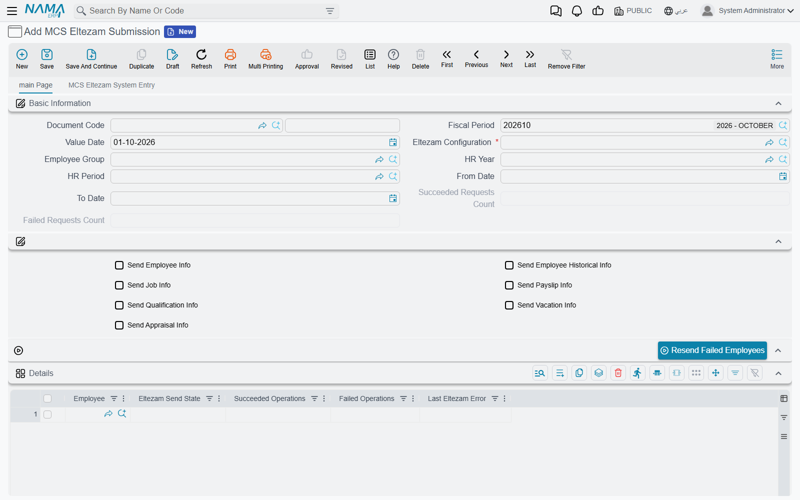
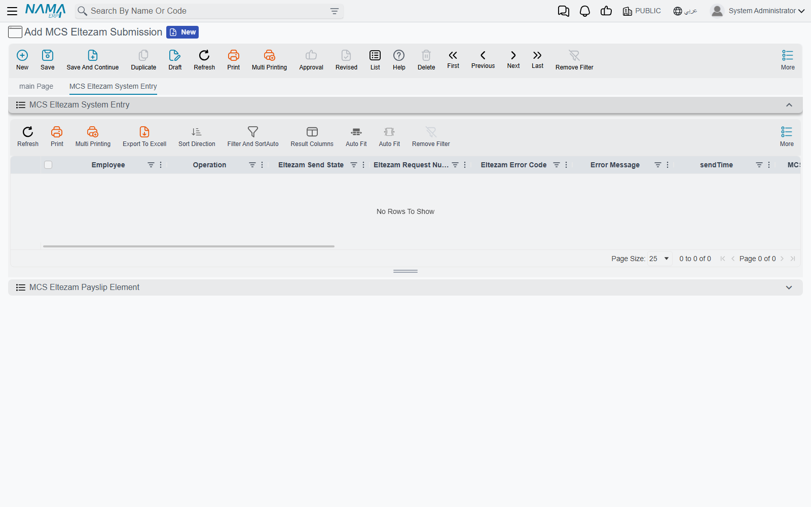

# Eltezam Submissions and Sending

Every time the agency reports to MCS — the monthly payslips, a batch of new hires, the year's
appraisals — it does so through an **MCS Eltezam Submission** (إرسال بيانات التزام), under
**Documents → MCS Eltezam Submission** in the integrations menu. The document says *who* is being
reported, for *which period* and *what* is being sent. Once it has been sent, it becomes the record
of what happened: which employees went through, which failed, and every request with the
ministry's answer.

## Filling in the document



| Field | Meaning |
|---|---|
| **Document Code, Fiscal Period, Value Date** | As on any document. The value date is also the date vacation balances are computed at |
| **Eltezam Configuration** (إعدادات التزام) | **Required.** The configuration to send with |
| **Employee Group** (مجموعة موظفين) | The employees to report. Leave it empty to use the configuration's group |
| **HR Year** (سنة الرواتب), **HR Period** (فترة الرواتب), **From Date** (من تاريخ), **To Date** (إلى تاريخ) | The period whose documents are sent — see [which documents count as "in the period"](./eltezam-data-sources#Which-documents-count-as-in-the-period). Leave all four empty to send the whole history |
| The seven **Send …** check boxes | Which operations this submission sends. Leave them all unticked to take the configuration's choice |
| **Succeeded Requests Count** (عدد الطلبات الناجحة), **Failed Requests Count** (عدد الطلبات الفاشلة) | Filled in by the system after each send |

When you save, Nama completes the document for you:

- an empty **Employee Group** is copied from the configuration;
- if no **Send …** box is ticked, all seven are copied from the configuration;
- if the **Details** grid is empty, it is filled with one line per employee of the group.

You can then remove employees from the grid, or add others by hand, before committing. The
document needs no document term.

### The Details grid

| Column | Meaning |
|---|---|
| **Employee** (الموظف) | The employee reported on this line |
| **Eltezam Send State** (حالة الإرسال لالتزام) | **Not Sent** (لم يرسل بعد), **Succeeded** (نجح) or **Failed** (فشل) |
| **Succeeded Operations** (العمليات الناجحة) | The operations the ministry accepted for this employee |
| **Failed Operations** (العمليات الفاشلة) | The operations that failed |
| **Last Eltezam Error** (آخر خطأ من التزام) | The latest error for this employee |

A line is **Failed** if any of its requests failed, **Succeeded** if at least one request went
through and none failed, and **Not Sent** if nothing was produced or sent for it — for example an
employee with no salary document in the period when only payslips are being sent.

## Committing does not send

Committing the submission checks that it has employees and at least one operation, and then
stops. **Nothing is sent to the ministry when you commit, and there is no Send button on the
screen.** Sending is done by one of two entity actions, run from an entity flow or a task
schedule. Setting one of them up is a one-time job for whoever administers the system.

In the **Class Name** field of the entity flow line or the task schedule, the action must be
written with its **full name**: `com.namasoft.modules.integrations.utils.actions.` followed by the
short name used on this page — for example
`com.namasoft.modules.integrations.utils.actions.EASendEltezamSubmissionDoc`. The short name on
its own is not found. Type the short name into the field and pick the full name from its
suggestion list.

### Sending on commit: `EASendEltezamSubmissionDoc`

The usual arrangement is an entity flow on **MCS Eltezam Submission** that runs
`EASendEltezamSubmissionDoc` on **Post Commit**, so every submission is sent the moment it is
committed (see [Introduction to Entity Flows](/platform/entity-flows/introduction-to-entity-flows)).
The action runs only on a committed submission.

| Parameter | Meaning |
|---|---|
| 1. **MCS Server (IP, host or full URL)** | **Required.** Where to send |
| 2. **Eltezam Configuration Code (Can be Empty)** | A configuration to use instead of the document's |
| 3. **From Date (yyyy-MM-dd, Can be Empty)** | Overrides the document's From Date for this run |
| 4. **To Date (yyyy-MM-dd, Can be Empty)** | Overrides the document's To Date |
| 5. **HR Period Code (Can be Empty)** | Overrides the document's HR Period |
| 6. **HR Year Code (Can be Empty)** | Overrides the document's HR Year |

Each period parameter that is filled wins over the document's own value for that run only — the
document itself is not changed. Dates must be written as `yyyy-MM-dd`, for example `2026-01-31`.

### Sending on a schedule: `EASubmitEltezamData`

For sending at night or re-sending on demand, use a task schedule of type **Action** with
`EASubmitEltezamData` (see [Scheduled Tasks](/platform/scheduled-tasks)).

| Parameter | Meaning |
|---|---|
| 1. **Eltezam Configuration Code (Can be Empty when documents are given)** | The configuration to send with |
| 2. **MCS Server (IP, host or full URL)** | **Required.** Where to send |
| 3. **Eltezam Submission Document Codes (Comma Separated, Can be Empty)** | The committed submissions to send, e.g. `EZS-0012, EZS-0013` |
| 4–7. **From Date, To Date, HR Period Code, HR Year Code** | The same period overrides as above |

With document codes, each listed submission is sent exactly as the post-commit flow would send
it, and its grid and log are updated. Without document codes, the action sends the employees of
the configuration's group directly, with no submission document involved — the requests are
made, but no document shows their results. Use submissions whenever you want to review what
happened.

### The MCS Server parameter

Both actions require the server parameter, even when the configuration has a Service URL. What
you write there combines with the Service URL:

- a **full URL** (`http://10.1.2.3/EltezamDataService.svc`) is used as it is;
- a **bare host or IP** (`10.1.2.3`) keeps the scheme and path of the configuration's Service URL
  and only swaps the host — handy when the same service path is reached through a different
  gateway.

## What happens during a send

1. The document's previous request log is cleared.
2. For every employee line and every selected operation, Nama builds the requests from the HR
   data, checks them (see **Do Not Send Records Having Validation Errors** on
   [the configuration](./eltezam-setup)), and sends them to the ministry one by one.
3. Each request is logged with the ministry's answer, and each line's state and the document's
   counts are updated.

A request **succeeds** when the ministry answers with a request number. Anything else is a failure
and the ministry's error code and message are kept.

If the ministry's server does not answer — unreachable, timing out, answering with a web page —
three times in a row, Nama stops rather than wait out every remaining employee. The lines not
reached stay **Not Sent** and the run reports that it stopped; see
[troubleshooting](./eltezam-troubleshooting).

## The request log (second page)

The second page of the document, **MCS Eltezam System Entry** (قيد التزام النظامي), holds two
collapsible lists.



**MCS Eltezam System Entry** has one row per request: employee, operation, send state, **Request
Number** (رقم طلب التزام) returned by the ministry, **Error Code** (كود خطأ التزام), **Error
Message** (رسالة الخطأ), send time, and the key values that were sent — employee ID, job number,
job codes, organization, location, transaction code, gender, health status, basic salary and
IsActive. Many more columns are hidden and can be shown from the column chooser, including
**Request XML** (ملف الإرسال) and **Response XML** (ملف الرد): the exact envelope sent and the
exact answer received, unless the configuration's **Do Not Store Request XML** is ticked. Filter
the list by employee, operation, send state, request number or error code.

**MCS Eltezam Payslip Element** (عنصر مسير رواتب التزام) has one row per payslip element sent:
employee, state, MCS employee ID, Hijri year and month, consolidation set, element code, name and
classification, amount, net pay and paid date. Filter it by employee, state or Hijri year and
month.

::: warning Saving a sent submission again clears its log
Saving a committed submission again — even without changing anything — empties the request log on
the second page, while the grid keeps its Succeeded / Failed states. It does not send the
submission again. Check the log before editing a submission you have already sent, and to send it
again, list it in the `EASubmitEltezamData` task schedule or use **Resend Failed Employees**.
:::

## Resending the employees that failed

Once the data or the code tables are fixed, press **Resend Failed Employees** (إعادة إرسال
الموظفين الذين فشل إرسالهم), in the actions block of the submission and in the More Actions menu.

It asks one question — **MCS Server (leave empty to use the configuration Service URL)** (خادم
الوزارة (اتركه فارغا لاستخدام عنوان الخدمة بالإعدادات)) — and then resends every line that is not
**Succeeded**. Only those employees' old log rows are replaced; the successful employees' rows are
kept. The counts are recalculated, and a summary appears, one line per employee:

```
Retried 3 employees: 5 requests succeeded, 1 failed
1045 Ahmed Ali: 2 succeeded, 0 failed
1046 Sara Omar: 1 succeeded, 1 failed (the ministry's error for her failed request)
…
```

If the ministry's server stops answering during the resend, the summary ends with the same
"Sending stopped…" line as a normal send.

The resend uses the document's own configuration and period, not the overrides an entity flow or
task schedule may have passed.
