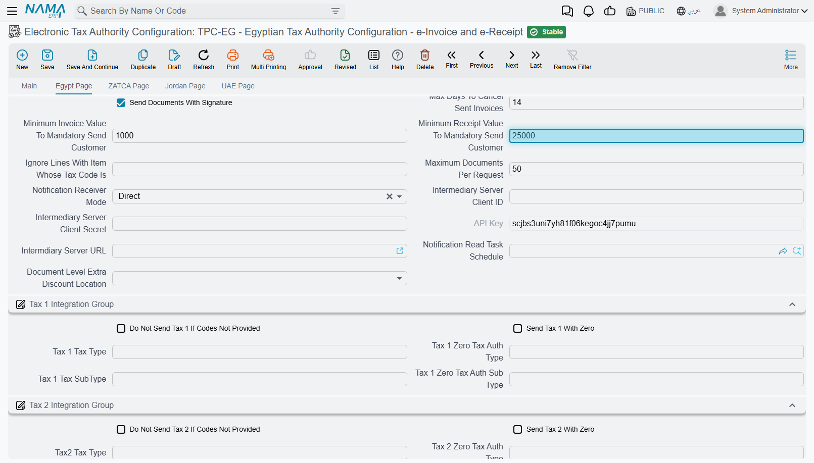
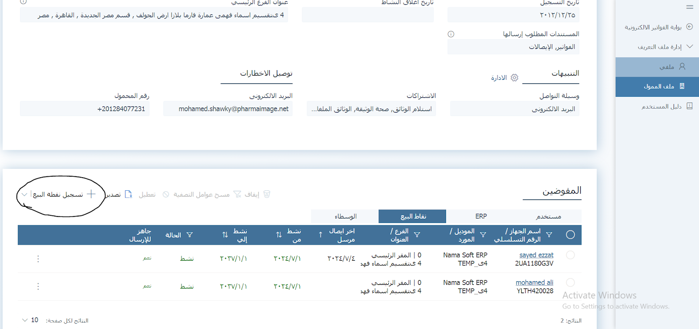
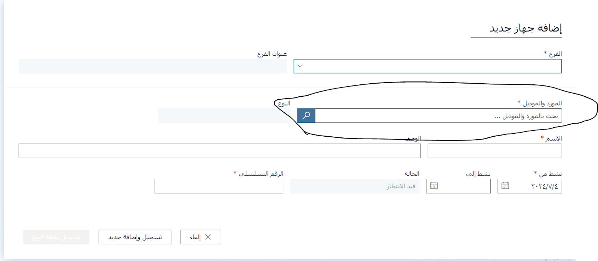
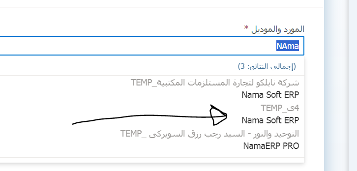
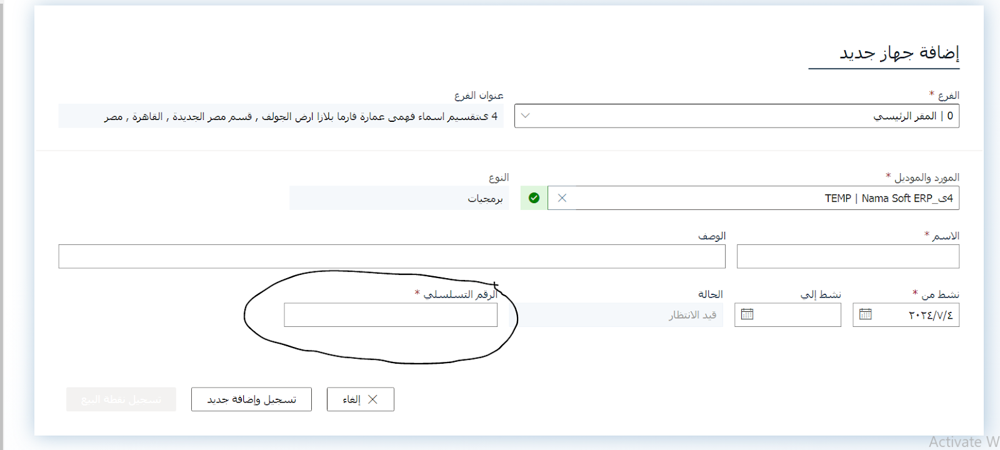
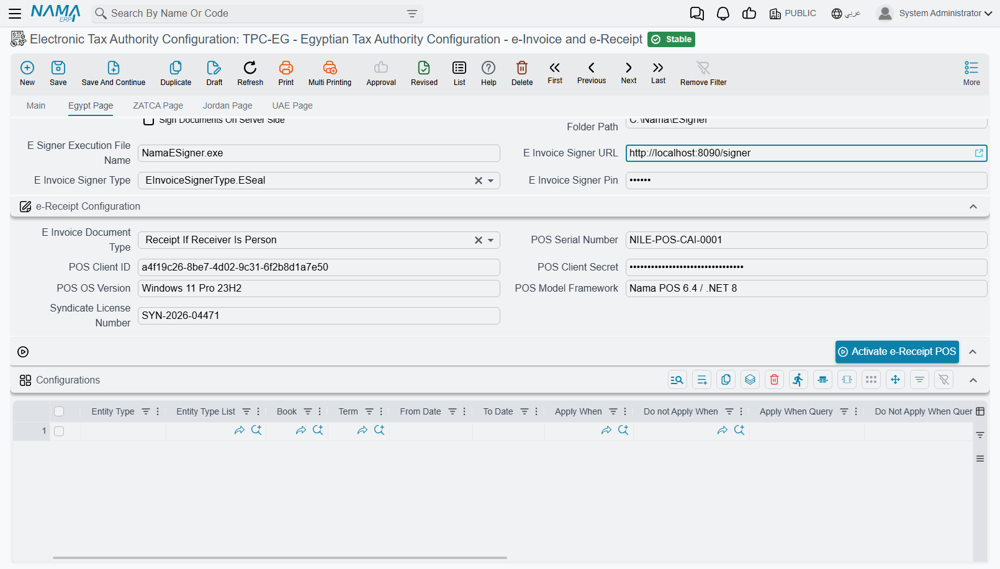
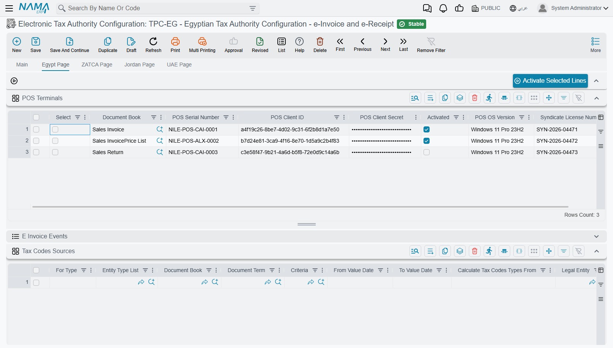

# Egyptian e-Invoice and e-Receipt

The Egyptian Tax Authority runs two electronic systems side by side. The **e-invoice** system is for sales to businesses and government: each invoice is digitally signed and lands on the buyer's own tax record. The **e-receipt** system is for sales to the public: receipts come from registered point-of-sale devices, one after another, as fast as the till produces them. A shop that sells to both kinds of customer uses both.

In Nama ERP both are driven by the same **Electronic Tax Authority Configuration** record and sent through the same **Tax Authority Submission Document**. The way documents are collected, validated and sent is the shared machinery described in the [electronic invoicing overview](./e-invoices-guide.md), so read that first. This page covers what is genuinely Egyptian: connecting to the portal, who counts as seller and buyer, item codes, the bank details printed on an invoice, receipts and devices, signing, and cancelling.

## What is different about Egypt

| | How Egypt works |
|---|---|
| **Two systems** | e-Invoices for business and government buyers; e-receipts for the public. One configuration decides which a document becomes. |
| **Environments** | Two: a pre-production portal for rehearsal and the live portal. |
| **Signing** | e-Invoices can be signed with the company's e-seal (a USB token), through a small signer program installed alongside Nama. Receipts are not signed. |
| **Item codes** | Every line needs a code the authority knows: a company-registered **EGS** code or an international **GS1** barcode. |
| **Buyer identity** | A 9-digit tax registration number for companies, a 14-digit national ID for individuals. |
| **Cancelling** | An accepted e-invoice is withdrawn through a **Document Cancel Document**, within the number of days the configuration allows. |

## Connecting to the portal

In **Global Configuration**, page 2, set **e-Invoice Page To Show** to **Egypt Page** (or **All Pages** if you file in more than one country), then run a **Regen UI** so the Egypt page appears on the configuration screen.

Create the **Electronic Tax Authority Configuration** and pick the **Tax Payer Type**. A new record starts on pre-production on purpose; choosing a type fills in the three addresses for you:

| Tax Payer Type | Portal URL | API URL | Identity Server URL |
|---|---|---|---|
| Egypt - Electronic Invoice Site (Pre Production) | `https://preprod.invoicing.eta.gov.eg` | `https://api.preprod.invoicing.eta.gov.eg` | `https://id.preprod.eta.gov.eg` |
| Egypt - Electronic Invoice Site | `https://invoicing.eta.gov.eg` | `https://api.invoicing.eta.gov.eg` | `https://id.eta.gov.eg` |

Your ERP system is registered on the portal as an application, and the portal gives it a client ID and a client secret. They go here:

| Field on the Egypt page | What to put in it |
|---|---|
| **User Name** | The **Client ID** of the ERP system registered on the portal |
| **Password** | The **Client Secret** that goes with it |
| **Tax Registeration NO** | Your company's 9-digit tax registration number |
| **Activity Type** | The activity code your registration was issued under, from the authority's activity list |

The pre-production portal issues its own client ID and secret, separate from the live ones. Moving to live means changing the **Tax Payer Type** *and* pasting in the live credentials.

## Which documents are sent

A document goes to the authority when its **document book** or **term** has **Send To Tax Authority** ticked and names the configuration in its **Tax Configuration** field. If the book and the term both name a configuration, they must name the same one. Any document type that can carry tax can be sent this way: sales invoices and returns, credit and debit notes, real estate, hospital, contracting and point-of-sale documents, and others.

From that moment, every committed document dated on or after the configuration's **Start Sending From Date** is queued for the next collection. Two settings guard the dates:

- **Max Days To Send Invoices** (3 days on a new record) — the authority's deadline. A document dated further back than that cannot be saved at all once its book or term sends to the authority.
- **Days To Allow Save Document In Future** — how many days ahead a document may be dated. Zero means not at all.

Each document goes to the portal as one of these types:

| Sent as | When |
|---|---|
| **Invoice** | The ordinary case. |
| **Credit note** | Sales returns and the other return documents, and a credit/debit note document whose term's **Send As** is *Credit Note*. |
| **Debit note** | The term has **Tax Authority Debit Note** ticked, or a credit/debit note document whose term's **Send As** is *Debit Note*. |
| **Export** invoice, credit note or debit note | The term has **Export Document** ticked. The buyer must then be a foreigner, and every line needs a weight unit and weight quantity. |
| **Receipt** or **return receipt** | The configuration sends this document as an e-receipt — see [e-Receipts](#e-Receipts) below. |

A return knows which invoice it reverses from the document it was created from, and Nama sends that invoice's identifier on the portal with it. So create returns from the original invoice, and keep the invoice and the return on the same configuration.

## Who the portal thinks you are

**Branch Id From** names the dimension — legal entity, branch, sector, department or analysis set — that represents the issuer. On every document, Nama reads that dimension from the document itself and sends its name, its address and its **Tax Authority Code**, which is the branch code you registered with the authority.

Egypt checks the issuer's address in detail. The dimension chosen on the configuration record itself is checked when you save the configuration and again before every send. Its **Tax Authority Code**, country, governorate, city, street and building number must all be filled. A blank one stops the submission with *Field {0} in selected dimension {1} is required*.

## Who the portal thinks the customer is

The customer's **The legal entity of the company** field, on its tax data, decides what kind of buyer the portal sees and which number identifies it:

| Customer's legal entity | Buyer type | Identity sent | Checked by Nama |
|---|---|---|---|
| **Government** or **Private Sector** | Business | **Tax Registeration NO** | Digits only, exactly 9 |
| **Individual** | Person | **Id Number** | Digits only, exactly 14, with a valid birth date inside it |
| **Foreigner** | Foreigner | **Id Number** (the passport number) | Must be filled |

The field is required for Egypt: a customer without it cannot be sent.

A business buyer on an e-invoice also needs a full address: country, governorate, city, street and building number. Individuals and foreigners don't.

Asking every walk-in customer for a national ID is not practical, and the authority doesn't require it below a certain amount. The configuration has two thresholds for this: **Minimum Invoice Value To Mandatory Send Customer** for e-invoices and **Minimum Receipt Value To Mandatory Send Customer** for receipts. When an individual's document is at or below the threshold, the ID is not required. Above it, the ID is required. Left at zero, the ID is required on every individual's document.



::: tip Example
With the receipt threshold at 25,000 EGP, a 300 EGP sale to an individual goes out without an ID number. A 40,000 EGP sale is held back until the customer's **Id Number** is filled.
:::

## Item codes: EGS and GS1

The authority does not know your item codes. Every line has to carry a code from one of its two catalogues:

- **GS1** — the international barcode of a product, for goods that have one.
- **EGS** — a code your company registers on the portal itself, for everything else. It always has the form `EG-<your tax registration number>-<your own code>`, for example `EG-758965109-L20003`. Once you request an EGS code on the portal, the authority reviews it and gives it an active-from date (and sometimes an active-to date).

### Where Nama takes the code from

**Calculate Item Code From** says which record holds the code: the **Item** itself, its **Master Group**, one of the item classes 1–10, one of the categories 1–5, its **Section** or its **Brand**. Nama uses that record's **Tax Authority Code**. If that field is empty, it falls back to the record's own code, so fill it in rather than relying on internal codes.

When the code has to be built from several pieces, set **Calculate Item Code From** to the template option and write the expression in **Item Code Template**. The template replaces everything above, and it is required in that mode and must be empty in every other.

Nama decides which catalogue a code belongs to by looking at it: a code that starts with `EG-` followed by the configuration's **Tax Registeration NO** and a dash is EGS; anything else is sent as GS1.

### Checking EGS codes before sending

With **Validate EGS Codes** ticked, **Validate Tax Authority Documents** and sending both look each EGS code up on the portal, among the codes your company has registered, before anything is sent:

- If the code is not there, the line fails with *Item code is not registered*. Either the code was mistyped, or it was never registered under this tax registration number.
- If the code is there but the document's date falls outside its active-from/active-to period, the line fails with *Item code is not active*. Usually the document is dated before the authority approved the code.

GS1 codes are not looked up — the portal checks them when the document arrives.

::: info Registering a code fixes the error straight away
A code the portal doesn't have is asked about again on every validation, so registering it on the portal and validating again is enough. Codes the portal does find are remembered until the server restarts or the system cache is cleared, so if the authority changes an existing code's active dates, clear the cache before checking again.
:::

With the box unticked, Nama sends the codes unchecked and the portal itself refuses an unknown one, recording the rejection against your tax file. Turn it on.

### The other line settings

- **Item Internal Code Template** and **Item Description Template** decide the internal code and description sent for each line (by default the item's code and its first name). **Internal Item Code Maximum Length** limits the internal code; zero means 50 characters.
- **Ignore Lines With Item Whose Tax Code Is** drops every line whose item tax code equals that value — handy for service lines the authority shouldn't see.
- **Don Not Send Assembly Components** sends an assembly as one line instead of its components.

## Units, currency and taxes

Three more things on each line have to be in the authority's own codes:

- **Unit** — the **Tax Authority Code** on the unit of measure (`EA`, `KGM` and so on). Fill it on every unit you sell in.
- **Currency** — the **Tax Authority Code** on the currency. A document in another currency also needs its rate.
- **Tax** — each of the four tax slots is mapped to the authority's tax type and sub-type in the *Tax 1*–*Tax 4* groups of the Egypt page. The *Zero* type and sub-type are sent instead when the tax on a line is zero. **Do Not Send Tax N If Codes Not Provided** leaves a slot out when it has no codes.

**Calculate Tax Codes Types From** chooses where those tax codes are read from: this configuration, or the tax plan on the term, the item or the customer. The **Tax Codes Sources** grid overrides that choice for particular document types, books, terms, dates or dimensions.

## Bank details and payment terms

An Egyptian e-invoice can optionally tell the buyer where to send the money — the bank, the account number, the IBAN and your payment terms. The Tax Authority treats the whole section as optional: fill in nothing and your invoices go out exactly as they always have. Fill it in, and customers who pay by transfer stop having to ask.

This applies to every Egyptian e-invoice — sales invoices, credit notes and debit notes alike.

### Whose bank account is sent?

Nama doesn't ask you a second time. It reuses the **Branch Id From** setting (`branchIdDimension`) in the **Electronic Tax Authority Configuration** — the same setting that tells the Authority which part of your business issued the invoice.

So if you told the Authority the issuer is a **Branch**, that branch's bank account is sent. If the issuer is the **Legal Entity**, the company's account is sent.

::: tip Why it works this way
The account and the issuer belong together. An invoice that says "issued by the Alexandria branch" but "pay into the Cairo account" is a reconciliation problem waiting to happen. One setting means the two can never drift apart.
:::

Most documents you send can go one step further and send a different account — or different payment terms — on each document. See **Choosing the account and terms on each invoice** below.

### Setting it up

1. On the **Bank** record, fill in the **Swift Code** (`swiftCode`). The bank's address is taken from the **Contact Information** section of the same record (`contactInfo.address`), so fill that in too.
2. On the **Bank Account** record, fill in **Account Number Sent To Tax Authority** (`accountNumberSentToTaxAuth`) with the number customers should transfer to, and check the **IBAN** (`iban`).
3. Open the record that **Branch Id From** names — **Legal Entity**, **Branch**, **Sector**, **Department** or **Analysis Set** — and select that account in its **Bank Account** field (`dimensionInfo.bankAccount`).
4. Optionally, fill **E-Invoice Payment Terms** (`eInvoicePaymentTerms`) on the **Electronic Tax Authority Configuration**. It's a single line of text sent with every Egyptian e-invoice, so keep it to terms that always apply — something like "Payment due within 30 days of the invoice date".

::: warning If you leave the account number empty, the code is sent instead
When **Account Number Sent To Tax Authority** is empty, Nama falls back to the bank account's **code** — which makes an internal label into something your customers read on their invoice.

Fill the field in. It accepts the number exactly as the bank writes it, dashes and spaces included, which codes don't allow.
:::

### Choosing the account and terms on each invoice

One default account suits most businesses, but not all. A company might collect from government customers into a dedicated account, or agree 60-day terms with one distributor while everyone else pays within 30. For those cases, the document's term can point Nama at a field on the document itself.

The two fields are on the terms of:

- **Sales Invoice** and **Sales Return**
- **SI Sales Invoice** and **SI Sales Return** (service center)
- **POS Sales Invoice** and **POS Sales Return**
- **Credit Note** and **Debit Note**
- **Misc Purchase Invoice**, whose term is shared with Misc Purchase Order and Request
- **Misc Contracting Invoice** and **Contractor Employee Equipment Invoice**

#### The two term fields

Open the **Document Term** of the document. Both fields are in the **Electronic Invoice** group of the **Settings** tab; fill in either one, or both.

| Term field | Field ID | What to type in it |
|---|---|---|
| **E-Invoice Bank Account Field** | `termConfig.eInvoiceBankAccountField` | The ID of a **reference** field on the invoice, where users will pick the bank account |
| **E-Invoice Payment Terms Field** | `termConfig.eInvoicePaymentTermsField` | The ID of a **text** field on the invoice, where users will type the payment terms |

#### Invoice fields you can point them at

The field must sit in the invoice header — not in a grid such as the item lines — and be the right kind. The usual choices are:

| Invoice field ID | Kind | Suitable for |
|---|---|---|
| `ref1`, `ref2`, `ref3` (**Reference 1**, **Reference 2**, **Reference 3**) | Reference | **E-Invoice Bank Account Field** |
| `description1` to `description5` | Text | **E-Invoice Payment Terms Field** |
| `remarks` | Text | **E-Invoice Payment Terms Field** |

Type the ID exactly as shown — `ref1`, not "Reference 1".

#### How it plays out

Say the sales invoice term has `ref1` in **E-Invoice Bank Account Field** and `description1` in **E-Invoice Payment Terms Field**:

- A user invoicing a government customer selects the government collection account in **Reference 1** and types "Payment due within 60 days" in `description1`. The Tax Authority receives that account — its bank, IBAN, Swift code and account number — and those terms.
- The next invoice leaves both fields empty. It sends the branch's bank account and the **E-Invoice Payment Terms** from the configuration, as usual.

Each field falls back to the default on its own:

- **The field is empty on the invoice:** the default is sent — the branch's bank account, or `eInvoicePaymentTerms` from the configuration.
- **The bank account field holds something that isn't a bank account** (a customer picked in **Reference 1** by mistake, say): the branch's bank account is sent.

::: warning A field ID that doesn't exist blocks the document
Nama looks the field up by the ID you typed. If the document has no such field, saving a document that is sent to the Tax Authority fails with a technical message like `Can not find Field getter method : ref11`. It names the field you typed, but not the term it came from, so keep this setting in mind when you see it. If tax data validation on save is switched off for the book or the term, the document saves and the failure shows up later on its submission entry instead.

The other mistakes are quieter:

- **The bank account field holds something that isn't a bank account:** the branch's account is sent, with no warning.
- **The payment terms field is not a text field:** whatever it holds is turned into text and sent as the payment terms, which is rarely what you want.

So point each setting at a field in the document header, of the right kind, and issue one test document after you change the term.
:::

### What gets sent

This is the full map, from each field the Tax Authority receives back to where Nama reads it.

| Tax Authority field | Meaning | Record | Field ID |
|---|---|---|---|
| `bankName` | Bank name | **Bank** | `name1` |
| `bankAddress` | Bank address | **Bank** | `contactInfo.address` |
| `swiftCode` | Swift code | **Bank** | `swiftCode` |
| `bankAccountNo` | Account number | **Bank Account** | `accountNumberSentToTaxAuth`, or `code` when that is empty |
| `bankAccountIBAN` | IBAN | **Bank Account** | `iban` |
| `terms` | Payment terms | **Sales Invoice** / **Sales Return** | The invoice field named in `termConfig.eInvoicePaymentTermsField` |
| | | **Electronic Tax Authority Configuration** | `eInvoicePaymentTerms` — when the above is empty or not set |

The **Bank** rows are read from the **Bank Account**'s own `bank` field. The **Bank Account** itself is chosen in this order:

1. **On the invoice** — the field named in `termConfig.eInvoiceBankAccountField` (for example `ref1`), if it holds a bank account. Only for the documents whose terms carry the two fields, listed above.
2. **On the issuer** — `dimensionInfo.bankAccount` on the record that `branchIdDimension` points to (**Legal Entity**, **Branch**, and so on). This is what every other e-invoice, including credit and debit notes, always uses.

Anything left empty is left out. Leave all of it empty and the payment section is dropped from the invoice entirely.

## e-Receipts

### Invoice or receipt?

**E Invoice Document Type**, in the e-receipt group of the Egypt page, decides which system a document goes to:

| Setting | What happens |
|---|---|
| **Always As Invoice** (also what an empty field means) | Everything is an e-invoice. |
| **Always As Receipt** | Everything is an e-receipt; returns become return receipts. |
| **Receipt If Receiver Is Person** | Business and government customers get e-invoices; individuals and foreigners get e-receipts. |

The choice is made per document, when it is sent, from the customer's **The legal entity of the company** field. A shop with mostly walk-in customers and a few corporate accounts uses the third option.

### Registering the device on the portal

Every device that issues receipts is registered with the authority as a point of sale.

1. Register the **serial number** of each computer or device that will send receipts with the authority.

2. The ERP system is identified on the portal by its **Vendor** (the software company, for example Nama Soft) and **Model** (the system, for example Nama ERP). They are set up on the portal's **Register POS** screen:

   

   

3. Add the device on the portal:

   * Select the branch (usually the main branch).
   * Select the approved Vendor and Model.
     
   * Enter a POS name (optional) and the activation date.
   * Enter the device's serial number. On a Windows machine you can read it by running this in the command prompt:

     ```bash
     wmic bios get serialnumber
     ```

     

   * Click "Save and Add New".

4. The portal shows the device's **Client ID** and **Client Secret**. Keep them somewhere safe. The device is registered but **inactive** until it is activated from Nama.

### Activating the device in Nama



**One device.** In the e-receipt group of the Egypt page, fill **POS Serial Number**, **POS Client ID**, **POS Client Secret** and **POS OS Version** (for example `Windows`), save, then press **Activate e-Receipt POS**. The device turns active on the portal.

**Several devices.** Register each one on the portal as above, then add a row per device to the **POS Terminals** grid at the bottom of the Egypt page: the **Document Book** that device's receipts and returns are issued from, its serial number, client ID, client secret and OS version. Save, tick the rows, and press **Activate Selected Lines**. Rows already marked **Activated** are skipped.



Nama picks the device for a receipt by the document's book. When the grid has rows, a receipt from a book that has no row goes out with no device serial, so give every receipt book its row.

::: tip Nama POS registers carry their own device
Receipts raised in the Nama point-of-sale application take the device details from their **POS Register** instead — the register has the same fields, its own **Activate e-Receipt POS** button, and a field naming the configuration.
:::

### How receipts travel

Each receipt carries the identifier of the device's previous receipt, so the authority can see an unbroken chain from each device. Nama remembers the last accepted receipt per device and fills this in for you, and within one submission the receipts are chained in date order, sales before returns.

Two rules are specific to receipts:

- A receipt must use a single currency throughout.
- A sent receipt is not cancelled — it is corrected with a return receipt. A **Document Cancel Document** raised against a document that went as a receipt is never collected for sending.

## Signing e-invoices

When **Send Documents With Signature** is ticked, every e-invoice is signed with your company's e-seal before it is sent. With it unticked, documents go unsigned, which the authority accepts only from taxpayers it has allowed to do so.

The e-seal is a USB token, and Nama talks to it through the **Nama eInvoice Signer**, a small Windows program (`eSignerSetup.msi`) that runs on port `7994`.

**Signing from the browser (the default).** On the **Tax Authority Submission Document**, **Sign Documents** or **Sign Selected Documents** hands the documents to the signer on the computer of the user pressing the button. The token has to be plugged into that computer, with the signer running and the token's own driver installed (ITIDA Web Sign for Egypt Trust e-seals, or MCDR's). In Chrome, the `chrome://flags/#block-insecure-private-network-requests` flag must be disabled, or the browser blocks the call.

**Signing on the server.** Tick **Sign Documents On Server Side** to have the ERP server sign instead. The token and the signer then live on the server: Nama starts the signer itself if it isn't running, from **E Signer Installation Folder Path** and **E Signer Execution File Name**, and passes it the **E Invoice Signer Type** (E Seal or MCDR) and **E Invoice Signer Pin**. **E Invoice Signer URL** points at a signer on another address. The scheduled flows that send automatically always sign on the server.

## Cancelling an accepted e-invoice

1. Create a **Document Cancel Document** pointing at the sent document.
2. Write the reason in its **Description** — the authority requires one.
3. Collect and send it through a **Tax Authority Submission Document** like any other document.

**Max Days To Cancel Sent Invoices** (3 days on a new record) is the window: a cancel document dated after it isn't sent. Only documents the authority has accepted can be cancelled.

## Status notifications from the portal

Besides **Check Tax Authority Status For Sent Document**, the portal can push status changes — a cancellation, a rejection by the buyer — back to Nama as they happen. **Notification Receiver Mode** sets this up:

| Mode | When to use it |
|---|---|
| **None** (default) | No push notifications; status is checked on request or by the scheduled flows. |
| **Direct** | The ERP server can be reached from the internet. The portal calls it directly, identified by the configuration's **API Key**. |
| **Intermediary Server** | The ERP is inside your network. A public Nama server receives the notifications, and your ERP fetches them on the **Notification Read Task Schedule**, using the **Intermediary Server URL**, client ID and secret. |

The notifications received are listed under **E Invoice Events** at the bottom of the Egypt page.

## Documents your suppliers send you

Where the received e-invoices module is installed, the Egypt page gains a **Recent Tax Electronic Invoice Configuration** group. The **Import Recent Tax Electronic Invoice From Tax Authority** action on the **Tax Electronic Invoice** list reads the documents that appeared on your portal account since the last read, and creates one record for each in the **Recent Document Book** and **Recent Document Term**.

## Messages you may see

Most Egyptian messages share one frame — the document, the line, and the field at fault — so the table below shows the frame and the field texts that go into it.

| Message | Why | What to do |
|---|---|---|
| *Error while validating tax authority document {0} at line {1} field {2} with invalid value {3}* — «خطأ عند التحقق من المستند  الخاص بمصلحة الضرائب {0} في السطر {1} الحقل {2} قيمة غير صالحة {3}» | Field {2} is *Item code is not registered* — «كود الصنف غير مُسجل»: the EGS code in {3} is not among your company's codes on the portal. | Check the item's **Tax Authority Code** (or whichever record **Calculate Item Code From** points at) against the portal, register the code if it is missing, then validate again. |
| Same message, field *Item code is not active* — «كود الصنف غير مٌفعل» | The code is registered, but the document's date is outside its active period. | Compare the document date with the code's active-from date on the portal. |
| *Error while validating tax authority document {0} at line {1} field {2} is required* — «خطأ عند التحقق من المستند  الخاص بمصلحة الضرائب {0} في السطر رقم {1} الحقل {2} مطلوب» | Something the authority needs on a line is empty — commonly the item code, the unit, or a tax code. | Fill the **Tax Authority Code** on the item, unit or tax mapping named in {2}. |
| *Error while validating tax authority document {0} field {1} is required* — «خطأ عند التحقق من المستند  الخاص بمصلحة الضرائب {0} الحقل {1} مطلوب» | Something the authority needs on the document or its customer is empty — such as the customer's legal entity, ID, or an address field. | Fill the field named in {1}, usually on the customer. |
| *Error while validating tax authority document {0} at line {1} field {2} invalid code {3}* — «خطأ عند التحقق من المستند  الخاص بمصلحة الضرائب {0} في السطر {1} الحقل {2} كود غير صالح {3}» | A unit, currency or tax code is not on the authority's list. | Correct the **Tax Authority Code** on that unit or currency, or the tax mapping. |
| *Error while validating tax authority document {0} - Receiver {1} ID {2} length must be {3} digits* — «خطأ عند التحقق من المستند  الخاص بمصلحة الضرائب {0} - المشتري {1} طول المعرف {2} يجب ان يكون {3} رقم» | A business's tax number is not 9 digits, or an individual's national ID is not 14. | Correct the number on the customer — or its legal entity, if a company was entered as an individual. |
| *Error while validating tax authority document {0} - Receiver {1} ID {2} must be numbers only* — «خطأ عند التحقق من المستند  الخاص بمصلحة الضرائب {0} المشتري {1} المعرف {2} يجب ان يكون أرقام فقط» | Dashes, spaces or letters in the number. | Keep the digits only. |
| *Error while validating tax authority document {0} - Receiver {1} ID {2} birth date part is incorrect* — «خطأ عند التحقق من المستند  الخاص بمصلحة الضرائب {0} - المشتري {1} الجزء الخاص بتاريخ الميلاد في المعرف {2} خطأ» | Digits 2–7 of a national ID are the holder's birth date, and these don't form one. | The ID was mistyped — check it against the card. |
| *Error while validating tax authority document {0} at line {1} internal Code {2} exceeded the maximum characters count {3}* — «خطأ عند التحقق من المستند  الخاص بمصلحة الضرائب {0} - السطر {1} الكود الداخلي {2} تخطي عدد الحروف المسموح به{3}» | The internal code sent for the line is longer than **Internal Item Code Maximum Length**. | Shorten the template, or raise the limit. |
| *Field {0} in selected dimension {1} is required* — «الحقل {0} في الفرع المختار {1} مطلوب» | The issuing branch (or other dimension) lacks its **Tax Authority Code** or part of its address. | Complete it on that dimension record. |
| *Please specify tax payer configuration file in book or term* — «الرجاء تحديد ملف إعدادت مصلحة الضرائب في دفتر او توجيه المستند» | The book or term sends to the authority but names no configuration. | Fill **Tax Configuration** on the book or term. |
| *Book {0} with configuration {1} and term {2} with configuration {3}* — «الدفتر {0} يحتوي علي إعدادت ضرائب {1} والتوجيه {2} يحتوي علي إعدادات ضرائب {3}» | The book and the term name different configurations. | Make them name the same one, or clear one of them. |
| *Value date can not be {0} - which is older than today with {1} days, because the document {2} will be sent to the tax authority* — «التاريخ الفعلي لا يمكن ان يكون {0} - حيث انه اقدم من تاريخ اليوم ب {1} أيام, لأن المستند {2} يتم إرساله للضرائب» | The document is dated further back than **Max Days To Send Invoices**. | Date it within the window. Sending older documents needs the authority's permission first. |
| *Value date can not be {0} - which is newer than today with {1} days, because the document {2} will be sent to the tax authority* — «التاريخ الفعلي لا يمكن ان يكون {0} - حيث انه احدث من تاريخ اليوم ب {1} أيام, لأن المستند {2} يتم إرساله للضرائب» | The document is dated further ahead than **Days To Allow Save Document In Future**. | Date it today, or raise the setting. |
| *Can not cancel document {0} because it is not sent to tax authority* — «لا يمكنك إلغاء المستند {0} لانه لم يُرسل لمصلحة الضرائب» | The document being cancelled was never accepted by the authority. | Nothing to cancel on the portal; correct the document in Nama instead. |
| *Document {0} was sent before* — «تم إرسال المستند {0} من قبل» | The document is already accepted. | Nothing to do; a change now means cancelling it and issuing a new one. |
| *Please mark option Send Documents With Signature in tax payer config or you try to sign cancel document* — «الرجاء التأكد من تفعيل أوبشن إرسال المستندات موقعه إلكترونيا الموجود في إعدادت مصلحة الضرائب أو إنك تحاول توقيع سند إلغاء» | Signing was pressed, but the configuration doesn't sign — or the lines are cancellations, which are never signed. | Tick **Send Documents With Signature**, or just send. |
| *There is no connection on port 7994, please make sure that the e-signer server is running.* | The browser could not reach the Nama eInvoice Signer on this computer. | Start the signer (or install it), check the token is plugged in, and disable the Chrome flag above. This message has no Arabic text and appears in English on Arabic screens. |
| *In Receipt Submission, You should use only one currency per whole document* | A receipt mixes currencies across its lines. | Use one currency for the whole receipt. This message has no Arabic text and appears in English on Arabic screens. |
