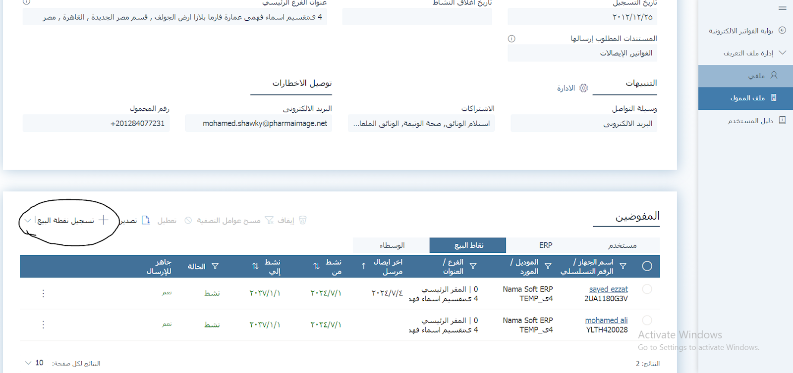
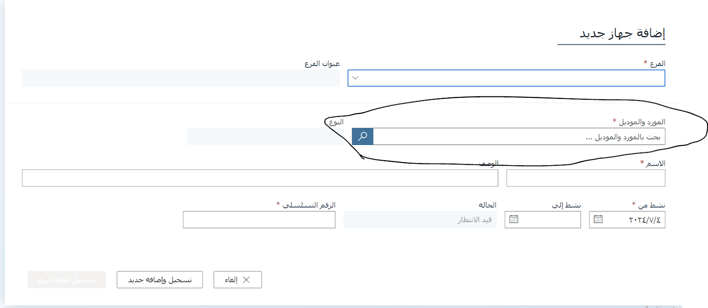
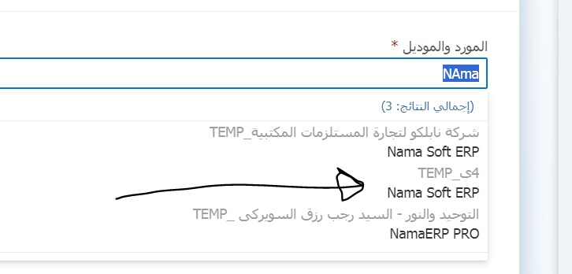
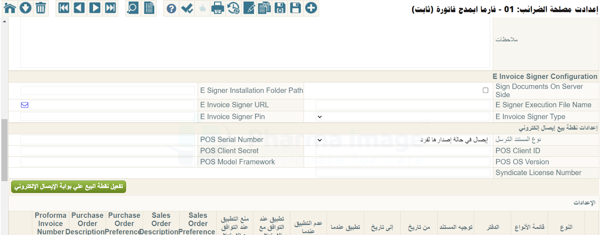
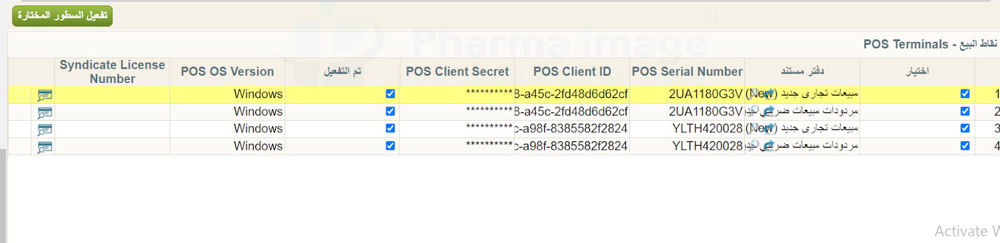
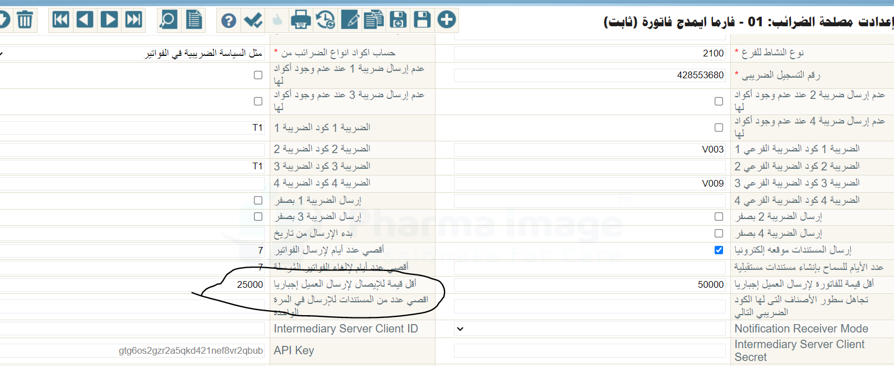

::: warning In Progress
This document is still in progress, not yet finished
:::

# Electronic Receipt (Egypt Tax eInvoice) - Activating the Electronic Receipt and eInvoice - Egypt

## How to Activate the Electronic Receipt via Computer

1. The customer must contact the Tax Authority to register the **Serial Number** of the computer or devices that will be used to send receipts.

2. The customer must also inform the Authority of the **Vendor & Model**, which are defined in the system through the **Register POS** screen as follows:



When you click "Register POS", the following window appears:



The meaning of each field:

* **Vendor**: The company name (example: Nama Soft)
* **Model**: The system name (example: Nama ERP)

3. After registering the devices with the Tax Authority and defining the Vendor and Model, complete the POS setup inside the system as follows:

* Select the branch (usually the main branch)

* Select the Vendor and Model approved by the Authority
  

* Enter the POS name (optional)

* Enter the activation date as desired

* Enter the device Serial Number registered with the Authority. You can obtain it from the customer's machine by running the following command in CMD:

  ```bash
  wmic bios get serialnumber
  ```

* After entering the data, click "Save and Add New"

* After saving, a window appears containing:

    * **Client ID**
    * **Client Secret**

These values must be saved in a secure place.
The POS will then be registered but its status will be **inactive** until it is activated through the system.

---

## Activation in the System

1. Go to Tax Authority settings in the system:
   

2. In the electronic POS settings:

* Set the document type to "Receipt" if the recipient is an **individual**

    * If the legal entity in the invoice's account record is of type **Individual**, the document is sent as a Receipt
    * If the legal entity is **Private Sector**, it is automatically sent as an Invoice

* If there is **only one device** for sending:

    * Fill in the fields: `Client ID`, `Client Secret`, `Serial Number`, and `POS OS Version` (e.g., Windows)

* Click "Save" then "Activate"

> The POS status changes to active on the Tax Authority portal

---

### If There Are Multiple Devices for Sending:

* Register a separate POS for each device as described in the steps above
* Inside the system, in the same Tax Authority settings, use the lower grid to define each device:



* Select the book used for invoices and returns

* Enter for each device:

    * Serial Number
    * Client ID
    * Secret ID
    * POS OS Version

* Save and click "Activate Lines"

---

## Important Notes:

* If the customer is an **individual**, their record must contain a **national ID number**, otherwise the system will reject sending the receipt.
* If the customer is **private sector**, data such as the **tax registration number** is required.

### Exempting Individual Customers from the ID Number Requirement:

For invoices with small amounts (e.g., 100 EGP), it may not be practical to request an ID number from every customer.
You can set the minimum receipt value that requires an ID number via the following setting:



::: tip
If the invoice is below this amount (e.g., 25,000 EGP), sending is allowed without an ID number.
If the value exceeds this threshold, the system requires the ID number.
:::
