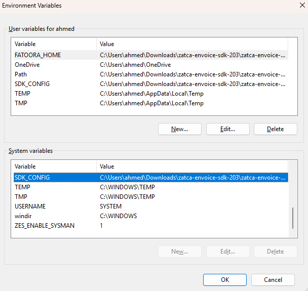
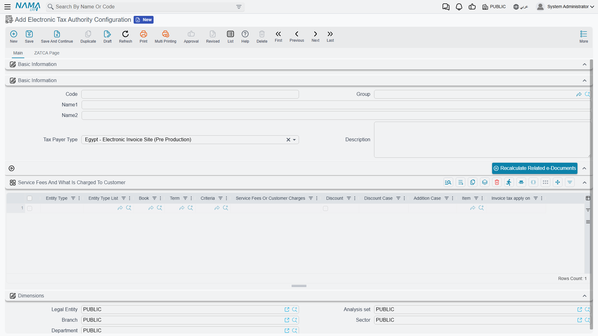
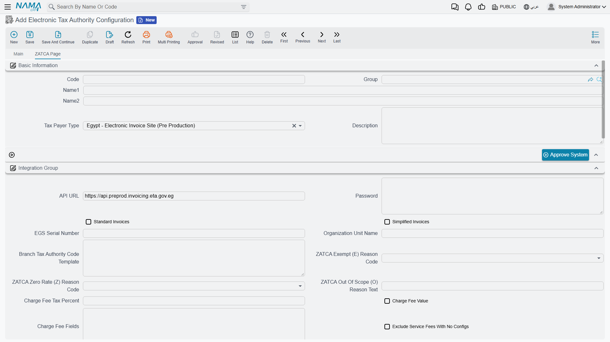

# الربط مع هيئة الزكاة والضريبة والجمارك بالسعودية (ZATCA Fatoora)

## نظرة عامة

تُلزِم هيئة الزكاة والضريبة والجمارك (ZATCA) المنشآت الخاضعة لضريبة القيمة المضافة في المملكة العربية السعودية بإصدار فواتيرها إلكترونيًا والربط مع منظومة **فاتورة (Fatoora)**. يدعم NamaERP المرحلة الثانية من الفوترة الإلكترونية (مرحلة الربط والتكامل - Integration Phase)، حيث يقوم النظام بتوليد الفاتورة بصيغة **UBL 2.1 XML**، وتوقيعها رقميًا، وإرسالها إلى الهيئة مباشرة.

قبل أن نغوص في خطوات الإعداد، من المفيد أن نفهم بعض المفاهيم الأساسية التي ستقابلك كثيرًا أثناء الربط:

### نوعان من الفواتير

تفرّق منظومة فاتورة بين نوعين من الفواتير، ولكل منهما مسار مختلف:

| النوع | المُستخدِم | آلية الإرسال | متى تكون الفاتورة سارية؟ |
|------|-----------|--------------|--------------------------|
| **الفاتورة الضريبية (Standard / B2B)** | المبيعات بين المنشآت | **المصادقة (Clearance)** | بعد أن تعتمدها الهيئة وتُرجِعها مختومة برمز QR رسمي — لا يجوز مشاركتها مع المشتري قبل ذلك |
| **الفاتورة المبسطة (Simplified / B2C)** | المبيعات للمستهلك النهائي | **الإبلاغ (Reporting)** | تُسلَّم للعميل فورًا وقت البيع، ويتم إبلاغ الهيئة بها خلال 24 ساعة |

::: tip
في إعداد مصلحة الضرائب ستجد حقلين: **فواتير قياسية (Standard Invoices)** و **فواتير مبسطة (Simplified Invoices)**. فعّل ما يناسب نشاطك — يمكن تفعيل النوعين معًا إذا كانت منشأتك تبيع للجهات وللأفراد.
:::

### دورة حياة الربط (الاعتماد - Onboarding)

لا يمكن لأي نظام أن يرسل فواتير قبل أن «يعتمد» نفسه لدى الهيئة. تمر عملية الاعتماد بثلاث مراحل تقوم بها زر **«اعتماد النظام»** في النظام تلقائيًا:

1. **توليد طلب الشهادة (CSR)**: ينشئ النظام طلب توقيع شهادة من بيانات منشأتك الضريبية.
2. **شهادة الامتثال (Compliance CSID)**: يرسل النظام الطلب مع **رمز التحقق (OTP)** الذي تحصل عليه من بوابة فاتورة، ثم يُرسِل عينات من الفواتير للتأكد من توافقها.
3. **شهادة الإنتاج (Production CSID)**: بعد نجاح عينات الامتثال، يحصل النظام على شهادة الإنتاج النهائية ويخزّنها داخل الإعداد، فتصبح المنشأة جاهزة لإرسال الفواتير الفعلية.

## المتطلبات الأساسية

قبل البدء تأكد من توفر التالي:

- صلاحية دخول إلى **بوابة فاتورة (Fatoora Portal)** لتوليد رمز التحقق (OTP).
- **رقم التسجيل الضريبي** للمنشأة (15 رقمًا، يبدأ وينتهي بالرقم 3).
- **رقم السجل التجاري (CRN)**.
- بيانات **العنوان الوطني** للمنشأة كاملة.
- **الرقم التسلسلي لوحدة توليد الفواتير (EGS Serial Number)**.
- تثبيت **حزمة ZATCA SDK** ونشر ملف التوقيع `zatca.war` على السيرفر (نشرحه في القسم التالي).

## تجهيز سيرفر العميل للربط

أداة التوقيع الرقمي التي توفرها الهيئة (ZATCA SDK) تُستخدَم لتوقيع الفواتير وحساب الـ hash ورمز QR. اتبع الخطوات التالية لتجهيز السيرفر:

- قم بتحميل ملف الزكاة والدخل من [Zatca SDK](https://zatca.gov.sa/en/E-Invoicing/SystemsDevelopers/ComplianceEnablementToolbox/Pages/DownloadSDK.aspx)
- قم بفك الملف المضغوط الذي تم تحميله في الخطوة السابقة
- بداخل المجلد الذي تم فكه ستجد ملف `install.ba_` — قم بتغيير اسمه إلى `install.bat` ثم قم بتشغيله
  - يمكنك تغيير الاسم بسهولة من خلال اختيار الملف ثم الضغط على F2
- قم بالذهاب إلى Environment Variables من خلال خصائص الكمبيوتر ← متقدم، أو قم بتشغيل الأمر التالي في Run Dialog (Win + R)
```sh
rundll32 sysdm.cpl,EditEnvironmentVariables
```
- قم بنسخ السطر الذي يخص `SDK_CONFIG` من القسم `User Variables` إلى القسم `System Variables`

::: tip نسخ المتغير تلقائيًا
يمكنك تشغيل الكود التالي في برنامج Windows PowerShell (يجب تشغيله كـ Administrator) لنسخ المتغير أعلاه بدلًا من نسخه يدويًا:
```powershell
$varName = "SDK_CONFIG"
$userValue = [Environment]::GetEnvironmentVariable($varName, "User")
if ($userValue) {
    Write-Host "Copying $varName with value '$userValue' to system environment..."
    [Environment]::SetEnvironmentVariable($varName, $userValue, "Machine")
    Write-Host "Copied successfully."
} else {
    Write-Host "User environment variable '$varName' not found."
}
```
**تذكّر أن تقوم بتشغيل PowerShell كـ Administrator.**
:::

بعد النسخ — سواء بشكل يدوي أو باستعمال كود باور شيل — يجب أن يكون الشكل مقاربًا للتالي:



- قم بفتح الملف `Configuration/config.json` وتأكد أن المسارات بداخله صحيحة.
- قم بتحميل ملف `zatca.war` من: <https://namasoft.com/bin/zatca.war>
  - ضع الملف في مجلد `Tomcat Path/webapps`.

::: warning
ملف `zatca.war` هو خدمة التوقيع التي يستدعيها النظام عند كل عملية إرسال. إذا ظهرت رسالة **"Please update zatca JAR"** فهذا يعني أن الخدمة غير منشورة أو أن نسختها قديمة.
:::

## تجهيز النظام

- من **«الإعدادات العامة»** ← الصفحة الثانية، اختر `هيئة الزكاة والدخل (السعودية)` في الحقل **«عرض صفحة الفاتورة الإلكترونية الخاصة بـ»**:

<GlobalConfigOption option-code="value.info.einvoicePageShowType" />

- بعد تغيير قيمة الحقل قم بعمل **Regen UI** حتى تظهر صفحة ZATCA داخل الفواتير والمستندات.

## استكمال بيانات الشركة

منظومة فاتورة تعتمد على بيانات **البائع (المنشأة)** كاملة. أكمل الحقول التالية في ملف الشركة (الكيان القانوني / الفرع المستخدم في الإعداد):

- رقم السجل التجاري
- رقم التسجيل الضريبى

ثم أكمل بيانات **العنوان الوطني** الخاص بالمؤسسة:

- كود الدولة
- الدولة
- المدينة
- المحافظة
- المنطقة
- شارع
- رقم المبني
- الكود البريدي
- الحي
- عنوان 1
- رقم تعريفي للأرض


::: warning
العنوان الوطني إلزامي. إذا نقص أحد حقول العنوان (الدولة، المدينة، الشارع، رقم المبنى…) فلن يجتاز الإعداد التحقق، وستظهر رسالة بالحقل الناقص في الفرع المختار.
:::

## إنشاء إعداد مصلحة الضرائب

كل ما سبق يتجمّع في ملف **«إعدادات مصلحة الضرائب» (Tax Payer Configuration)**. أنشئ ملفًا جديدًا، وفي الصفحة الرئيسية اضبط البيانات الأساسية:



عند التكويد، اختر القيمة المناسبة في حقل **«نوع المصلحة» (Tax Payer Type)** حسب مرحلة الربط:

| القيمة | الاستخدام |
|-------|-----------|
| `السعودية - موقع الفاتورة الإلكتروني للمطورين` | بيئة المطورين (Sandbox) لأغراض التجربة والتطوير |
| `السعودية - موقع الفاتورة الإلكترونية التجريبي` | بيئة المحاكاة (Simulation) للربط خلال فترة التجربة |
| `السعودية - موقع الفاتورة الإلكترونية` | الربط الفعلي (Production) |

::: tip
يُملأ حقل **رابط الـ API (API URL)** تلقائيًا عند اختيار نوع المصلحة. ابدأ دائمًا ببيئة **المحاكاة (Simulation)** واختبر سيناريوهاتك بالكامل قبل الانتقال إلى الإنتاج.
:::

بعد ذلك انتقل إلى تبويب **«صفحة ZATCA»** لاستكمال بيانات التكامل:



| الحقل | الوصف |
|------|-------|
| **رقم التسجيل الضريبي (Tax Reg No)** | الرقم الضريبي للمنشأة (15 رقمًا، يبدأ وينتهي بـ 3) |
| **الرقم التسلسلي للوحدة (EGS Serial Number)** | الرقم التسلسلي لوحدة توليد الفواتير — حقل إلزامي للربط مع ZATCA |
| **فواتير قياسية (Standard Invoices)** | فعّله إذا كنت تصدر فواتير ضريبية للجهات (B2B) |
| **فواتير مبسطة (Simplified Invoices)** | فعّله إذا كنت تصدر فواتير مبسطة للأفراد (B2C) |
| **اسم وحدة المنشأة (Organization Unit Name)** | إلزامي للمنشآت التابعة لمجموعة ضريبية: أدخل **رقم السجل (10 أرقام)** عندما يكون الرقم الحادي عشر من الرقم الضريبي = 1 |
| **كلمة المرور (Password)** | يُستخدَم لإدخال **رمز التحقق (OTP)** وقت اعتماد النظام (نشرحه في القسم التالي) |
| **بُعد الفرع (Branch Dimension)** | الفرع/الكيان القانوني الذي تُؤخَذ منه بيانات البائع والعنوان الوطني |
| **نوع النشاط (Activity Type)** | كود النشاط التجاري للمنشأة |

::: warning مجموعة ضريبية (Tax Group)
إذا كانت منشأتك ضمن مجموعة ضريبية (الرقم الحادي عشر من الرقم الضريبي يساوي 1)، فيجب تعبئة **«اسم وحدة المنشأة»** برقم سجل صحيح مكوّن من 10 أرقام، وإلا سيرفض النظام توليد طلب الشهادة.
:::

## اعتماد النظام (Onboarding)

بعد حفظ الإعداد وتعبئة بياناته، نقوم باعتماد النظام لدى الهيئة:

1. ادخل إلى **بوابة فاتورة** وولّد **رمز التحقق (OTP)**.
2. ضع رمز التحقق في حقل **«كلمة المرور» (Password)** داخل صفحة ZATCA.
3. اضغط زر **«اعتماد النظام» (Approve System)**.

عند الضغط، يقوم النظام بالخطوات الثلاث التي ذكرناها في المقدمة (توليد CSR ← شهادة الامتثال + التحقق من العينات ← شهادة الإنتاج)، ويخزّن الشهادة النهائية داخل الإعداد. عند نجاح العملية تصبح المنشأة جاهزة لإرسال الفواتير.

::: tip
عينات الامتثال التي يرسلها النظام تعتمد على ما فعّلته من أنواع الفواتير: إذا فعّلت **الفواتير القياسية** يتم التحقق من عينات فاتورة/إشعار دائن/إشعار مدين قياسية، ومثلها للمبسطة. لذلك فعّل فقط الأنواع التي ستصدرها فعليًا.
:::

::: warning
رمز التحقق (OTP) صالح لمدة محدودة. إذا انتهت صلاحيته قبل الضغط على «اعتماد النظام»، ولّد رمزًا جديدًا من بوابة فاتورة.
:::

## إعداد أكواد الضريبة وفئات ضريبة القيمة المضافة

تُصنّف ZATCA كل سطر في الفاتورة حسب **فئة ضريبة القيمة المضافة**. يجب أن تكون كل ضريبة مستخدمة في فواتيرك مربوطة بفئة صحيحة:

| الكود | الفئة | الوصف |
|------|------|-------|
| `S` | النسبة القياسية | خاضع للضريبة بالنسبة القياسية (**15%**) |
| `Z` | نسبة الصفر | خاضع للضريبة بنسبة صفر (Zero-Rated) |
| `E` | معفى | معفى من ضريبة القيمة المضافة (Exempt) |
| `O` | خارج النطاق | غير خاضع لضريبة القيمة المضافة (Out of Scope) |

عندما لا تكون الفئة هي `S`، تشترط الهيئة ذِكر **سبب الإعفاء/عدم الخضوع**. لذلك حدِّد في صفحة ZATCA داخل الإعداد:

- **كود سبب الإعفاء (E)** — لفواتير الأصناف المعفاة.
- **كود سبب نسبة الصفر (Z)** — لفواتير الأصناف الخاضعة بنسبة صفر.
- **نص سبب عدم الخضوع (O)** — وصف نصّي للأصناف خارج النطاق.

تستخدم الهيئة قائمة موحّدة من أكواد الإعفاء تُعرف بـ **VATEX**. اختر الكود المناسب لطبيعة نشاطك:

| الكود | السبب |
|------|------|
| `VATEX-SA-29` | الخدمات المالية |
| `VATEX-SA-29-7` | عقد تأمين على الحياة |
| `VATEX-SA-30` | التوريدات العقارية المعفاة من الضريبة |
| `VATEX-SA-32` | صادرات السلع من المملكة |
| `VATEX-SA-33` | صادرات الخدمات من المملكة |
| `VATEX-SA-34-1` | النقل الدولي للسلع |
| `VATEX-SA-34-2` | النقل الدولي للركاب |
| `VATEX-SA-34-3` | الخدمات المرتبطة بالنقل الدولي للركاب |
| `VATEX-SA-34-4` | توريد وسائل النقل المؤهلة |
| `VATEX-SA-34-5` | الخدمات ذات الصلة بنقل السلع أو الركاب |
| `VATEX-SA-35` | الأدوية والمعدات الطبية |
| `VATEX-SA-36` | المعادن المؤهلة |
| `VATEX-SA-EDU` | الخدمات التعليمية الخاصة للمواطنين |
| `VATEX-SA-HEA` | الخدمات الصحية الخاصة للمواطنين |
| `VATEX-SA-MLTRY` | توريد السلع العسكرية المؤهلة |
| `VATEX-SA-OOS` | التوريدات غير الخاضعة للضريبة (خارج النطاق) |

::: warning
عند استخدام الفئة `S` يجب أن تكون نسبة الضريبة بالضبط **15%**. وفي حالة الفئات `E` و `Z` و `O` لن تُقبل الفاتورة بدون كود/نص سبب صحيح.
:::

## إعداد العميل (المشتري)

بالنسبة للفواتير القياسية (B2B)، تحتاج الهيئة إلى التعرّف على هوية المشتري. أكمل البيانات الضريبية لكل عميل ستصدر له فواتير قياسية:

| الحقل | الوصف |
|------|-------|
| **رقم التسجيل الضريبي (Tax Reg No)** | الرقم الضريبي للمشتري — مطلوب للمشتري المسجَّل في الضريبة (B2B) |
| **نوع هوية المشتري (ZATCA Buyer Id Type)** | نوع الهوية المستخدمة للتعريف بالمشتري (انظر الجدول التالي) |
| **رقم الهوية (Id Number)** | قيمة الهوية المطابقة للنوع المختار |
| **العنوان** | الدولة والمدينة والحي والشارع ورقم المبنى والرمز البريدي |

أنواع هوية المشتري المتاحة:

| الكود | الهوية | متى تُستخدَم |
|------|-------|-------------|
| `TIN` | الرقم الضريبي | المشتري المسجَّل ضريبيًا |
| `CRN` | السجل التجاري | الجهات والشركات |
| `MOM` | رخصة وزارة الشؤون البلدية | حسب الترخيص |
| `MLS` | رخصة وزارة الموارد البشرية | حسب الترخيص |
| `700` | الرقم الموحد 700 | حسب التسجيل |
| `SAG` | رخصة وزارة الاستثمار (MISA) | المنشآت الاستثمارية |
| `NAT` | الهوية الوطنية | الأفراد المواطنون |
| `GCC` | الهوية الخليجية | مواطنو دول الخليج |
| `IQA` | رقم الإقامة | المقيمون |
| `PAS` | جواز السفر | غير المقيمين |
| `OTH` | هوية أخرى | الحالات الأخرى |

::: tip اختيار نوع الهوية بحسب نوع العميل
- **شركة/جهة (قطاع خاص أو حكومي)** ← غالبًا `CRN` أو `TIN`.
- **فرد مواطن** ← `NAT` (لا تستخدم `CRN` للأفراد إطلاقًا).
- **مقيم** ← `IQA`، **زائر/أجنبي** ← `PAS`.
:::

::: warning
في الفاتورة القياسية يجب أن يحمل المشتري **إما رقمًا ضريبيًا وإما أحد أنواع الهوية أعلاه**؛ وإلا تُرفض الفاتورة. كذلك يجب أن تكون قيمة الهوية **حروفًا وأرقامًا فقط** بدون شرطات أو مسافات.
:::

## إرسال الفواتير

يتم تجميع الفواتير وإرسالها إلى الهيئة من خلال مستند **«إرسال مستندات إلى مصلحة الضرائب» (Tax Authority Submission Document)**.


الخطوات:

1. أنشئ مستند إرسال جديدًا واختر **إعداد مصلحة الضرائب** المناسب، وحدّد فترة التجميع (من/إلى تاريخ أو من/إلى مستند).
2. اضغط **«تجميع مستندات الضرائب» (Collect Tax Authority Documents)** لإضافة الفواتير المستحقة للإرسال إلى السطور.
3. (اختياري) اضغط **«التأكد من صحة المستندات» (Validate Tax Authority Documents)** للتحقق من البيانات قبل الإرسال، أو **«مطالعة المستندات قبل الإرسال»** لمعاينة الـ XML الناتج.
4. اضغط **«إرسال المستندات المختارة» (Send Selected Documents)** أو **«إرسال المستندات التي لم تُرسَل» (Send Not Sent Documents)** لتقديم الفواتير.

يوجّه النظام كل فاتورة تلقائيًا حسب نوعها: **الفواتير القياسية تذهب لمسار المصادقة (Clearance)** و **الفواتير المبسطة تذهب لمسار الإبلاغ (Reporting)**.

### حالات الإرسال

بعد الإرسال تُضبط حالة كل مستند إلى إحدى القيم:

| الحالة | المعنى |
|-------|-------|
| **لم تُرسَل (Not Sent)** | لم تُقدَّم بعد إلى الهيئة |
| **أُرسلت (Sent)** | قبلتها الهيئة (تمت مصادقتها أو الإبلاغ عنها بنجاح) |
| **أُرسلت وغير صحيحة (Not Valid Sent)** | رفضتها الهيئة — راجع حقل الأخطاء على السطر لمعرفة السبب |

### متابعة حالة الفاتورة

- استخدم زر **«فحص حالة المستندات المُرسَلة للضرائب» (Check Tax Authority Status For Sent Document)** للاستعلام عن الحالة النهائية من الهيئة وتحديثها على السطور.
- من الفاتورة نفسها يمكنك استخدام **«عرض الفاتورة في موقع الفاتورة الإلكترونية»** لفتح الفاتورة على بوابة الهيئة.

::: tip
بالنسبة للفواتير القياسية، النسخة القانونية المعتمدة هي **النسخة المختومة من الهيئة (Cleared Invoice)** التي تتضمن رمز QR الرسمي، ويحتفظ بها النظام بعد المصادقة. أما الفواتير المبسطة فتحمل رمز QR منذ لحظة إصدارها.
:::

## أنواع المستندات المدعومة

| النوع | مدعوم |
|------|-------|
| فاتورة (Invoice) | نعم |
| إشعار دائن (Credit Note) | نعم |
| إشعار مدين (Debit Note) | نعم |

## الحد الأقصى لأيام الإرسال

العدد الافتراضي للأيام المسموح بها لإرسال الفاتورة بعد تاريخ قيمتها هو **3 أيام**، ومثلها لإلغائها. يمكن تغيير ذلك من حقلي **«الحد الأقصى لأيام إرسال الفاتورة»** و **«الحد الأقصى لأيام إلغاء الفاتورة»** في الإعداد.

## أسباب الرفض الشائعة

| المشكلة | الحل |
|--------|------|
| رفض هوية البائع/المشتري | تأكد أن نوع الهوية صحيح وأن قيمتها حروف وأرقام فقط، وأن العنوان الوطني كامل |
| رقم ضريبي غير صحيح | يجب أن يكون 15 رقمًا يبدأ وينتهي بـ 3 |
| فاتورة قياسية بدون تعريف للمشتري | أضف رقم المشتري الضريبي أو أحد أنواع الهوية |
| سطر معفى/صفري بدون سبب | اضبط كود سبب الإعفاء (E/Z) أو نص عدم الخضوع (O) في الإعداد |
| "Please update zatca JAR" | تأكد من نشر `zatca.war` في `webapps` وأنه يعمل |
| "Please approve system first" | اضغط «اعتماد النظام» بعد إدخال رمز التحقق (OTP) |
