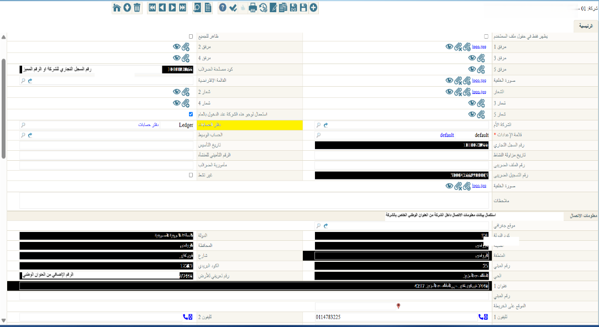
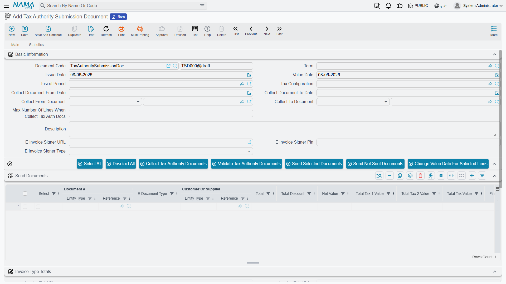

# Integration with ZATCA (Saudi Arabia – Fatoora)

## Overview

The Zakat, Tax and Customs Authority (ZATCA) requires VAT-registered businesses in Saudi Arabia to issue their invoices electronically and integrate with the **Fatoora** e-invoicing platform. NamaERP supports **Phase 2 (the Integration Phase)**, where the system generates each invoice as **UBL 2.1 XML**, signs it digitally, and submits it directly to the Authority.

Before diving into the setup steps, it helps to understand a few concepts you'll meet repeatedly during integration:

### Two kinds of invoices

Fatoora distinguishes between two invoice types, each with its own path:

| Type | Used for | Submission model | When is the invoice valid? |
|------|----------|------------------|----------------------------|
| **Standard / Tax Invoice (B2B)** | Business-to-business sales | **Clearance** | Only after ZATCA approves it and returns it stamped with an official QR code — it must not be shared with the buyer before that |
| **Simplified Invoice (B2C)** | Sales to end consumers | **Reporting** | Handed to the customer immediately at point of sale; reported to ZATCA within 24 hours |

::: tip
In the Tax Payer Configuration you'll find two flags: **Standard Invoices** and **Simplified Invoices**. Enable whichever matches your business — you can enable both if you sell to both businesses and individuals.
:::

### The onboarding lifecycle (CSID)

No system may send invoices until it has "onboarded" itself with the Authority. Onboarding has three stages, all performed automatically by the **Approve System** button:

1. **Generate the CSR**: the system builds a Certificate Signing Request from your business's tax data.
2. **Compliance CSID**: the system submits the request together with an **OTP** obtained from the Fatoora portal, then sends sample invoices to prove compliance.
3. **Production CSID**: once the compliance samples pass, the system obtains the final production certificate and stores it inside the configuration, making your business ready to submit live invoices.

## Prerequisites

Before you start, make sure you have:

- Access to the **Fatoora Portal** to generate the OTP.
- The business's **VAT Registration Number** (15 digits, starting and ending with 3).
- The **Commercial Registration Number (CRN)**.
- The complete **National Address** of the business.
- The **EGS Serial Number** (Electronic Generation Solution unit serial).
- The **ZATCA SDK** installed and the `zatca.war` signer deployed on the server (covered in the next section).

## Preparing the Client Server

The Authority's digital-signing toolkit (ZATCA SDK) is used to sign invoices and compute the hash and QR code. Follow these steps to prepare the server:

- Download the ZATCA SDK from [Zatca SDK](https://zatca.gov.sa/E-Invoicing/SystemsDevelopers/ComplianceEnablementToolbox/Pages/DownloadSDK.aspx)
- Extract the downloaded archive
- Inside the extracted folder you will find a file named `install.ba_` — rename it to `install.bat` and run it
  - You can easily rename it by selecting the file and pressing F2
- Go to Environment Variables via Computer Properties > Advanced, or run the following command in the Run Dialog (Win + R)
```sh
rundll32 sysdm.cpl,EditEnvironmentVariables
```
- Copy the `SDK_CONFIG` entry from the `User Variables` section to the `System Variables` section

::: tip Copy the variable automatically
You can run the following code in Windows PowerShell (must be run as Administrator) to copy the variable above instead of copying it manually:
```powershell
$varName = "SDK_CONFIG"
$userValue = [Environment]::GetEnvironmentVariable($varName, "User")
if ($userValue) {
    Write-Host "Copying $varName with value '$userValue' to system environment..."
    [Environment]::SetEnvironmentVariable($varName, $userValue, "Machine")
    Write-Host "Copied successfully."
} else {
    Write-Host "User environment variable '$varName' not found."
}
```
**Remember to run PowerShell as Administrator.**
:::

After copying — whether manually or using the PowerShell script — the result should look similar to the following:


- Open the file `Configuration/config.json` and verify that the paths inside it are correct.
- Download the `zatca.war` file from: <https://namasoft.com/bin/zatca.war>
  - Place the file in the `Tomcat Path/webapps` folder.

::: warning
`zatca.war` is the signing service the system calls on every submission. If you see the message **"Please update zatca JAR"**, the service is either not deployed or out of date.
:::

## Preparing the System

- From **"Global Configuration"** → Page 2, select `ZATCA (Saudi Arabia)` in the field **"e-Invoice Page To Show"**:

<GlobalConfigOption option-code="value.info.einvoicePageShowType" />

- After changing the field value, perform a **Regen UI** so the ZATCA page appears inside invoices and documents.

## Completing the Company Information

Fatoora relies on complete **seller (establishment)** data. Fill in the following fields in the company file (the legal entity / branch used in the configuration):

- Commercial Registration Number
- Tax Registration Number

Then complete the establishment's **National Address**:

- Country Code
- Country
- City
- Governorate
- District
- Street
- Building Number
- Postal Code
- Neighborhood
- Address 1
- Land Identifier



::: warning
The National Address is mandatory. If an address field (country, city, street, building number…) is missing, the configuration will fail validation and you'll see a message naming the missing field in the selected branch.
:::

## Creating a Tax Payer Configuration

Everything above comes together in the **Tax Payer Configuration** record. Create a new record and, on the main page, set the basic data:


When configuring, select the appropriate value in the **Tax Payer Type** field according to your integration stage:

| Value | Use |
|-------|-----|
| `Saudi Arabia - E-Invoice Developer Portal` | Developer (Sandbox) environment for testing and development |
| `Saudi Arabia - E-Invoice Simulation Portal` | Simulation environment for integration during the trial period |
| `Saudi Arabia - E-Invoice Portal` | Live (Production) integration |

::: tip
The **API URL** field is filled automatically when you pick the tax payer type. Always start with the **Simulation** environment and test your scenarios end-to-end before moving to production.
:::

Next, switch to the **ZATCA Page** tab to complete the integration data:


| Field | Description |
|-------|-------------|
| **Tax Reg No** | The establishment's VAT number (15 digits, starts and ends with 3) |
| **EGS Serial Number** | The Electronic Generation Solution unit serial — required for ZATCA integration |
| **Standard Invoices** | Enable if you issue tax invoices to businesses (B2B) |
| **Simplified Invoices** | Enable if you issue simplified invoices to individuals (B2C) |
| **Organization Unit Name** | Required for establishments belonging to a tax group: enter the **10-digit record number** when the 11th digit of the VAT number = 1 |
| **Password** | Used to enter the **OTP** at the time of system approval (see next section) |
| **Branch Dimension** | The branch / legal entity from which the seller data and National Address are taken |
| **Activity Type** | The business activity code of the establishment |

::: warning Tax Group
If your establishment is part of a tax group (the 11th digit of the VAT number equals 1), **Organization Unit Name** must contain a valid 10-digit record number, otherwise the system will refuse to generate the certificate request.
:::

## Approving the System (Onboarding)

After saving the configuration and filling in its data, onboard the system with the Authority:

1. Log in to the **Fatoora Portal** and generate an **OTP**.
2. Place the OTP in the **Password** field on the ZATCA page.
3. Click the **Approve System** button.

When clicked, the system performs the three stages described in the overview (generate CSR → compliance CSID + sample validation → production CSID) and stores the final certificate inside the configuration. On success, the establishment is ready to submit invoices.

::: tip
The compliance samples the system sends depend on which invoice types you enabled: enabling **Standard Invoices** validates standard invoice / credit note / debit note samples, and likewise for simplified. So enable only the types you will actually issue.
:::

::: warning
The OTP is valid for a limited time. If it expires before you click **Approve System**, generate a new one from the Fatoora portal.
:::

## Configuring Tax Codes and VAT Categories

ZATCA classifies every invoice line by its **VAT category**. Each tax used in your invoices must be mapped to a valid category:

| Code | Category | Description |
|------|----------|-------------|
| `S` | Standard rate | Taxable at the standard rate (**15%**) |
| `Z` | Zero rate | Zero-rated supply |
| `E` | Exempt | Exempt from VAT |
| `O` | Out of scope | Not subject to VAT |

When the category is not `S`, the Authority requires an **exemption / exception reason**. So set the following on the ZATCA page in the configuration:

- **ZATCA Exempt (E) Reason Code** — for exempt-item invoices.
- **ZATCA Zero Rate (Z) Reason Code** — for zero-rated items.
- **ZATCA Out Of Scope (O) Reason Text** — a free-text description for out-of-scope items.

The Authority uses a standardized list of exemption codes known as **VATEX**. Pick the code that matches your activity:

| Code | Reason |
|------|--------|
| `VATEX-SA-29` | Financial services |
| `VATEX-SA-29-7` | Life insurance services |
| `VATEX-SA-30` | Real estate transactions |
| `VATEX-SA-32` | Export of goods |
| `VATEX-SA-33` | Export of services |
| `VATEX-SA-34-1` | International transport of goods |
| `VATEX-SA-34-2` | International transport of passengers |
| `VATEX-SA-34-3` | Services connected to international passenger transport |
| `VATEX-SA-34-4` | Supply of a qualifying means of transport |
| `VATEX-SA-34-5` | Services related to goods or passenger transportation |
| `VATEX-SA-35` | Medicines and medical equipment |
| `VATEX-SA-36` | Qualifying metals |
| `VATEX-SA-EDU` | Private education to citizen |
| `VATEX-SA-HEA` | Private healthcare to citizen |
| `VATEX-SA-MLTRY` | Supply of qualified military goods |
| `VATEX-SA-OOS` | Out of scope of VAT |

::: warning
When using category `S`, the tax rate must be exactly **15%**. For categories `E`, `Z` and `O`, the invoice will not be accepted without a valid reason code/text.
:::

::: tip Where the exemption code comes from (Tax Plan)
You aren't limited to defining the exemption codes above on the configuration — you can also set them on the **Tax Plan** and its lines. The **Tax Codes Type** field on the configuration decides which level the codes are read from — the same mechanism used for your other tax codes — and when the chosen level leaves a code empty, the system falls back to the code defined on the configuration.
:::

## Customer (Buyer) Setup

For standard (B2B) invoices, the Authority needs to identify the buyer. Complete the tax data for every customer you will issue standard invoices to:

| Field | Description |
|-------|-------------|
| **Tax Reg No** | The buyer's VAT number — required for a VAT-registered buyer (B2B) |
| **ZATCA Buyer Id Type** | The type of identity used to identify the buyer (see the table below) — **optional**; if left empty it is auto-derived from whichever identity field is filled |
| **Id Number** | The identity value matching the selected type |
| **Address** | Country, city, district, street, building number and postal code |

Available buyer identity types:

| Code | Identity | Source field (value) | When to use |
|------|----------|----------------------|-------------|
| `TIN` | Tax Identification Number | Tax Reg No | A VAT-registered buyer |
| `CRN` | Commercial Registration | Commercial Reg No | Businesses and entities |
| `MOM` | MOMRAH License | Distinguished Number | As per license |
| `MLS` | MHRSD License | Distinguished Number | As per license |
| `700` | 700 Number (Unified National Number) | CR National Number | As per registration |
| `SAG` | MISA License | Distinguished Number | Investment entities |
| `NAT` | National ID | Id Number | Citizen individuals |
| `GCC` | GCC ID | Distinguished Number | GCC nationals |
| `IQA` | Iqama Number | Distinguished Number | Residents |
| `PAS` | Passport ID | Id Number | Non-residents |
| `OTH` | Other ID | Distinguished Number | Other cases |

::: tip Choosing the identity type by customer kind
- **Company / entity (private or government)** → usually `CRN` or `TIN`.
- **Individual citizen** → `NAT` (never use `CRN` for individuals).
- **Resident** → `IQA`, **visitor / foreigner** → `PAS`.
:::

::: tip Leave the type empty to auto-derive it
If you don't set **ZATCA Buyer Id Type**, the system infers the code from the filled field: an ID number on an **individual** → `NAT`, on a **foreigner** → `PAS`; a commercial registration or distinguished number → `CRN`; a **CR national number (the unified national number)** → `700`; and the VAT registration number → `TIN`. You only need to set the type explicitly to force a specific scheme (such as `MOM`, `MLS`, `SAG`, `GCC` or `IQA`), in which case the **distinguished number** is used as the identity value.
:::

::: tip Commercial registrations that begin with `700`
If the **Commercial Reg No** value itself starts with `700`, it is a Unified National Number and is automatically sent under scheme `700` instead of `CRN` — whether the buyer Id type is auto-derived or explicitly set to `CRN`.
:::

::: warning
On a standard invoice the buyer must carry **either a VAT number or one of the identity types above**; otherwise the invoice is rejected. The identity value must also be **alphanumeric only** — no dashes or spaces.
:::

## Sending Invoices

Invoices are collected and submitted to the Authority through the **Tax Authority Submission Document**.



Steps:

1. Create a new submission document and select the relevant **Tax Payer Configuration**, then set the collection range (from/to date or from/to document).
2. Click **Collect Tax Authority Documents** to add the invoices due for submission to the lines.
3. (Optional) Click **Validate Tax Authority Documents** to check the data before sending, or **Preview Documents Before Sent** to inspect the generated XML.
4. Click **Send Selected Documents** or **Send Not Sent Documents** to submit the invoices.

The system routes each invoice automatically by its type: **standard invoices go through the Clearance path** and **simplified invoices go through the Reporting path**.

### Submission statuses

After sending, each document's status is set to one of:

| Status | Meaning |
|--------|---------|
| **Not Sent** | Not yet submitted to the Authority |
| **Sent** | Accepted by the Authority (cleared or reported successfully) |
| **Not Valid Sent** | Rejected by the Authority — check the error field on the line for the reason |

### Tracking invoice status

- Use the **Check Tax Authority Status For Sent Document** button to query the final status from the Authority and update it on the lines.
- From the invoice itself, use **View Invoice At E Invoice Site** to open the invoice on the Authority's portal.

::: tip
For standard invoices, the legally valid version is the **Cleared Invoice** returned by the Authority, which carries the official QR code; the system keeps it after clearance. Simplified invoices carry a QR code from the moment they are issued.
:::

### Exporting the invoice XML

The submission document offers two actions to pull the raw UBL XML for the selected lines — useful for audits or for proving what was actually submitted:

- **Export Cleared / Sent XML For Selected Lines** — exports the exact XML the Authority received: the cleared (ZATCA-stamped, QR-bearing) version for standard invoices, or the reported version for simplified ones.
- **Export Current XML For Selected Lines** — regenerates the XML from the document's current data on the spot.

Exporting both and comparing them tells you whether the underlying invoice changed after submission: if the **current** XML no longer matches the **cleared/sent** one, the source document was edited after it was submitted. Lines belonging to authorities that don't use XML are skipped.

## Supported Document Types

| Type | Supported |
|------|-----------|
| Invoice | Yes |
| Credit Note | Yes |
| Debit Note | Yes |

## Maximum Days to Send

The default number of days allowed to send an invoice after its value date is **3 days**, and likewise to cancel it. You can change this via the **Max Days To Send Invoice** and **Max Days To Cancel Invoice** fields in the configuration.

## Common Rejection Causes

| Problem | Solution |
|---------|----------|
| Seller/buyer identity rejected | Make sure the identity type is correct, its value is alphanumeric only, and the National Address is complete |
| Invalid VAT number | Must be 15 digits starting and ending with 3 |
| Standard invoice with no buyer identification | Add the buyer's VAT number or one of the identity types |
| Exempt/zero-rated line without a reason | Set the exemption reason code (E/Z) or out-of-scope text (O) in the configuration |
| "Please update zatca JAR" | Make sure `zatca.war` is deployed in `webapps` and running |
| "Please approve system first" | Click Approve System after entering the OTP |
