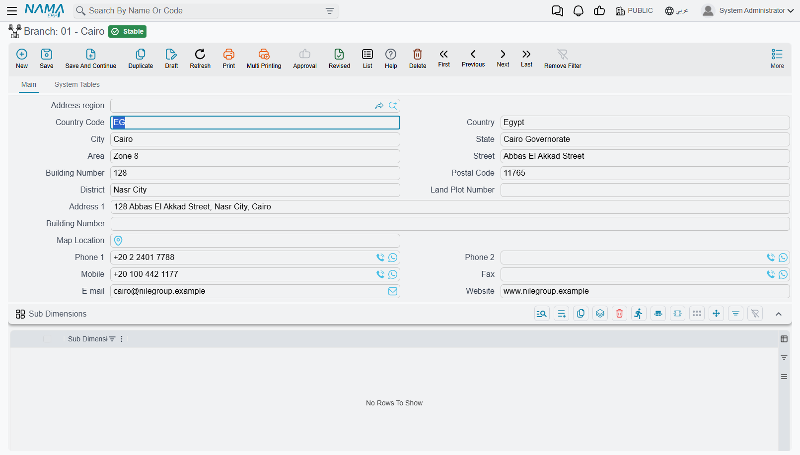
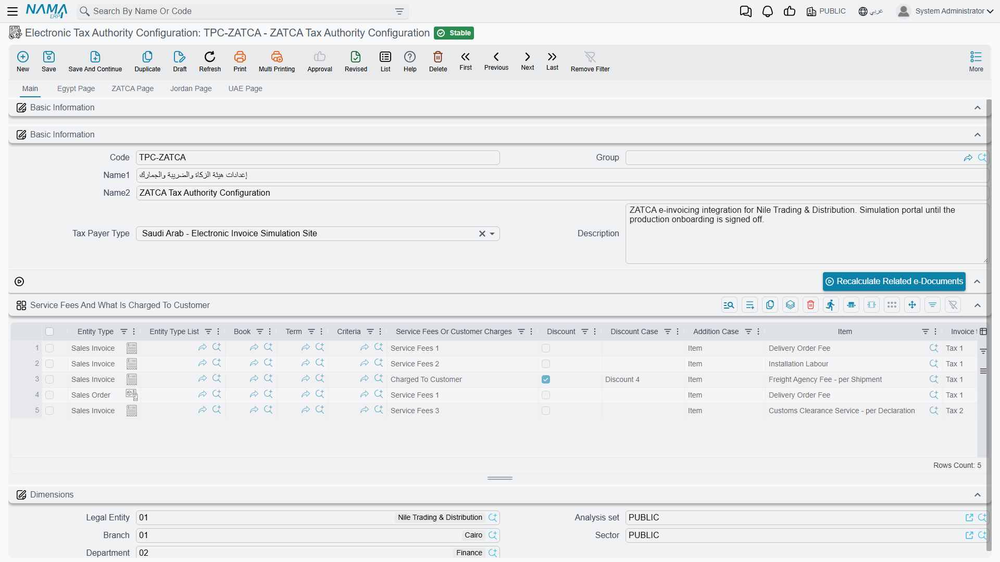
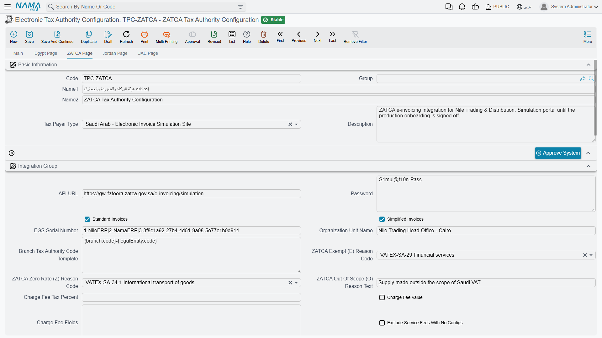
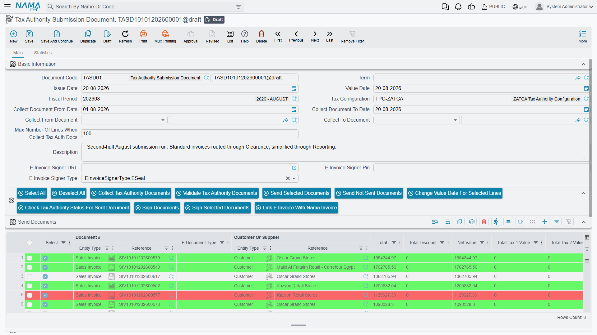

# Integration with ZATCA (Saudi Arabia – Fatoora)

The Zakat, Tax and Customs Authority (ZATCA) requires every VAT-registered business in Saudi Arabia to issue its invoices electronically through the **Fatoora** platform. Nama ERP implements **phase 2**, the integration phase. Each invoice, return and debit note is built as UBL 2.1 XML, signed, and sent to ZATCA one document at a time.

The collecting, validating and sending is the same machine Nama uses for every country, and it is described once in [Electronic Invoicing in Nama ERP](./e-invoices-guide.md). This page covers what is specific to Saudi Arabia: preparing the server, onboarding with ZATCA, how Nama decides what kind of invoice a document is, and what each part of the invoice is taken from.

## What is different about Saudi Arabia

**Two kinds of invoice, two routes.** ZATCA splits sales into two kinds, and they travel differently:

| Kind | Typical buyer | Route | When is it legally an invoice? |
|---|---|---|---|
| **Standard tax invoice** | A business or government body | **Clearance** — ZATCA checks it and returns a stamped copy | Only after ZATCA clears it. The cleared copy is the one the buyer is entitled to. |
| **Simplified tax invoice** | A consumer | **Reporting** — you hand it over, then report it within 24 hours | Immediately. ZATCA's check comes after the fact. |

You do not choose the kind per document. Nama decides it from the customer, as explained in [Standard or simplified?](#Standard-or-simplified).

**Every document is chained to the one before it.** Each document carries a running counter and the hash of the previous document sent from the same unit. ZATCA uses the chain to detect a missing or altered invoice. In Nama, one **Electronic Tax Authority Configuration** is one sending unit — ZATCA calls it an *EGS unit* — with its own counter and its own chain.

**You must be onboarded before you can send.** ZATCA only accepts documents from a unit it has certified. Certification is a one-time exchange driven by a one-time password (OTP) from the Fatoora portal. Nama runs it from the **Approve System** button.

## Preparing the server

ZATCA's signing toolkit (the ZATCA SDK) and Nama's signing service, `zatca.war`, must both be on the Nama server before anything else works.

1. Download the SDK from [ZATCA's SDK page](https://zatca.gov.sa/E-Invoicing/SystemsDevelopers/ComplianceEnablementToolbox/Pages/DownloadSDK.aspx) and extract it.
2. In the extracted folder, rename `install.ba_` to `install.bat` (select it and press F2) and run it.
3. The installer creates an environment variable named `SDK_CONFIG` for the current user only. Tomcat runs as a service and does not see it, so copy it to the **System Variables**. Open the editor with Win + R and:
   ```sh
   rundll32 sysdm.cpl,EditEnvironmentVariables
   ```

   ::: tip Copy the variable with PowerShell instead
   Run this in PowerShell **as Administrator**:
   ```powershell
   $varName = "SDK_CONFIG"
   $userValue = [Environment]::GetEnvironmentVariable($varName, "User")
   if ($userValue) {
       Write-Host "Copying $varName with value '$userValue' to system environment..."
       [Environment]::SetEnvironmentVariable($varName, $userValue, "Machine")
       Write-Host "Copied successfully."
   } else {
       Write-Host "User environment variable '$varName' not found."
   }
   ```
   :::

   The result should look like this:

   

4. Open `Configuration/config.json` in the SDK folder and check that every path in it points at a file that exists.
5. Download `zatca.war` from <https://namasoft.com/bin/zatca.war>, put it in Tomcat's `webapps` folder, and restart Tomcat so it picks up the new system variable.

To confirm the service is up, open `http://<server>:<port>/zatca/api` in a browser — it answers **Zatca war is running**. If Nama shows *Please update zatca JAR* when you approve or send, the service is not deployed or not running.

## Switching the ZATCA page on

In **Global Configuration**, page 2, set **e-Invoice Page To Show** to **ZATCA Page**:

<GlobalConfigOption option-code="value.info.einvoicePageShowType" />

Then run a **Regen UI** so the ZATCA page appears on the configuration and the documents.

::: warning Choose ZATCA Page, not All Pages
When the field is empty or set to **All Pages**, Nama checks tax and unit codes against the Egyptian code lists, and Saudi documents fail validation with codes that are perfectly valid for ZATCA. Choose **All Pages** only if the same database also files in Egypt.
:::

## Who ZATCA thinks you are

ZATCA identifies the seller by its VAT number, its commercial registration and its national address. Nama takes them from two places.

**From the configuration:** the seller's VAT number is the configuration's **Tax Registeration NO**. It must be 15 digits, starting and ending with 3.

**From the document's Legal Entity:** everything else comes from the Legal Entity the invoice is issued under:

| What ZATCA needs | Where Nama takes it from |
|---|---|
| Seller name | The Legal Entity's Arabic name |
| Commercial registration (CRN) | The Legal Entity's **Tax Authority Code**, in its dimension information. Letters and digits only. |
| National address | The address on the Legal Entity's contact information: **Country Code**, country, state, city, **District**, street, **Building Number** (exactly 4 digits), **Postal Code** (exactly 5 digits) and **Land Plot Number**. |



The configuration's **Branch Id From** field decides which record is checked when the configuration is saved, and which record is described to ZATCA during onboarding. Set it to **Legal Entity**, and set the configuration's own Legal Entity to the company it sends for. That keeps the record Nama checks, the record ZATCA certifies, and the record printed on the invoices the same. A group with several legal entities needs one configuration per legal entity.

## Creating the configuration

Open **Electronic Tax Authority Configuration**, create a record, and pick the **Tax Payer Type**. The type sets both the environment and the **API URL**:

| Tax Payer Type | Environment |
|---|---|
| Saudi Arab - Electronic Invoice Sandbox | ZATCA's developer portal. Good for a first try; nothing there is real. |
| Saudi Arab - Electronic Invoice Simulation Site | ZATCA's simulation. Use it for an end-to-end rehearsal with your own data. |
| Saudi Arab - Electronic Invoice Site | Live. |



Then fill the **ZATCA Page**:



| Field | What to put in it |
|---|---|
| **Password** | The OTP from the Fatoora portal, used by **Approve System**. The field is required on every save, so once onboarding is done any value may stay in it. |
| **EGS Serial Number** | The serial of this sending unit. Required. ZATCA's format is shown below the table. |
| **Standard Invoices** / **Simplified Invoices** | Which kinds this unit will issue. These ticks only decide which sample documents are submitted during onboarding. They do not route individual documents. |
| **Organization Unit Name** | For a member of a VAT group (the 11th digit of the VAT number is 1), the 10-digit commercial registration of the member. Otherwise, any branch name. |
| **ZATCA Exempt (E) Reason Code**, **ZATCA Zero Rate (Z) Reason Code**, **ZATCA Out Of Scope (O) Reason Text** | The reasons sent with exempt, zero-rated and out-of-scope lines. See [Taxes and VAT categories](#Taxes-and-VAT-categories). |
| **Branch Id From** | **Legal Entity** — see above. |
| **Activity Type** | Required. For ZATCA it is only sent during onboarding, as the business category. |
| **Calculate Tax Codes Types From** | Where each tax's ZATCA category is read from. See [Taxes and VAT categories](#Taxes-and-VAT-categories). |
| **Tax Registeration NO** | The seller's 15-digit VAT number. |
| **Max Days To Send Invoices** | How old a document may be and still be sent. New configurations start at 3. |
| **Start Sending From Date** | Documents dated before this day are never sent. Use it so switching ZATCA on does not sweep up old invoices. |
| **Days To Allow Save Document In Future** | How far ahead a document that goes to ZATCA may be dated. |

ZATCA expects the **EGS Serial Number** as three numbered parts — the solution's name, its model or version, and the unit's own serial:

```text
1-Nama|2-ERP|3-0001
```

::: warning Do not duplicate a configuration to make a second unit
**Duplicate** copies the certificate ZATCA issued to the original, so two units would be sending under one identity, each with its own counter. Create the second configuration from scratch, or approve the copy with its own OTP and EGS serial before it sends anything.
:::

## Onboarding: Approve System

Save the configuration first, then:

1. Log in to the Fatoora portal for the same environment (simulation for simulation, live for live) and generate an OTP for one unit.
2. Put the OTP in **Password** and save.
3. Press **Approve System**.

In one go, Nama then:

1. Builds a certificate request from the configuration: the VAT number, the Legal Entity's name, address and CRN, the EGS serial, the organization unit name and the activity type.
2. Asks ZATCA for a compliance certificate using the OTP.
3. Submits ZATCA's compliance samples: a standard invoice, credit note and debit note if **Standard Invoices** is ticked, and the simplified three if **Simplified Invoices** is ticked.
4. If every sample passes, asks for the production certificate and stores it on the configuration.

When it succeeds, the button returns without a message, and the configuration is ready to send. When anything fails, the button shows ZATCA's own reasons and nothing is stored. Fix what they point at, get a fresh OTP, and press it again.

An OTP is valid for one hour and for one use. Pressing **Approve System** again later, with a new OTP, onboards the unit afresh and replaces the stored certificate.

## Standard or simplified?

Nama decides the kind of each document from the customer's **Tax Info**, through the customer's **The legal entity of the company** field:

| The legal entity of the company | Document kind |
|---|---|
| Government | Standard — cleared |
| Private Sector | Standard — cleared |
| Individual | Simplified — reported |
| Foreigner | Simplified — reported |
| Empty | Standard if the customer has a **Tax Registeration NO**, simplified if not |

A document with no customer at all is treated as standard, and standard invoices need a buyer, so give cash sales a customer — a generic "cash customer" with **Individual** is enough.

The **Standard Invoices** and **Simplified Invoices** ticks on the configuration play no part here. A unit onboarded for standard invoices only will still try to send a simplified one when the customer calls for it, and ZATCA decides whether to accept it.

## Who ZATCA thinks the customer is

A standard invoice must name the buyer and identify it. A simplified one needs neither, though anything you fill is sent.

The buyer's name is the customer's Arabic name, its VAT number is the customer's **Tax Registeration NO**, and its address follows the same fields as the seller's. When the country is SA, the **Postal Code** must be 5 digits.

The identity is a scheme plus a value. If **ZATCA Buyer Id Type** is set on the customer's Tax Info, Nama uses that scheme and takes the value from the matching field:

| Code | Identity | Value taken from |
|---|---|---|
| `TIN` | VAT number | **Tax Registeration NO** |
| `CRN` | Commercial registration | **Commercial Registration Number** |
| `700` | Unified national number | **Commercial Registration National Number** |
| `NAT` | National ID | **Id Number** |
| `PAS` | Passport | **Id Number** |
| `MOM`, `MLS`, `SAG`, `GCC`, `IQA`, `OTH` | MOMRAH, MHRSD and MISA licences, GCC ID, Iqama, other | **Special Number** |

If **ZATCA Buyer Id Type** is empty, Nama works it out, taking the first that applies:

1. An **Individual** with an **Id Number** → `NAT`.
2. A **Foreigner** with an **Id Number** → `PAS`.
3. A **Commercial Registration Number** → `CRN`.
4. A **Commercial Registration National Number** → `700`.
5. A **Special Number** → `CRN`.
6. A **Tax Registeration NO** → `TIN`.

A commercial registration that itself starts with `700` is a unified national number, so it is always sent under `700` rather than `CRN`.

::: warning Special Number wins
Whenever the customer's **Special Number** is filled, it is the value sent, whichever scheme was chosen. Fill it only for customers identified by one of the licence or ID schemes it is meant for (`MOM`, `MLS`, `SAG`, `GCC`, `IQA`, `OTH`).
:::

Dashes and spaces are removed from the identity before sending.

## Which documents are sent, and as what

A document goes to ZATCA when its **document book** or its **term** has **Send To Tax Authority** ticked and names this configuration in **Tax Configuration**. The general guide explains this in [What the configuration decides](./e-invoices-guide.md#What-the-configuration-decides). Sales invoices and returns, POS invoices and returns, service, rent, contracting and the other invoicing documents all qualify the same way.

Each document is sent as one of ZATCA's three types:

| ZATCA type | Which documents |
|---|---|
| **Credit note** | Returns: sales returns, POS returns, and the other return documents. |
| **Debit note** | Any document whose term has **Tax Authority Debit Note** ticked. Credit/debit notes and real-estate cancellation and fine documents take the type from the term's **Send As** instead. |
| **Invoice** | Everything else. |

Credit and debit notes need two things invoices do not:

- **The original invoice.** ZATCA wants to know which invoice is being corrected. Nama sends the code of the document in **From Document**, so create returns from the invoice they reverse.
- **A reason.** The document's **Description** field (**Remarks** on some screens) is sent as the reason for the note, and validation refuses a note without one.

Every document also needs a **payment means**. Nama takes the term's **Payment Method Code** first, then the **Tax Authority Code** of the [payment method](/platform/payments/payment-methods-and-terminals) on the first payment line, then `10` (cash) if the document was paid in cash, and otherwise `1` (not specified).

## What each line carries

- **The item** is identified by its **Tax Authority Code**, or by its code if that is empty. **Calculate Item Code From** can take the code from the item's group, brand or category instead, and **Item Code Template** can build it from a pattern. This value is what appears as the line's item name on ZATCA's side.
- **The unit** is the unit's **Tax Authority Code**.
- **The price** is the unit price before tax, at 2 decimals. Discounts before tax become a discount on the line, and the document's header discount is spread over the lines.
- **Service fees** charged to the customer are sent as a document-level charge, unless they are set up to become item lines.

**Currency.** ZATCA wants the VAT total in riyals, so the database must have a default currency whose **Tax Authority Code** is `SAR`. A document in another currency is sent in its own currency, with the VAT total also converted to riyals at the document's rate.

**Rounding.** The payable amount is rounded to the nearest whole riyal, and the difference is sent as a rounding amount, so the XML's amount due can differ from the document's net by up to half a riyal.

## Taxes and VAT categories

ZATCA classifies every line by a VAT category:

| Category | Meaning | Reason needed |
|---|---|---|
| `S` | Standard rate (15%) | No |
| `Z` | Zero-rated | A `VATEX` code |
| `E` | Exempt | A `VATEX` code |
| `O` | Out of scope | Free text — Nama always sends the code `VATEX-SA-OOS` |

The category of each tax comes from its tax codes, which hold the ZATCA type (`VAT`) and sub-type (`S`, `Z`, `E` or `O`). **Calculate Tax Codes Types From** decides where those codes are read from — the configuration itself, the item's, term's or customer's tax plan, or the tax configuration — and a tax plan can also hold its own exemption reasons that override the configuration's. A document whose **Taxable** box is cleared is sent as exempt.

The reasons come from the configuration's **ZATCA Exempt (E) Reason Code**, **ZATCA Zero Rate (Z) Reason Code** and **ZATCA Out Of Scope (O) Reason Text**, unless the tax plan has its own. ZATCA's list:

| Code | Reason |
|---|---|
| `VATEX-SA-29` | Financial services |
| `VATEX-SA-29-7` | Life insurance services |
| `VATEX-SA-30` | Real estate transactions |
| `VATEX-SA-32` | Export of goods |
| `VATEX-SA-33` | Export of services |
| `VATEX-SA-34-1` | International transport of goods |
| `VATEX-SA-34-2` | International transport of passengers |
| `VATEX-SA-34-3` | Services connected to international passenger transport |
| `VATEX-SA-34-4` | Supply of a qualifying means of transport |
| `VATEX-SA-34-5` | Services related to goods or passenger transportation |
| `VATEX-SA-35` | Medicines and medical equipment |
| `VATEX-SA-36` | Qualifying metals |
| `VATEX-SA-EDU` | Private education to a citizen |
| `VATEX-SA-HEA` | Private healthcare to a citizen |
| `VATEX-SA-MLTRY` | Supply of qualified military goods |
| `VATEX-SA-OOS` | Out of scope of VAT |

`VATEX-SA-EDU` and `VATEX-SA-HEA` apply only to citizens, so ZATCA expects the buyer's national ID (`NAT`) on those invoices.

## Sending

Sending follows the general cycle — collect, validate, send — on a **Tax Authority Submission Document**, as described in [Sending: collect, check, send](./e-invoices-guide.md#Sending-collect-check-send).



What is particular to ZATCA:

- **One document per request.** Standard documents go to clearance, simplified ones to reporting, and the answer comes back in the same exchange. The line becomes **Sent** or **Not Send Correctly** at once, with ZATCA's reasons on the line. There is nothing further to ask ZATCA afterwards, so **Check Tax Authority Status For Sent Document** has no effect for Saudi documents.
- **There is no signing step to press.** Signing happens as part of sending.
- **Send in order.** Because each document carries the hash of the one before it, send a unit's documents in date order and resend rejected ones once corrected, rather than leaving them behind.
- **The cleared copy is kept.** For a standard invoice, ZATCA's cleared XML — with ZATCA's stamp and QR code — is stored on the submission line.

### Deadlines

New configurations allow **3 days** between a document's date and its sending. A document older than **Max Days To Send Invoices** cannot be saved with a value date that far back, and one that grows too old before it is sent is no longer collected. ZATCA expects simplified invoices to be reported within 24 hours, so schedule the [automatic flows](./e-invoices-guide.md#Keeping-it-running-without-anyone-watching) rather than relying on someone remembering.

### Correcting a sent document

Once a document is **Sent**, Nama locks it: it cannot be edited or deleted. ZATCA has no cancellation either. The correction is a new document — a sales return (credit note) to reduce or reverse the invoice, or a document sent as a debit note to increase it — created from the original so it carries the reference.

### The XML and the PDF

**Export Cleared / Sent XML For Selected Lines** on the submission document gives you the XML ZATCA holds: the cleared copy for standard invoices and the reported one for simplified ones. **Export Current XML For Selected Lines** rebuilds it from today's data, unsigned. If the two differ, the document has changed since it was sent.

To hand customers a PDF with the XML inside it, as ZATCA's PDF/A-3 format expects, tick **Include ZATCA XML In PDF** on the invoice's print form in **Report Definition**. It is available on user-form reports for invoices and returns, and attaches the XML ZATCA holds.

## Messages you may see

The generic validation messages — a field required, a code invalid, a value date outside the window, a book and term naming different configurations — are listed in the [Egyptian guide](./egypt-einvoice-guide.md#Messages-you-may-see) and read the same for Saudi documents. The messages below are particular to ZATCA. Most of them have no Arabic text and appear in English on Arabic screens.

| Message | Why | What to do |
|---|---|---|
| *Please update zatca JAR* | Nama could not reach the `zatca.war` signing service. | Deploy `zatca.war` in Tomcat's `webapps` and restart Tomcat. See [Preparing the server](#Preparing-the-server). |
| *Please approve system first in tax payer configuration file* | The configuration has no production certificate yet. | Run [Approve System](#Onboarding-Approve-System). |
| *CSR is not generated, please check company vat information* | The certificate request could not be built from the configuration. | Check **Tax Registeration NO**, **EGS Serial Number** and the Legal Entity's name and address, then try again. |
| *In case of a company belongs to a group please provide field {0} with a valid 10 numbers (Record Number)* | The VAT number belongs to a VAT group (its 11th digit is 1), and **Organization Unit Name** is not a 10-digit number. | Enter the member's 10-digit commercial registration in **Organization Unit Name**. |
| *Error while approving system {0}* | ZATCA refused the OTP or a compliance sample; {0} carries ZATCA's reasons. | An expired or used OTP is the usual cause — generate a new one. Otherwise fix what the reasons point at. |
| *Error while validating tax authority document {0} - the seller VAT registration number is required by ZATCA (BR-KSA-39)* | **Tax Registeration NO** on the configuration is empty. | Fill it. |
| *Error while validating tax authority document {0} - the seller VAT registration number {1} must be 15 digits starting and ending with 3 (BR-KSA-44)* | The VAT number is mistyped. | Correct **Tax Registeration NO** on the configuration. |
| *Error while validating tax authority document {0} - the branch commercial registration field {1} is required by ZATCA (BR-KSA-08)* | The document's Legal Entity has no **Tax Authority Code**. | Enter the commercial registration number in the Legal Entity's **Tax Authority Code**. |
| *Error while validating tax authority document {0} - the branch commercial registration {1} must contain only letters and digits (BR-KSA-08)* | The Legal Entity's **Tax Authority Code** has dashes, spaces or symbols. | Keep letters and digits only. |
| *Error while validating tax authority document {0} - the seller building number {1} must contain 4 digits (BR-KSA-37)* | The Legal Entity's **Building Number** is not 4 digits. | Correct it from the national address. |
| *Error while validating tax authority document {0} - the seller postal code {1} must be 5 digits (BR-KSA-66)* | The Legal Entity's **Postal Code** is not 5 digits. | Correct it. |
| *Error while validating tax authority document {0} - the buyer postal code {1} must be 5 digits (BR-KSA-67)* | A Saudi customer's **Postal Code** is not 5 digits. | Correct it on the customer. |
| *Error while validating tax authority document {0} - VAT category {1} requires a VATEX exemption reason code, please fill field {2} in the tax payer configuration (BR-KSA-CL-04)* | A line is exempt (`E`) or zero-rated (`Z`), and no reason code is set. | Fill the field named in {2} on the configuration, or the reason on the tax plan. |
| *There is must be currency with tax authority code SAR and it should be default currency* — «يجب ان يكون هناك عملة بكود ضريبي SAR وان تكون هي العملة الافتراضية» | No default currency carries the code `SAR`. | Put `SAR` in the riyal's **Tax Authority Code** and make it the default currency. |
| *Field {0} in selected dimension {1} is required* — «الحقل {0} في الفرع المختار {1} مطلوب» | Shown on saving the configuration: the record chosen in **Branch Id From** lacks its **Tax Authority Code** or part of its address. | Complete that record. |
| *Document {0} can not be modified or deleted because it was sent to the tax authority* — «لا يمكنك تعديل او حذف المستند {0} حيث انه تم ارساله الي مصلحة الضرائب» | The document has been accepted by ZATCA. | Issue a credit or debit note instead. See [Correcting a sent document](#Correcting-a-sent-document). |
| *We will not send document {0}, please check value date is before {1} days from today or in the period of two fields start from {2} to {3}* — «لن يتم إرسال المستند {0}, الرجاء التحقق من التاريخ الفعلي قبل {1} ايام من اليوم او بداخل الفتره المحدده بالحقلين من {2} الي {3}» | The document is older than **Max Days To Send Invoices**. | ZATCA expects documents on time. A document past the window has to go through ZATCA's own late-submission process. |
