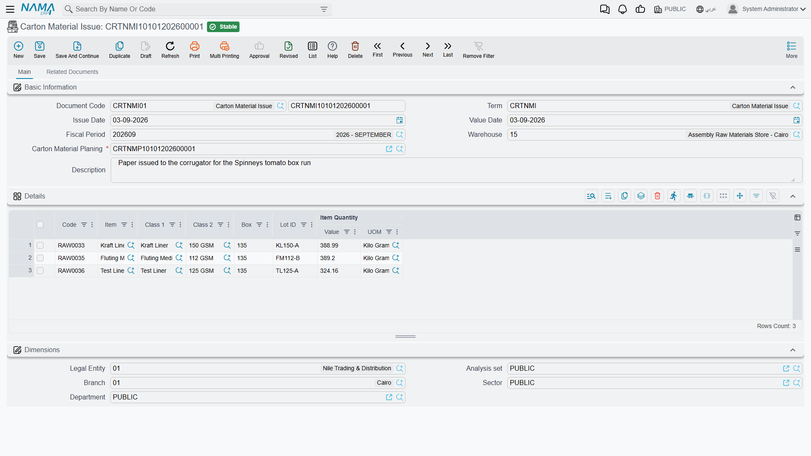
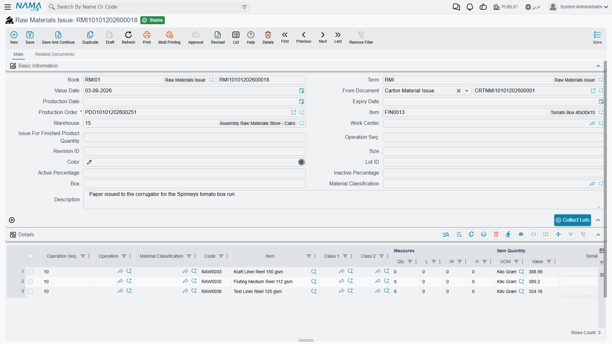

# Carton Material Issues: From Store to Shop Floor

## Connecting Planning to Execution

You have a material planning document. The optimizer worked out which reels to use, at which widths, in what quantities. Production orders are generated and ready.

Now the paper has to physically leave the store and reach the corrugator. That is what a **Carton Material Issue** does.

You'll find it under **Manufacturing → Cartoon → Carton Material Issue**.

## The Three Rules That Govern This Screen

Before anything else, three hard rules. All three are enforced, all three will stop you, and knowing them saves a puzzling half-hour.

**A carton material issue must name a planning document.** **Carton Material Planing** is marked required on the screen — the red asterisk on the field is not decorative. There is no such thing as an ad-hoc carton material issue that stands on its own. If you want to move paper without a plan behind it, that is an ordinary [stock issue](/modules/supplychain/issuing-stock), not this document.

**That planning document must already have materials.** The issue is checked against the plan's cutting output, so a plan that has not been through **Collect Materials** has nothing to check against. Try to save against one and Nama says so plainly: *Could not find any materials in planning document*.

**And that planning document must already have generated its production orders.** This is the rule that surprises people, because nothing on the screen hints at it. The issue does not charge material to the plan; it charges it to the production order the plan created, so it goes looking for that order and refuses to save without it: *Could not find production order generated by planning document*. A plan that has been solved but never taken through **Generate Production Orders** is not yet something you can issue against.

::: warning The order of work is not optional
Order → planning document → **Collect Materials** → **Generate Production Orders** → material issue. Each step is a precondition for the next, and skipping any of them fails at save rather than at commit — which is at least fast feedback.
:::

## What the Document Generates

A carton material issue is not the end of the chain. **Committing one generates a [Raw Materials Issue](./raw-material-issue.md)** — the standard manufacturing document that actually charges the material onto the production order. The carton issue is the carton-aware front end; the raw material issue is what the costing engine sees.

That generated document appears on the **Related Documents** tab, under **Raw Materials Issue**. Open it and you can read the whole chain off its header: **From Document** points back at the carton material issue, **Production Order** at the order the material is charged to, and **Item** at the carton being made.

This has a setup consequence that catches people out. **The carton material issue term must name the book and term to use for the document it generates** — the two settings are **Generated Raw Material Issue Book** and **Generated Raw Material Issue Term**, in the term's **Generation** group. Leave either empty and every attempt to commit fails with a message naming the missing setting. It is a one-time configuration, but nothing works until it is done.

## Filling In the Document

The screen is deliberately small. There is one header block, one grid, and the dimensions.

### The Header

**Document Code** carries the **Book** and number, and **Term** the settings — including the generation settings above. **Issue Date**, **Value Date** and **Fiscal Period** date the movement.

**Warehouse** is where the paper is pulled from. Note that it sits in the **header**, not on the lines: one carton material issue draws from one store. Materials coming out of two different stores need two documents.

**Carton Material Planing** is the required link to the plan, as described above.

**Description** is free text.

### The Details Grid

Each row is one material being issued, and the grid is short by design:

**Code** and **Item** identify the reel item.

**Class 1** and **Class 2** are the paper grade and the grammage — the same two classifications the optimizer matched on, carried through so the issue is self-describing.

**Box** is the reel width. This is the column that matters most on this screen, and it is easy to skim past because "Box" does not sound like a width. On a paper reel item the Box dimension *is* the width, so the row saying `135` is saying "a 135 cm reel" — reel widths on these screens are in centimetres, the same unit the planning document works in.

**Lot ID** is the specific reel. Where the plan pinned a lot down, match it.

**Item Quantity | Value** and **UOM** are how much. Reels are normally stocked by weight, so this is usually kilogrammes rather than metres — the metres are the plan's **Metric Length**, which is what the shop floor cuts, not what the store issues.

## What Committing Does

Committing the issue reduces the stock of each item, at that lot and that Box width, in the header warehouse, and generates the raw material issue that charges the material onto the production order.

The multi-dimensional part is worth being explicit about, because it is the whole reason carton stock behaves the way it does. Nama tracks a balance per item **per lot per Box width per warehouse**. A reel item holding 8,000 kg at 135 cm and 5,200 kg at 145 cm has two independent balances, and issuing from the 135 leaves the 145 untouched. Get the Box value wrong on a line and you will draw down a width you did not mean to, while the width you actually cut stays on the books.

## Working With Material Issues in Practice

Issue against the plan the optimizer produced, and match its widths. Substituting a 145 cm reel where 135 cm was planned is not a like-for-like swap: the cutting pattern was calculated for a specific width, and on a different one the pieces may simply not fit the way the plan says they will. If you have to substitute, expect the trim to differ from the plan and say why in the description — that note costs seconds now and answers a question that would otherwise take an hour to reconstruct.

Issue promptly, too. A plan built on last week's stock picture may no longer be executable, because someone else may have drawn from the same lot in the meantime. The gap between planning and issuing is where plans quietly go stale.

Keep one plan to one issue where you can. Partial issues are supported and there are good operational reasons for them — staging space on the floor is a real constraint — but each extra document makes the trail from plan to consumption a little harder to follow.

And give the shop floor the lot and the width, not just the item. A lot number correct on paper achieves nothing if the operator pulls the wrong physical reel off the rack, and on a paper store the wrong reel usually looks exactly like the right one.

## Where This Sits in the Chain

The material issue is the handover from planning's ideal world to production's real one:

**[Carton Material Planning](./carton-material-planning.md)** decides what to cut and from which reels.

**Carton Material Issue** takes that paper out of the store and generates the raw material issue that charges it to the job.

**[Production Execution](./production-execution.md)** records what was actually made.

**[Order Close](./production-costing.md)** compares what was issued against what the plan said should have been issued, and settles the cost.

That last comparison is the point of doing any of this precisely. The variance between planned and issued material is the number that tells you whether the optimizer's plan survived contact with the shop floor — and it is only as honest as the widths and lots you typed on this screen.
