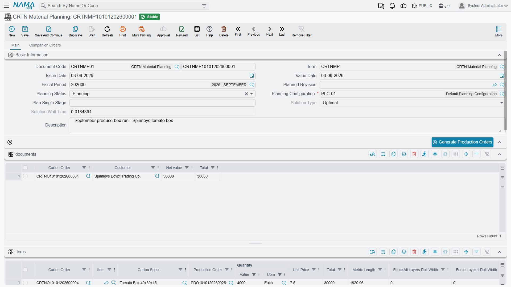
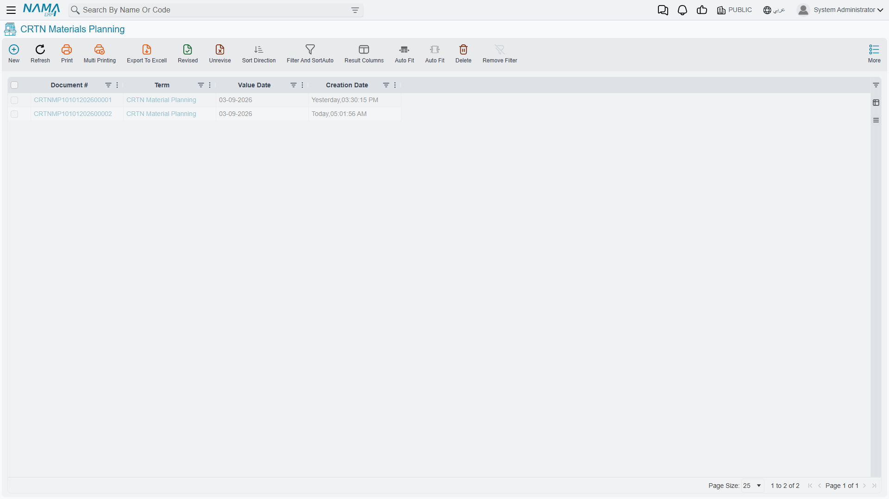
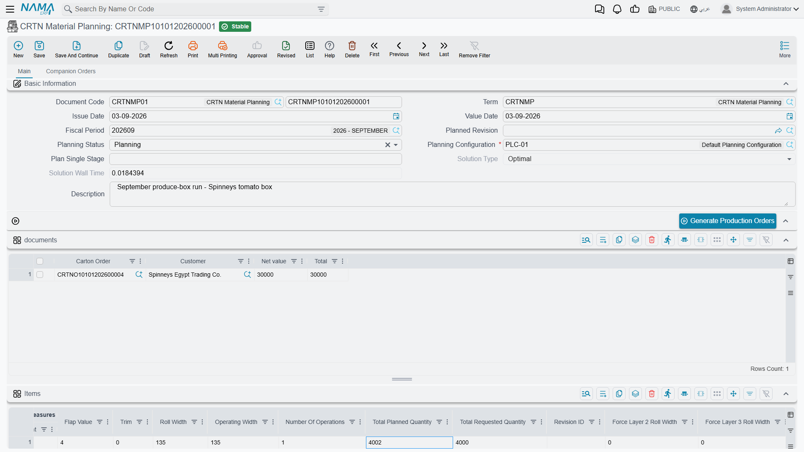
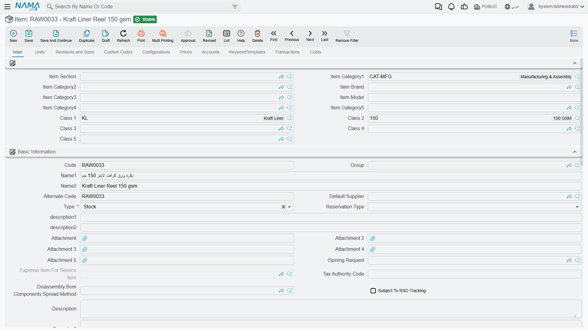
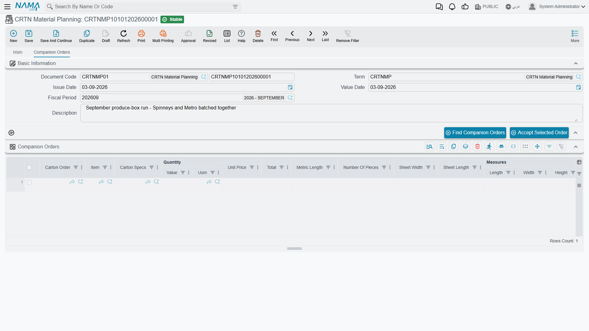
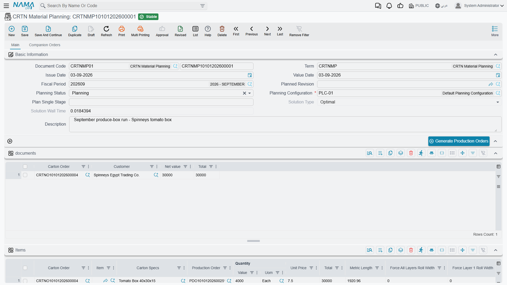
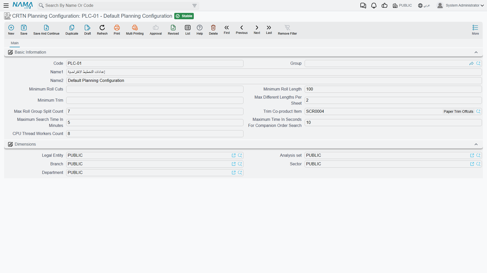
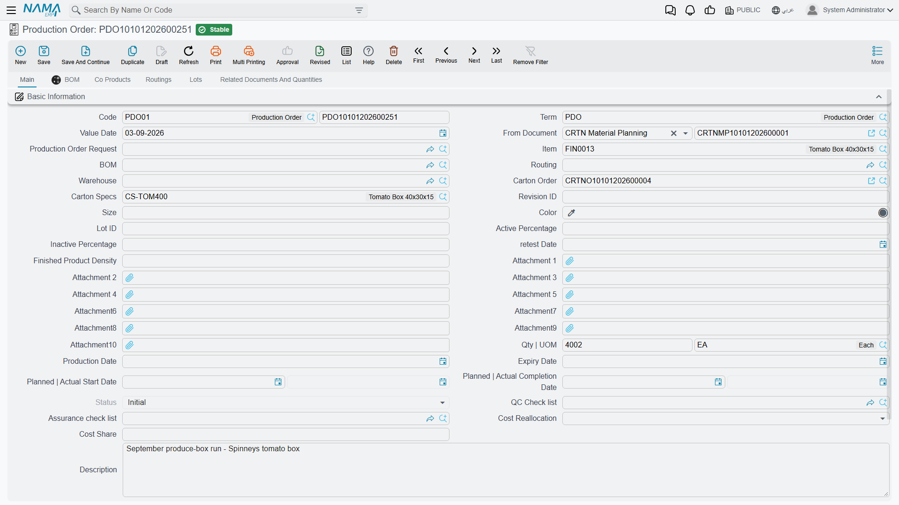

# Carton Material Planning: The Optimization Engine

## The Heart of Material Efficiency

This is where Nama ERP earns its keep in carton manufacturing. You have orders to fulfil, reels of paper in the store, and a simple goal: cut those reels to produce the ordered cartons with minimum waste.

Sounds simple. It isn't.

You have several orders of different sizes. Several layers per carton, each from a different grade of paper. Several reel widths in stock. Constraints on minimum trim, minimum cuts per reel, maximum production complexity. And an enormous number of ways to cut everything.

**Carton Material Planning** takes that complexity and searches for the cutting plan with the least waste. You tell it what has to be made and what material is available; it tells you how to cut each reel.

You'll find it under **Manufacturing → Cartoon → CRTN Material Planning**.

The list view is the planning register — every run, with the status and the solution it reached.

## How the Screen Is Laid Out

The document has two tabs, and the **Main** tab is a stack of four grids rather than one long form. What makes it readable is that **each grid has its own action button sitting directly above it**, and that button is what fills the grid below:

| Action | What it does |
| --- | --- |
| **Generate Production Orders** | Consumes the finished plan and creates the production orders |
| **Collect Materials** | Fills **Materails** — the cutting plan |
| **Review Available Quantities** | Fills **Available Materials** — stock against requirement |
| **Find Companion Orders** / **Accept Selected Order** | Fill **Companion Orders**, on its own tab |

So the screen reads top to bottom as the order you work in: describe what you need, find material, check it is really there, and only then generate production orders.

The **Companion Orders** tab is a separate page with its own copy of the basic header and its own two buttons. It is a search workspace rather than part of the plan itself, which is why it sits apart.

## Setting Up the Planning Document

### The Header

**Document Code** carries the **Book** and the document number, and **Term** the settings that govern the document. **Issue Date**, **Value Date** and **Fiscal Period** date it as on any other document.

**Planning Configuration** is **required** — the field is marked with a red asterisk, and nothing else on the screen works without it. It names the parameter set the solver obeys: minimum trim, search time, thread count and the rest. Those parameters are described further down.

**Planning Status** has exactly two values:

- **Initial** — you are still collecting requirements.
- **Planning** — the document is ready for the optimizer.

There is no third, "planned" status. A finished plan is still shown as **Planning**; what tells you it has been solved is the **Solution Type** field, not the status.

**Plan Single Stage** limits the run to one production stage instead of all of them. Leave it empty to plan every stage together, which is what almost every run wants.

**Solution Type** and **Solution Wall Time** are greyed out on the screen because they are outputs. The solver writes them; you never type them.

**Planned Revision** narrows the plan to a specific item revision, where the specification is revision-controlled.

### Adding Orders

The **documents** grid is where the plan starts. Each row references a **Carton Order** and shows the **Customer**, **Net value** and **Total** taken from it.

You can populate it two ways. From an order, use **Generate CRTN Material Planning** and Nama creates the planning document with that order already listed. Or create the document and add the order rows yourself.

Rows can also be added straight to Items without going through an order at all, which is how you plan for stock rather than for a customer. It is the exception rather than the rule, and it costs you the link back to the order, so use it only where there genuinely is no order to link to.

### What Saving Does to the Items Grid

This is the part worth knowing, because it saves a great deal of typing.

**When you save a planning document that has rows in `documents`, Nama fills the Items grid for you** from the manufacturing details of those orders. One row appears per carton specification, already carrying:

- **Carton Order** and **Carton Specs**
- **Sheet Length** and **Sheet Width**, taken from the specification
- **Measures | Length**, **Width**, **Height** and **Flap Value**
- **Unit Price** and **Total**

What it does **not** fill is **Quantity** and **Total Requested Quantity**. Those stay empty and you type them.

That is deliberate rather than an oversight: the quantity you plan is not always the quantity ordered — you may be planning part of an order now and the rest later, or adding a margin for expected waste — so Nama declines to guess.

::: warning Check the quantity columns before you optimize
A row with no quantity contributes nothing to the plan. The optimizer will run happily, report a solution, and simply have planned less than you meant to make.
:::

### Reading the Rest of the Items Grid

The Items grid is wide, and its right-hand half is entirely results. Before the optimizer runs, every one of those columns reads zero.

After a run they carry the answer for each carton. **Roll Width** is the reel width the solver chose, and **Number Of Pieces** how many sheets fit across it. **Operating Width** is the width those pieces actually consume, and **Trim** what is left over — the waste on that pattern. **Number Of Operations** counts the separate cutting operations the plan needs, and **Metric Length** the linear metres of reel required. **Total Planned Quantity** is what will really be produced, usually a little above **Total Requested Quantity** because cutting works in whole strikes.

The **Force All Layers Roll Width** and **Force Layer 1** to **Force Layer 7 Roll Width** columns work the other way round: they are inputs, and they constrain the solver. Fill one and it will only consider reels of that width for that layer. Use them for a real requirement — finishing a part-used reel, a customer demand about appearance, a machine that runs only certain widths — and leave them empty otherwise, because every forced width is a choice taken away from the optimizer.

## What the Optimizer Matches Reels On

None of this works unless the material side is set up to be found, and that setup is not obvious from the planning screen.

A paper reel is an **ordinary stock item**. Four things make it one.

**Class 1 and Class 2 carry the grade and the grammage.** On the item, Class 1 is the paper grade — Kraft Liner, Test Liner, Fluting Medium — and Class 2 is the weight in grams per square metre.

The same two classes appear on every layer of the [carton specification](./carton-specifications.md). That is the whole matching rule: **the solver looks for stock whose Class 1 and Class 2 equal the layer's Class 1 and Class 2**. Get either wrong, on the item or on the layer, and that layer finds no material at all — however much paper is physically in the store.

**The reel width lives in the Box dimension.** There is no "roll width" field on the item. Width is recorded as the item's **Box** dimension value on each receipt, so one item code holds stock at several widths side by side — 120, 135, 145 and 165 all under the same reel item, each with its own balance. This is why the planning grids show a column called **Box** where you would expect a width.

**The item's configuration has to track lot and packaging.** Dimensional tracking is switched on by the **Item Configurations** record the item points at, not on the item itself. If that configuration does not have packaging tracking enabled, the Box value is refused when stock is received, and no amount of editing the item will help. Reel items need a configuration that tracks both lot and packaging.

**The grammage has to be recorded as a number, not just as a classification.** Matching on Class 2 tells the solver *which* reels are 150 gsm; it does not tell it what 150 gsm weighs, and the solver needs that to turn a reel's weight into a length. It reads the figure from the item's **Item Weight**, and where that is empty, from the **Weight Per Square Meter** of any of the item's classes. Setting it once on the Class 2 record — the grammage classification itself — covers every reel that carries the class. Leave it unset everywhere and **Collect Materials** stops with *Could not determine weight per SQM for item*, naming the reel it gave up on.

One consequence is worth stating plainly: reels are normally stocked and issued **by weight**, so quantities on these screens are kilogrammes. **Metric Length** is the separate figure that gives the linear metres, and it is what the shop floor actually cuts.

### The Units Are Centimetres

Nothing on the screen says so, and this is the most expensive thing on the page to get wrong.

Before the solver can plan anything it converts each reel's weight into a length: so many kilogrammes of paper, at so many grams per square metre, spread across a reel of a given width, comes to so many metres of reel. That conversion is written for **centimetres**. So the **Box** value on stock, and **Sheet Length** and **Sheet Width** on the specification, must all be in centimetres — a 135 cm reel is recorded as `135`, and a 1,440 × 450 mm blank as `144` × `45`.

Record them in millimetres instead and the geometry still looks right, because three 450s really do fit across 1350. But the arithmetic then goes wrong in two directions at once: the reel is worked out ten times shorter than it is, and every sheet ten times longer, so the solver believes a reel yields a hundredth of the strikes it really does. A reel good for 27,000 strikes is offered to it as 274. The run fails as **Could not find a feasible solution**, which reads like a stock shortage and is nothing of the kind.

::: tip How to tell which one you are looking at
Compare **Roll Width** against **Sheet Width** on any row. In centimetres they are small numbers in a believable ratio — 135 and 45, three across. If you are looking at 1350 against 450, the data is in millimetres and no realistic quantity will ever solve.
:::

**Metric Length** is the exception: it is reported in **metres**, because metres are what the shop floor measures reel consumption in.

## Running the Optimizer

### Finding Companion Orders

Here is where the module gets clever. You have one order to plan. There may be other pending orders for cartons of a similar build — could they be cut from the same reels, with less waste?

Open the **Companion Orders** tab and use **Find Companion Orders**. Nama looks through committed carton orders that are not yet fully planned, keeps those whose specifications have a compatible layer structure, and for each candidate runs a quick trial: if this order were batched with yours, what would total waste be? Results come back sorted by waste, best first, with **Total Waste** on each row.

**Why this matters**: a 45 cm sheet alone on a 165 cm reel fits three across and leaves 30 cm of trim. Add an order for a 39 cm sheet and the pair can be arranged to leave far less. The saving is real, and it is the single biggest lever on this screen.

To take a candidate, select its row and use **Accept Selected Order**. The order joins the `documents` grid and its specifications join Items, and you can search again to add another.

Waste is not the only thing to weigh. The lowest-waste candidate may be for a customer whose delivery can wait, while the second-best is urgent. The list ranks by material; you rank by material *and* by promise.

**Maximum Time In Seconds For Companion Order Search** caps how long each candidate is trialled. It is a per-candidate budget, so a generous value multiplied by many candidates is a long wait.

### Collect Materials

With the Items grid complete and the status set to **Planning**, use **Collect Materials**.

Nama searches stock for reels matching each layer's Class 1 and Class 2 that are wide enough for the sheet plus minimum trim and long enough to clear the minimum reel length, works out how many pieces and strikes each candidate reel could yield, builds a constraint model over those possibilities, and solves it for least waste.

When it finishes it writes the cutting plan into **Materails**, the aggregate into **Materials Totals**, the per-carton answers into the result columns of **Items**, and its own verdict into **Solution Type** and **Solution Wall Time**.

**Solution Type** is the honest part of the output:

- **Optimal** — the solver proved no better plan exists.
- **Feasible** — it found a workable plan but ran out of time before it could prove that.

In practice most runs are quick. A single straightforward order is typically solved as **Optimal** in a fraction of a second, and a two-order batch in a few seconds. But difficulty does not scale gently: a hard combination will run to the very end of its budget and come back **Feasible**. That is the signal to give it a longer **Maximum Search Time In Minutes** and try again — a few extra minutes of search that saves two per cent of the paper pays for itself immediately.

### When the Optimizer Finds Nothing

The usual causes, in the order worth checking:

**The dimensions are in the wrong unit.** Sheet dimensions or reel widths captured in millimetres rather than centimetres, as described above. Check this first on a new installation: it is invisible from the screen, and it fails in a way that looks like something else entirely.

**No matching material.** The commonest cause by far is not a shortage but a mismatch — a layer whose Class 1 or Class 2 corresponds to no reel item. Check the specification's layers against the reel items before concluding you need to buy paper.

**Genuinely insufficient stock.** No reel wide enough, long enough, or in the right grade. **Review Available Quantities** shows this directly.

**Constraints too tight.** A high minimum trim, or a minimum reel cuts figure that rules out the stock you actually hold.

**Too little time.** A complex batch against a short search budget.

## Reading the Results

### Materails: the Cutting Plan

Despite the spelling on the tab, this is the actionable output — one row per layer of each carton, saying which material to cut and how.

Each row carries the **Carton Order**, **Finished Item** and **Carton Specs** it belongs to, then the instruction: **Number Of Pieces** across, **Number Of Strikes** along, and **Metric Length** consumed. **Class 1** and **Class 2** identify the paper and **Box** the reel width, and **Lot ID** identifies the specific reel where the plan pins one down.

A three-layer carton produces three rows; a five-layer double-wall carton produces five. They may sit on different widths, because each layer is chosen on its own merits.

### Materials Totals: What to Pull From the Store

A short grid that aggregates the plan by **Class 1**, **Class 2** and **Box**, with the total **Quantity** for each combination. This is the picking list — "for this whole plan, this much 150 gsm Kraft Liner at 135 cm" — and the quickest way to see whether the store can serve the run at all.

### Available Materials: Stock Against Requirement

**Review Available Quantities** fills this grid, and it answers a question the cutting plan does not: is the paper there?

The button asks one question before it runs — **Include Item In Result**, which defaults to No. Answer Yes and every row also names the reel item it refers to, which is what you want whenever more than one item code carries the same grade and grammage.

Each row is a reel width, with the **Item** and its **Class 1** and **Class 2**, then **Required Quantity In Layer 1** through **Layer 7**, the **Total Required Quantities**, the **Available Quantity** in stock, and the **Unavailable Quantity** — the shortfall.

The layer-by-layer breakdown is the useful part. A width can be comfortably supplied for one layer and short for another, and a single combined figure would hide which. Any non-zero **Unavailable Quantity** means the plan as it stands cannot be executed from current stock.

Run this before accepting companion orders, not after. Committing to a combined plan you cannot source is worse than planning the orders separately, because the failure arrives later and at a worse moment.

## The Planning Configuration

The configuration is a small master file under **Manufacturing → Cartoon → CRTN Planning Configuration**, and it holds every parameter the solver obeys.

**Minimum Roll Cuts** — a reel must yield at least this many cuts to be worth using, which keeps the plan from setting up a reel for a handful of pieces.

**Minimum Roll Length** — ignore reels shorter than this. It stops the optimizer consuming short remnants that cost more in setup than they save in paper.

**Minimum Trim** — the smallest trim the plan will accept. This one reads backwards until you have seen it on a machine: why reject a *low*-waste pattern? Because a sliver of trim jams equipment, cannot be recycled cleanly, and usually means a width has been forced to fit. A slightly wider offcut that comes off the machine intact is worth more than a narrow one that stops the line.

It cuts both ways, though, because it is enforced as a hard limit on every reel the solver considers. Set it to 3 cm and the pattern that fits three 45 cm sheets across a 135 cm reel exactly — the arrangement with the least waste there is — becomes illegal, and the solver settles for two across. Where your reel widths are near-multiples of your sheet widths, a non-zero minimum trim throws away the best answer.

**Max Different Lengths Per Sheet** — caps how many different sheet lengths may be cut from one sheet. It is a limit on shop-floor complexity rather than on mathematics.

**Max Roll Group Split Count** — how many separate cutting patterns may be used across reels of the same group.

**Trim Co-product Item** — the stock item that trim is booked to. Set it and the waste becomes a co-product on the generated production orders rather than vanishing, which is what lets you value recovered offcuts instead of writing them off.

**Maximum Search Time In Minutes** — the solver's budget. When runs keep coming back **Feasible**, this is the number to raise.

**Maximum Time In Seconds For Companion Order Search** — the per-candidate budget for companion trials.

**CPU Thread Workers Count** — how many threads the search may use. Don't set it above the number of cores the server actually has.

Most sites run a single configuration. A second one is worth creating when a class of work genuinely needs different rules — a long overnight run that can afford a much larger search budget, for instance.

## Moving to Production

Before committing, look at three things. Are the planned quantities acceptable — if you asked for 4,000 and the plan makes 4,020 because the cutting works out that way, is the overrun fine? Is the trim level sensible — a few per cent is normal, fifteen suggests waiting for different material or batching differently? And does **Available Materials** show any shortfall?

When the plan is right, use **Generate Production Orders**. Three pieces of setup have to be in place first, and each one fails with its own message:

- **The planning term must name the book and term to generate into.** They are **Generated Production Book** and **Generated Production Term** on the CRTN Material Planning term. Leave either empty and you are told which.
- **Each carton specification must name an Item and carry at least one routing operation.** The generated order takes its finished product from the specification's **Item** field, and every component is placed on the first routing operation — so a specification with an empty routing fails with *This operation is not in routing*.
- **The production order's term must allow component lines without an item.** Carton components are identified by Class 1, Class 2 and reel width rather than by an item code, so the generated component lines carry no Item at all. Switch on **Allow Empty Item In Component Lines** on the Production Order term, or generation stops with *Field Item is required*.

With those in place, Nama creates one production order per carton specification in Items, each carrying the planned quantity, the components from the cutting plan, the operations from the specification's routing, and the trim co-product if one is configured. Each order references the planning document and the original carton order, so the chain from customer order to shop floor stays intact. The **Production Order** column in Items fills in with the order created for that row.

Materials are then issued with a [Carton Material Issue](./carton-material-issue.md), which reads its lines from this plan.

## A Worked Example

Spinneys wants 4,000 tomato boxes, 40 × 30 × 15 cm — a regular slotted container on a three-layer build: 150 gsm Kraft Liner outside, 112 gsm fluting medium, 125 gsm test liner inside. Its pattern turns those dimensions into a blank of 144 × 45 cm.

Create a planning document, choose the planning configuration, and add the order to `documents`. Save. The Items grid fills with the specification and its sheet dimensions; type 4,000 into Quantity, because that is the column Nama leaves to you.

Now look at the widths. The store holds reels at 120, 135, 145 and 165 cm. A 45 cm sheet fits exactly three times across 135 cm with nothing left over, which is as good as cutting gets; across 165 cm it also fits three times, but leaves 30 cm of trim.

Set the status to **Planning** and use **Collect Materials**. It comes back **Optimal** in a fraction of a second and puts the carton on the 135 cm reel: **Number Of Pieces** 3, **Operating Width** 135, **Trim** zero. **Total Planned Quantity** reads 4,002 rather than 4,000, because 1,334 strikes at three across is 4,002 cartons and cutting works in whole strikes — comfortably inside the specification's 5% permitted excess.

**Materails** shows three rows, one per layer, each consuming 1,920.96 metres of 135 cm reel. **Materials Totals** turns that into the picking list: 389.0 kg of 150 gsm Kraft Liner, 389.2 kg of 112 gsm fluting medium, 324.2 kg of 125 gsm test liner.

That middle figure is worth a second look. The fluting is the lightest paper of the three, yet it weighs the most, because its corrugating factor of 1.34 means 34% more of it goes into the same board — the flutes are longer than the sheet they sit in. If you have ever wondered why the medium runs out before the liners do, that is why.

Then check **Available Materials** before generating anything. If the 135 cm fluting shows a shortfall, the plan that looked best on paper is not the plan you can run this week.

## Working With Planning in Practice

Batching is where the money is. Planning orders one at a time leaves the optimizer nothing to work with; batching compatible orders through companion orders is the single biggest lever on this screen. But there is a ceiling — too many orders of too many different sizes makes the problem harder rather than richer, and three to five orders is a practical sweet spot.

Plan regularly rather than saving up a week's worth. Smaller, more frequent batches keep the flexibility to slot in a rush order, which a single weekly mega-plan does not.

Force widths sparingly. The optimizer is better at this than intuition is, and forced widths should be reserved for real constraints — a customer requirement, finishing off part-used reels, a machine limitation — not for a hunch.

Watch the solution type. A run that keeps returning **Feasible** rather than **Optimal** is telling you it ran out of time, and the fix is a longer search budget rather than acceptance of the result.

And when a run finds nothing at all, look at the classes before you look at the stock. A layer pointing at a grade or grammage that no reel item carries fails in exactly the same way as an empty warehouse, and it is far commoner.
