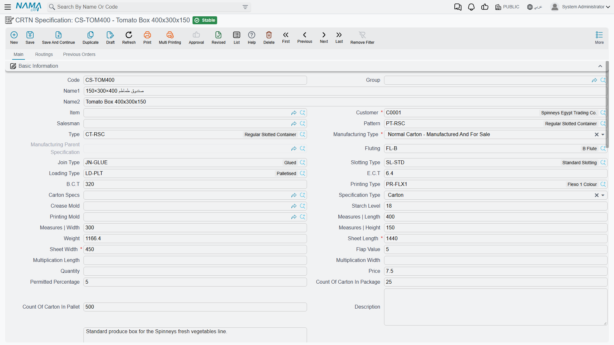
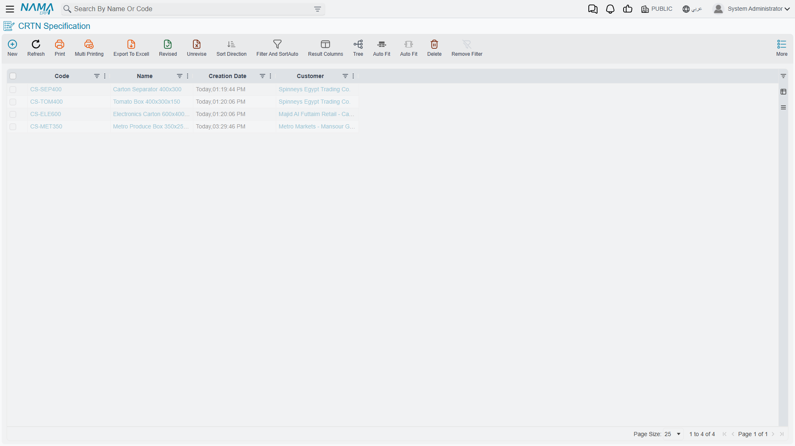
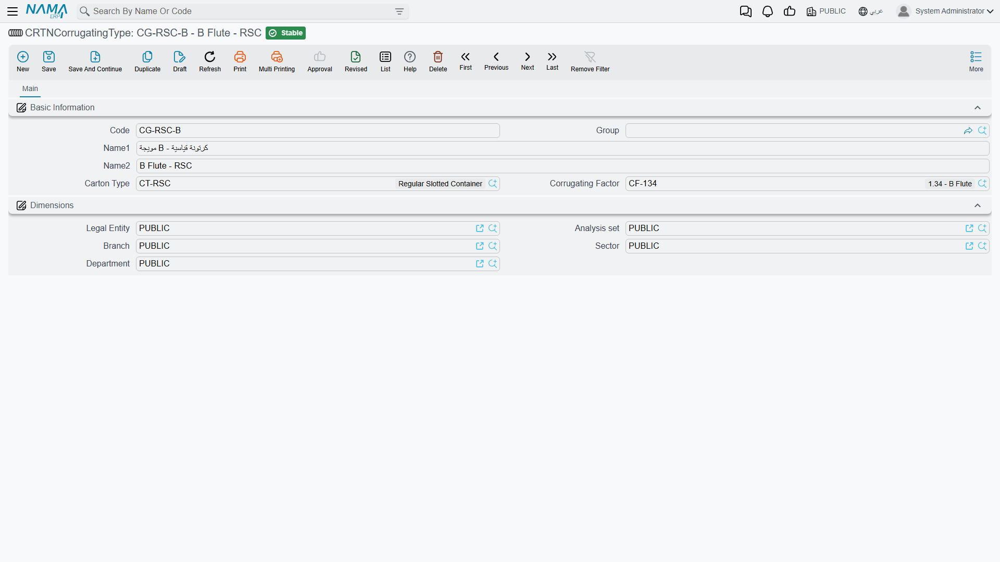
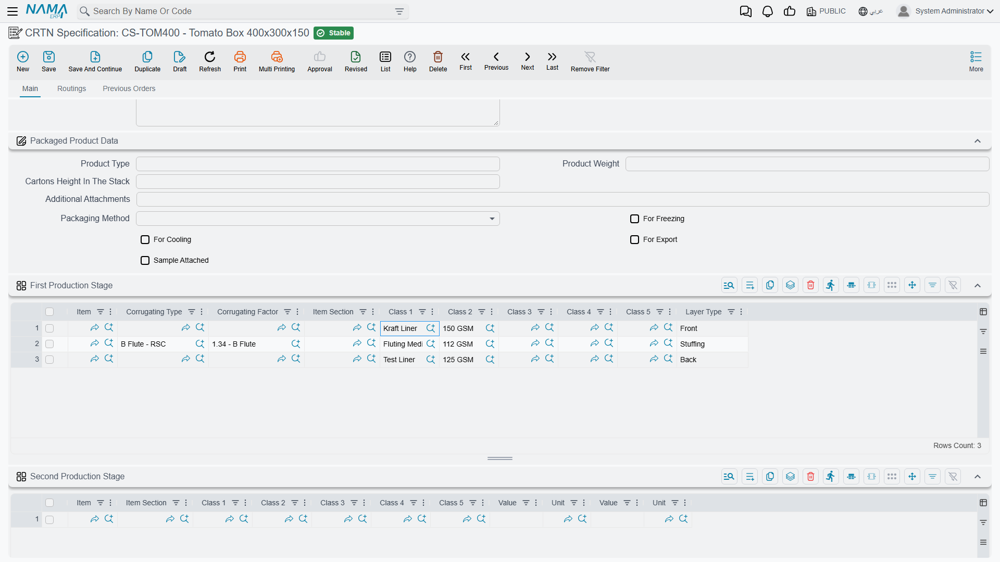
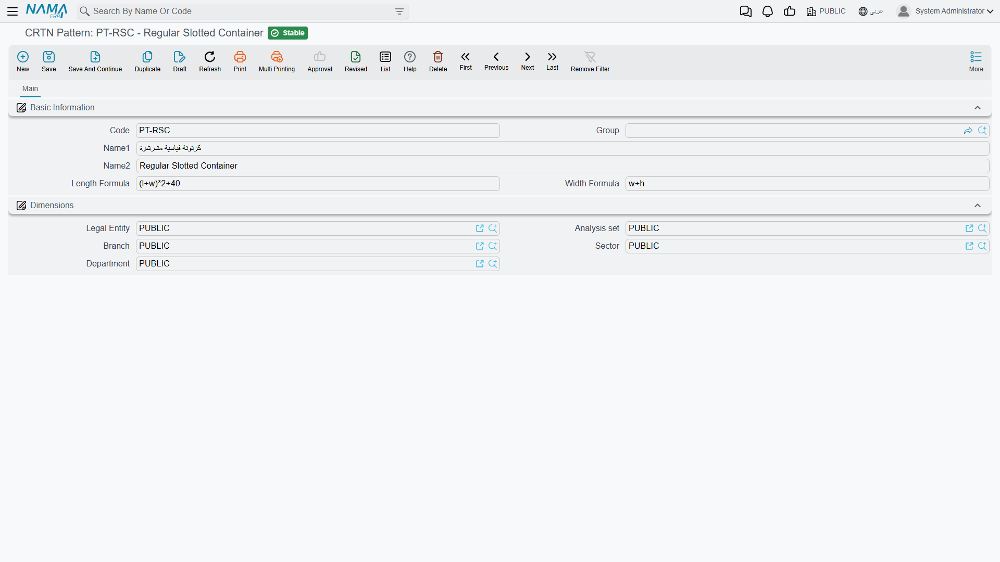

# Carton Specifications: Defining Your Products

## What a Carton Specification Really Is

Think of a carton specification as the complete blueprint for a carton product. It's not just dimensions - it's everything someone needs to know to manufacture that exact carton: what materials go into each layer, how big the flat sheet needs to be, what printing or slotting patterns to use, which molds to employ, even how the finished cartons get packaged.

You create these once for each carton design you sell. When customers order "Tomato Box 250" or "Electronics Packaging Large", they're referencing a specification you've already defined. All the manufacturing complexity - material requirements, production stages, routings - is already figured out and stored in the spec.

You'll find specifications under **Manufacturing > Cartoon > CRTN Specification** (التصنيع > Cartoon > مواصفات الكرتونة).

The list view is your product catalogue — every carton design you can quote and make.

## The Four Types of Specifications

Nama supports four manufacturing approaches for cartons:

### Normal Carton (نوع التصنيع: كرتونة عادية)

This is your standard corrugated carton - facing, fluting, liner, all laminated together in the corrugator, then printed, slotted, and folded. Most of your specifications will be this type.

When you select "Normal Carton" as the manufacturing type, you're saying "this is a standalone product that goes through our standard production process."

### Normal Separator (نوع التصنيع: فاصل عادي)

Separators (or dividers) go inside cartons to protect products. They're simpler than full cartons - usually just corrugated board cut to size, maybe with slots to interlock.

Like normal cartons, these are standalone products. You manufacture them, stock them, and sell them independently.

### Assembled Carton (نوع التصنيع: كرتونة مجمعة)

Here's where it gets interesting. An assembled carton is made by putting together multiple normal cartons. Think of a display carton that consists of a base tray plus a separate lid.

When you create an assembled carton specification:
1. You still define the overall dimensions and characteristics
2. But instead of defining material layers, you add "child carton lines"
3. Each child line references a normal carton specification

Order the assembled carton, and Nama automatically knows it needs to manufacture all the child components.

**Important**: Assembled cartons reference normal cartons as children. The children must already exist as separate "Normal Carton" specifications.

### Assembled Separator (نوع التصنيع: فاصل مجمع)

Similar to assembled cartons, but for complex separator configurations. An assembled separator is made of multiple "Small Separator" components.

You define the assembled separator and link it to its small separator children. This type is less common - used mainly for intricate internal packaging systems.

###

 Small Separator (نوع التصنيع: فاصل صغير)

Small separators are individual components of an assembled separator. You typically don't order these directly - they're manufactured as part of the assembled separator parent.

## Creating a Basic Carton Specification

Let's walk through creating a spec for a common produce box.

### Step 1: Basic Information

Start a new specification and fill in the essentials:

**Code and Name**: Something descriptive like "TOMATO-250" and "Tomato Box 250mm"

**Customer**: Select the customer this spec is designed for. Nama will filter specifications by customer when creating orders, so you only see specs relevant to each customer.

**Manufacturing Type**: Select "Normal Carton" (or whichever type applies)

**Item**: If this specification produces a specific inventory item (maybe you stock these cartons), select the item. This links the specification to inventory management.

### Step 2: Physical Dimensions

These are the dimensions of the finished, folded carton:

**Length** (l): The longest dimension when looking at the box
**Width** (w): The shorter horizontal dimension
**Height** (h): The vertical dimension

For example, a box that's 250mm × 200mm × 150mm when assembled.

### Step 3: Sheet Dimensions

This is where it gets manufacturing-specific. The flat corrugated sheet, before folding, needs to be larger than the finished box.

**Sheet Length**: How long the flat sheet needs to be
**Sheet Width**: How wide the flat sheet needs to be

**Flap Value** (اللسان): The extra material for flaps that fold over. Default is typically 5mm or so.

**Here's the clever part**: You don't always calculate these manually. You can use formulas.

If you select a **Pattern** (باترون) that has formulas defined, or a **Crease Mold** (قالب الطيات) with formulas, Nama automatically calculates sheet dimensions using those formulas.

The formulas can reference:
- `l` - length
- `w` - width
- `h` - height
- `f` - flap value
- `ml`, `mw`, `mh` - mold dimensions (if a crease mold is selected)

For example, a pattern might have:
- Width formula: `2*(l+w) + f`
- Length formula: `h + w + f`

Select that pattern, and sheet dimensions populate automatically based on your physical dimensions.

**Multiplication factors**: If you want to cut multiple cartons from one sheet (maybe two across), you can set multiplication width or length. Most specs leave these blank (one carton per sheet).

### Step 4: Carton Structure and Materials

Now define what the carton is made of:

**Type** (نوع الكرتونة): Select a carton type like "Standard Corrugated", "Double Wall", etc. Types can have default starch levels.

**Fluting** (نوع التموج): Choose the fluting profile - E-flute, C-flute, B-flute, etc. This determines the thickness and strength of the corrugated medium.

**Fluting**, **Corrugating Type** and **Corrugating Factor** are three different things and are easy to confuse. **Fluting** here on the header is a descriptive profile for the board as a whole. **Corrugating Type**, chosen per layer, is the record that ties a flute to a carton type and carries the **Corrugating Factor** — the numeric take-up ratio the calculations actually use. The header tells a person what the board is; the layer tells the system how much paper it eats.

**Join Type** (نوع التلصيق): How the carton is joined - glued, stitched, taped, etc.

**Slotting Type** (نوع التخريم): The slotting pattern - standard, special, etc.

**Pattern** (باترون): The overall design pattern (regular slotted carton, half-slotted, etc.)

**Loading Type**: How finished cartons are stacked or loaded.

**Starch Level** (منسوب النشا): How much starch/adhesive is used in grams per square meter. This affects weight calculations and strength.

**ECT and BCT**: Edge Crush Test and Box Compression Test values - strength ratings for the carton.

### Step 5: Production Stages (The Critical Part)

This is where you define what materials actually go into manufacturing the carton. Most carton specifications use the **First Production Stage** (مرحلة الإنتاج الأولى) extensively.

#### First Production Stage: The Layers

Each row in the **First Production Stage** grid is one layer of material, outside to inside.

**Layer Type** says what the layer is, and it has four values: **Front** (the outer liner), **Stuffing** (the corrugated medium), **Back** (the inner liner) and **Other** — anything else, such as the middle liner of a double-wall board.

**Class 1** and **Class 2** are the two columns that matter most, because they are how material is found. Class 1 is the paper grade and Class 2 is the grammage, and the [material planner](./carton-material-planning.md) searches stock for reel items carrying exactly that pair. **Item Section** and **Class 3** to **Class 5** narrow the search further where a grade alone is not specific enough. **Item** pins the layer to one specific stock item instead, which is worth doing only when there is genuinely one material and no choice to make.

**Corrugating Type** and **Corrugating Factor** apply to the corrugated layer and stay blank on flat liners. The factor is the take-up ratio: the medium is fluted, so it consumes more paper per square metre of board than a flat sheet does. A B flute at 1.34 uses 34% more, a C flute at 1.44 uses 44% more. Nama uses this both to calculate the carton weight and to work out how much medium the plan has to find.

A single-wall carton is three rows — Front, Stuffing, Back. A double-wall carton is five — Front, Stuffing, Other, Stuffing, Back — two fluted layers, usually on different flute profiles, separated by a middle liner.

#### Second Production Stage (Optional)

Use this if you have additional lamination or processing after initial corrugating. Maybe you laminate printed sheets or add special coatings. Same structure as first stage - define layers and materials.

#### Third Production Stage (Optional)

For final finishing processes that add materials - maybe stickers, labels, special tape, etc.

### Step 6: Molds and Printing

If this carton uses molds:

**Crease Mold** (قالب الطيات): Select the mold used for creasing/folding. The mold should be set up in the Molds master file as type "Crease Mold".

**Printing Mold** (قالب الطباعة): Select the printing cylinder or plate if this is a printed carton. Set up as type "Printing Mold".

**Printing Type** (نوع الطباعة): Select the printing process (flexo, offset, digital, etc.). Printing types can have maximum sheet length limits - Nama validates you're not exceeding them.

**Has Badge**: Check if the carton includes a badge or label.

### Step 7: Routings (Operations)

Define the production steps in the **Routings** (عمليات التشغيل) tab.

Each routing line specifies:
- **Operation**: Reference a Standard Operation like "Corrugating", "Printing", "Slotting", "Stitching"
- The operation defines work centers, time estimates, resources needed

When you generate production orders from this specification, these routing lines become the production order routing.

### Step 8: Packaging and Quantities

**Quantity**: Default order quantity (optional)

**Price**: Default selling price (optional)

**Permitted Percentage**: How much over/under production is allowed (like 5% to account for waste/overruns)

**Count in Package**: How many finished cartons fit in one package
**Count on Pallet**: How many cartons fit on one pallet

These help with shipping and logistics planning.

### Step 9: Packaged Product Information (Optional)

If this carton is designed for a specific packaged product (common in food/produce), you can document:
- Product type (fresh produce, frozen goods, etc.)
- Product weight
- Packaging method
- Whether it's for cooling, freezing, or export
- Sample attachments (photos, spec sheets)
- Cartoons stacked height

This is mainly documentation for sales and customer service.

## Advanced Scenarios

### Assembled Cartons with Child Components

Let's say you're creating a specification for a display shipper - a carton with a base tray and a separate lid.

**Step 1**: Create two normal carton specifications:
- "DISPLAY-BASE" - the base tray
- "DISPLAY-LID" - the lid

Define each with their own dimensions, materials, routings, etc.

**Step 2**: Create an assembled carton specification:
- **Code**: "DISPLAY-FULL"
- **Manufacturing Type**: "Assembled Carton"
- **Dimensions**: The overall dimensions when assembled

**Step 3**: In the **Child Carton Lines** tab, add:
- Line 1: Carton Specs = "DISPLAY-BASE", Quantity = 1
- Line 2: Carton Specs = "DISPLAY-LID", Quantity = 1

Now when someone orders "DISPLAY-FULL", Nama's manufacturing details will show it needs to produce 1 base and 1 lid.

**Important validations**:
- All child cartons must be for the same customer as the parent
- Child cartons must be "Normal Carton" type (not other assembled cartons - no nesting assemblies)
- A child carton can only belong to one assembled parent at a time

### Using Formulas for Sheet Calculations

Typing sheet dimensions by hand gets tedious and error-prone. A **Pattern** does it for you.

The pattern master file, under **Manufacturing → Cartoon → CRTN Pattern**, holds exactly two formulas: **Length Formula** and **Width Formula**. They are written in terms of the carton's own measurements — `l` for length, `w` for width, `h` for height — plus whatever constants the blank needs.

For a regular slotted container the geometry is fixed, and the formulas fall straight out of it. The blank wraps all four walls plus a glue flap, so its length is `(l+w)*2` plus that flap. Across the corrugation it carries the box height plus two flaps of half the width each, so its width is `w+h`:

- Length Formula: `(l+w)*2+40`
- Width Formula: `w+h`

Check it against a real box. A 400×300×150 mm carton gives `(400+300)*2+40 = 1440` and `300+150 = 450` — exactly the sheet that carton needs.

A flat separator needs nothing more elaborate than `l` and `w`, since the pad is simply the size of the space it divides.

Select the pattern on a specification, enter the physical dimensions, and the sheet dimensions follow.

### Weight Calculations

Nama automatically calculates the carton weight based on:
- Paper weights (GSM) from each layer
- Corrugating factors (fluting expands, so more material per area)
- Sheet area (length × width)
- Starch level

Formula: `weight = ((sum of layer weights × corrugating factors) + starch level) × sheet area / 10000`

Result is in appropriate units (usually grams or kilograms).

This helps with freight calculations and material costing.

### Forcing Production Stages

Most cartons only use First Production Stage. But if you have multi-stage processing:

**First Stage**: Corrugating/laminating - creates the basic corrugated board
**Second Stage**: Printing - adds graphics
**Third Stage**: Special coating or laminating - adds protective layers

Each stage can have different material requirements. The material planning optimizer handles multi-stage specs by finding appropriate materials for each stage independently.

## Working With Specifications in Practice

Adopt a naming convention before you create the first hundred specifications rather than after. Something like `ACME-300-RSC` — customer, size, style — makes searching and filtering work; free-form names do not, and renaming later is nobody's favourite afternoon.

Set up your common patterns and molds, with their formulas, before creating specifications in bulk. Specifications built on top of ready patterns are faster to create and more consistent than ones where each author improvises.

Do not over-specify layers. Define as separate layers only what you actually stock separately — if two layers always arrive pre-laminated, they are one layer as far as the system needs to know, and splitting them adds maintenance without adding information.

Resist the temptation to share a specification across customers whose dimensions differ even slightly. Separate specifications avoid a whole category of mistake and keep filtering clean.

Validate a new specification before it carries a real commitment: create a small test order, run material planning, and confirm the system finds appropriate materials and calculates sensible quantities. Check the calculated weight against a physical sample too — a figure well off the real one usually means a GSM value or a corrugating factor is wrong, and that is far cheaper to find now than during a production run.

Where a specification has unusual dimensions, say why in the description. The colleague who inherits it will not otherwise be able to tell a deliberate choice from a typo.

## Validation and Business Rules

Nama enforces several validations when you save a specification:

**Crease and printing molds must match types**: If you select a mold in "Crease Mold", it must be set up as a crease mold in the molds master file. Same for printing molds.

**Sheet length limits**: If you select a printing type with a maximum sheet length, Nama checks your sheet length doesn't exceed it.

**Corrugating factors must match types**: If you select a corrugating type in a layer, its corrugating factor must match the factor specified in the corrugating type master data.

**Starch levels must match types**: If your carton type has a starch level defined, the specification's starch level should match.

**The specification's customer must be the order's customer**: A carton order accepts only specifications belonging to the customer on its header. Put a Spinneys specification on a Metro Markets order and the save is refused with a message naming both customers. This is deliberate — carton specifications are customer-specific tooling and artwork rather than a shared catalogue — but it does mean the same product for a second customer needs its own specification.

**Assembled cartons require children**: If manufacturing type is "Assembled Carton" or "Assembled Separator", you must add child carton lines. Conversely, normal cartons can't have children.

**Child carton restrictions**:
- Must be for the same customer
- Must be the appropriate type (normal cartons for assembled cartons, small separators for assembled separators)
- Can't reference yourself (no circular references)
- Can't be already used as a child in another specification

**Customer consistency**: All child cartons must be for the same customer as the parent specification.

## Common Questions

**Q: Can I change a specification after it's been used in orders?**
A: Yes, but be careful. Changes affect future orders, not past ones. If you change material requirements, existing production orders won't update automatically. Consider creating a new revision of the spec instead (copy and modify).

**Q: What if I have the same carton for multiple customers?**
A: Create separate specifications. Even if dimensions are identical, having customer-specific specs makes filtering cleaner and prevents accidentally quoting one customer's price to another.

**Q: How do I handle variations (like different printing for the same base carton)?**
A: Create separate specifications for each variation. The base structure might be the same, but printing molds are different, so they're different products from a manufacturing standpoint.

**Q: Can layers use items from different warehouses?**
A: Yes. Item classes don't specify warehouses. When planning materials, you can choose which warehouse to pull from. The specification just defines what type of material is needed.

**Q: What happens if I delete a specification?**
A: Nama prevents deletion if it's used in any orders or production orders. You'd need to delete those first, which is rarely advisable. Instead, mark it as "Prevent Usage" to stop it from being selected in new orders while preserving history.

---

::: tip Next Step
Once you have specifications defined, you're ready to create customer orders. See [Carton Orders](./carton-orders.md) for the next step.
:::

::: warning Material Planning Requirements
For material planning to work, you need inventory items set up with the same item classes (section, class1, class2, etc.) that you specified in the production stages. The optimizer can't find materials if the classifications don't match.
:::
