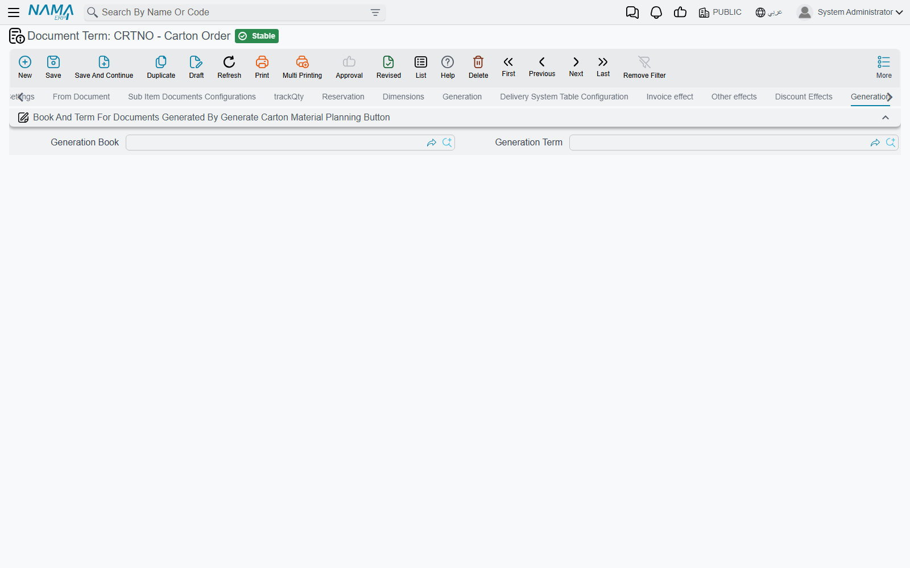

# Carton Document Terms

The carton chain is a relay: a **Carton Order** hands over to a **Carton Material Planning** document, the planning document creates **production orders**, and a **Carton Material Issue** creates the **raw materials issue** that takes the paper out of the store. Each hand-over takes its book and term from the term of the document doing the handing over, and that is nearly all these three terms are for.

How manufacturing terms work in general is on [Production Order and Planning Document Terms](/modules/manufacturing/document-terms/mfg-terms-production-orders#How-manufacturing-terms-work). The carton chain itself is on [Carton Manufacturing](/modules/manufacturing/carton-manufacturing-overview).

::: info Required license
These terms belong to the `manufacturing-crtn-pln` license.
:::

## Carton Order

The carton order's term looks like a sales document's term — it carries the supply chain tabs, and invoice, other and discount effect tabs. What the carton chain uses is the last **Generation** tab, whose one block is titled **Book And Term For Documents Generated By Generate Carton Material Planning Button**: a **Generation Book** and a **Generation Term**. They are the book and term of the planning document that **Genrate Carton Material Planning** creates from a saved order (see [Carton Orders](/modules/manufacturing/carton-orders)).

## Carton Material Planning

**Generated Production Book** and **Generated Production Term** (دفتر / توجيه أمر الإنتاج المنشأ) are the book and term of the production orders that **Generate Production Orders** creates from a solved plan.

The production order term named here must itself have **Allow Empty Item In Component Lines** ticked: carton components are described by class and box rather than by an item, and without that option the generated orders are refused for missing items. See [Production Order and Planning Document Terms](/modules/manufacturing/document-terms/mfg-terms-production-orders#What-must-be-on-an-order).

## Carton Material Issue

**Generated Raw Material Issue Book** and **Generated Raw Material Issue Term** (دفتر / توجيه مستند صرف مواد خام المنشأ), in the **Generation** block, are the book and term of the raw materials issue the carton material issue creates. They are checked on every save.

## When a field is left empty

All six fields above are required by the document that uses them. Leave one empty and the generating button, or the carton material issue's save, stops with *Field {0} in term can not be empty* — «الحقل {0} الموجود في التوجية لا يمكن أن يكون فارغاً» — where `{0}` names the missing field. Open the term and fill it.
