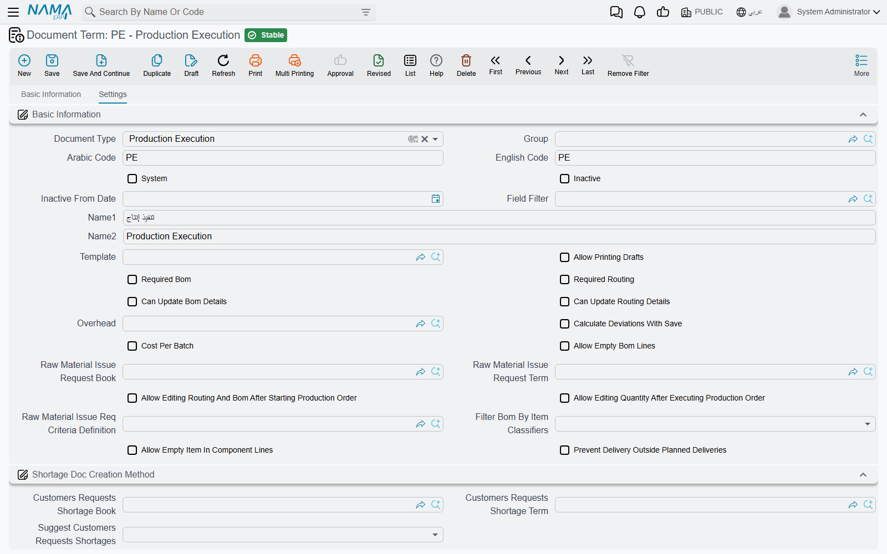

# Execution and Delivery Document Terms

The documents on this page record what happened on the shop floor and what came off it: the production execution, the product delivery and return, the scrap receipt and the production sample. Their terms matter more than most, because the execution is the module's great generator — one saved execution can create a material issue, a resource voucher, a mold voucher, a delivery, a quality control document and samples, and every one of those takes its book and term from here.

How manufacturing terms work in general, and what the common top of the screen holds, is on [Production Order and Planning Document Terms](/modules/manufacturing/document-terms/mfg-terms-production-orders#How-manufacturing-terms-work).

::: info Required license
These terms belong to the core `manufacturing` license. The mold voucher generation block only matters where `manufacturing-molds` is enabled.
:::

## Production Execution

### What an execution generates

Every time an execution is saved, it rebuilds the documents it is responsible for, one per production order it touches. Each has a block on the term with a **Generation Book** and a **Generation Term**:

| Block | What is generated | When |
|---|---|---|
| **Material Issue** (صرف المواد الخام) | A raw materials issue | From the order's component lines whose issue type says they are issued with execution. |
| **Resource Voucher** (سند موارد) | A resource voucher | From the routing resources of the operations executed. |
| **Manufacturing Mold Voucher** (سند استهلاك قالب تصنيع) | A mold voucher | From the molds used by the operations executed. |
| **Product Delivery** (تسليم منتج) | A product delivery | Only when **Automatic Product Delivery** is ticked — see below. |
| **Sample Document Generation** (انشاء سند سحب العينة) | Production sample documents | Only when the execution is set to generate samples. |

A generated document that ends up with no lines is deleted. One that has lines but no book or term stops the save with *To generate {0}, you must define book and term for it* — an English-only message — so fill the blocks for every document your executions will really produce.

Each block has a **Consider Approval For Generating …** switch (اعتبار الموافقة على إنشاء …). Ticked, the generated document goes through its own approval cycle instead of being committed straight away — useful when, say, resource vouchers must be checked by cost accounting before they post.

### Automatic delivery

**Automatic Product Delivery** (تسليم المنتج النهائي تلقائيا) is copied onto the execution when the term is chosen. With it on, every line that moves quantity into the order's **last** operation creates or updates a product delivery for that order, so finishing a run and receiving the product into stock is one step. A line whose quantity has not reached the last operation is refused with *Can not auto delivery because quantity is not in last operation* — «لا يمكن تسليم المنتج تلقائيا لأن الكميات لم تتحرك لأخر عملية». Untick it on an execution that already generated deliveries and those deliveries are cancelled.

Two options shape the generated delivery:

- **Use Execution To Date As Delivery Value Date** (استخدام إلى تاريخ بالتنفيذ كالتاريخ الفعلي في تسليم المنتج) — the delivery's value date becomes the line's **To Date** rather than the execution's date, and its fiscal period follows. Use it when executions are entered after the fact and the stock must be dated when the work actually finished.
- **Use Co-Product Warehouse** (استخدام مخزن المنتج الثانوي) — off, the generated delivery's header warehouse and locator are set to the main product's. On, the header is left alone so co-products keep their own warehouses.

### Editing and deleting what was generated

- **Can Update Generated Documents** (إمكانية تعديل المستندات الناتجة) — on by default. Untick it and users cannot edit the deliveries an automatic-delivery execution created: *You can not edit document {0} because it is auto generated* — «لا يمكنك التعديل في المستند {0} حيث أنه منشأ تلقائيًا». The execution stays the single place to change them.
- **Delete Auto Generated Documents With Document Deletion** (حذف المستندات المنشأة تلقائياً مع حذف السند) — normally an execution cannot be deleted while the documents it generated refer to it. Ticked, those generated documents are deleted along with it.

### Quality control

| Option | What it does |
|---|---|
| **Generated Quality Control Type** (نوع فحص الجودة المنشأ) | **Quality Control Doc** or **Quality Control Request**. After save, the execution creates one such document for the lines moving into operations that have a quality check list. |
| **Quality Control Doc Book** / **Quality Control Doc Term** | Its book (required) and term (optional). With no book and type, nothing is generated. |
| **Can not Execute Routing without Approved QC Doc** (لايمكن تنفيذ عملية تشغيل في أمر إنتاج بدون سند فحص جودة تمت الموافقة عليه) | Quantity cannot leave an operation that has a quality check list until a committed quality control document for the order approves that operation (or marks it not applicable). Refused with *Operation {0} is not approved by quality control doc* — «العملية {0} لم يتم الموافقة عليها عن طريق سند فحص جودة». |
| **Can not Execute Routing without Approved QA Doc** (لايمكن تنفيذ عملية تشغيل في أمر إنتاج بدون سند تأكيد جودة تمت الموافقة عليه) | The same gate for operations with a quality assurance list: *Operation {0} is not approved by quality assurance doc* — «العملية {0} لم يتم الموافقة عليها عن طريق سند تأكيد جودة». |

The Arabic label of the book field reads «دفنر مستند فحص جودة» on screen.

## Product Delivery

A product delivery always creates a **stock receipt** for the finished product and its co-products. The **Stock Receipt** block (توريد المخزن) names that receipt's **Generation Book** and **Generation Term**.

| Option | What it does |
|---|---|
| **Prevent Auto Delivery Without QC Doc** (منع تسليم المنتج مع عدم وجود مستند فحص جودة) | Despite the word "auto", applies to every delivery: if the order's last operation has a quality check list, a committed quality control document must approve it first. Same message as the execution gate. |
| **Prevent Auto Delivery Without QA Doc** (منع تسليم المنتج مع عدم وجود مستند تأكيد جودة) | The same for a quality assurance list. |
| **Don’t Update Details warehouse From header Warehouse** (عدم تحديث المخزن على السطور من المخزن الرئيسى) | Changing the header warehouse no longer overwrites the lines' warehouses — for deliveries that split the output across stores. |
| **Do Not Use Production Movement Entries** (عدم استخدام قيود حركة الإنتاج) | Where production movement entries are in use, a delivery normally checks and consumes the quantity waiting in the order's last operation. Ticked, deliveries under this term skip that check — for receiving product that never went through executions. |

## Product Return

A product return always creates a **stock issue** taking the product back out of stock. The **Generation** block names its **Generation Book** and **Generation Term**.

## Scrap Receipt

A scrap receipt always creates a **stock receipt** for the scrap. The **Generation** block names its **Generation Book** and **Generation Term**. The document itself is on [Scrap Receipts](/modules/manufacturing/scrap-receipt).

## Production Sample Document

**Do Not Affect On Production Order Quantities** (عدم التأثير على كميات أمر الإنتاج), in the **Effect** block, makes samples under this term leave the order's operation quantities alone: the sample is recorded but nothing is taken out of the operation it was drawn from. Use it for retention samples that are not lost to production.

## Messages you may see

| Message | Why | What to do |
|---|---|---|
| *To generate {0}, you must define book and term for it* | An execution needs to generate a document whose block on the term has no book or term. The message has no Arabic translation. | Fill **Generation Book** and **Generation Term** in that block of the Production Execution term. |
| *Can not auto delivery because quantity is not in last operation* — «لا يمكن تسليم المنتج تلقائيا لأن الكميات لم تتحرك لأخر عملية» | Automatic delivery is on, but a line has not moved its quantity into the last operation. | Execute up to the last operation, or untick **Automatic Product Delivery** on this execution. |
| *Operation {0} is not approved by quality control doc* — «العملية {0} لم يتم الموافقة عليها عن طريق سند فحص جودة» | The operation has a quality check list and no committed quality control document approves it. | Commit an approved quality control document for the order and operation, then save again. |
| *Operation {0} is not approved by quality assurance doc* — «العملية {0} لم يتم الموافقة عليها عن طريق سند تأكيد جودة» | The same for a quality assurance list. | Commit an approved quality assurance document first. |
| *You can not edit document {0} because it is auto generated* — «لا يمكنك التعديل في المستند {0} حيث أنه منشأ تلقائيًا» | The document was generated by an execution whose term does not allow editing generated documents. | Change the execution instead; it rebuilds the document on save. |
