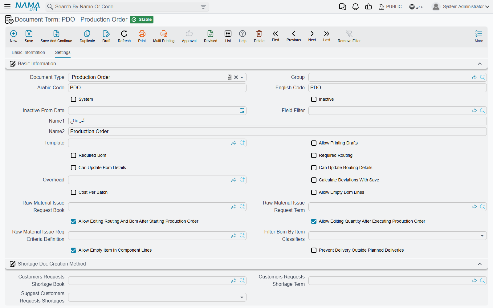

# Production Order and Planning Document Terms

Every manufacturing document has a **document term** (توجيه المستند) behind it, and the term is where most of the module's rules live: whether an order may be saved without a BOM, which book a generated delivery is written into, what posts to which account at order close. Two production orders that behave differently on the same screen almost always have different terms.

This page covers the terms of the documents that *plan* production — the production order, its request, the three aggregated documents and the MRP planning document. The documents that record what happened on the floor are on [Execution and Delivery Document Terms](/modules/manufacturing/document-terms/mfg-terms-execution-and-delivery); materials are on [Raw Material Document Terms](/modules/manufacturing/document-terms/mfg-terms-materials); costing and accounting are on [Costing, Resource and Mold Document Terms](/modules/manufacturing/document-terms/mfg-terms-costing); and the carton screens on [Carton Document Terms](/modules/manufacturing/document-terms/mfg-terms-carton).

::: info Required license
The terms on this page belong to the core `manufacturing` license, except the MRP planning document's term, which needs `manufacturing-mrp`.
:::

## How manufacturing terms work

Open a term from **Basic → Settings → Document Term** and choose the **Document Type**; the screen then shows the options for that type. Three things hold for every manufacturing term.

**The top of the screen is always the same.** Code, names, **System**, **Inactive**, **Field Filter**, **Allow Printing Drafts** and the **Shortage Doc Creation Method** block are common to every document term and are described once, on [General Configuration](/modules/supplychain/document-terms/doc-term-general). This page only covers what each manufacturing term adds.

**A term that generates documents names their book and term.** Many manufacturing documents create others — an aggregated order creates production orders, an execution creates deliveries and issues. The term of the *creating* document names the book and the term of the *created* one. Leave them empty and the creating document refuses to save, or quietly creates nothing, depending on the document; each case is spelt out below.

**Inventory-type terms carry the supply chain tabs too.** Raw material issue, return and their requests carry the full set of supply chain tabs (From Document, Sub Item, Quantity Tracking, Reservation, Dimensions, Generation, Delivery System). Those tabs are described under [Supply Chain Document Terms](/modules/supplychain/document-terms/doc-term-general).

## Production Order

The production order term is the longest in the module, and the one most worth reading before going live. Its options sit in the **Basic Information** block and two blocks below it.

### What must be on an order

| Option | What it does |
|---|---|
| **Required Bom** (مكونات المنتج مطلوبة) | The order's **BOM** field must be filled before it can be saved. |
| **Required Routing** (عملية التشغيل مطلوبة) | The same, for the **Routing** field. |
| **Allow Empty Bom Lines** (السماح بترك سطور مكونات الأنتاج فارغة) | Off by default, so an order with no component lines is refused with *Components can not be empty* — «لا يمكن ترك مكونات المنتج فارغة». Tick it for orders that genuinely consume nothing you track — a pure rework order, for example. |
| **Allow Empty Item In Component Lines** (السماح بترك الصنف فارغاً في سطور المكونات) | Off by default, so every component line needs an item. Carton production needs this ticked, because carton components are described by class and size rather than by an item code. |

### What may change on an order

| Option | What it does |
|---|---|
| **Can Update Bom Details** (يمكن تعديل تفاصيل مكونات المنتج) | While the order is still *Initial* and names a BOM, lets the user change the component lines so they no longer match the BOM. Off, a changed component line is refused with *Can not modify component lines* — «لا يمكن تغير سطور مكونات المنتج». |
| **Can Update Routing Details** (يمكن تعديل تفاصيل عملية التشغيل) | The same for the routing and routing-resource lines while the order is Initial. Off, they are refused with *Can not modify routing lines* — «لا يمكن تغيير سطور سطور عمليات التشغيل» — or *Can not modify routing resource lines* — «لا يمكن تععديل سطور موارد التشغيل». |
| **Allow Editing Routing And Bom After Starting Production Order** (السماح بالتعديل في مكونات المنتج وعمليات التشغيل بعد بدء أمر الإنتاج) | Once an order has left Initial, its component, routing and resource lines are frozen with the same three messages. Ticking this lifts the freeze. It also lets an aggregated production order change lines whose production order has already started. |
| **Allow Editing Quantity After Executing Production Order** (السماح بتعديل الكمية بعد البدء في تنفيذ أمر الإنتاج) | Off, the order's quantity and unit cannot change once it has left Initial: *Quantity can be changed only if status is still initial*. That message has no Arabic translation and shows in English on Arabic screens. |

### Costing

| Option | What it does |
|---|---|
| **Overhead** (التكاليف الغير مباشرة) | The default overhead type for these orders. The order close voucher takes its overhead from the order close term first and falls back to this one. |
| **Calculate Deviations With Save** (حساب الانحرافات مع الحفظ) | At order close, compares actual unit cost with standard unit cost and fills the close voucher's deviation figures — quantity, material, resource and overhead. The Order Close term's **Standard Deviation Debit / Credit** post only when this is on. |
| **Cost Per Batch** | Costs the order separately for each lot delivered, instead of as one pool. **Lot ID** then becomes required on raw material issues, raw material returns and resource vouchers for the order. It cannot be combined with *Calculate Deviations With Save*: closing such an order fails with *Cost Per Batch Not Supported for deviation calculation*. The option's label is English on Arabic screens too. |

Costing itself is explained on [Production Costing](/modules/manufacturing/production-costing).

### The raw material issue request

| Option | What it does |
|---|---|
| **Raw Material Issue Request Book** / **Raw Material Issue Request Term** (دفتر / توجيه طلب صرف مواد خام) | When both are filled, saving an order that has a BOM creates — or updates — a **Raw material issue request** carrying the order's component lines, so the store sees what it has to prepare. Leave either empty and no request is created. Cancelling the order deletes the request. |
| **Raw Material Issue Req Criteria Definition** (معايير إنشاء طلب صرف مواد خام) | Narrows that to orders matching the criteria. Empty means every order. An order that stops matching has its request deleted on the next save. |

### Choosing the BOM by item classifier

**Filter Bom By Item Classifiers** (فلترة مكونات المنتج من خلال محدد الصنف) widens the BOM search on the order. Normally only BOMs for the order's item are offered. Choose a classifier — **Item Section** or **Item class 1** to **Item class 10** — and BOMs that name no item but carry the same value of that classifier as the item are offered too. That is how one generic BOM serves a whole family of items.

### Planned deliveries

An order can carry a grid of planned deliveries — this much of this item, in this lot, to this warehouse. Every product delivery and product return is matched against those lines to keep their delivered quantity up to date: first by the **Expected Delivery Code**, and failing that by the first planned line with the same item whose ticked dimensions also match.

The **Planned Deliveries Matching Options** block says which dimensions must match: **Consider Size**, **Consider Color**, **Consider Revision**, **Consider Box**, **Consider Lot**, **Consider Warehouse**, **Consider Locator**, **Consider Measures**, **Consider Serial**, **Consider Second Serial**, **Consider SubItem**, **Active Percentage Consideration Type** (a yes/no switch despite its name) and **Consider Inactive Percentage**.

**Prevent Delivery Outside Planned Deliveries** (منع التسليم خارج سطور التسليمات المخططة) turns the matching into a rule. A delivery or return line must then match a planned line, may not deliver more than was planned, and may not return more than was delivered. The refusals are listed at the end of this page.

## Production Order Request

The request's term has one option of its own. **Filter Routing By Item Classifiers** (فلترة عمليات التشغيل من خلال محدد الصنف) does for the request's **Routing** search what *Filter Bom By Item Classifiers* does for the order's BOM search: routings that name no item but carry the item's value of the chosen classifier are offered as well.

The request itself is on [Production Order Requests](/modules/manufacturing/production-order-request).

## Aggregated Production Order

| Option | What it does |
|---|---|
| **Production Order Book** / **Production Order Term** (دفتر أمر انتاج / توجيه أمر الإنتاج) | The book and term of the production orders the aggregated order creates, one per line. Both are required: saving without them fails with *Production Term or Production Book from term config Can not be Empty* — «توجية و دفتر أمر الإنتاج الموجودين في التوجيه لا يمكن ان يكونا فارغين». |
| **Default Cost Reallocation** (إعادة تحميل التكلفة الافتراضية) | Fills the document's **Cost Reallocation**, which re-spreads cost across the orders the aggregated order created: **Cost Share Only** (أسهم التكلفة فقط) by each line's cost share, **Quantity Only** (الكمية فقط) by delivered quantity, **Cost Share And Quantity** (أسهم التكلفة مرجحة بالكمية) by the two multiplied, or none. |
| **Total Cost Share Is 100%** (إجمالي أسهم التكلفة 100%) | When a reallocation method is chosen, the lines' cost shares must add up to 100: *Total cost share must be 100%* — «إجمالي أسهم التكلفة يجب أن يكون 100%». |
| **Regenerate Production Orders Regardless Of there are Changes Or Not** (إعادة إنشاء أوامر الإنتاج مع الحفظ بغض النظر عن وجود تغيرات أم لا) | Normally a generated order's routing, resource and co-product lines are rebuilt only when its BOM or routing changed. Ticked, they are rebuilt on every save of the aggregated order. |

## Aggregated Product Delivery and Aggregated Production Order Closing

Both terms only name the book and term of the documents they generate, and both pairs are required.

- **Aggregated Product Delivery**: **Product Delivery Book** / **Product Delivery Term** (دفتر / توجيه تسليم المنتج). Missing either: *Both Book and term of generated product delivery must be provided* (English only).
- **Aggregated Production Order Closing**: **Production Order Closing Book** / **Production Order Closing Term** (دفتر / توجيه إغلاق أمر الإنتاج). Missing either: *You must fill order voucher close book and term in term {0}* (English only).

## MRP Planning Document

The MRP document generates purchase and production documents from its planned lines, and its term says how.

| Option | What it does |
|---|---|
| **Purchase Doc Type** (نوع مستند الشراء المنشأ) | **Purchase Order**, **MRP Purchase Request** or **Item Request** — what the planned purchase lines become. |
| **Production Doc Type** (نوع مستند الإنتاج المنشأ) | **Production Order** or **Production Order Request** — what the planned production lines become. |
| **Purchase Order Book** / **Purchase Order Term** | Used when purchase lines become purchase orders. |
| **MRP Purchase Order Book** / **MRP Purchase Order Term** | Used when they become MRP purchase requests. |
| **Item Request Book** / **Item Request Term** | Used when they become item requests. |
| **Production Order Book** / **Production Order Term** | Used when production lines become production orders. |
| **Production Order Request Book** | Used when they become production order requests. There is no term field for this one. |
| **Demand Docs Date Lines** (حقول تاريخ سندات الطلب) | A small grid of **Entity Type** and a date field. For each demand document type listed, the MRP line's document date is read from the chosen date field instead of the document's own date — a sales order's promised delivery date rather than its order date, for example. The date column has no translated heading, so it shows its internal name. |

Every book used for generation must be **auto-coded**; otherwise generating stops with *In this document term the book of {0} must be Auto* — «في توجيه هذا المستند , لابد ان يكون تكويد دفتر {0} آلي». A missing book or term stops it with a message naming the document type, for example *To generate Purchase Order doc ,Please select book and term of the Purchase Order in The term of this Document*.

The planning document itself is on [Material Requirements Planning](/modules/manufacturing/material-requirements-planning).

## Messages you may see

| Message | Why | What to do |
|---|---|---|
| *Components can not be empty* — «لا يمكن ترك مكونات المنتج فارغة» | The order has no component lines and its term does not allow that. | Add the components, or tick **Allow Empty Bom Lines** on the term. |
| *Quantity can be changed only if status is still initial* | The order has started and its term does not allow quantity changes. | Tick **Allow Editing Quantity After Executing Production Order**, or raise a new order for the extra quantity. |
| *Production Term or Production Book from term config Can not be Empty* — «توجية و دفتر أمر الإنتاج الموجودين في التوجيه لا يمكن ان يكونا فارغين» | The aggregated order's term does not name the book and term of the orders it creates. | Fill both on the Aggregated Production Order term. |
| *Total cost share must be 100%* — «إجمالي أسهم التكلفة يجب أن يكون 100%» | A reallocation method is chosen and the cost shares do not add up to 100. | Correct the shares, or clear **Cost Reallocation**. |
| *No planned delivery line of the production order {0} has the expected delivery code {1}* — «لا يوجد سطر تسليم مخطط في أمر الإنتاج {0} بكود التسليم المتوقع {1}» | The delivery line names an expected delivery code the order does not have. | Correct the code, or clear it and let the line match by item. |
| *The item {0} matches no planned delivery line of the production order {1}* — «الصنف {0} لا يطابق أي سطر تسليم مخطط في أمر الإنتاج {1}» | Delivery outside the plan is prevented and no planned line has this item with matching dimensions. | Add a planned delivery line on the order, or correct the delivery's dimensions. |
| *Delivered quantity {0} exceeds the planned delivery quantity {1} of the planned delivery line {2}* — «الكمية المسلمة {0} تتجاوز الكمية المخطط تسليمها {1} في سطر التسليم المخطط {2}» | The delivery would take the planned line past its quantity. | Raise the planned quantity on the order, or deliver less. |
| *Returned quantity {0} exceeds the delivered quantity {1} of the planned delivery line {2}* — «الكمية المرتجعة {0} تتجاوز الكمية المسلمة {1} في سطر التسليم المخطط {2}» | The return is larger than what was delivered against that planned line. | Return no more than was delivered. |
| *Field {0} must be {1} as in the planned delivery line {2} of the production order* — «يجب أن تكون قيمة الحقل {0} هي {1} كما في سطر التسليم المخطط {2} في أمر الإنتاج» | A ticked matching dimension differs from the planned line's value. | Use the planned value, or untick that dimension in **Planned Deliveries Matching Options**. |
| *In this document term the book of {0} must be Auto* — «في توجيه هذا المستند , لابد ان يكون تكويد دفتر {0} آلي» | A book named on the MRP term for generated documents is manually coded. | Name an auto-coded book. |
