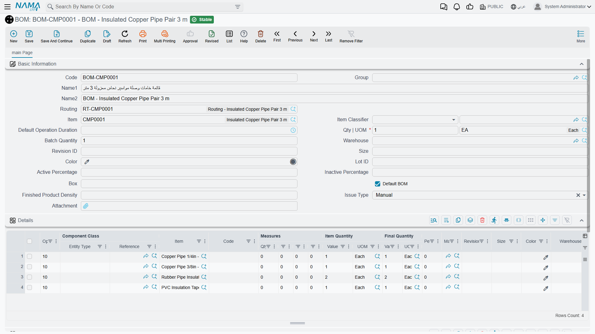
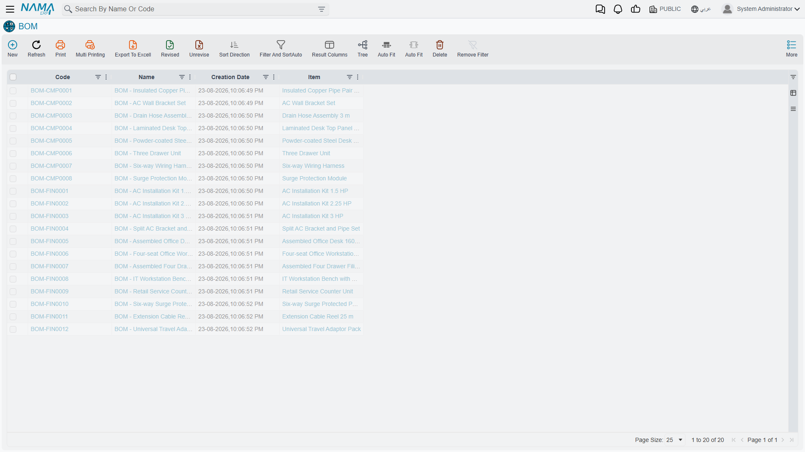
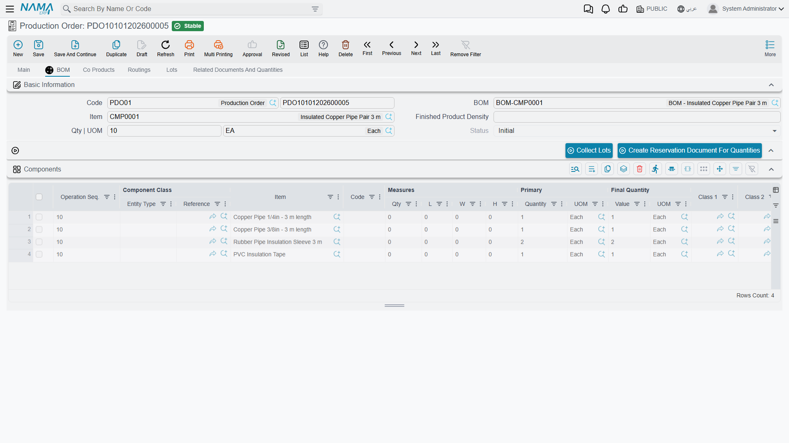

# Bill of Materials: The Recipe for a Product

## Why the BOM Comes First

Nothing else in the manufacturing module works until the system knows what a product is made of. A production order for 10 insulated copper pipe pairs is just a wish until Nama can answer the next question by itself: *and what does that consume?* The **BOM** (مكونات منتج) is the answer — the list of components that go into one unit of a finished product, along with how much of each.

The cooking analogy is the honest one. A recipe says "for one cake: 500g flour, 4 eggs, 200g sugar". A BOM says "for one insulated copper pipe pair 3 m: one 1/4-inch copper pipe, one 3/8-inch copper pipe, two rubber insulation sleeves, one roll of PVC tape". Scale the cake to twelve and you scale the flour to six kilos; scale the production order to 10 and Nama scales the components the same way.

You'll find bills of materials under **Manufacturing → Master Files → BOM** (التصنيع ← الملفات ← مكونات منتج).

The list view shows every bill of materials you hold, with the product each one produces.

## The Header: What This Recipe Produces

The top half of the screen answers "what does this BOM make, and how much of it?"

**Code** and **Name1 / Name2** identify the BOM itself. Give it a code you can recognise at a glance — `BOM-CMP0001` reading "the BOM for component CMP0001" is a pattern that pays off the first time someone has to pick one from a list of two hundred.

**Item** is the product this BOM produces. This is the link that makes everything else automatic: when a production order names an item, Nama looks for that item's BOM and pulls the components in.

**Qty | UOM** is the crucial pair, and the one most often misunderstood. It says *how many finished units the component quantities below refer to*. Set it to 1 and the grid lists what one unit consumes. Set it to 100 and the grid lists what a batch of a hundred consumes, and Nama divides accordingly when an order asks for 250.

::: tip Use a batch quantity when small numbers get ugly
If one unit consumes 0.0035 kg of adhesive, don't write 0.0035. Set **Qty** to 1000 and record 3.5 kg. The arithmetic is identical, and the number in the grid is one a human can sanity-check.
:::

**Batch Quantity** is separate from that, and it trips people up. Qty|UOM is the *reference* quantity for the recipe; Batch Quantity is the quantity the shop floor actually makes in one go — the size of the mixer, the capacity of the oven. Leave it at 1 unless your process genuinely has a fixed batch size.

**Routing** points at the manufacturing steps this product goes through. A BOM says what goes in; a [routing](/modules/manufacturing/manufacturing-routing) says what happens. Naming one here means a production order that picks up this BOM gets the matching operations too, without anyone selecting them separately.

**Default BOM** is a checkbox that matters more than its size suggests. A product can have several BOMs — a standard recipe and a reduced-cost variant, or an old revision and a new one. Exactly one of them should be the default, and that's the one a production order will reach for when nobody says otherwise.

**Issue Type** decides how the components leave the store. Set to **Manual**, somebody records a [raw materials issue](/modules/manufacturing/raw-material-issue) and physically decides what goes out. The alternative hands that job to the system, which draws the components automatically as production is recorded.

The remaining header fields — **Group**, **Item Classifier**, **Warehouse**, **Revision ID**, **Size**, **Color**, **Lot ID**, **Box**, **Active Percentage** / **Inactive Percentage**, **Finished Product Density**, **Default Operation Duration**, **Attachment** — are optional refinements. Most implementations leave nearly all of them empty and are none the worse for it.

## The Details Grid: What Goes In

Each row in **Details** is one component. In the pipe-pair example above there are four rows, and the columns worth understanding are these.

**Op.** (operation sequence) is the step at which this component gets consumed. All four rows carry `10`, meaning everything is issued at the first operation. On a longer routing this is where the recipe gets interesting: the copper goes in at cutting (10), the insulation at taping (20), the label at packing (30). Getting these right is what lets the system tell you that an order stalled at operation 20 still hasn't consumed the label stock.

**Item** is the component itself — the raw material or sub-assembly being consumed.

**Item Quantity** (**Value** + **UOM**) is how much of it. Read together with the header's Qty|UOM: with Qty = 1 and a row reading `2 Each`, one finished pair consumes two insulation sleeves.

**Final Quantity** is what the system will actually plan for, after the percentage columns have had their say. On a clean BOM with no waste allowance it equals Item Quantity, which is why the two columns so often look redundant — they aren't, they just agree.

**Component Class** (**Entity Type** + **Reference**) is how a BOM line stops being a single fixed part. Instead of naming one specific item, a line can name a *class* of items, and the actual part is chosen when the order is created. This is how you model "any of our three approved 3/8-inch pipes" without maintaining three near-identical BOMs.

**Percentage**, **Revision**, **Size**, **Color** and **Warehouse** round out the row: a waste allowance, which revision of the component applies, and where it should be drawn from if not the order's default store.

::: warning A BOM is master data, not a document
Changing a BOM changes what *future* production orders will consume. It does not reach back into orders already created — those captured their component list when they were made. This is deliberate and it is what you want, but it does mean that fixing a wrong BOM does not fix the orders that were built on it. Those have to be corrected individually.
:::

## Multi-Level Products

Nama does not need a special "multi-level BOM" feature, because levels fall out of the design on their own. A desk has a BOM listing a laminated top panel and a powder-coated steel frame. The top panel is itself a manufactured item with its own BOM, listing chipboard and laminate sheet. The frame has its own, listing steel tube and powder coat.

Make the desk and you have a choice: produce the panel and frame as their own production orders first, then consume them into the desk order; or let planning explode the whole tree and tell you that a desk order for 50 units ultimately needs 50 sheets of laminate. [Material requirements planning](/modules/manufacturing/material-requirements-planning) does exactly that explosion, and it is the reason keeping sub-assembly BOMs accurate matters even when nobody produces them separately.

## Where the BOM Shows Up Next

Once a BOM exists, most of the module reads from it rather than asking anyone to retype it:

- A **production order** for the item pulls in the components as its material plan, on its own **BOM** tab.
- A **[raw materials issue](/modules/manufacturing/raw-material-issue)** against that order proposes those same components as the things to draw from the store.
- **[MRP](/modules/manufacturing/material-requirements-planning)** explodes it to work out what to buy and when.
- **[Order close](/modules/manufacturing/production-costing)** compares what the BOM said should have been consumed against what actually was — which is the whole basis of a material variance.

That last one is worth sitting with. An inaccurate BOM does not announce itself. It quietly produces a material variance every single time an order closes, and the variance gets blamed on the shop floor. If your costing shows a persistent one-directional variance on a product, suspect the recipe before you suspect the operators.

## Messages you may see

| Message | Why | What to do |
|---|---|---|
| *Item {0} does not contain uom {1}* — «الصنف {0} لا يحتوي على الوحدة {1}» | The unit on the header quantity — the unit the recipe produces in — is not one of the units defined on the produced item. | Use one of the item's own units, or add the unit to the item file. |
| *Item {0} in line number {1} does not contain uom {2}* — «الصنف {0} في السطر {1} لا يحتوي على الوحدة {2}» | The same check on a component line or a co-product line: the unit typed there is not defined on that item. | Change the unit on the line, or add it to the item. |
| *The operation {0} is not in the routing {1}* — «العملية {0} ليست من عمليات التشغيل {1}» | A component line is assigned to an operation sequence that the chosen routing does not contain. It usually appears after the routing was changed under a finished recipe. | Renumber the component onto an operation the routing really has, or put the operation back in the routing. |
| *The Item and the component class can not both be empty. At least one must be not empty* — «لا يمكن ترك الصنف و تصنيف المكون كلاهما فارغين, يجب أن يكون إحداهما له قيمة» | A component line names neither an item nor a component class. This is the wording you get when **Allow Empty Item In BOM Details If Component Class Exist** is on; with it off, the item is simply required. | Name the item, or name the class the item will be picked from at production time. |
| *Cost percentage can not be zero* — «قيمة التكلفة لايمكن ان تكون صفر» | A co-product line is set to share cost by percentage and the percentage is left empty or zero, so it would absorb none of the order's cost. | Give it a percentage, or change the line's cost type to a fixed cost. |
| *Option {0} in details {1} only one line must activate this option* — «بالنسبة للأوبشن {0} في سطور{1} - سطر واحد فقط يمكنه تفعيل هذا الأوبشن» | More than one component line has **Weight Supplement** ticked. Only one component may play that role in a recipe. | Untick it everywhere but the one component that takes up the weight difference. |
| «القيمة المئوية للتكلفة اكبر من المئة» | The co-product cost percentages add up to more than 100, which would charge the order more cost than it holds. | Bring the percentages back to 100 or less. This message is stored in Arabic only, so it appears in Arabic on an English screen too, and it is reported against a line number that is always 1 rather than the offending line. |
