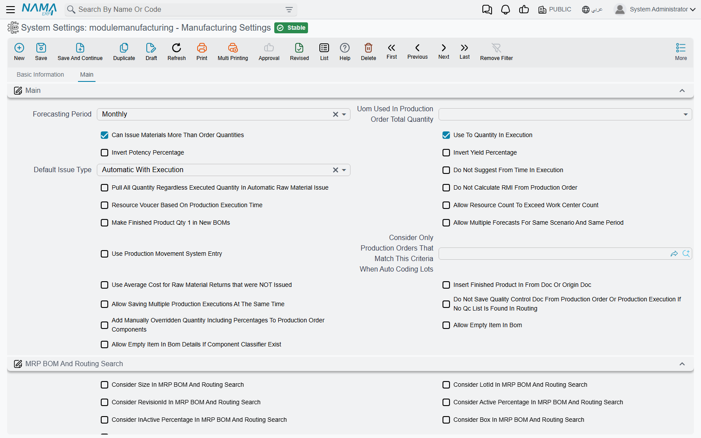

# Manufacturing Settings

Most of how a manufacturing document behaves is decided on its [document term](/modules/manufacturing/document-terms/mfg-terms-production-orders). A smaller set of decisions has to be the same for every document in the database — whether a store may issue more than an order asked for, whether MRP treats two colours of the same item as one requirement, whether executions are counted with movement entries — and those live on the module's own settings screen, **Manufacturing Settings** (إعدادات التصنيع), reached from the configuration area rather than from the Manufacturing menu.

The screen is one tab with four blocks. Several options sit in a block that has nothing to do with what they control, so this page groups them by what they affect, not by where they appear.

::: info Required license
The settings screen is part of the core `manufacturing` license. The MRP options only matter where `manufacturing-mrp` is enabled.
:::

## One record, read live

**There is exactly one.** Every reader of these settings reads the same single record, with no company passed in, so a group running several legal entities in one database runs all of them on the same manufacturing settings.

**It is read live.** A change applies to the next document saved, including older documents opened and saved again.

**Only five options start switched on**: *Can Issue Materials More Than Order Quantities* and the four MRP options *Use Revision*, *Use Color*, *Use Size* and *USe Measure In MRP*. One more behaves as on until the settings are first saved: *Use To Quantity In Execution*. Saving the screen once without ticking it switches it off, which hides the To Qty columns on executions — tick it before the first save if your executions use them.

## Production orders and BOMs

| Option | What it does |
|---|---|
| **Default Issue Type** (طريقة السحب الافتراضية) | When a BOM, production order or production order request is saved, every component line with no issue type gets this one: **Manual** (يدوي), **Automatic With Receipt** (آلي مع الإستلام), **Automatic With Execution** (آلي مع التنفيذ) or **Non Issued Supplies** (مستلزمات لا تصرف). Automatic With Execution is what makes an execution generate the raw materials issue for that line. |
| **Make Finished Product Qty 1 in New BOMs** (جعل كمية المنتج النهائي في مكونات المنتج تساوي واحد عند إنشاء مكونات جديدة) | On save, component lines with no finished product quantity get 1. It only acts when **Default Issue Type** is also set. |
| **Allow Including Product In BOM** (السماح بإدراج "المتج" النهائي في مكوناته) | Off, a component line whose item is the finished product itself is refused: *Invalid Item* — «لا يمكن أستخدام هذا الصنف لانه المنتج النهائي». Tick it for products that consume some of themselves — a recycled-material line, for instance. A co-product line can never be the product itself. |
| **Allow Empty Item In Bom** (السماح بترك الصنف فارغاً في مكونات المنتج) | Off, a BOM must name its finished item. Tick it for generic BOMs chosen by item classifier rather than by item. |
| **Allow Empty Item In Bom Details If Component Classifier Exist** (السماح بترك الصنف فارغا في سطور مكونات المنتج عند اختيار تصنيف المكون) | Off, every BOM line needs an item. On, a line may leave the item empty if it names a **Component Class** — but not both: *The Item and the component class can not both be empty. At least one must be not empty* — «لا يمكن ترك الصنف و تصنيف المكون كلاهما فارغين, يجب أن يكون إحداهما له قيمة». |
| **Do Not Copy Warehouse from BOM Header While Inserting Lines** (عدم نسخ المخزن من رأس مكونات المنتج عند الإدخال) | Off, a new BOM line takes the header's warehouse; on, it starts empty. |
| **Do Not Add Default BOM If More Than One Founded ForThe Same Item** (عدم إدراج مكونات منتج افتراضية في حالة وجود أكثر من واحده لنفس الصنف) | When an item has more than one default BOM matching its dimensions, the production order does not pick one for you; the user chooses. |
| **Uom Used In Production Order Total Quantity** (الوحدة المستخدمة لإجمالي كميات أمر الإنتاج) | The calculated total quantity of each component and co-product line on orders and requests is converted to this unit of the item: **Base Unit(Smallest)**, **Reporting Unit 1**, **Reporting Unit 2**, **Default Sales Unit** or **Default Purchase Unit**. Empty keeps the line's own unit. |
| **Invert Potency Percentage** (قلب نسبة الفعالية) | A component's quantity is normally grossed up by potency as quantity × 100 ÷ potency. On, the figure is read as the *loss* instead: quantity × 100 ÷ (100 − potency). |
| **Invert Yield Percentage** (قلب نسبة الانتاجية) | The same switch for the yield percentage. |
| **Add Manually Overridden Quantity Including Percentages To Production Order Components** (إضافة حقل الكمية المٌعدلة يدويا شاملة النسب فى سطور المكونات فى أمر الإنتاج) | Adds a column to the order's components grid where the overridden quantity is typed including the active and inactive percentages; the system works back to the manual quantity from it. |
| **Do Not Update Anything After Quantity Update In Production Orders If Manual Overridden Quantity Is Not Zero** (عدم تحديث أى شئ بعد تحديث الكمية في أوامر الإنتاج إذا كان الكمية المٌعدلة يدويا لا تساوى صفر) | When any component carries a manually overridden quantity, changing the order quantity no longer recalculates the components and co-products — so the manual figures survive. |
| **Allow Resource Count To Exceed Work Center Count** (السماح لعمليات التشغيل بتخطي  عدد المورد الموجود في صاله التشغيل) | Off, saving a routing or production order checks that each resource belongs to the operation's work center and that no more of it is used than the work center has: *The resource {0} not found in work center {1}* — «{1} المورد {0} غير موجود في صاله الانتاج» — or *Resource {0} count in workcenter {1} is {2} and you are using {3}*. |
| **Consider Only Production Orders That Match This Criteria When Auto Coding Lots** (اعتبار أوامر الإنتاج التي تطابق هذا المعيار فقط عند تكويد الشحنة اَليا) | When a production order codes its own lot number, only earlier orders matching these criteria are looked at to find the last sequence — so two product lines can keep separate lot sequences. |
| **Insert Finished Product In From Doc Or Origin Doc** (إدراج الصنف المصنع عند اختيار تم النسخ من أو بناء على) | When a supply chain document is created from a production order or request, it normally copies the order's components. On, it copies one line instead: the finished product with the order's quantity and dimensions. |
| **Copy Only Manual Lines When FromDoc Production Order** (نسخ السطور اليدوي فقط عند عمل سند بناءا على أمر إنتاج) | When a supply chain document is created from a production order, only components whose issue type is Manual are copied. Raw material issues and their requests always copy only manual lines. |

## Raw material issue and return

| Option | What it does |
|---|---|
| **Can Issue Materials More Than Order Quantities** (السماح بسحب مواد خام اكبر من الموجوده بأمر الإنتاج) | On by default. Off, all the issues against an order — per item and operation — may not exceed the component's quantity plus its permitted percentage: *Total issue of item {0} Cannot exceed {1}* — «إجمالي السحب من الصنف {0} لا يمكن أن يتخطي كمية {1}». |
| **Do Not Calculate RMI From Production Order** (عدم إنشاء سطور المواد خام  من أمر الإنتاج) | Changing the production order on an issue, return or their requests normally refills the lines from the order. On, lines already typed are kept; an empty grid is still filled. |
| **Use Raw Material Documents With Initial Order** (استخدام مستندات المواد الخام مع أمر الإنتاج المبدئي) | Raw material issue and return *requests* normally accept only orders In Progress: *Production order is initial* — «حالة امر الانتاج مبدئي». On, Initial orders are offered and accepted too, so the store can prepare before the order starts. |
| **Prevent RMR to RM Which Not Issued to Production Order** (عدم السماح بارتجاع مواد خام لم تصرف على أمر الإنتاج) | A raw materials return may only return what was issued to the same order, and no more of it. Refused with *You cant return item {0} which was not issued for the production order* — «لا يمكن ارتجاع الصنف  {0} حيث انه لم يتم صرفه لأمر الانتاج» — or *You cant return the item {0} in quantity greater than the quantity issued for the production order* — «لايمكن ارتجاع الصنف  {0} بكميه اكبر من الكميه المصروف بها لأمر الإنتاج». |
| **Use Color / Size / Box / Lot / Revision In RMR** (استخدام اللون / المقاس / الصندوق / الشحنه / رقم الإصدار في ارتجاع المواد الخام) | Make that check per colour, size, box, lot or revision rather than per item. They only matter when the option above is on. |
| **Copy Warehouse From Production Order Lines To Raw Material Return Lines** (نسخ المخزن من سطور أمر الإنتاج إلي سطور ارتجاع المواد الخام) | Return lines filled from the order normally have no warehouse or locator; on, they take the component's. |
| **Use Average Cost for Raw Material Returns that were NOT Issued** (إذا وجد صنف مرتجع لم يتم صرفه لنفس أمر الإنتاج يتم حساب تكلفة الإرتجاع من متوسط التكلفة الحالى) | A returned item that was never issued to the order is normally costed at its standard cost. On, it is costed at its current average cost. |

## Production execution

| Option | What it does |
|---|---|
| **Use Production Movement System Entry** | Switches the way operation quantities are counted: each execution, delivery, return, scrap receipt and sample records a movement, and each step's balance is rebuilt from the movements. **Allow Negative Quantity** on routings and orders needs it. The label shows in English on Arabic screens too. See [Production Execution](/modules/manufacturing/production-execution#Scenario-5-One-Step-Keeps-Producing-Past-the-Order). |
| **Use To Quantity In Execution** (استعمال الي كمية في التنفيذ) | Shows the **To Qty** columns on execution lines, for steps whose output is in a different quantity from their input. |
| **Use To Operation For UOM Rate** (استعمال الي عملية في احتساب معامل التحويل) | An execution line's unit conversion rate is taken from its *to* operation instead of its *from* operation. It sits in the MRP block on screen. |
| **Do Not Suggest From Time In Execution** (عدم اقتراح من وقت في سطور سند التنفيذ عند إدخال سطر) | A new execution line normally gets the current time as its **From Time**; on, it is left empty. |
| **Resource Voucer Based On Production Execution Time** (احتساب مده عمل المورد من وقت سند التفيذ) | When an execution line has a from and to time, the resource voucher it generates charges the hours between them, instead of the time worked out from the routing. |
| **Subtract Lines Quantities From Operation Calculated Quantities** (خصم كميات السطور من الكمية المحسوبة من العملية) | When an execution suggests a line's quantity from what is waiting at an operation, it subtracts what other lines of the same execution already take from that order and operation. It sits in the raw material return block on screen. |
| **Allow Saving Multiple Production Executions At The Same Time** | Off, only one execution can be saved at a time across the whole system; a second user saving at the same moment gets *Another production execution with the id {0} is being saved, please wait and try again later* — «جاري حفظ سند تنفيذ أخر الأن. يرجي الانتظار الي ان ينتهي حفظ هذا السند. معرف السند الآخر {0}» — and simply saves again. Tick it only when executions never touch the same orders at once. Its label is English on Arabic screens too. |
| **Do Not Save Quality Control Doc From Production Order Or Production Execution If No Qc List Is Found In Routing** (عدم إصدار سند فحص جودة في حالة عدم وجود قائمة فحص جودة في سطور التشغيل في أمر إنتاج) | A quality control document raised from an order or execution is refused for operations with no quality check list: *Can not save Quality Control Doc for operation {0} as its routing does not have check list* — «لا يمكن إصدار سند فحص جودة للعملية {0} لأن عملية التشغيل الخاصة به لا يوجد لها قائمة فحص جودة». |

## MRP

These matter only with the `manufacturing-mrp` license. The planning document itself is on [Material Requirements Planning](/modules/manufacturing/material-requirements-planning).

**What counts as one requirement.** The nine options in the **MRP Configuration** block (إعدادات تخطيط الإنتاج) — **Use Revision In MRP**, **Use Color In MRP**, **Use Size In MRP**, **USe Lot In MRP**, **Use Box In MRP**, **USe Measure In MRP**, **Use Active Percent In MRP**, **Use Inactive Percent In MRP** and **Use SubItem In MRP** — decide which dimensions keep requirements apart. Ticked, two requirements for the same item in different colours stay two lines; unticked, they merge into one. Revision, colour, size and measures start ticked.

**Finding the BOM and routing.** The **MRP BOM And Routing Search** block (البحث عن عمليات التشغيل و مكونات المنتج في التخطيط) decides which of a requirement's dimensions are used when MRP looks for the BOM and routing to explode it with: **Consider Size**, **Consider LotId**, **Consider RevisionId**, **Consider Color**, **Consider Active Percentage** and **Consider InActive Percentage In MRP BOM And Routing Search**. Each applies only when the item tracks that dimension and the requirement carries a value. Tick them where different sizes or colours of one item are made by different BOMs.

| Option | What it does |
|---|---|
| **Unit Used For MRP** (الوحده المستخدمة في تخطيط الإنتاج) | Required quantities are converted to this unit of each item. Empty means the base unit. |
| **Remove Selections In Mrp Document After Generation** (حذف خيارات التحديد بمستند التخطيط بعد إنشاء المستندات) | After documents are generated from a planning document, the **Selected** ticks on its planned lines are cleared, so a second press does not regenerate the same lines by accident. |
| **Forecasting Period** (فترة التوقعات) | The default period of a new sales forecast: **Weekly** (أسبوعي), **Monthly** (شهرية) or **Quarterly** (ربع سنوية). It is copied when the forecast is created; the forecast's own period rules after that. |
| **Allow Multiple Forecasts For Same Scenario And Same Period** (السماح بأكثر من سند توقع لنفس الفترة ونفس السيناريو) | Off, a sales forecast whose dates overlap another forecast of the same scenario is refused: «تم عمل سند توقعات لنفس الفترة بنفس السيناريو». |

## Messages you may see

| Message | Why | What to do |
|---|---|---|
| *Total issue of item {0} Cannot exceed {1}* — «إجمالي السحب من الصنف {0} لا يمكن أن يتخطي كمية {1}» | Issuing more than an order asked for is switched off, and this issue would take the item past the order quantity plus its permitted percentage. | Issue less, raise the component's permitted percentage on the order, or tick **Can Issue Materials More Than Order Quantities**. |
| *You cant return item {0} which was not issued for the production order* — «لا يمكن ارتجاع الصنف  {0} حيث انه لم يتم صرفه لأمر الانتاج» | Returns are limited to what was issued, and this item was never issued to the order (with the ticked dimensions). | Check the order on the return, or the dimensions of the line. |
| *You cant return the item {0} in quantity greater than the quantity issued for the production order* — «لايمكن ارتجاع الصنف  {0} بكميه اكبر من الكميه المصروف بها لأمر الإنتاج» | The return is larger than what was issued. | Return no more than was issued. |
| *Production order is initial* — «حالة امر الانتاج مبدئي» | A raw material request names an order that has not started. | Start the order, or tick **Use Raw Material Documents With Initial Order**. |
| *The resource {0} not found in work center {1}* — «{1} المورد {0} غير موجود في صاله الانتاج» | A routing or order uses a resource its work center does not have. | Add the resource to the work center, or tick **Allow Resource Count To Exceed Work Center Count**. |
| *Another production execution with the id {0} is being saved, please wait and try again later* — «جاري حفظ سند تنفيذ أخر الأن. يرجي الانتظار الي ان ينتهي حفظ هذا السند. معرف السند الآخر {0}» | Another execution was being saved at the same moment. | Save again after a few seconds. |
| *Invalid Item* — «لا يمكن أستخدام هذا الصنف لانه المنتج النهائي» | A component line names the finished product itself. | Remove the line, or tick **Allow Including Product In BOM**. |
