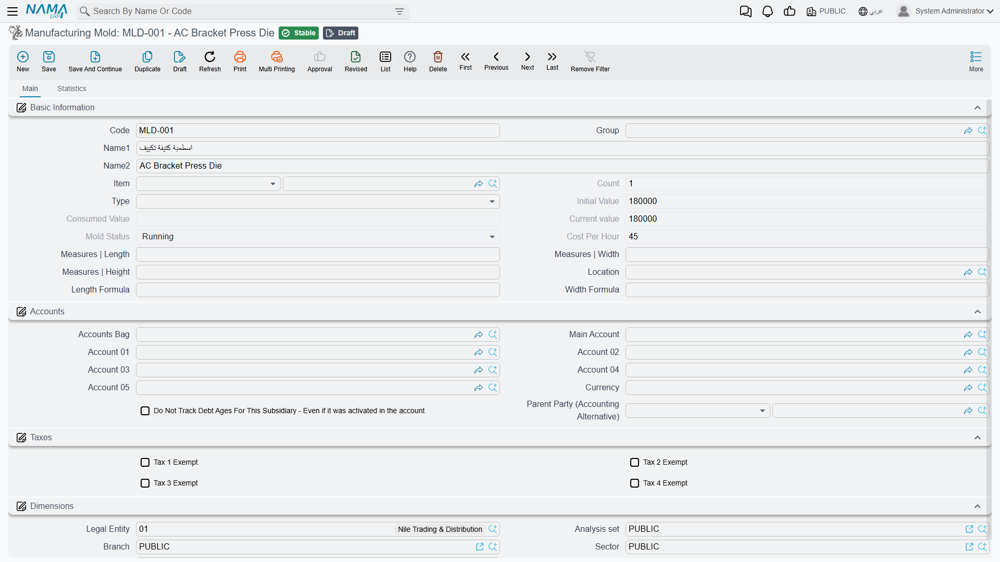
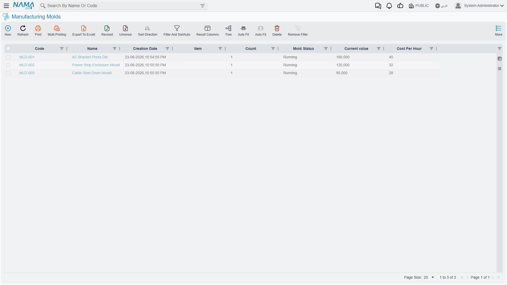
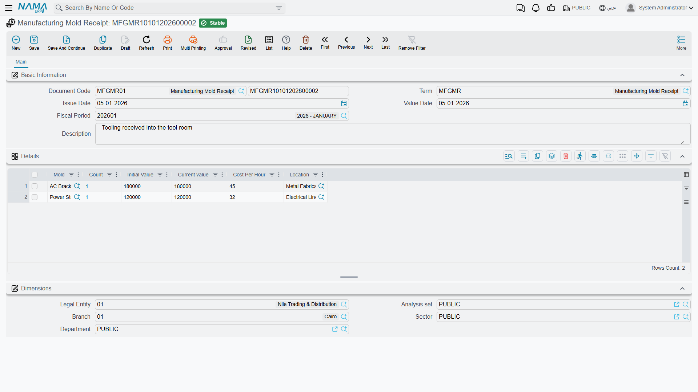

# Manufacturing Molds: Tooling That Wears Out

## Why Tooling Needs Its Own File

A press die for an air-conditioner bracket costs 180,000. It is not a raw material — it does not get consumed into the product and leave. It is not quite a fixed asset either, because unlike a building or a lorry, its life is measured in *pressings* rather than in years, and the thing that uses it up is production.

That in-between nature is why molds get their own small family of screens. A **Manufacturing Mold** (قالب تصنيع) is a piece of tooling with a value, a wear rate and a running balance, and the module exists to answer three questions honestly: what is this die worth now, how much of its life has this job consumed, and when does it need replacing?

Everything lives under **Manufacturing → Manufacturing Molds** (التصنيع ← قوالب تصنيع).

The list view is the tooling register — every mold you hold, with its status.

## The Mold Master File

**Code** and **Name1 / Name2** identify the tooling — `MLD-001`, AC Bracket Press Die.

**Item** links the mold to the product it makes, where the relationship is one-to-one. **Type** classifies the tooling, and **Count** is how many of this mold you hold.

The value fields are the heart of the screen and they work as a set:

- **Initial Value** is what the mold was worth when it entered service — 180,000 here.
- **Consumed Value** is how much of that has been used up by production so far. It is not editable, because it is a consequence of the work the mold has done rather than something you assert.
- **Current value** is what remains.

**Cost Per Hour** (45) is the rate at which the mold is consumed as it runs. This is the number that turns tooling from a lump of capital into a per-unit product cost: run the die for two hours on a job and 90 of its value has moved onto that job's cost.

**Mold Status** — `Running` here — is likewise not directly editable. It reflects where the mold is in its life, and it moves as the documents below are raised against it.

::: tip Cost Per Hour is a policy decision, not a measurement
Nothing in the system can tell you what a die's hourly wear really is. You are choosing how to spread a known capital cost over an estimated life — 180,000 over an expected 4,000 hours gives 45. If the estimate is wrong, product costs are wrong in the same direction for as long as the mold runs, so it is worth revisiting when a mold's actual life turns out different from the plan.
:::

**Measures | Length**, **Width** and **Height** record the tooling's physical size, and **Length Formula** / **Width Formula** let dimensions be derived rather than typed where the mold's geometry follows the product's. **Location** is where it is kept.

The **Accounts** section attaches the mold to the chart of accounts so its consumption reaches the ledger, and the **Taxes** and **Dimensions** sections work as they do on other master files.

The **Statistics** tab holds the mold's transaction entries — the running record of what has happened to it.

## Mold Receipt

Tooling enters service on a **Manufacturing Mold Receipt** (توريد قالب تصنيع), under **Manufacturing → Manufacturing Molds → Manufacturing Mold Receipt**.

The header carries the **Document Code**, **Term**, **Issue Date**, **Value Date** and **Fiscal Period**. Each **Details** row brings one mold into service, and the columns are exactly the value fields from the master file: **Mold**, **Count**, **Initial Value**, **Current value**, **Cost Per Hour** and **Location**.

That repetition is deliberate. The receipt is what *establishes* those figures — the master file displays them, but this document is where they come from and where their audit trail begins. Receiving two dies at 180,000 and 120,000 on one document, as in the example, sets both molds running with their own values and rates.

## Mold Voucher

The **Manufacturing Mold Voucher** (استهلاك قالب تصنيع), under **Manufacturing → Manufacturing Molds → Manufacturing Mold Voucher**, records consumption — the hours a mold spent on a job, converted at its cost-per-hour into value moved from the mold onto the production order.

Much of this happens without a voucher. A [standard operation](/modules/manufacturing/manufacturing-work-centers) can list its molds in the **Molds** grid, with an **Hours Count** and a **Charge Type**, and the consumption is charged as production is recorded. Tick **Specify Hours Count From Operation Execution** on that grid and the hours come from what execution actually reports rather than from a fixed figure.

The voucher is for what falls outside that: a mold used on a job whose routing does not list it, or a run where the tooling was engaged far longer than standard.

## Mold Disposal

Eventually a die cracks, wears past tolerance, or the product it makes is discontinued. The **Manufacturing Mold Disposal** (تخريد قالب تصنيع), under **Manufacturing → Manufacturing Molds → Manufacturing Mold Disposal**, takes it out of service and settles whatever value it still carries.

::: warning A mold with value left is not free to scrap
Disposing of a mold that still shows a current value writes that remaining value off — it has to go somewhere, and it lands as a loss rather than being spread over future production. That is the honest treatment, but it means an unexpected disposal is a hit to the period rather than a non-event. Where a mold has failed early, this write-off is exactly the number worth showing the person who chose the supplier.
:::

## Mold Location

**Manufacturing Mold Location** (موقع قالب تصنيع) is a small master file listing the places tooling is kept — a store, a rack, a specific machine. Molds reference it, receipts set it, and a factory with two hundred dies across three buildings needs it far more than a factory with three.

## How the Pieces Fit

The cycle is short and it mirrors the life of a physical object. A **receipt** brings a die into service with a value and an hourly rate. **Vouchers** — mostly raised automatically through standard operations — consume that value as the die runs, moving it onto the production orders that used it. The mold's **consumed** and **current** values track the drain. When there is nothing useful left, a **disposal** retires it.

What you get out of that is the ability to answer a question most factories cannot: not just *what did this job cost in material and labour*, but *what did it cost in tooling*. On products made with expensive dies, that is not a rounding error — it is often the difference between a product that looks profitable and one that is.
