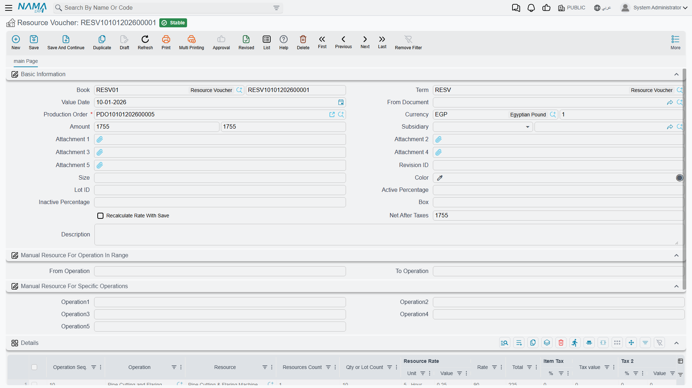

# Resource Vouchers: Charging Machine and Labour Time

## The Cost That Isn't Material

Issue the copper, the insulation and the tape to a job and you have accounted for what the product is physically made of. You have not accounted for the four hours the cutting machine ran, or the crew that stood at it. Those are real costs, they are a large share of what a manufactured product actually costs, and nothing on a materials document captures them.

The **Resource Voucher** (سند موارد) does. It charges the time a machine, a crew or any other resource spent on a production order, and turns it into money against that job.

You'll find it under **Manufacturing → Documents → Resource Voucher** (التصنيع ← المستندات ← سند موارد).

## When You Actually Need One

Here is the thing worth understanding before you enter a single voucher: **most resource consumption never needs one**.

If a [standard operation](/modules/manufacturing/manufacturing-work-centers) has **Auto Charge** ticked, its resources are charged automatically as production is recorded. The routing knows the machine runs 0.25 of an hour per item; production execution says 90 items went through; the charge lands by itself. Nobody types anything.

The resource voucher is for the cases that escape that:

- **Resources not on the routing at all.** A rented compressor brought in for one job. A contractor's crew called in to clear a backlog.
- **Operations where the real time bears no relation to the standard.** The machine jammed and the step took three times as long. An automatic charge would record a comfortable fiction.
- **Corrections.** The standard rate was wrong for a period and the job needs the difference.

::: tip If you are entering vouchers for every order, something upstream is wrong
Routine, predictable resource consumption belongs on the standard operation with Auto Charge on. A shop that keys a voucher for every order every day has usually left Auto Charge off where it should be on — and is paying for that in data-entry time and in the errors that come with it.
:::

## The Header

**Book**, **Term** and **Value Date** work as they do on every document.

**Production Order** is required, and for the same reason as on a materials issue: a resource cost has to attach to a job or it has nowhere to go.

**Currency** and its rate handle resources billed in another currency — the contractor invoicing in dollars. **Amount** carries the voucher's value, and **Net After Taxes** the figure after tax has been applied — 1,755 in both fields in the example, because no tax applies to it.

**Subsidiary** names the party where the resource is external and there is someone to pay.

**Recalculate Rate With Save** is the checkbox to think about. Leave it unticked and the rates on the lines stay exactly as entered. Tick it and saving re-derives them from the current standard rates. Which you want depends on why you are raising the voucher: recalculation is right when you are catching up a document to current rates, and wrong when the whole point of the voucher was to record a rate that *differed* from standard — in that case ticking it silently discards what you came to record.

**Attachment 1** through **Attachment 5** hold the evidence — the contractor's invoice, the maintenance log, the timesheet. On a document whose purpose is to explain an unusual cost, these earn their place.

## Choosing Which Operations to Charge

Two sections sit between the header and the grid, and they exist to save typing on orders with long routings.

**Manual Resource For Operation In Range** takes a **From Operation** and a **To Operation** — charge everything from step 20 through step 60 in one stroke.

**Manual Resource For Specific Operations** takes up to five individual steps in **Operation1** through **Operation5** — for when the steps you want are scattered rather than contiguous.

Both are shortcuts for populating the grid. Leave them empty and you name the operations line by line instead, which on a short routing is no hardship.

## The Details Grid

Each row charges one resource at one operation.

**Operation Seq.** and **Operation** say where — `10`, Pipe Cutting and Flaring, in the example.

**Resource** is what consumed the time: the Pipe Cutting & Flaring Machine. **Resources Count** is how many of them — 1 here.

**Qty or Lot Count** is the volume the charge is being spread across: 10.

**Resource Rate** (**Unit** + **Value**) is the standard rate — `5 - Hour` at `0.25`, meaning a quarter of an hour per unit.

**Rate** (90) is the money rate, and **Total** (225) is the resulting charge. That figure is what lands on the production order's cost.

**Item Tax** (**%** + **Tax value**) and **Tax 2** (**%** + **Value**) apply tax where the resource is externally billed and taxable. For an in-house machine they stay zero.

## Where the Cost Goes

A saved resource voucher adds to the production order's accumulated cost, alongside materials issued and overheads absorbed. Its effects are raised as business requests and processed in the background, so the save itself is immediate; if a voucher's effects fail, they surface in the **Business Requests** list view for reprocessing.

At [order close](/modules/manufacturing/production-costing), resource cost is compared against what the routing said the operations should have consumed. A persistent gap is worth chasing, because it usually means one of two specific things: the standard rates on your operations have drifted away from reality, or the shop is genuinely taking longer than the routing claims. Those call for very different responses, and the resource variance is the number that tells them apart.
