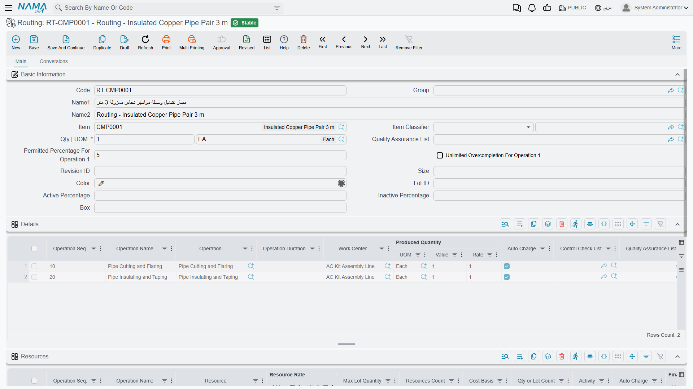
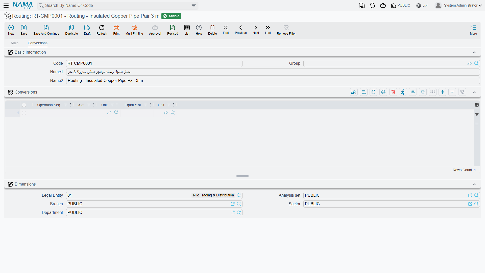
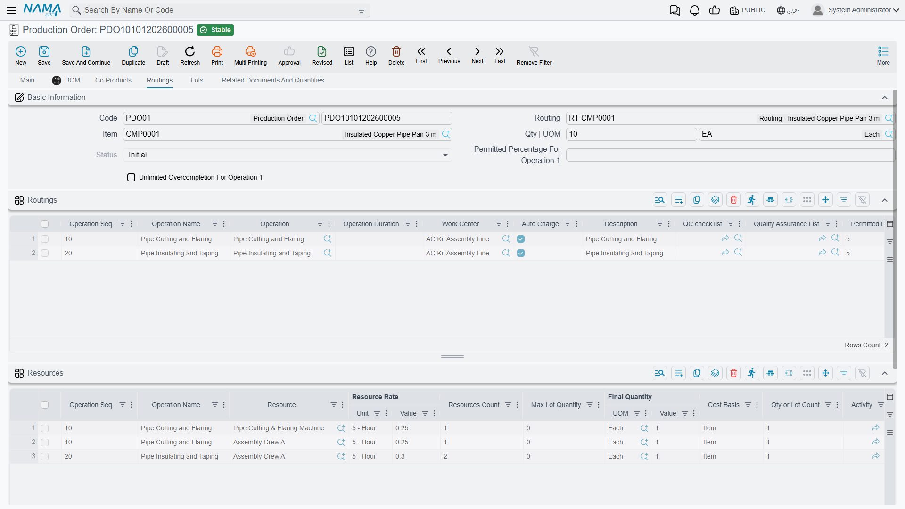

# Routings: The Steps a Product Goes Through

## What a Routing Adds to a BOM

A [bill of materials](/modules/manufacturing/manufacturing-bom) tells you what a product is made of. It says nothing about how it gets made — and for anything more involved than putting parts in a box, that second half matters just as much. The insulated copper pipe pair needs its pipes cut and flared, then insulated and taped. Two steps, in that order, on a particular line, taking a particular amount of time. That sequence is the **routing** (عملية تشغيل).

Where the BOM is a recipe's ingredient list, the routing is its method: *preheat the oven, cream the butter and sugar, fold in the flour, bake for 40 minutes*. And as in cooking, the order is not decorative. You cannot tape insulation onto a pipe you haven't cut yet, and the system needs to know that so it can tell you where an order actually is.

You'll find routings under **Manufacturing → Master Files → Routing** (التصنيع ← الملفات ← عملية تشغيل).

## The Header

**Code**, **Name1 / Name2** and **Item** work exactly as they do on a BOM — and pairing the codes (`BOM-CMP0001` with `RT-CMP0001`) is a small discipline that makes both files far easier to live with.

**Qty | UOM** is the reference quantity again: the number of finished units that the durations and rates below are quoted against.

**Permitted Percentage For Operation 1** and **Unlimited Overcompletion For Operation 1** are the two fields on this screen that reward a careful read. Manufacturing rarely produces exactly what was ordered — a run of 100 might yield 103 because the machine was already set up and the operator kept going. These two fields decide how the system reacts to that at the *first* operation. The permitted percentage sets the tolerance (5 in the screenshot: an order for 100 may complete up to 105 at operation 1). Ticking unlimited overcompletion removes the ceiling entirely.

::: warning This tolerance applies to the first operation only
Both field labels say "For Operation 1", and they mean it. Tolerances for later operations are set on the operations themselves, not here. Setting a generous percentage on the routing does not quietly loosen the whole line.
:::

**Quality Assurance List** attaches a checklist that has to be satisfied for the product. **Group**, **Item Classifier**, **Revision ID**, **Size**, **Lot ID**, **Color**, **Box** and the **Active / Inactive Percentage** pair are optional refinements, as on the BOM.

## The Details Grid: The Operations

Each row is one step, and the rows run in the order the product travels.

**Operation Seq.** is the step number, and the convention of counting in tens — 10, 20, 30 — is worth adopting. It costs nothing and it means that when someone eventually needs to slip a deburring step between cutting and taping, it becomes 15 rather than a renumbering of the whole routing and every BOM line that pointed at it.

**Operation** references a [standard operation](/modules/manufacturing/manufacturing-work-centers) — a reusable definition of a step, with its own resources and rates already set up. **Operation Name** is the label that appears against it. Pulling steps from standard operations rather than describing them afresh on every routing is what stops a hundred routings from each carrying their own slightly different idea of what "cutting" costs.

**Work Center** is where the step happens — the line, cell or shop floor area. Both rows in the screenshot run at the AC Kit Assembly Line.

**Operation Duration** is how long the step takes. Left empty, the duration comes from the standard operation.

**Produced Quantity** (**UOM**, **Value**, **Rate**) is the step's output. A **Rate** of 1 with a **Value** of 1 says one unit in, one unit out — the normal case. Rates come into their own when an operation changes the counting: a step that cuts one sheet into four blanks has an output rate that is not 1, and getting it right is what keeps quantities honest down the rest of the line.

**Auto Charge**, ticked on both rows here, means the operation's cost is applied automatically as production is recorded, rather than waiting for someone to raise a [resource voucher](/modules/manufacturing/manufacturing-resource-voucher) by hand. For a routine, predictable step this is what you want. Untick it for steps where the real time varies enough that an automatic charge would be fiction.

**Control Check List** and **Quality Assurance List** attach per-operation checks — the gate that has to be passed before units move on.

## The Resources Grid: What the Steps Consume

Operations take time on machines and from people, and neither is free. The **Resources** grid attributes that consumption step by step.

**Operation Seq.** and **Operation Name** tie each resource line back to a step in the grid above, so one operation can draw on several resources — a machine *and* the crew that runs it.

**Resource** is the machine, crew or work centre being consumed. **Resources Count** is how many of them.

**Resource Rate** (**Value** + **Unit**) is the cost basis — a rate quoted per hour, per unit, or per whatever unit suits. **Cost Basis** and **Qty or Lot Count** decide how that rate is applied: per item produced, or per lot regardless of size. That distinction is exactly the difference between a cost that scales with volume and a setup cost that does not, and it is where a lot of costing accuracy is won or lost.

**Max Lot Quantity** caps how much one resource line covers before another is needed. **Activity** classifies the work for reporting. **Auto Charge** behaves as it does above.

## The Conversions Tab

The second tab handles products where the unit of measure changes as the product moves down the line. Material arrives in kilograms, gets processed into metres, and is sold by the piece.

Each row reads as a sentence: at a given **Operation Seq.**, **X of** one **Unit** **Equal Y of** another **Unit**. One row saying "at operation 20, 1 of Roll equals 250 of Sheet" is what keeps quantities coherent from one operation to the next instead of needing manual reconciliation at the end. Most routings need no rows here at all — the tab matters only where the unit genuinely changes mid-process.

## How a Routing Gets Used

A production order that names this routing copies the operations onto its own **Routings** tab, and from that moment the order has a shape: a list of steps, each with a work centre, a duration and a quantity that has yet to pass through it.

That is what makes [production execution](/modules/manufacturing/production-execution) possible.

 Every execution document records progress *against an operation* — so many units moved from step 10 to step 20 — and without a routing there are no steps to record against. It is also what makes work-in-process a real number rather than a guess: units that have cleared operation 10 but not 20 are, precisely and answerably, work in process.
