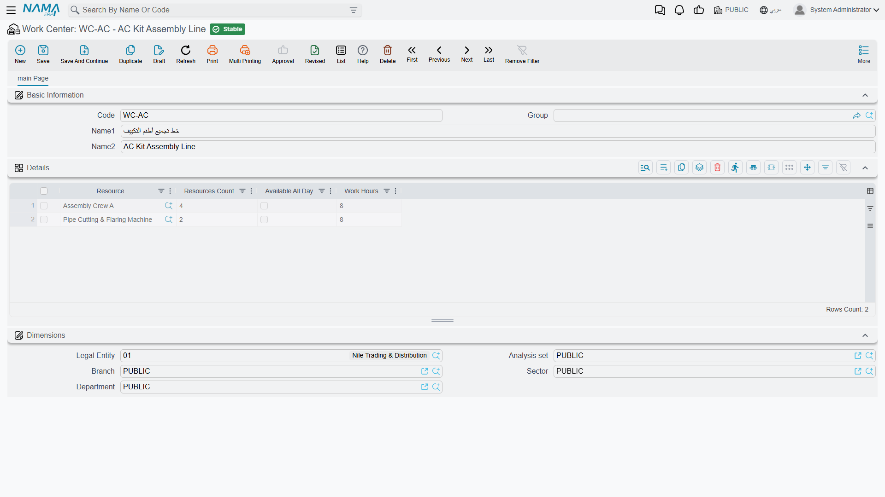
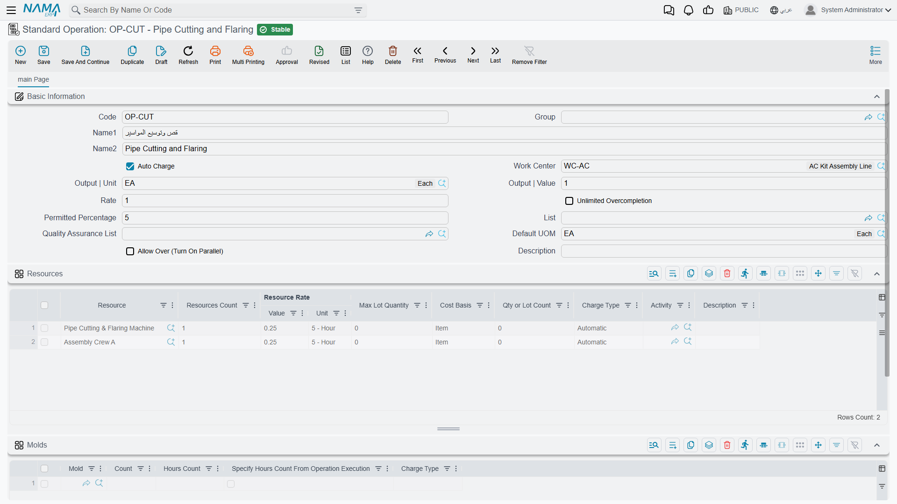
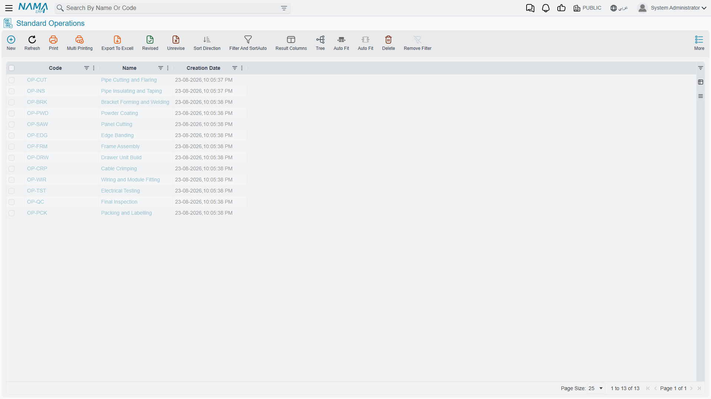

# Work Centers and Standard Operations

## Two Files That Answer "Where" and "How Much"

A [routing](/modules/manufacturing/manufacturing-routing) lists the steps a product goes through, but it doesn't want to carry every detail about each one. If forty products all pass through the cutting step, you do not want forty routings each holding their own private copy of what cutting costs, how long it takes, and which machine does it — because the day the machine rate changes, you would have forty places to fix and you would miss some.

So two master files sit underneath routings and hold that detail once:

- A **Work Center** (صالة إنتاج) is a *place* — a line, a cell, an area of the shop floor — and the resources stationed there.
- A **Standard Operation** (عملية قياسية) is a *step* — cutting, taping, packing — with its own resources, rates and tolerances.

A routing then just points at them. Change the rate on the standard operation and every routing that references it is corrected at once.

## Work Centers

You'll find them under **Manufacturing → Master Files → Work Center** (التصنيع ← الملفات ← صالة إنتاج).

The screen is deliberately small. **Code**, **Name1 / Name2** and an optional **Group** identify the work centre; everything substantial is in the grid below.

Each **Details** row is a resource stationed at this work centre:

**Resource** is the machine or crew. The AC Kit Assembly Line above has two — Assembly Crew A and a Pipe Cutting & Flaring Machine.

**Resources Count** is how many of that resource exist here. Four for the crew means four people, and that number is what turns a work centre into a capacity figure rather than a name.

**Work Hours** is how many hours a day the resource is available — 8 on both rows. **Available All Day** is the override for resources that don't work to a shift pattern: tick it and the hours figure stops applying.

::: tip Capacity comes from this grid, not from a capacity field
There is no field on this screen that says "this line can produce 400 units a day". Capacity is derived: resources × count × work hours, against the durations and rates on the operations that run here. If planning tells you a line is overloaded and you disagree, this grid is the first place to look — an understated Resources Count is the usual culprit.
:::

The **Dimensions** section — **Legal Entity**, **Branch**, **Department**, **Analysis set**, **Sector** — places the work centre in the organisation, and is what lets costs and output be reported by branch or department later.

## Standard Operations

You'll find them under **Manufacturing → Master Files → Standard Operation** (التصنيع ← الملفات ← عملية قياسية).

The list view is the catalogue of steps your routings can draw on.

This is the richer of the two files, because a step carries more meaning than a place.

**Code** and **Name1 / Name2** identify it. **Work Center** names where the step normally happens — the Pipe Cutting and Flaring operation above runs at the AC Kit Assembly Line.

**Output | Unit** and **Output | Value**, together with **Rate**, describe what the step produces per pass. **Default UOM** is the unit the operation is measured in when nothing more specific applies.

**Auto Charge**, ticked here, applies the operation's cost automatically as production is recorded. Leave it off for steps whose real consumption varies too much for an automatic figure to be honest — those get a [resource voucher](/modules/manufacturing/manufacturing-resource-voucher) entered by hand instead.

**Permitted Percentage** (5 here) and **Unlimited Overcompletion** set the over-production tolerance for this step, in the same way the routing header sets it for the first operation.

**Allow Over (Turn On Parallel)** is the field worth pausing on. Normally a unit finishes one operation before starting the next — strict sequence. Ticking this allows the step to run in parallel with its neighbours, which is what you need for a line where cutting on the next batch starts while taping on the current one is still going. Leave it unticked and the system will hold work back until the preceding step has released it.

**List** and **Quality Assurance List** attach the checks that gate the step, and **Description** is free text for the operators.

### The Resources Grid

This is where an operation's cost actually comes from. Each row is a resource the step consumes:

**Resource** and **Resources Count** — what, and how many. **Resource Rate** (**Value** + **Unit**) is the rate: both rows above read `0.25` against `5 - Hour`.

**Cost Basis** decides what the rate attaches to. Both rows here read **Item**, meaning the cost scales with the number of items produced. The alternative attaches cost to the lot instead, which is how you model a setup cost that is the same whether you run ten units or a thousand. Getting this wrong is one of the quieter ways a product cost goes astray — a setup charged per item makes small runs look cheap and large runs look expensive, exactly backwards.

**Qty or Lot Count** and **Max Lot Quantity** bound how far one resource line stretches. **Charge Type** — **Automatic** on both rows — controls whether the charge lands by itself or waits to be entered. **Activity** classifies the work for reporting, and **Description** documents the row.

### The Molds Grid

Operations that need tooling list it here. **Mold** references the [manufacturing mold](/modules/manufacturing/manufacturing-molds), **Count** is how many are needed, and **Hours Count** is how long the tooling is engaged.

**Specify Hours Count From Operation Execution** changes where that number comes from: instead of the fixed figure on this row, the hours are taken from what the execution document actually records. Use it when tooling time genuinely tracks the work rather than being a constant — which for most presses and dies it does.

**Charge Type** controls how the tooling cost is applied, as it does for resources.

## Putting Them Together

The chain runs in one direction, and each link removes duplication from the one above it:

A **work centre** says a line exists and has four crew and a machine on it. A **standard operation** says cutting happens at that line, consumes those resources at those rates, and tolerates 5% overrun. A **routing** says this product goes through cutting, then taping. A **production order** for the product picks up that routing, and suddenly has a full plan — steps, places, durations, resources and costs — without anyone having entered any of it on the order itself.

Which is the point. Set these two files up carefully once, and orders become almost free to create.
